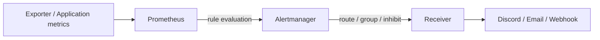
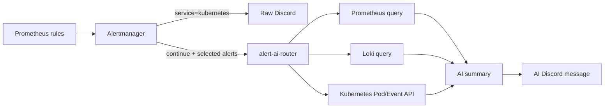
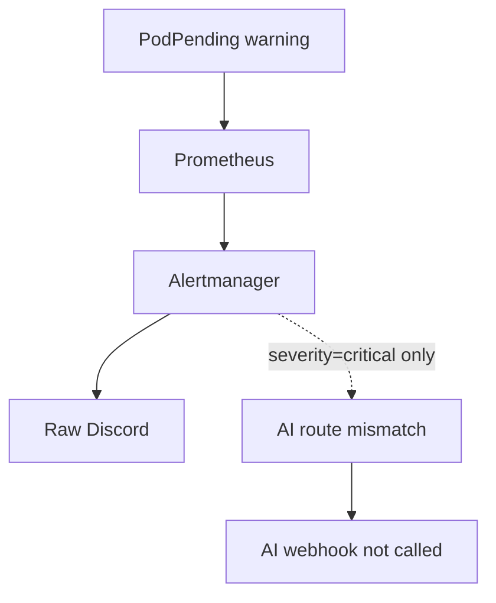

## 알림을 받았는데, 왜 AI 요약은 오지 않았을까

Kubernetes Pod가 오래 `Pending` 상태라는 Discord 알림을 받았다.

```text
[firing] HomeKubernetesPodPendingTooLong
Pod <namespace>/<pod> has stayed Pending for more than 10 minutes.
severity=warning service=kubernetes
```

원문 알림은 도착했지만, 같은 장애에 대해 기대했던 AI 요약은 오지 않았다.

처음에는 AI API나 Discord webhook이 실패했다고 생각했다. 하지만 실제 원인은 더 앞단에 있었다.

- Prometheus rule은 alert를 정상적으로 만들었다.
- Alertmanager의 원문 Discord route도 alert를 받았다.
- AI route는 `severity=critical`만 매칭하고 있었다.
- 해당 alert의 severity는 `warning`이었다.
- 따라서 AI router에는 webhook 요청 자체가 도착하지 않았다.

이 문제를 따라가며 Alertmanager가 단순한 “알림 전달기”가 아니라는 것을 다시 정리하게 됐다. Alertmanager는 알림을 **어떤 기준으로 묶고, 어디로 보내고, 언제 억제하고, 언제 다시 보낼지** 결정하는 계층이다.

## 전체 흐름: Prometheus와 Alertmanager의 책임은 다르다



### Prometheus가 하는 일

Prometheus는 metric을 수집하고 PromQL expression을 평가한다. 조건이 일정 시간 동안 유지되면 alert의 상태를 `pending`에서 `firing`으로 바꿔 Alertmanager에 전달한다.

예를 들어 다음 rule은 Pod가 10분 이상 Pending 상태인지 판단한다.

```yaml
groups:
  - name: home-kubernetes
    rules:
      - alert: HomeKubernetesPodPendingTooLong
        expr: |
          sum by (namespace, pod) (
            kube_pod_status_phase{
              job="kube-state-metrics",
              phase="Pending"
            } == 1
          ) > 0
        for: 10m
        labels:
          severity: warning
          service: kubernetes
        annotations:
          summary: Kubernetes pod is pending too long.
```

여기서 `for: 10m`은 Alertmanager가 기다리는 시간이 아니다. Prometheus가 조건을 계속 관찰한 뒤 firing 상태로 만들기 위한 시간이다.

Prometheus 공식 문서도 alerting rule은 “무엇이 지금 잘못됐는지” 판단하지만, 여러 목적지로 알림을 보내고 그룹화하는 완전한 notification solution은 아니라고 설명한다. [Prometheus alerting rules](https://prometheus.io/docs/prometheus/latest/configuration/alerting_rules/)

### Alertmanager가 하는 일

Prometheus가 만든 alert에는 `alertname`, `severity`, `service`, `namespace`, `pod`, `node` 같은 label과 `summary`, `description` 같은 annotation이 붙어 있다. Alertmanager는 이 정보를 기준으로 다음 작업을 한다.

1. 같은 장애를 하나의 그룹으로 묶는다.
2. label에 맞는 route를 선택한다.
3. Discord, Slack, Email, Webhook 등의 receiver로 보낸다.
4. 중복 알림과 일시적인 알림을 줄인다.
5. 상위 장애가 발생하면 파생 장애를 억제할 수 있다.
6. 점검 시간에는 silence로 알림을 일시 차단할 수 있다.

즉, Alertmanager는 장애 원인을 분석하는 시스템이 아니다. **이미 만들어진 alert를 운영 가능한 notification 흐름으로 바꾸는 시스템**에 가깝다.

## Alertmanager 핵심 기능

### Route: 어디로 보낼지 결정

route는 alert label을 보고 receiver를 선택한다.

```yaml
route:
  receiver: discord-default
  routes:
    - matchers:
        - service="kubernetes"
      receiver: discord-kubernetes
      continue: true

    - matchers:
        - service="kubernetes"
        - severity=~"critical|warning"
        - alertname=~"HomeKubernetesImagePullBackOff|HomeKubernetesOOMKilledRecent|HomeKubernetesPodPendingTooLong"
      receiver: alert-ai-router-kubernetes
```

`continue: true`는 첫 route에서 알림을 보낸 뒤 다음 형제 route도 계속 평가하라는 의미다. 이 설정이 있으면 하나의 alert가 원문 Discord와 AI webhook에 동시에 전달될 수 있다.

반대로 `continue`가 없거나 `false`면 해당 route에서 매칭이 끝날 수 있다. 원문 알림과 AI 보조 알림을 모두 사용하려면 이 경계를 의도적으로 확인해야 한다.

### Grouping: 여러 alert를 하나로 묶기

alert가 여러 개 발생할 때 매번 Discord 메시지를 하나씩 보내면 장애가 쉽게 묻힌다. `group_by`는 같은 그룹으로 묶을 label을 정한다.

```yaml
group_by:
  - alertname
  - service
  - namespace
  - pod
  - node
  - reason
```

예를 들어 `pod`와 `node`를 group key에서 빼면 같은 namespace의 여러 Pod 장애가 한 메시지로 섞일 수 있다. 반대로 모든 label을 group key로 넣으면 알림이 지나치게 잘게 쪼개진다.

현재 Kubernetes 알림은 다음 기준으로 분리하는 방향을 선택했다.

- alert 이름
- service
- namespace
- Pod
- Node
- container/reason

### `group_wait`, `group_interval`, `repeat_interval`

세 시간 설정은 서로 다르다.

| 설정 | 의미 |
| --- | --- |
| `group_wait` | 새 그룹이 생긴 뒤 첫 알림을 보내기 전 대기 시간 |
| `group_interval` | 이미 알림을 보낸 그룹에 새 alert 변화가 생겼을 때 대기 시간 |
| `repeat_interval` | 변화가 없어도 계속 firing 중일 때 반복 전송 간격 |

예를 들어 `group_wait: 30s`라면 첫 alert 발생 직후 바로 전송하지 않고 30초 동안 같은 그룹의 추가 alert를 기다린다. `repeat_interval: 4h`는 장애가 계속되는 동안 4시간마다 반복 알림을 보낼 수 있다는 뜻이다.

`HomeKubernetesPodPendingTooLong`의 `for: 10m`과 Alertmanager의 `group_wait: 30s`는 완전히 다른 계층의 시간이다.

```text
Pod Pending 시작
  → Prometheus가 10분 동안 조건 유지 확인
  → firing alert 생성
  → Alertmanager group_wait 30초
  → receiver로 notification 전송
```

Alertmanager 공식 설정 문서도 `group_wait`가 너무 짧으면 관련 alert가 아직 모이지 않을 수 있고, 너무 길면 알림 전달이 늦어질 수 있다고 설명한다. [Alertmanager configuration](https://prometheus.io/docs/alerting/latest/configuration/)

### Receiver: 최종 전달 대상

receiver는 실제 알림을 전달하는 목적지다.

```yaml
receivers:
  - name: discord-kubernetes
    discord_configs:
      - api_url_file: <discord-webhook-secret>
        send_resolved: true

  - name: alert-ai-router-kubernetes
    webhook_configs:
      - url: http://alert-ai-router.<namespace>.svc/alertmanager/webhook
        send_resolved: false
```

원문 Discord에는 `send_resolved: true`를 사용한다. 장애가 해소됐다는 사실도 운영 기록이기 때문이다. AI route는 현재 `send_resolved: false`로 두었다. firing 때 원인 분석을 보내고, resolved는 원문 알림으로 받는 방식이다.

### Inhibition: 파생 알림 억제

Inhibition은 특정 상위 alert가 발생했을 때 연관된 하위 alert notification을 잠시 억제하는 기능이다.

```yaml
inhibit_rules:
  - source_matchers:
      - alertname="NodeNotReady"
    target_matchers:
      - alertname="HomeKubernetesPodPendingTooLong"
    equal:
      - node
```

Node 자체가 NotReady라면 그 노드의 여러 Pod가 Pending이 될 수 있다. 이때 Pod alert를 전부 보내면 같은 원인으로 메시지가 폭증할 수 있다.

다만 inhibition을 너무 공격적으로 사용하면 중요한 증거도 숨길 수 있다. 현재는 원문 route를 우선 유지하고, Node 장애와 파생 Pod 장애의 관계가 반복 검증된 뒤 적용하는 편이 안전하다.

### Silence: 계획된 작업 알림 차단

Silence는 maintenance 같은 계획된 작업 동안 특정 label의 알림을 일시 차단한다.

예를 들어 SD 카드를 교체하는 동안 다음 alert가 발생할 수 있다.

- NodeNotReady
- PodPending
- CNI Pod Pending
- kubelet heartbeat missing

이때 rule을 삭제하거나 severity를 낮추는 대신, `node=raspi-02`와 maintenance 시간을 기준으로 silence를 생성하는 편이 변경 이력을 남기기 쉽다.

Silence는 장애를 해결하는 기능이 아니다. “이 시간과 이 대상의 알림은 계획된 작업으로 알고 있다”는 운영 기록에 가깝다.

## 현재 홈 Kubernetes의 알림 구조

현재 구성은 원문 알림과 AI 보조 알림을 분리한다.



### 원문 경로

원문 경로는 AI router의 상태와 관계없이 살아 있어야 한다.

```text
Prometheus
  → Alertmanager
  → raw Discord receiver
```

이 경로에는 다음 정보가 남는다.

- alertname
- status
- severity
- service
- namespace
- summary/description
- firing/resolved 상태

AI API가 timeout되거나, AI router Pod가 죽거나, 문맥 수집이 실패해도 원문 알림은 받아야 한다. AI를 단일 알림 경로로 만들면 AI 장애가 모니터링 장애로 이어진다.

### AI 보조 경로

AI는 모든 alert를 받지 않는다. 현재 선택 기준은 다음과 같다.

- `HomeKubernetesImagePullBackOff`
- `HomeKubernetesOOMKilledRecent`
- `HomeKubernetesPodPendingTooLong`
- severity `critical` 또는 선택된 `warning`

단순 informational alert까지 AI에 보내면 비용과 노이즈가 증가한다. 반대로 모든 warning을 제외하면 이번처럼 실제 원인 분석이 필요한 `PodPending`도 놓칠 수 있다.

그래서 “severity만으로 전부 결정”하지 않고, `alertname + service + severity` 조합으로 고신호 alert를 선택한다.

## AI router가 수집하는 문맥

AI router는 Alertmanager payload만 보고 결론을 만들지 않는다. alert에 포함된 위치 정보를 이용해 주변 상태를 조회한다.

### Prometheus

Kubernetes Pod alert에는 다음 값을 조회한다.

- Pod phase
- container waiting reason
- 최근 container restart 수
- Pod 정보와 Node

### Loki

namespace와 Pod를 기준으로 최근 로그를 조회한다.

```logql
{namespace="<namespace>", pod="<pod>"}
  |~ "(?i)error|fail|timeout|denied|unhealthy|read-only"
```

전체 namespace 로그를 AI에 넘기는 대신 대상 Pod 중심으로 범위를 좁힌다. 로그는 길이를 제한하고, secret·token·credential이 들어갈 수 있는 값은 보내지 않는 별도 redaction이 필요하다.

### Kubernetes API

다음 정보를 조회한다.

- 대상 Pod 상태
- container status
- Pod Event
- 대상 Node 관련 Event

이번 `Pod Pending` 문제처럼 실제 원인이 Node의 filesystem이라면 Pod metric 하나만으로는 부족하다. `FailedScheduling`, `FailedMount`, `NodeNotReady`, `read-only filesystem`을 함께 봐야 조사 방향을 좁힐 수 있다.

## AI 알림에 포함해야 할 내용

AI에게 “원인을 알려줘”라고만 요청하면 추측이 길어질 수 있다. 운영 메시지는 다음 구조가 더 낫다.

```text
[AI FIRING] HomeKubernetesPodPendingTooLong

대상
- namespace: <namespace>
- pod: <pod>
- node: <node>

관측된 사실
- phase=Pending
- waiting reason=...
- 관련 Event=...
- 최근 로그=...

가능한 원인
- 확인된 사실과 분리해서 작성
- 아직 검증되지 않은 가설은 명시

다음 확인 명령
1. kubectl describe pod ...
2. kubectl describe node ...
3. journalctl -u rke2-agent ...

문맥 수집 상태
- Prometheus: success/fail
- Loki: success/fail
- Kubernetes API: success/fail
```

중요한 원칙은 AI가 `critical`로 승격하거나 자동으로 `kubectl delete`, `uncordon`, `restart`를 실행하지 않는 것이다. severity와 실제 조치는 사람이 관리하는 rule·runbook·승인 절차 안에 둔다.

## 이번 문제: warning alert가 AI로 오지 않은 이유

기존 흐름은 사실상 다음과 같았다.



원문 Discord는 정상 동작했기 때문에 Discord 전체 장애가 아니었다. AI가 요약하지 못한 것도 아니고, AI 호출 전에 route matcher에서 제외된 것이다.

이 구분이 중요하다.

| 위치 | 확인할 질문 |
| --- | --- |
| Prometheus | alert가 firing 되었는가? |
| Alertmanager | 어떤 route가 매칭됐는가? |
| Webhook | alert-ai-router에 HTTP 요청이 왔는가? |
| Router | severity 선택 조건을 통과했는가? |
| Context | Prometheus/Loki/Kubernetes API 조회가 성공했는가? |
| AI provider | 응답이 왔는가? |
| Discord | 최종 webhook 전송이 성공했는가? |

## 로컬에서 변경한 내용

현재는 다음 변경을 로컬 소스와 GitOps manifest에 반영했다.

### 1. AI 대상 severity 확장

```yaml
- name: AI_SEVERITIES
  value: critical,warning
```

단, Alertmanager route에서 모든 warning을 보내지는 않고 Kubernetes의 세 가지 고신호 alert만 선택한다.

### 2. Pod와 Node 문맥 추가

기존 alert에 Pod와 Node label이 없으면 AI router가 정확한 대상을 찾기 어렵다. `HomeKubernetesPodPendingTooLong` rule에서 `kube_pod_info`와 join해 Node label을 추가하는 방향으로 바꿨다.

```promql
pending_pod
  * on(namespace, pod) group_left(node)
    kube_pod_info
```

### 3. 문맥 수집 범위 축소

기존에는 namespace 전체 로그와 namespace의 여러 Pod를 넓게 조회할 가능성이 있었다. 이제 alert에 Pod가 있으면 해당 Pod를 우선 조회한다.

```text
namespace 전체
  → 대상 namespace + 대상 pod
```

### 4. AI 실패 이유 기록

AI 요약이 비어 있을 때 단순히 “요약 실패”라고 끝내지 않고 다음 이유를 분리한다.

- AI API key 없음
- provider HTTP 오류
- timeout
- 빈 응답
- 네트워크/API 호출 실패

이 정보는 router log와 metric으로 남겨야 한다. 그래야 “AI가 원인을 못 찾은 것인지”, “AI route까지 가지 못한 것인지”, “문맥 수집이 실패한 것인지”를 나눌 수 있다.

## 아직 적용하지 않은 부분

현재 변경은 다음 파일에만 로컬 반영된 상태다.

- `alert-ai-router/src/server.js`
- `home-ops/apps/alert-ai-router/manifests/deployment.yaml`
- `home-ops/apps/observability/kube-prometheus-stack/manifests/home-kubernetes-alertmanagerconfig.yaml`
- `home-ops/apps/observability/kube-prometheus-stack/manifests/home-kubernetes-rules.yaml`

새 `alert-ai-router` 이미지를 빌드하고 registry digest를 갱신한 뒤, GitOps repository의 promotion을 거쳐야 실제 클러스터에 적용된다. 따라서 현재 글에서 “AI warning 처리가 운영 환경에 적용됐다”고 표현하지 않는다.

## 다음 알림 운영 기준

현재 홈 클러스터에서는 다음 기준으로 시작하는 것이 적절하다.

| 구분 | 원문 알림 | AI 요약 | 예시 |
| --- | --- | --- | --- |
| Critical | 전송 | 전송 | ImagePullBackOff, 서비스 장애 |
| Selected warning | 전송 | 전송 | Pod Pending, OOMKilled |
| 일반 warning | 전송 | 미전송 | 일시적 scrape 지연 |
| Info | 기록/대시보드 | 미전송 | 정상 상태 변화 |

### Node 장애와 파생 알림

Node filesystem 오류가 원인이라면 NodeNotReady, CNI Pending, 여러 Pod Pending이 동시에 발생할 수 있다. 이때 AI에는 모두 독립적으로 보내기보다 다음처럼 처리하는 편이 좋다.

1. 원문 alert는 모두 보존한다.
2. Alertmanager grouping으로 같은 Node의 alert를 묶는다.
3. 상위 Node/storage alert가 확인되면 파생 alert는 inhibition 후보로 둔다.
4. AI에는 Node·Pod·Event·filesystem 로그를 함께 전달한다.
5. 계획된 SD 교체 시간에는 Node 단위 silence를 생성한다.

### 15분 문맥 윈도우

현재 `CONTEXT_WINDOW_MINUTES=15`는 Alertmanager 기능이 아니라 AI router가 Loki와 metric을 조회하는 범위다.

서비스 오류에는 15분이 적절할 수 있다. 하지만 ext4, reboot, node unreachable처럼 원인이 오래 전부터 시작된 문제는 30분 또는 1시간이 더 적절할 수 있다.

따라서 이후에는 alert 종류별로 문맥 범위를 다르게 두는 방안을 검토한다.

```text
application error     → 15분
Pod Pending           → 30분
Node / disk failure   → 60분
```

범위를 무조건 늘리면 AI 입력량과 노이즈가 증가하므로, 로그 개수·metric series·Event 수에도 상한을 둬야 한다.

## 정리

Alertmanager는 Prometheus가 만든 alert를 운영 가능한 알림으로 변환하는 계층이다.

- Prometheus: 조건 평가
- Alertmanager: 그룹화·라우팅·억제·반복·전달
- AI router: 선택된 alert의 문맥 수집과 요약
- Discord: 원문 및 보조 알림 표시

이번 문제의 핵심은 AI 모델의 성능이 아니었다. `warning` alert가 AI route에 들어오지 않는 **routing contract** 문제였다.

그래서 알림 보강의 우선순위도 다음처럼 잡았다.

1. 원문 alert 경로를 독립적으로 보장한다.
2. alert label에 namespace, Pod, Node를 충분히 담는다.
3. 고신호 alert만 AI route로 보낸다.
4. AI에는 metric·log·Event를 함께 전달한다.
5. AI 실패와 문맥 수집 실패를 별도 metric으로 관측한다.
6. 자동 조치가 아니라 사람이 확인할 다음 명령과 근거를 제공한다.

AI는 알림 시스템의 중심이 아니라, 사람이 장애를 좁혀 가는 시간을 줄이는 보조 계층으로 두는 편이 현재 환경에 맞다.

## 참고 자료

- [Prometheus alerting rules](https://prometheus.io/docs/prometheus/latest/configuration/alerting_rules/)
- [Alertmanager configuration](https://prometheus.io/docs/alerting/latest/configuration/)
- [Alertmanager notification templates](https://prometheus.io/docs/alerting/latest/notifications/)
- [Alertmanager management API](https://prometheus.io/docs/alerting/latest/management_api/)
- [Prometheus Alertmanager integrations](https://prometheus.io/docs/alerting/latest/integrations/)
