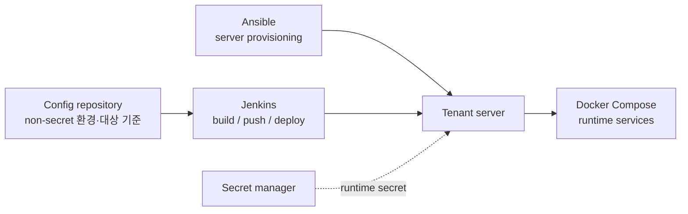
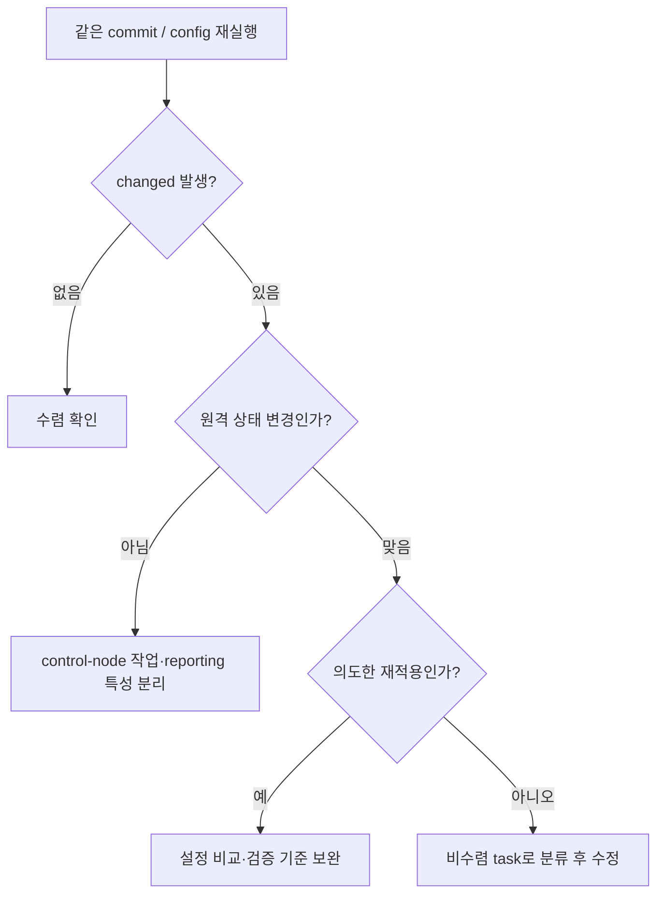

새 테넌트 서버를 만들 때 처음에는 shell script로 충분하다고 생각했다. Docker를 설치하고, 디렉터리를 만들고, `.env`를 놓고, PostgreSQL과 Compose를 준비하면 됐다.

문제는 환경이 늘면서부터였다. 재실행했을 때 무엇이 다시 바뀌었는지, 그 변경이 원격 서버의 drift인지 playbook의 특성인지, 일부 역할만 다시 적용해도 되는지를 설명하기 어려웠다. 그래서 목표를 “스크립트를 더 길게 만드는 것”이 아니라 **테넌트 서버가 도달해야 할 상태를 선언하고, 같은 입력으로 다시 검증하는 것**으로 바꿨다.

> 검증 범위: IDC Demo/PoC를 위한 disposable 서버의 tenant bootstrap과 runtime secret 경계다. 애플리케이션 전체를 상용 배포한 결과나 완전한 멱등성을 주장하지 않는다.

## 먼저 책임을 나눴다

Jenkins가 build와 deploy를 실행하더라도, 서버 내부의 준비 상태까지 pipeline에 넣으면 책임이 섞인다. 반대로 모든 값을 inventory에 적으면 테넌트별 환경값과 비밀값을 함께 관리하기 어려웠다.

따라서 환경값의 기준은 config repository, 서버 준비는 Ansible, 이미지 build/push와 배포 실행은 Jenkins, 서비스 실행 단위는 Docker Compose로 분리했다.

*IDC Demo/PoC 구성에서 테넌트 runtime과 Core 운영 도구의 책임을 단순화한 그림입니다. 고객·서버·네트워크 식별 정보와 세부 전달 경로는 제외했습니다.*

Ansible 쪽은 다시 다음 역할로 쪼갰다.

| 역할 | 준비하는 상태 |
| --- | --- |
| `common` | 환경 설정 로드, 대상 서버 동적 등록 |
| `tenant_host` | Docker/Compose, 실행 계정, 서비스 디렉터리, `.env` seed, 로그 경로 |
| `pg` | PostgreSQL 17, DB/schema/user/extension/grant, Liquibase 실행 조건 |
| `tenant_stack` | Compose 파일·runtime secret mount·서비스 기동 조건 |
| `monitoring` | collector/exporter가 붙을 수 있는 runtime 조건 |

Ansible role은 관련 task·variable·template을 정해진 구조로 묶어 재사용할 수 있다. 이 구조를 사용한 이유도 “역할별 상태를 따로 재실행하고 검증할 수 있게” 만들기 위해서였다. [Ansible Roles 문서](https://docs.ansible.com/projects/ansible/latest/playbook_guide/playbooks_reuse_roles.html)도 role을 관련 task, vars, files, handlers를 재사용 가능한 단위로 묶는 방식으로 설명한다.

## `changed=0`만 목표로 두면 놓치는 것

처음에는 두 번째 실행에서 `changed=0`이 나와야 좋은 playbook이라고 생각했다. 하지만 changed는 원격 서버의 실제 drift만 뜻하지 않는다.

- control node의 `add_host`는 runtime inventory에 대상을 등록하는 작업이다. changed로 표시돼도 원격 서버 상태가 바뀐 것은 아니다.
- 선언한 database setting을 다시 적용하는 task는 현재 값 비교 방식에 따라 changed로 남을 수 있다.
- 비밀번호처럼 매 실행마다 새 값을 생성하는 task는 실제 비수렴이다. “의도된 changed”라고 넘기지 않고 ownership과 생성 조건을 다시 확인해야 한다.

여기서 말하는 **drift**는 사람이 수동으로 바꾸거나 외부 변경으로 인해 실제 서버 상태가 playbook이 선언한 상태와 달라진 경우다. changed가 남았다는 사실 하나만으로 drift라고 단정할 수 없고, task별 원인을 봐야 했다.

## disposable 서버에서 재실행 결과를 확인했다

검증에서는 같은 commit과 config로 bootstrap을 다시 실행하고, 이어서 stack을 재실행했다. PostgreSQL 17은 대상 서버에 이미 설치된 상태였으므로 cluster 재설치가 아니라 tenant DB/schema/user/grant와 runtime secret 경계를 중심으로 확인했다.

| 실행 | 결과 | 해석 |
| --- | --- | --- |
| Bootstrap 재실행 | `changed=1`, `failed=0`, `unreachable=0` | 남은 변경은 database default `search_path` 재적용 task로 분류 |
| Stack 재실행 | `changed=0`, `failed=0`, `unreachable=0` | health task를 제외한 Compose/runtime secret 준비 상태 수렴 확인 |
| Check mode | `changed=1`, `failed=0`, `unreachable=0` | 실제 적용 전 예상 변경 확인. 실행 성공을 대체하지는 않음 |

즉, “두 번째 실행이 조용했다”가 결론이 아니었다. 남은 `changed=1`이 무엇인지 확인하고, 그것이 실제 원격 서버 drift인지 재적용 task의 보고 특성인지 구분하는 것이 더 중요했다.

## Check mode는 사전 확인이지 실행 결과가 아니다

`--check --diff`는 실제 변경 없이 예상 변경을 보는 데 유용했다. 특히 template, file, package, service처럼 선언형 모듈을 사용한 task의 변경 예상과 diff를 확인하기 좋았다.

다만 check mode는 simulation이다. 공식 문서도 지원하지 않는 module은 아무것도 보고하지 않거나 실행하지 않으며, 이전 task의 registered variable에 의존하는 조건부 task는 충분한 출력을 만들지 못할 수 있다고 설명한다. 그래서 command/shell, runtime health, Compose 기동처럼 실제 상태에 의존하는 영역은 check mode만으로 통과 판정을 내리지 않았다. [Ansible check mode / diff mode 문서](https://docs.ansible.com/projects/ansible/latest/playbook_guide/playbooks_checkmode.html)

내 기준은 세 단계가 함께 있어야 한다.

1. `--check --diff`로 선언형 변경의 예상 범위를 먼저 확인한다.
2. disposable 서버에 실제 적용해 task failure와 원격 상태를 확인한다.
3. 같은 commit/config로 재실행해 남은 changed를 분류하고, runtime health를 별도로 확인한다.

## 이 경험에서 남긴 기준

Ansible을 도입한 이유는 YAML을 쓰기 위해서가 아니었다. 테넌트 서버의 Docker, 디렉터리, DB 권한, secret runtime boundary처럼 서로 다른 상태를 한 번의 shell script에 감추지 않고, 역할별로 재실행·부분 실행·검증할 수 있게 만들기 위해서였다.

`changed=0`은 좋은 신호일 수 있지만 목표 그 자체는 아니다. 재실행 결과에서 **무엇이 바뀌었고, 왜 바뀌었으며, 다음에는 어떤 상태를 보장할지 설명할 수 있는가**를 provisioning 검증 기준으로 남겼다.

## 참고 자료

- [Ansible: Roles](https://docs.ansible.com/projects/ansible/latest/playbook_guide/playbooks_reuse_roles.html)
- [Ansible: Validating tasks with check mode and diff mode](https://docs.ansible.com/projects/ansible/latest/playbook_guide/playbooks_checkmode.html)
- [Jenkins CI/CD가 느릴 때, executor부터 늘리지 않고 계측부터 한 이유](/blog/jenkins-cicd-measurement-docker-optimization-case-study/)
