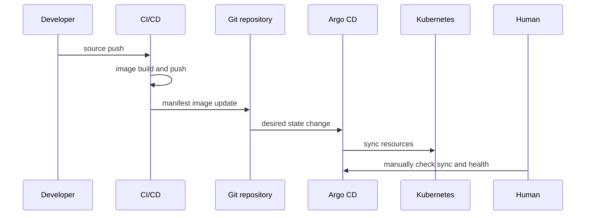
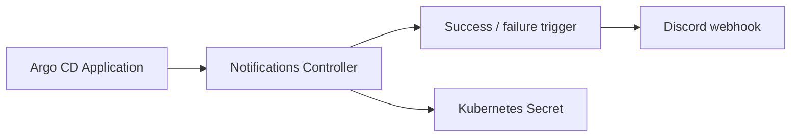
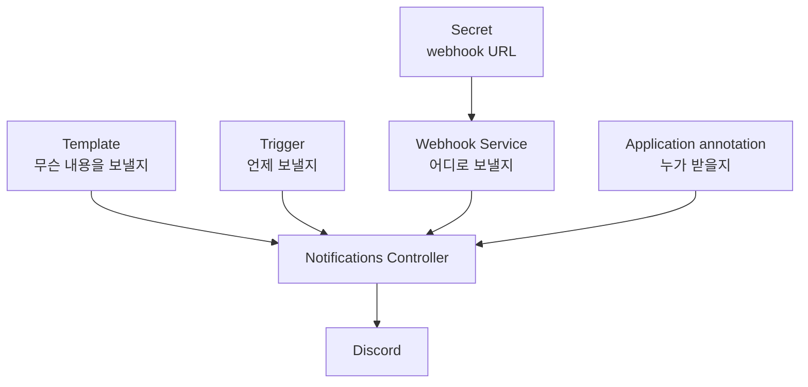
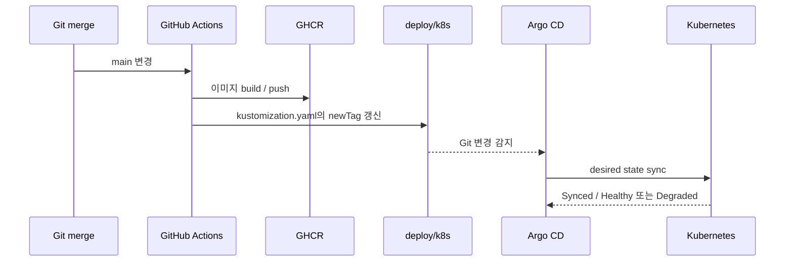
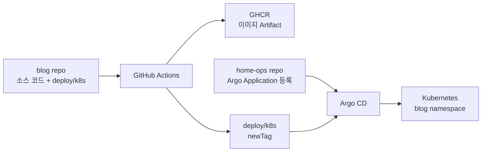

배포가 끝날 때마다 Argo CD 화면을 열어 상태를 확인하는 일이 조금씩 귀찮아졌다. 자동 Sync가 구성되어 있어도 마지막 판단은 사람이 직접 해야 했다. 배포가 성공했는지, 새 Pod가 실제로 준비됐는지, 혹시 Sync가 실패했는지를 Discord에서 바로 받고 싶었다.

목표는 배포 명령을 Discord에서 실행하는 것이 아니었다. Argo CD가 Git의 변경을 Kubernetes에 적용한 뒤, 그 결과를 사람이 화면에서 다시 확인하지 않아도 되도록 만드는 것이었다.

그 과정에서 알림을 구성하는 요소가 각각 어떤 책임을 갖는지도 확인했다. Secret은 알림 기능을 켜는 설정이 아니라 **webhook 주소를 보관하는 입력값**이다. Argo CD Notifications가 실제로 메시지를 보내려면 다음 세 가지 구성이 함께 필요하다.

1. Discord webhook URL을 담은 Secret
2. 어떤 조건에 어떤 메시지를 보낼지 정의한 ConfigMap
3. 어떤 Argo CD Application이 그 알림을 구독할지 연결하는 annotation

이번 글에서는 개인 Kubernetes 환경에 배포한 블로그 애플리케이션을 기준으로 이 구조를 적용한 과정을 정리한다.

## 배포 완료를 사람이 확인하던 흐름

기존 배포 흐름은 대략 다음과 같았다.



배포 자체는 자동화되어 있었지만 마지막 확인은 수동이었다. 자동화의 마지막 단계에 사람이 남아 있는 셈이었다.

목표는 다음과 같이 바꾸는 것이었다.



여기서 중요한 점은 Notifications Controller가 Secret만 읽는 것이 아니라, Application 상태와 ConfigMap의 trigger·template도 함께 읽는다는 것이다.

## Secret 하나가 아니라 알림 파이프라인을 구성한다

먼저 `argocd` namespace에 다음 Secret을 만들었다.

```text
argocd-notifications-secret
└── discord-webhook-url
```

실제 URL은 예제에 적지 않는다. webhook URL은 외부에서 메시지를 보낼 수 있는 인증 정보와 같은 성격이므로 Git 저장소, 블로그 글, 일반 로그에 남기면 안 된다.

Secret이 담당하는 책임은 하나다.

```text
discord-webhook-url = Discord로 요청을 보낼 주소
```

반대로 Secret에는 다음 정보가 없다.

- 언제 보내야 하는가
- 성공과 실패를 어떻게 구분하는가
- Discord 메시지의 제목과 내용은 무엇인가
- 어떤 Argo CD Application이 대상인가

그래서 Secret을 만든 직후에도 아무 알림이 오지 않는 것이 정상이다.

## ConfigMap에 서비스, 메시지, 조건을 정의한다

Argo CD Notifications의 ConfigMap에는 세 종류의 설정이 들어간다.

| 구성 | 책임 |
| --- | --- |
| Service | Discord webhook으로 요청을 보내는 방법 |
| Template | Discord에 보낼 메시지 형식 |
| Trigger | 어떤 Application 상태에서 Template을 실행할지 |

### Discord 서비스

실제 URL을 ConfigMap에 직접 적지 않고 Secret 참조를 사용한다.

```yaml
service.webhook.discord: |
  url: $discord-webhook-url
  headers:
    - name: Content-Type
      value: application/json
```

`$discord-webhook-url`은 literal URL이 아니다. Notifications Controller가 `argocd-notifications-secret`에서 같은 이름의 키를 찾아 실제 URL로 치환한다.

### 성공 메시지 Template

성공 Template에는 Discord Embed를 사용했다. 애플리케이션 이름, Git revision, Sync 상태, Health 상태를 함께 보내도록 했다.

```yaml
template.discord-deployed: |
  webhook:
    discord:
      method: POST
      body: |
        {
          "username": "Argo CD",
          "embeds": [{
            "title": "배포 완료: {{.app.metadata.name}}",
            "color": 5763719,
            "fields": [
              {"name": "Revision", "value": "{{.app.status.sync.revision}}", "inline": true},
              {"name": "Status", "value": "{{.app.status.sync.status}} / {{.app.status.health.status}}", "inline": true}
            ]
          }]
        }
```

`{{.app...}}`는 Notifications Controller가 현재 Argo CD Application 객체의 값으로 치환하는 템플릿 표현식이다.

실패 Template은 제목과 색상을 다르게 하고, Sync 실패의 phase를 표시하도록 만들었다.

### 성공과 실패 Trigger

이번에는 배포 성공을 다음 두 조건이 모두 맞을 때로 정의했다.

```yaml
trigger.on-deployed-discord: |
  - description: Application is synced and healthy
    oncePer: app.status.sync.revision
    send: [discord-deployed]
    when: app.status.operationState.phase in ['Succeeded'] && app.status.health.status == 'Healthy'
```

Sync 작업만 성공했다고 바로 “배포 완료”라고 판단하지 않은 이유가 있다. Manifest 적용은 끝났지만 새 Deployment가 아직 rollout 중이거나, readiness probe에 실패해 Health가 나쁠 수 있다.

따라서 이번 글에서의 배포 완료는 다음의 교집합이다.

```text
Argo Sync 성공
∩
Application Health Healthy
```

`oncePer`는 같은 Git revision에 대해 성공 알림이 계속 반복되지 않게 한다.

실패 조건은 Sync operation 자체가 `Error` 또는 `Failed`가 된 경우로 제한했다.

```yaml
trigger.on-sync-failed-discord: |
  - description: Application sync failed
    send: [discord-sync-failed]
    when: app.status.operationState.phase in ['Error', 'Failed']
```

### Sync는 성공했지만 애플리케이션이 망가진 경우

Sync 성공만으로는 서비스가 실제로 요청을 처리할 준비가 끝났다고 볼 수 없다. 예를 들어 다음 흐름이 가능하다.

```text
Manifest 적용 성공
→ 새 Pod 생성
→ 이미지 Pull 실패
→ Pod가 Ready가 되지 않음
→ Application Health = Degraded
```

이 경우 Kubernetes 리소스 적용 자체는 성공했기 때문에 `on-sync-failed`만으로는 놓칠 수 있다. 그래서 운영 중인 Application에는 Health 저하용 trigger도 함께 연결했다.

```yaml
template.discord-health-degraded: |
  webhook:
    discord:
      method: POST
      body: |
        {
          "username": "Argo CD",
          "embeds": [{
            "title": "상태 저하: {{.app.metadata.name}}",
            "color": 15158332,
            "fields": [
              {"name": "Sync", "value": "{{.app.status.sync.status}}", "inline": true},
              {"name": "Health", "value": "{{.app.status.health.status}}", "inline": true}
            ]
          }]
        }

trigger.on-health-degraded-discord: |
  - description: Application health became degraded
    oncePer: app.status.health.status
    send: [discord-health-degraded]
    when: app.status.health.status == 'Degraded'
```

세 trigger의 역할은 서로 다르다.

| Trigger | 의미 | 대표적인 상황 |
| --- | --- | --- |
| `on-deployed-discord` | Sync 성공 + Health 정상 | 새 버전이 실제로 서비스 가능 |
| `on-sync-failed-discord` | 리소스 적용 작업 실패 | 권한 오류, 잘못된 Manifest, Apply 실패 |
| `on-health-degraded-discord` | 적용은 됐지만 런타임 상태 저하 | `ImagePullBackOff`, `CrashLoopBackOff`, readiness 실패 |

즉 `on-sync-failed`는 “Argo CD가 변경을 적용하지 못했다”는 알림이고, `on-health-degraded`는 “적용은 했지만 애플리케이션이 정상 상태가 아니다”라는 알림이다. 둘은 겹치는 설정이 아니라 서로 다른 실패 지점을 감시한다.

## Application에 알림 구독을 연결한다

Service와 Template과 Trigger를 만들어도 대상 Application이 구독하지 않으면 메시지가 가지 않는다.

그래서 배포 대상 Application에 다음 annotation을 붙였다.

```yaml
metadata:
  annotations:
    notifications.argoproj.io/subscribe.on-deployed-discord.discord: ''
    notifications.argoproj.io/subscribe.on-sync-failed-discord.discord: ''
    notifications.argoproj.io/subscribe.on-health-degraded-discord.discord: ''
```

이 annotation은 다음 문장과 같다.

```text
이 Application이 on-deployed-discord trigger를 discord 서비스로 구독한다.
이 Application이 on-sync-failed-discord trigger를 discord 서비스로 구독한다.
이 Application이 on-health-degraded-discord trigger를 discord 서비스로 구독한다.
```

값이 비어 있는 것처럼 보이는 이유는 webhook URL을 annotation에 넣지 않기 때문이다. URL은 Service가 Secret에서 가져간다.

구성 요소를 책임별로 나누면 다음과 같다.



이 분리가 이번 작업에서 가장 중요했다.

```text
Secret      = 어디로
Template    = 무엇을
Trigger     = 언제
Annotation  = 누구에게 적용할지
Controller  = 실제 실행
```

## GitHub Actions가 `newTag`를 바꾸는 이유

현재 배포 흐름에서 GitHub Actions는 이미지를 Push하는 것에서 끝나지 않는다. Kubernetes가 어떤 이미지를 사용해야 하는지도 Git에 기록한다.



예를 들어 Deployment의 기본 이미지가 다음과 같다고 하자.

```yaml
image: ghcr.io/example/blog:v0.1.0
```

Kustomize overlay가 `newTag`를 적용하면 실제 렌더링 결과는 다음처럼 바뀐다.

```yaml
images:
  - name: ghcr.io/example/blog
    newTag: git-abcdef123456
```

그래서 CI의 순서는 중요하다.

1. 새 소스로 이미지를 빌드한다.
2. Registry에 새 이미지를 Push한다.
3. Push가 성공한 경우에만 `newTag`를 새 버전으로 바꾼다.
4. Manifest 변경을 Git commit으로 남긴다.
5. Argo CD가 그 commit을 감지해 Sync한다.

GitHub Actions가 Kubernetes에 직접 `kubectl apply`하는 방식이 아니다. Actions는 Artifact와 desired state를 Git에 남기고, Argo CD가 Git을 기준으로 클러스터를 변경한다. 이것이 현재 구조에서 GitHub Actions와 Argo CD의 경계다.

### CI가 늦거나 실패하면 어떻게 되는가

이미지 Build·Push 단계에서 실패하면 Manifest의 `newTag`도 바뀌지 않는다. 그러면 Argo CD는 새 배포를 시작하지 않고, 기존에 실행 중인 버전을 계속 유지한다.

반대로 다음과 같은 경우에는 `ImagePullBackOff`가 발생할 수 있다.

- 존재하지 않는 tag가 Manifest에 기록된 경우
- Registry 인증 Secret이 잘못된 경우
- 해당 노드 아키텍처용 이미지가 Push되지 않은 경우
- Registry 자체에 일시적인 문제가 있는 경우

이때 Argo CD 화면에서는 Sync가 성공으로 보일 수 있지만 Health가 `Degraded`가 될 수 있다. 그래서 배포 완료 알림만 두지 않고 Sync 실패와 Health 저하를 별도로 알리도록 했다.

## 현재 저장소 구조와 기업형 분리 구조

현재 개인 클러스터에서는 앱 저장소와 배포 Manifest를 한 저장소에 함께 둔다.



각 저장소의 책임은 다음과 같다.

| 저장소 | 관리하는 것 |
| --- | --- |
| `blog` | 애플리케이션 소스, Dockerfile, Deployment·Service·Kustomize Manifest, 이미지 버전 |
| `home-ops` | Argo CD `Application`, 대상 저장소와 경로, namespace, Sync 정책, 알림 구독 |
| GHCR | 실제 컨테이너 이미지 Artifact |

따라서 현재 구조에서는 이미지 버전을 두 저장소에 중복해서 관리하지 않는다. 이미지 tag는 `blog/deploy/k8s`에만 있고, `home-ops`에는 “어느 저장소의 어느 경로를 Argo CD가 감시할지”만 있다.

규모가 커지면 다음처럼 분리하는 경우가 많다.

```text
app repository
└── 소스 코드, 테스트, Dockerfile

deployment / environment repository
└── Deployment, Service, Helm/Kustomize, image tag 또는 digest

platform repository
└── Argo CD bootstrap, Application/ApplicationSet, AppProject, 공통 정책
```

이 구조에서 CI는 앱 저장소에서 이미지를 만들고, deployment repository의 이미지 tag나 digest를 바꾸는 Pull Request를 만든다. Argo CD는 deployment repository를 감시한다. 환경별 승인·승격·감사 이력이 중요해질수록 이 분리가 유리하다.

반대로 개인 프로젝트나 작은 팀에서는 현재처럼 `app + deploy/k8s`를 한 저장소에 두는 편이 단순하다. 저장소 간 동기화와 PR 관리가 줄고, 코드 commit부터 배포 Manifest 변경까지 한 번에 추적할 수 있기 때문이다. 분리 자체가 목적이 아니라 변경 권한과 배포 승인 경계를 분리할 필요가 있을 때 나누는 것이 좋다.

실제 사례로는 Kintone을 운영하는 Cybozu가 애플리케이션 저장소와 Kubernetes Manifest 저장소를 분리하고, CI가 이미지를 만든 뒤 Manifest 저장소를 갱신하며 Argo CD가 이를 적용하는 구조를 소개한 바 있다. 환경별 branch, AppProject, App-of-Apps와 같은 운영 경계도 함께 설명한다.

## 실제 적용 후 확인한 것

설정을 적용한 뒤 다음 항목을 확인했다.

### 1. ConfigMap 키가 로드됐는가

다음 일곱 가지 설정이 존재하는지 확인했다.

```text
service.webhook.discord
template.discord-deployed
template.discord-sync-failed
template.discord-health-degraded
trigger.on-deployed-discord
trigger.on-sync-failed-discord
trigger.on-health-degraded-discord
```

### 2. Application이 구독했는가

배포 대상 Application annotation에 성공·Sync 실패·Health 저하 구독이 모두 존재하는지 확인했다.

### 3. Controller가 실행 중인가

Notifications Controller Pod가 `1/1 Running`인지 확인했다.

### 4. 성공 알림이 실제 발화했는가

컨트롤러 로그에서 다음 흐름을 확인했다.

```text
on-deployed-discord TRIGGERED
Sending notification
Discord webhook POST
```


*실제로 받은 배포 완료 알림 예시. 당시 Application 이름은 `platform-ops-log`였으며, 이후 현재 구조에서 `blog`로 변경했다. Revision과 `Synced / Healthy` 상태를 함께 확인할 수 있다.*

실패 상태를 일부러 만들지는 않았다. 운영 중인 서비스의 배포를 고의로 깨뜨리는 대신, 성공 경로는 실제 상태로 확인하고 실패 경로는 trigger 조건과 Template 로딩을 검증하는 방식으로 남겼다.

## 로그에 webhook URL을 남기지 않기

검증 과정에서 webhook HTTP 요청을 디버그 로그로 출력하는 동작을 확인했다. URL은 단순한 식별자가 아니라 Discord에 요청을 보낼 수 있는 민감 정보다.

그래서 Notifications Controller의 로그 레벨을 `warn`으로 낮추고 재시작했다. 그리고 webhook URL이 노출됐을 가능성이 있으면 기존 Discord webhook을 폐기하고 새로 발급하는 것이 안전하다.

새 webhook을 발급한 뒤에는 ConfigMap을 다시 수정할 필요가 없다. Secret의 값만 교체하면 된다.

```bash
export DISCORD_WEBHOOK_URL='새_webhook_URL'

kubectl -n argocd create secret generic argocd-notifications-secret \
  --from-literal=discord-webhook-url="$DISCORD_WEBHOOK_URL" \
  --dry-run=client -o yaml | kubectl apply -f -
```

이 명령을 실행할 때 URL을 터미널 기록이나 채팅에 직접 남기지 않는 것이 좋다.

## 정리

이번 작업을 하면서 알림 설정과 배포 흐름을 다음처럼 이해하게 됐다.

> Secret 하나는 알림 시스템이 아니라 목적지 주소다.

Argo CD에서 Discord 알림을 구성하려면 다음 책임을 연결해야 한다.

1. Secret에 Discord webhook URL을 저장한다.
2. ConfigMap에 Discord Service를 정의한다.
3. 성공·실패·Health 저하 메시지 Template을 만든다.
4. Application 상태를 판단할 Trigger를 만든다.
5. Application annotation으로 알림 구독을 연결한다.
6. Notifications Controller가 설정을 읽고 webhook 요청을 실행하는지 확인한다.

배포 자체는 다음 경계를 따른다.

```text
GitHub Actions = 이미지 build/push + Manifest의 새 버전 기록
Argo CD        = Git의 desired state를 Kubernetes에 적용
Notifications  = Argo CD의 결과를 Discord로 전달
```

이 구조의 장점은 알림 목적지, 메시지 형식, 상태 조건, 대상 Application을 각각 바꿀 수 있다는 데 있다. Discord 대신 다른 webhook을 사용하거나, 실패 알림만 추가하거나, 여러 Application을 같은 trigger에 연결할 때도 책임 경계가 섞이지 않는다.

이번 구성에서는 `Degraded` 상태도 별도 알림으로 추가했다. 다음 단계에서는 rollout timeout, 특정 Pod 상태, 환경별 Discord 채널처럼 더 세밀한 정책을 고려할 수 있다. 다만 알림 조건을 늘릴수록 운영 채널이 시끄러워질 수 있으므로, 어떤 상태를 실제 대응 대상으로 볼지 먼저 정하는 편이 좋다.

## 참고 자료

- [Argo CD Notifications: Services overview](https://argo-cd.readthedocs.io/en/stable/operator-manual/notifications/services/overview/)
- [Argo CD Notifications: Webhook service](https://argo-cd.readthedocs.io/en/stable/operator-manual/notifications/services/webhook/)
- [Argo CD Notifications: Subscriptions](https://argo-cd.readthedocs.io/en/stable/operator-manual/notifications/subscriptions/)
- [Argo CD Notifications: Triggers](https://argo-cd.readthedocs.io/en/stable/operator-manual/notifications/triggers/)
- [Argo CD Notifications: Notification catalog](https://argo-cd.readthedocs.io/en/stable/operator-manual/notifications/catalog/)
- [Argo CD: Cluster bootstrapping and App-of-Apps](https://argo-cd.readthedocs.io/en/stable/operator-manual/cluster-bootstrapping/)
- [GitHub Docs: Publishing Docker images](https://docs.github.com/en/actions/tutorials/publish-packages/publish-docker-images?learn=continuous_deployment)
- [Cybozu Engineering Blog: Production-grade delivery workflow using Argo CD](https://blog.kintone.io/entry/production-grade-delivery-workflow-using-argocd)
- [Discord: Webhooks](https://docs.discord.com/developers/platform/webhooks)
