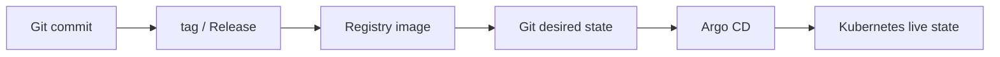
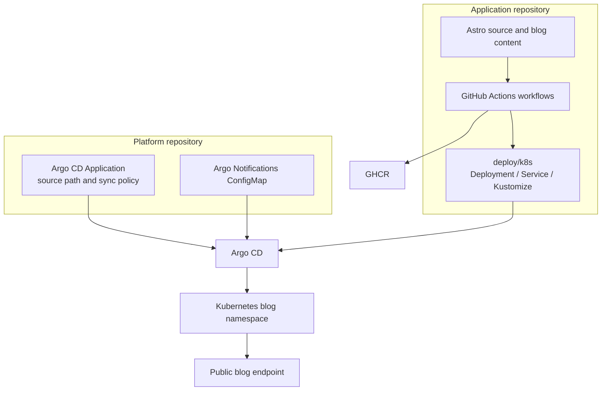
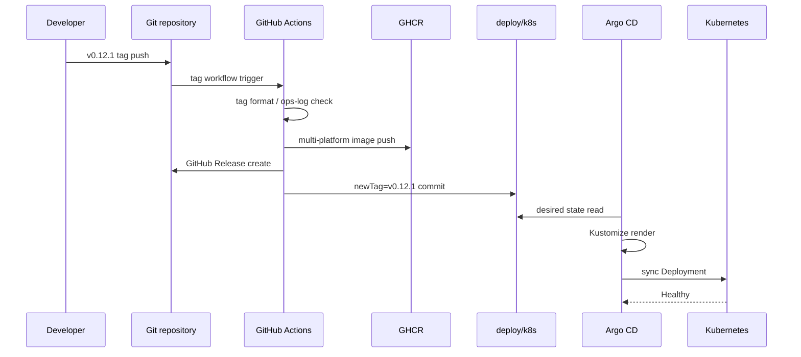

처음에는 블로그의 배포를 단순하게 생각했다.

```text
main push
→ Docker image build
→ Registry push
→ Kubernetes 배포
```

정적 Astro 블로그 하나를 홈 Kubernetes 클러스터에 올리는 일이라면 이 정도로 충분해 보였다. 그런데 실제로 구성하다 보니 질문이 계속 생겼다.

- GitHub Actions가 이미지를 만들면 바로 Kubernetes에 배포해야 할까?
- Argo CD가 Git을 감시한다면 어떤 Git 변경을 배포 기준으로 삼아야 할까?
- 글 하나를 수정할 때마다 GitHub Release와 patch 버전을 만들어야 할까?
- Git tag, GitHub Release, GHCR image, Kubernetes `newTag`는 각각 무엇을 의미할까?
- Actions는 성공했는데 Argo CD가 실패하면 어디를 봐야 할까?
- Discord 알림만 보고 콘텐츠 배포인지 기능 Release인지 구분할 수 있을까?

결론부터 말하면 현재 구조는 두 개의 배포 lane으로 나뉜다.

```text
글 작성·수정
→ SHA 기반 콘텐츠 배포

기능·레이아웃·인프라 변경
→ SemVer tag와 GitHub Release 기반 배포
```

이 글은 처음부터 이 구조를 알고 설계한 기록이 아니다. 하나의 배포 흐름으로 시작했다가, 콘텐츠와 애플리케이션 변경의 의미가 다르다는 것을 확인하고 구조를 다시 나눈 과정이다.

## 먼저 구분해야 했던 네 가지 상태

CI/CD를 이해하기 어려웠던 가장 큰 이유는 Git, Registry, Kubernetes가 서로 다른 상태를 가지고 있다는 사실을 한 덩어리로 생각했기 때문이다.

### 소스 상태

Git commit은 소스 코드와 글이 어떤 시점에 어떤 모습이었는지를 가리킨다.

```text
commit: 79d3b8a
```

commit은 변경 이력이다. 그 자체가 Kubernetes가 실행할 이미지라는 뜻은 아니다.

### 버전 상태

Git tag는 특정 commit에 사람이 붙이는 버전 이름이다.

```text
v0.12.0
```

현재 Release 배포에서는 이 tag를 배포 승인점으로 사용한다. 운영기록에 버전을 추가하고, PR을 merge한 뒤, 그 commit에 annotated tag를 붙인다.

```bash
git tag -a v0.12.1 -m "v0.12.1"
git push origin v0.12.1
```

### Artifact 상태

Docker build 결과는 Registry의 컨테이너 이미지다.

Release lane에서는 다음과 같이 저장한다.

```text
<registry>/blog:v0.12.1
```

콘텐츠 lane에서는 commit을 기준으로 저장한다.

```text
<registry>/blog:sha-79d3b8a
```

tag는 사람이 읽기 쉽고, SHA는 어떤 소스에서 만들어졌는지 추적하기 쉽다. 다만 tag만으로 이미지의 불변성을 완벽히 보장할 수는 없다. 더 강한 재현성이 필요하면 Registry digest를 사용해야 한다.

```text
<registry>/blog@sha256:<digest>
```

GitHub Container Registry는 tag뿐 아니라 digest로 이미지를 pull하는 방법도 제공한다. 현재 블로그는 운영 이해도를 우선해 SemVer와 SHA tag를 사용하고, digest pinning은 다음 개선 대상으로 남겨 두었다. [GitHub Container Registry: digest로 이미지 pull하기](https://docs.github.com/en/packages/working-with-a-github-packages-registry/working-with-the-container-registry)

### Kubernetes desired state

Kubernetes가 사용해야 할 이미지 버전은 Git의 Manifest에 기록된다.

```yaml
images:
  - name: <registry>/blog
    newTag: v0.12.1
```

이 값은 “이미지가 존재한다”는 뜻이 아니라 “이 이미지가 운영에서 원하는 상태다”라는 뜻이다.

### Cluster live state

마지막으로 실제 클러스터에서 실행 중인 Pod가 있다.

```text
desired state: v0.12.1
live Pod: v0.12.1
```

Argo CD는 desired state와 live state를 비교한다. 둘이 다르면 OutOfSync가 되고, 자동 sync가 켜져 있으면 클러스터를 Git 상태에 맞추려고 한다.

이 네 가지를 분리하면 배포 흐름이 훨씬 선명해진다.



## 처음에는 하나의 Release lane으로 시작했다

첫 번째로 정리한 구조는 Release 중심이었다.

```text
PR/main push
→ build 검증

vX.Y.Z tag push
→ image build/push
→ GitHub Release 생성
→ kustomization.yaml newTag 변경
→ Argo CD sync
```

이 방식의 장점은 분명했다. `v0.12.0`이라는 한 문자열이 다음 대상을 연결한다.

```text
운영기록 v0.12.0
↔ Git tag v0.12.0
↔ GitHub Release v0.12.0
↔ GHCR image :v0.12.0
↔ Kubernetes newTag v0.12.0
```

일반적인 코드 변경이나 인프라 변경을 운영에 반영할 때는 이 연결이 편했다. 누가 언제 무엇을 배포했는지 Release와 Git history를 함께 볼 수 있기 때문이다.

문제는 글이었다.

```text
글 제목 오타 수정
→ v0.12.1
→ GitHub Release 생성
→ 운영기록에 버전 추가
```

글 하나를 수정했을 뿐인데 애플리케이션 기능 Release와 동일한 절차가 필요했다. Release가 너무 자주 생기고, 운영기록도 콘텐츠 수정 이력으로 가득 찰 수 있었다.

여기서 “배포”라는 단어가 서로 다른 두 의미로 사용되고 있다는 것을 알게 됐다.

```text
콘텐츠 배포
= 이미 있는 블로그 엔진으로 새 글을 제공

Release 배포
= 블로그 엔진이나 운영 구조의 새 버전을 승인
```

## 참고한 공개 구조와 그대로 복사하지 않은 부분

이 구조는 특정 기업의 내부 시스템을 그대로 가져온 것이 아니다. 공개된 공식 문서와 reference architecture에서 공통 원칙을 확인하고, 개인 블로그의 규모에 맞게 줄였다.

### Argo CD의 GitOps 경계

Argo CD 공식 문서는 CI pipeline이 새 이미지를 build/push한 뒤 Manifest 저장소의 이미지 참조를 변경하고, Argo CD가 그 Git 변경을 sync하는 흐름을 설명한다. 자동 sync를 사용하면 CI가 Argo CD API 서버에 직접 접근하지 않아도 된다. [Argo CD: Automation from CI Pipelines](https://argo-cd.readthedocs.io/en/stable/user-guide/ci_automation/)

자동 sync 공식 문서도 Git의 desired manifest와 클러스터의 live state 차이를 감지해 sync하는 구조를 설명한다. [Argo CD: Automated Sync Policy](https://argo-cd.readthedocs.io/en/stable/user-guide/auto_sync/)

Argo CD 문서에는 애플리케이션 저장소와 Manifest 저장소를 분리하는 구성이 권장 예시로 나온다. 하지만 개인 블로그에서는 저장소를 무조건 나누는 것보다 운영 경계를 먼저 나누는 편이 낫다고 판단했다.

현재 선택은 다음과 같다.

```text
blog repository
├── Astro source
├── Dockerfile
└── deploy/k8s

home-ops repository
└── Argo CD Application
```

애플리케이션 저장소는 자신의 Kubernetes 리소스를 소유하고, 중앙 운영 저장소는 Argo CD Application과 클러스터 공통 설정을 소유한다.

앱마다 별도의 deployment repository를 만들지는 않았다. 앱 수가 늘고 팀·권한·환경이 분리되면 Manifest 저장소를 별도로 두는 것이 의미 있어지지만, 지금 규모에서는 저장소 간 연결만 늘어날 가능성이 컸다.

### Google Cloud의 CI/CD reference architecture

Google Cloud의 컨테이너 애플리케이션 reference architecture는 소스 변경을 trigger로 build/test를 수행하고, 이미지를 Artifact Registry에 저장한 뒤, 별도의 delivery 도구가 staging과 production으로 전달하는 구조를 보여 준다. [Google Cloud: CI/CD pipeline for containerized apps](https://docs.cloud.google.com/architecture/app-development-and-delivery-with-cloud-code-gcb-cd-and-gke)

또 다른 Google Cloud 문서는 GitHub Actions와 Cloud Deploy를 연결할 때 CI와 CD의 책임을 나누고, delivery pipeline과 target을 애플리케이션 build pipeline 밖에서 선언적으로 관리하는 방향을 설명한다. [Google Cloud: Using GitHub Actions with Cloud Deploy](https://cloud.google.com/blog/products/devops-sre/using-github-actions-with-google-cloud-deploy/)

이 구조를 그대로 적용하지는 않았다. 별도 staging과 production이 있는 서비스가 아니고, 현재는 단일 홈 클러스터에 하나의 블로그를 배포하기 때문이다. 대신 다음 원칙만 가져왔다.

```text
CI = build/test/artifact 생성
CD = desired state를 기준으로 실제 환경 반영
```

### GitLab의 downstream pipeline 사례

GitLab 공식 문서에는 애플리케이션 프로젝트가 별도의 downstream deployment project를 trigger하고 배포 결과를 upstream으로 돌려주는 구성이 소개되어 있다. 팀과 배포 저장소가 분리된 환경에서 유용한 패턴이다. [GitLab: Downstream pipelines for deployments](https://docs.gitlab.com/ci/pipelines/downstream_pipelines/)

이 사례는 “배포 저장소 분리”가 틀렸다는 뜻이 아니라, 분리의 비용을 감당할 조직 경계가 있을 때 효과가 커진다는 점을 보여 준다. 현재 블로그는 중앙 `home-ops`가 Application을 관리하되, 앱 Manifest는 앱 저장소에 두는 중간 형태를 선택했다.

### Argo CD를 여러 클러스터의 중앙 제어면으로 사용하는 사례

Google Cloud의 GKE fleet와 Argo CD reference 사례는 중앙 Argo CD가 여러 애플리케이션 클러스터를 바라보고, config repository와 cluster label을 이용해 배포 대상을 관리하는 hub-and-spoke 구조를 보여 준다. [Google Cloud: Build a fleet with Argo CD and GKE](https://cloud.google.com/blog/products/containers-kubernetes/building-a-fleet-with-argocd-and-gke)

현재 환경은 여러 클러스터를 운영하는 구조가 아니지만, `home-ops`에서 Application을 중앙 관리하는 방향은 이 원칙의 작은 버전으로 볼 수 있다.

## 현재 저장소와 책임 경계

현재 전체 구조는 다음과 같다.



### Application repository가 관리하는 것

```text
src/content/blog/        글 원문
src/layouts/             글 레이아웃
src/components/          화면 컴포넌트
public/                  이미지와 정적 파일
Dockerfile               runtime image
deploy/k8s/              blog Namespace, Deployment, Service, Kustomize
.github/workflows/       CI/CD와 댓글 알림
```

### Platform repository가 관리하는 것

```yaml
apiVersion: argoproj.io/v1alpha1
kind: Application
metadata:
  name: blog
spec:
  source:
    repoURL: https://github.com/<owner>/blog.git
    targetRevision: main
    path: deploy/k8s
  destination:
    namespace: blog
  syncPolicy:
    automated:
      prune: true
      selfHeal: true
```

Application은 앱의 Deployment YAML을 복사해 갖고 있지 않다. “어느 저장소의 어느 경로를 Argo CD가 읽을지”만 중앙에서 관리한다.

이 경계 덕분에 앱 저장소는 자신의 배포 리소스를 이해하고, 플랫폼 저장소는 어떤 앱을 어느 클러스터와 namespace에 연결할지 관리한다.

## Kustomize는 언제 최종 Manifest를 만드는가

`deploy/k8s/deployment.yaml`에는 기본 이미지 값이 남아 있다.

```yaml
containers:
  - name: blog
    image: <registry>/blog:v0.1.0
```

반면 `kustomization.yaml`에는 운영에서 선택한 이미지가 있다.

```yaml
images:
  - name: <registry>/blog
    newTag: v0.12.0
```

Kustomize는 두 파일을 조합해 최종 Manifest를 만든다.

```text
deployment.yaml
        +
kustomization.yaml newTag
        ↓
최종 Deployment image: <registry>/blog:v0.12.0
```

CI에서 실행하는 명령은 결과가 만들어지는지 검증하는 용도다.

```bash
kubectl kustomize deploy/k8s
```

Argo CD가 실제 배포할 때도 repo-server에서 Kustomize를 render한다. 따라서 최종 Manifest를 별도 파일로 commit하는 것이 아니라, Git에 있는 입력값으로 배포 시점에 결과를 만든다. Kubernetes 공식 문서도 `kustomization.yaml`의 `images`와 `newTag`로 컨테이너 이미지를 변경하고 `kubectl kustomize`로 결과를 확인하는 예시를 제공한다. [Kubernetes: Kustomize로 리소스 관리하기](https://kubernetes.io/docs/tasks/manage-kubernetes-objects/kustomization/)

## CI와 Release pipeline을 분리한 이유

### CI: 검증만 한다

PR과 일반 `main` push에는 `Validate` workflow가 실행된다.

```yaml
name: Validate

on:
  pull_request:
  push:
    branches:
      - main

jobs:
  build:
    steps:
      - run: npm ci
      - run: npm run build
      - run: kubectl kustomize deploy/k8s
```

여기서는 이미지를 GHCR에 push하지 않고 Kubernetes에도 직접 접근하지 않는다.

이렇게 하면:

- PR마다 운영 배포가 일어나지 않는다.
- 실패한 검증과 실패한 배포를 구분할 수 있다.
- `main`에 코드가 들어갔지만 아직 Release하지 않은 상태를 유지할 수 있다.

### Release lane: 버전이 있는 배포

Release workflow는 SemVer tag push에서 시작한다.

```yaml
on:
  push:
    tags:
      - 'v*.*.*'
  workflow_dispatch:
```

핵심 단계는 다음과 같다.



workflow는 먼저 tag 형식을 확인한다.

```bash
if [[ ! "$tag" =~ ^v[0-9]+\.[0-9]+\.[0-9]+$ ]]; then
  exit 1
fi
```

그리고 운영기록에 같은 버전이 있는지 확인한다.

```bash
grep -Fq "version: '$tag'" src/pages/ops-log.astro
```

이 검사는 현재 버전이 운영기록의 “최신 항목”인지 파싱하는 것은 아니다. 해당 tag 문자열이 운영기록에 존재하는지 확인하는 최소 검증이다. 나중에 운영기록의 첫 항목과 정확히 비교하려면 별도 parser가 필요하다.

검증을 통과하면 다음 이미지가 생성된다.

```text
<registry>/blog:v0.12.1
```

GHCR push에는 workflow의 `GITHUB_TOKEN`을 사용한다. GitHub 공식 문서도 workflow 저장소에서 Container Registry로 이미지를 publish할 때 `GITHUB_TOKEN`과 `packages: write` 권한을 사용하는 방식을 설명한다. [GitHub Docs: Publishing packages with GitHub Actions](https://docs.github.com/en/packages/managing-github-packages-using-github-actions-workflows/publishing-and-installing-a-package-with-github-actions)

GitHub Release 생성에는 별도의 `RELEASE_TOKEN`을 사용한다. Release API 권한 문제를 분리하고, token 값은 Git에 기록하지 않는다.

### `--generate-notes`는 무엇인가

Release 생성 단계에는 다음 옵션이 있다.

```bash
gh release create "$tag" \
  --title "$tag" \
  --generate-notes
```

`--generate-notes`는 이전 Release 이후의 merged pull request, contributor, changelog 링크를 바탕으로 GitHub Release 설명을 자동 생성한다. 운영기록 본문을 복사하는 기능은 아니다. [GitHub Docs: Automatically generated release notes](https://docs.github.com/en/repositories/releasing-projects-on-github/automatically-generated-release-notes)

### promotion commit

이미지와 Release가 준비되면 workflow가 `main`의 `newTag`를 바꾸고 bot commit을 만든다.

```text
chore(release): promote blog to v0.12.1 [deploy:release] [skip ci]
```

이 commit은 배포 명령이 아니라 desired state 변경 이력이다.

```text
image가 존재함
        ≠
운영이 그 image를 사용해야 함
```

두 상태를 분리했기 때문에 Registry push가 실패하면 Manifest promotion도 일어나지 않고, 기존 운영 이미지가 유지된다.

## 콘텐츠 lane: 글은 Release가 아니다

콘텐츠 workflow는 다음 경로의 `main` push만 감지한다.

```yaml
on:
  push:
    branches:
      - main
    paths:
      - 'src/content/blog/**'
      - 'public/images/blog/**'
```

글과 글 이미지만 변경된 경우 SHA tag로 이미지를 만든다.

```text
<registry>/blog:sha-79d3b8a
```

그리고 `newTag`를 바꾼다.

```text
chore(content): promote blog to sha-79d3b8a [deploy:content] [skip ci]
```

여기에는 Release가 없다. 대신 commit SHA가 콘텐츠 배포의 추적 기준이 된다.

콘텐츠 workflow에는 허용 경로 검사도 넣었다.

```bash
while IFS= read -r file; do
  case "$file" in
    src/content/blog/*|public/images/blog/*)
      ;;
    *)
      echo "Use the SemVer Release lane." >&2
      exit 1
      ;;
  esac
done <<< "$changed_files"
```

실수로 글과 `src/layouts`를 같은 commit에 넣으면 콘텐츠 배포로 조용히 처리하지 않는다. 둘 중 하나를 선택해야 한다.

```text
PR을 나눠 콘텐츠와 기능을 각각 배포
또는
전체 변경을 Release lane으로 배포
```

이 구분은 CI/CD 도구의 기능보다 변경의 의미를 먼저 정의한 결과다.

## 두 promotion이 충돌하지 않게 만들기

콘텐츠와 Release는 결국 같은 파일을 수정한다.

```text
deploy/k8s/kustomization.yaml
```

두 workflow가 동시에 실행되면 다음 문제가 생길 수 있다.

```text
콘텐츠 workflow: newTag=sha-abc1234
Release workflow: newTag=v0.13.0
```

어느 commit이 마지막에 push되는지에 따라 운영 desired state가 달라질 수 있다.

그래서 두 workflow가 같은 concurrency group을 공유하도록 했다.

```yaml
concurrency:
  group: blog-production-promotion
  cancel-in-progress: false
```

GitHub Actions는 기본적으로 여러 workflow run을 동시에 실행할 수 있다. `concurrency`는 같은 그룹의 실행을 직렬화해 배포 Manifest를 동시에 수정하지 않도록 하는 기능이다. [GitHub Docs: Concurrency](https://docs.github.com/en/actions/concepts/workflows-and-actions/concurrency)

콘텐츠 배포 중 Release가 들어오면 Release workflow는 앞선 promotion이 끝난 뒤 실행된다. 반대로 Release가 먼저 실행되면 콘텐츠 workflow가 그 뒤에 최신 `main`을 기준으로 진행한다.

다만 concurrency가 모든 race condition을 없애는 것은 아니다. 장시간 build 중 새로운 commit이 `main`에 들어오면 콘텐츠 workflow는 `main`이 자신이 build한 commit과 달라졌는지 확인하고 중단한다. 오래된 이미지가 최신 콘텐츠를 덮어쓰지 않게 하기 위한 확인이다.

## 수동 실행과 멱등성

Release workflow에는 `workflow_dispatch`도 있다.

```yaml
workflow_dispatch:
  inputs:
    release_tag:
      required: true
    skip_release:
      required: false
```

이것은 별도의 복구 workflow가 아니다. 기존 `Publish release image` workflow를 GitHub Actions 화면이나 CLI에서 다시 시작하는 입력이다.

```bash
gh workflow run "Publish release image" \
  -R <owner>/blog \
  -f release_tag=v0.12.0 \
  -f skip_release=true
```

수동 실행은 다음 tag commit을 checkout한다.

```text
현재 main
  ↓
release_tag=v0.12.0
  ↓
v0.12.0 tag가 가리키는 commit checkout
```

그리고 이미지 build/push, Release 확인, Manifest promotion을 다시 수행한다.

### 현재 코드의 반복 안전성

이미 Release가 있으면 다시 만들지 않는다.

```bash
if gh release view "$RELEASE_TAG"; then
  echo "GitHub Release already exists."
else
  gh release create "$RELEASE_TAG"
fi
```

이미 `newTag`가 같은 값이면 파일을 바꾸지 않는다.

```python
if updated == text:
    print(f"newTag is already {image_tag}")
else:
    path.write_text(updated)
```

staged diff가 없으면 빈 commit도 만들지 않는다.

```bash
if git diff --cached --quiet; then
  echo "No manifest update needed."
  exit 0
fi
```

따라서 Release 중복 생성과 Manifest 빈 commit은 막을 수 있다. 하지만 같은 이미지 tag로 build/push를 다시 하는 것까지 완전히 불변으로 만드는 것은 아니다. 엄밀한 재현성이 필요하면 image digest를 desired state에 기록해야 한다.

## 알림은 CI와 CD를 따로 봐야 한다

GitHub Actions 성공만으로 배포 성공이라고 판단하지 않는다.

```text
GitHub Actions 성공
= build/test 성공
  image push 성공
  desired state commit 성공

Argo CD 성공
= desired state render 성공
  Kubernetes apply 성공
  Pod Ready
  Application Healthy
```

현재는 Argo CD Notifications를 통해 세 가지 상태를 Discord로 보낸다.

```text
on-deployed
on-sync-failed
on-health-degraded
```

### 성공 알림

```text
✅ 배포 완료: blog
배포 유형: 콘텐츠 배포
Status: Synced / Healthy
Revision: <commit>
```

### Sync 실패 알림

Git Manifest를 읽거나 render/apply하는 단계에서 실패한 경우다.

가능한 원인은 다음과 같다.

- Kustomize 문법 오류
- Kubernetes resource 권한 오류
- 잘못된 Manifest
- Argo CD repository 접근 오류

### Health degraded 알림

Sync 자체는 끝났지만 실제 애플리케이션이 정상 상태가 아닌 경우다.

- ImagePullBackOff
- Readiness probe 실패
- Deployment replica 미충족
- Pod CrashLoopBackOff

### 알림에서 배포 유형을 구분하는 방법

promotion commit에 marker를 붙인다.

```text
[deploy:content]
[deploy:release]
```

Argo Notifications template에서 source commit metadata의 commit message를 읽는다.

```yaml
{{- $commit := call .repo.GetCommitMetadata .app.status.sync.revision -}}
{{ if contains "[deploy:content]" $commit.Message }}
콘텐츠 배포
{{ else if contains "[deploy:release]" $commit.Message }}
Release 배포
{{ else }}
기타 Manifest 변경
{{ end }}
```

Argo CD Notifications 공식 template 기능에는 Application source commit metadata를 읽는 `repo.GetCommitMetadata`가 포함되어 있다. [Argo CD Notifications: Templates](https://argo-cd.readthedocs.io/en/stable/operator-manual/notifications/templates/)

이 작업을 적용하면서 한 번은 ConfigMap의 Go template 조건에 JSON escaping을 그대로 넣어 controller parsing 오류가 발생했다.

```text
unexpected "\\" in operand
```

Kustomize render는 성공했지만 알림 controller가 template을 읽지 못하는 상황이었다. 이 경험 때문에 설정 반영 후에는 다음을 각각 확인해야 한다는 기준이 생겼다.

```text
1. Git manifest render
2. Argo Application sync
3. Notifications controller log
4. 실제 Discord message
```

YAML 문법이 맞는 것과 Go template이 실행 가능한 것은 서로 다른 검증 대상이다.

## 실제로 무엇을 모니터링하는가

배포 후 확인 순서는 다음과 같이 정했다.

### 1. GitHub Actions

```text
Validate
Publish content image
Publish release image
```

확인할 것:

- workflow가 올바른 event로 실행됐는가
- build가 성공했는가
- GHCR image가 존재하는가
- promotion commit이 `main`에 들어갔는가

### 2. Argo CD Application

```text
Sync: Synced
Health: Healthy
Revision: expected promotion commit
```

Argo CD 자동 sync는 Git desired state와 live state를 비교하는 것이므로, Actions의 마지막 commit과 Argo Application revision이 이어지는지 확인한다.

### 3. Kubernetes

```bash
kubectl -n blog get deployment,pods,service
kubectl -n blog rollout status deployment/blog
```

확인할 것:

- Deployment replicas가 Ready인가
- Pod가 Running인가
- image tag와 digest가 기대한 값인가
- readiness/liveness probe가 통과하는가

### 4. 외부 health check

```bash
curl -fsS https://<blog-host>/healthz
```

클러스터 내부 Healthy와 외부 접속 성공은 별도다. Cloudflare Tunnel, DNS, Service 경로까지 확인해야 최종 사용자 관점의 배포 성공을 판단할 수 있다.

### 5. Discord

마지막으로 사람이 직접 화면을 새로고침하는 대신 다음 알림을 확인한다.

```text
배포 유형
Revision
Sync status
Health status
```

그래도 Discord는 결과 전달 수단이지 유일한 관측 시스템은 아니다. 문제 원인은 Actions log, Argo operation history, Kubernetes event와 Pod log에서 찾아야 한다.

## AI에게는 어떤 식으로 요청하는가

구조를 나누고 나니 AI에게도 작업 종류를 명확히 전달할 수 있게 됐다.

### 글만 작성

```text
새 글 작성하고 PR만 올려줘. 배포는 하지 마.
```

AI는 글 작성, build 검증, PR 생성까지만 수행한다.

### 글을 운영에 반영

```text
새 글 작성하고 main merge 후 콘텐츠 배포와 Argo 상태까지 확인해줘.
```

AI는 콘텐츠 lane을 사용하고 GitHub Release를 만들지 않는다.

### 기능 변경을 Release

```text
Mermaid 변경사항을 minor Release로 배포해줘.
```

AI는 최신 Release를 확인하고, 다음 버전을 계산하고, 운영기록·tag·Release·image·Argo 상태를 연결한다.

### 혼합 변경

```text
새 글과 레이아웃을 함께 수정해줘.
```

이 경우는 자동으로 콘텐츠 lane에 넣지 않는다. PR을 나눌지, 전체를 Release로 배포할지 결정해야 한다.

AI의 역할은 배포 버튼을 대신 누르는 것보다 변경을 올바른 lane에 넣고, 각 경계의 결과를 확인하는 데 있다.

## 현재 구조의 장점과 남은 한계

### 얻은 것

- 글 수정이 불필요한 Release를 만들지 않는다.
- 기능·인프라 변경은 SemVer로 추적한다.
- 이미지와 desired state의 순서를 Git commit으로 남긴다.
- Argo CD가 클러스터에 직접 접근하는 CI token을 요구하지 않는다.
- Actions 성공과 실제 Kubernetes Healthy를 분리해 볼 수 있다.
- Discord에서 콘텐츠 배포와 Release 배포를 구분할 수 있다.
- 중앙 `home-ops`는 Application과 플랫폼 설정을 관리한다.

### 남은 한계

- SHA tag도 현재는 tag 기반이므로 digest만큼 강한 불변성은 아니다.
- 운영기록 버전 검사는 아직 최신 항목 비교가 아니라 문자열 존재 검사다.
- 콘텐츠 workflow의 첫 실제 글 배포는 콘텐츠 변경을 넣어 별도 검증해야 한다.
- 단일 블로그 기준의 구조라 여러 환경·여러 클러스터의 promotion 정책은 아직 없다.
- Discord 알림은 결과를 알려 주지만 원인 분석은 Actions·Argo·Kubernetes를 함께 봐야 한다.

## 마무리: 배포를 하나의 버튼으로 보지 않기

처음에는 “GitHub Actions가 Docker image를 만들고 Kubernetes에 배포한다”고 생각했다. 지금은 배포를 다음처럼 나눠서 본다.

```text
소스 변경
→ 검증
→ Artifact 생성
→ desired state 기록
→ Argo CD render/sync
→ Kubernetes health
→ 알림
```

그리고 모든 변경이 같은 속도로 움직일 필요는 없다고 판단했다.

```text
글 작성/수정
→ 빠른 콘텐츠 배포

기능/구조/인프라 변경
→ 사람이 확인하는 Release 배포
```

Release는 많이 만드는 것이 좋은 것이 아니라, 의미 있는 운영 기준점을 남길 때 유용하다. 반대로 콘텐츠는 작은 수정도 사용자에게 빠르게 전달되는 편이 낫다.

현재 구조가 모든 조직에 맞는 정답은 아니다. 팀이 커지고 환경이 늘어나면 애플리케이션 저장소와 Manifest 저장소, 환경별 promotion, 이미지 digest pinning, staging 승인 단계를 더 분리할 수 있다.

지금의 결론은 더 단순하다.

> 변경의 의미가 다르면, 배포 lane도 달라야 한다.

## 참고 자료

- [GitHub Actions workflow syntax](https://docs.github.com/en/actions/reference/workflows-and-actions/workflow-syntax)
- [GitHub Actions concurrency](https://docs.github.com/en/actions/concepts/workflows-and-actions/concurrency)
- [GitHub Container Registry와 GitHub Actions](https://docs.github.com/en/packages/managing-github-packages-using-github-actions-workflows/publishing-and-installing-a-package-with-github-actions)
- [GitHub automatically generated release notes](https://docs.github.com/en/repositories/releasing-projects-on-github/automatically-generated-release-notes)
- [Argo CD: Automation from CI Pipelines](https://argo-cd.readthedocs.io/en/stable/user-guide/ci_automation/)
- [Argo CD: Automated Sync Policy](https://argo-cd.readthedocs.io/en/stable/user-guide/auto_sync/)
- [Argo CD Notifications: Templates](https://argo-cd.readthedocs.io/en/stable/operator-manual/notifications/templates/)
- [Kubernetes: Declarative Management with Kustomize](https://kubernetes.io/docs/tasks/manage-kubernetes-objects/kustomization/)
- [Google Cloud: CI/CD pipeline for containerized apps](https://docs.cloud.google.com/architecture/app-development-and-delivery-with-cloud-code-gcb-cd-and-gke)
- [Google Cloud: Using GitHub Actions with Cloud Deploy](https://cloud.google.com/blog/products/devops-sre/using-github-actions-with-google-cloud-deploy/)
- [GitLab: Downstream pipelines for deployments](https://docs.gitlab.com/ci/pipelines/downstream_pipelines/)
- [Google Cloud: Build a fleet with Argo CD and GKE](https://cloud.google.com/blog/products/containers-kubernetes/building-a-fleet-with-argocd-and-gke)
