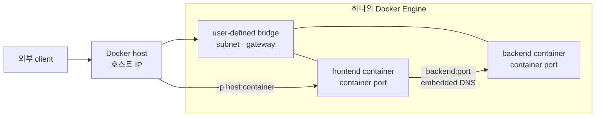

Docker 컨테이너 두 개를 같은 네트워크에 붙이면 서로 통신할 수 있다. `-p 18080:80`을 붙이면 호스트 밖에서도 웹 서버에 접근할 수 있다. 하지만 이 결과만 외우면 `eth0`, `veth`, `docker0`, gateway, routing table이 서로 어떤 관계인지 헷갈린다.

이 글의 범위는 **하나의 Docker 호스트 안에서 컨테이너가 서로 통신하고 외부로 나가는 과정**이다.

> 컨테이너는 별도 커널을 갖는 것이 아니라 host kernel의 network namespace를 격리해 사용한다. Docker는 그 namespace를 veth와 Linux bridge로 호스트 네트워크에 연결한다.

Kubernetes의 Pod, CNI, Service, Ingress는 별도 글에서 다룬다.

## 컨테이너에도 네트워크 스택이 있다

Docker 컨테이너 안에서는 보통 다음 정보를 확인할 수 있다.

- 네트워크 인터페이스
- IP 주소
- 기본 gateway
- routing table
- DNS 설정

컨테이너는 호스트와 격리된 network namespace를 사용하지만, 그 안의 프로세스는 일반적인 IP 네트워크처럼 패킷을 만든다. 실제 처리는 별도 컨테이너 커널이 아니라 host kernel이 해당 namespace의 관점에서 수행한다.



위 bridge는 물리적인 스위치가 아니라 Docker가 호스트에 구성하는 가상 Linux bridge다.


<p style="margin: -0.75rem 0 1.75rem; text-align: center; color: #64748b; font-size: 0.78rem; line-height: 1.5;">기본 <code>bridge</code> 네트워크를 기준으로 컨테이너와 호스트의 연결을 표현한 그림입니다. user-defined bridge에서는 <code>docker0</code> 대신 보통 <code>br-&lt;network-id&gt;</code> 형태의 별도 Linux bridge가 생성됩니다.</p>

## eth0, veth, bridge, gateway

### 컨테이너의 `eth0`와 호스트 NIC는 다르다

그림의 `eth0`는 두 종류를 구분해야 한다.

- 컨테이너 `eth0`: 컨테이너 network namespace 안에서 보이는 가상 인터페이스
- 호스트 NIC: 호스트가 실제 네트워크에 연결할 때 사용하는 인터페이스

호스트 NIC는 `eth0`라는 이름이 아닐 수 있다. Ubuntu에서는 `enp2s0`, `ens18`처럼 보일 수 있다. 이름이 같더라도 network namespace가 다르면 서로 다른 인터페이스다.

### `veth pair`는 namespace를 연결한다

Docker는 컨테이너를 만들 때 한 쌍의 가상 Ethernet 인터페이스를 만든다.

```text
컨테이너 eth0 ── veth pair ── host veth ── docker0 또는 br-<network-id>
                                                     │
                                              bridge gateway IP
```

한쪽 끝은 컨테이너 namespace 안에서 `eth0`로 보이고, 반대쪽 끝은 호스트 namespace의 `veth...`로 보인다. 호스트 쪽 veth는 Linux bridge에 연결된다.

### `docker0`는 무엇인가

`docker0`는 Docker의 기본 `bridge` 네트워크에 연결된 Linux bridge 인터페이스다. 여러 컨테이너의 host-side veth를 하나의 가상 스위치처럼 묶는다.

user-defined bridge에서는 보통 `docker0`가 아니라 다음과 같은 별도 bridge가 생성된다.

```text
br-<network-id>
```

원리는 같지만 네트워크별 subnet, gateway, 내장 DNS 범위를 분리할 수 있다. 실제 애플리케이션 스택에서는 기본 `bridge`보다 user-defined bridge를 사용하는 편이 관리하기 쉽다.

### gateway는 bridge의 IP다

gateway는 컨테이너 eth0와 veth 사이에 따로 있는 장비가 아니다. Docker bridge에 호스트가 할당한 IP 주소다.

```text
bridge subnet: 172.20.0.0/16
bridge gateway: 172.20.0.1
frontend: 172.20.0.2
backend: 172.20.0.3
```

- `172.20.0.2 → 172.20.0.3`: 같은 subnet이므로 대상 컨테이너로 직접 전달
- `172.20.0.2 → 8.8.8.8`: subnet 밖이므로 `172.20.0.1`을 다음 hop으로 선택

따라서 gateway는 “모든 통신이 반드시 통과하는 주소”가 아니라, **컨테이너 subnet 밖으로 나갈 때 사용하는 다음 hop**이다.

## routing table과 ARP

컨테이너도 목적지에 따라 직접 보낼지 gateway로 보낼지 판단해야 한다. 그래서 namespace마다 routing table이 있다.

```text
172.20.0.0/16 dev eth0          # 같은 bridge subnet
default via 172.20.0.1 dev eth0  # 그 외 목적지
```

먼저 목적지 IP를 routing table로 판단한다. 그 다음 현재 링크에서 사용할 **다음 hop의 MAC 주소**가 필요하다.

### 같은 bridge subnet으로 갈 때

frontend가 backend `172.20.0.3`으로 연결한다고 하자.

1. frontend namespace의 routing table이 backend를 같은 subnet으로 판단한다.
2. host kernel이 backend IP의 MAC을 모르면 ARP 요청을 만든다.
3. ARP 요청은 bridge 범위의 Ethernet broadcast로 전달된다.
4. backend의 IP를 가진 namespace가 ARP reply를 보낸다.
5. host kernel은 neighbor cache에 IP-MAC 매핑을 저장한다.
6. bridge가 backend MAC을 기준으로 프레임을 전달한다.

```text
frontend process
  → frontend eth0
  → frontend-side veth
  → Docker bridge
  → backend-side veth
  → backend eth0
  → backend process
```

ARP 요청의 broadcast는 전체 인터넷으로 퍼지는 것이 아니다. 같은 Layer 2 네트워크 안에서만 전달된다. 다른 subnet으로 갈 때는 목적지 서버의 MAC을 찾지 않고, 먼저 bridge gateway의 MAC을 찾는다. ARP가 IP가 아닌 “다음 hop”의 link-layer 주소를 찾는 이유다.

```bash
docker exec frontend ip addr
docker exec frontend ip route
docker exec frontend ip neigh
ip -br link
bridge link
```

`ip neigh`에 다음과 같은 항목이 보이면 해당 namespace 관점에서 IP와 MAC 관계를 확인할 수 있다.

```text
172.20.0.3 dev eth0 lladdr 02:42:ac:14:00:03 REACHABLE
```

ARP의 요청과 응답은 [RFC 826](https://www.rfc-editor.org/rfc/rfc826.html)에 정의된 방식으로 동작한다. Linux kernel은 neighbor 정보를 관리하고, 관련 상태는 [Linux kernel neighbour documentation](https://kernel.org/doc/html/latest/netlink/specs/rt-neigh.html)에서 확인할 수 있다.

### 외부 네트워크로 나갈 때

```text
frontend 172.20.0.2
  → bridge gateway 172.20.0.1
  → host routing/NAT
  → host NIC enp2s0
  → 공유기/외부 네트워크
```

이때 IP 목적지는 외부 IP이고, Ethernet 목적지는 우선 bridge gateway MAC이다. 호스트를 지난 뒤에는 각 링크마다 다음 hop의 MAC을 사용한다. 최종 서버의 MAC을 컨테이너가 직접 알아내는 구조가 아니다.

## 컨테이너마다 `/etc/resolv.conf`가 있는 이유

애플리케이션이 `backend`, `db`, `example.com` 같은 이름을 IP로 바꾸려면 질의할 DNS resolver를 알아야 한다. 그래서 각 network namespace에 `/etc/resolv.conf`가 존재한다.

user-defined bridge에서는 보통 다음과 같은 Docker 내장 DNS 주소가 설정된다.

```text
nameserver 127.0.0.11
```

이 주소는 컨테이너 내부 애플리케이션이 Docker Engine의 embedded DNS로 질의하는 진입점이다. 같은 user-defined network의 `backend` 이름은 Docker가 관리하고, 외부 도메인은 설정된 upstream DNS로 전달될 수 있다.

```bash
docker exec frontend cat /etc/resolv.conf
docker exec frontend getent hosts backend
docker exec frontend getent hosts example.com
```

컨테이너별 `resolv.conf`는 호스트의 DNS 설정을 단순히 복사한 파일이 아니다. 각 network namespace 안의 프로세스가 독립적으로 이름 해석 설정을 읽을 수 있게 Docker가 주입한 설정이다.

## default bridge와 user-defined bridge

Docker를 설치하면 기본 `bridge`, `host`, `none` 네트워크가 만들어진다.

```bash
docker network ls
```

```text
NETWORK ID     NAME      DRIVER    SCOPE
<network-id>   bridge    bridge    local
<network-id>   host      host      local
<network-id>   none      null      local
```

- `bridge`: 별도 네트워크 namespace와 기본 bridge 연결
- `host`: 호스트 network namespace를 공유해 격리가 줄어듦
- `none`: 기본 네트워크 연결을 거의 제공하지 않음

실제 애플리케이션 스택에서는 이름 있는 user-defined bridge를 만드는 편이 낫다.

```bash
docker network create --driver bridge app-net

docker run -d \
  --name backend \
  --network app-net \
  nginx:alpine

docker run -d \
  --name frontend \
  --network app-net \
  nginx:alpine
```

이제 `frontend`는 `backend`라는 이름으로 같은 network의 컨테이너를 찾을 수 있다.

```bash
docker run --rm \
  --network app-net \
  busybox wget -qO- http://backend
```

`backend`는 사람이 `/etc/hosts`에 직접 적은 값이 아니다. Docker가 user-defined network의 embedded DNS로 컨테이너 이름을 해석한다.

## `EXPOSE`와 `-p`는 다르다

Dockerfile의 `EXPOSE 80`은 이미지가 사용하는 포트를 문서화하는 메타데이터에 가깝다. 외부에서 실제 접근할 수 있게 만드는 것은 `docker run -p` 또는 Compose의 `ports` 설정이다.

```bash
docker run -d \
  --name web \
  --network app-net \
  --publish 18080:80 \
  nginx:alpine

curl -I http://127.0.0.1:18080
```

```text
호스트의 127.0.0.1:18080
        ↓ port publishing
컨테이너 web:80
```

같은 `app-net`의 다른 컨테이너는 호스트 포트로 돌아가지 않고 `web:80`으로 접근할 수 있다. 외부 진입 경로와 컨테이너 간 내부 경로를 분리하면 불필요한 공개 포트를 줄일 수 있다.

## `docker network inspect`에서 볼 항목

```bash
docker network inspect app-net
```

| 항목 | 의미 |
| --- | --- |
| `Driver` | bridge, overlay 등 네트워크 드라이버 |
| `Subnet` | 네트워크에 할당된 주소 범위 |
| `Gateway` | 컨테이너가 subnet 밖으로 나갈 때 사용하는 주소 |
| `Containers` | 연결된 컨테이너 목록 |
| `IPv4Address` | 해당 network에서 컨테이너가 받은 IP |

컨테이너 IP를 애플리케이션 설정에 직접 넣으면 재생성에 취약하다. 같은 Docker network 안에서는 컨테이너 이름이나 Compose service name을 사용하고, 외부 공개는 reverse proxy나 publish 포트에 맡기는 편이 낫다.

## Docker bridge의 범위

Docker user-defined bridge는 기본적으로 **하나의 Docker Engine 호스트 범위**다. 서로 다른 서버에서 실행 중인 컨테이너를 같은 bridge 이름만으로 연결할 수는 없다.

여러 Docker 호스트에 걸친 네트워크가 필요하면 Docker Swarm overlay 같은 분산 네트워크나 호스트 간 별도 라우팅이 필요하다. 노드가 늘어나면서 Pod, CNI, Service가 등장하는 Kubernetes 네트워크는 다음 글에서 분리해 설명한다.

## 확인 순서

Docker에서 “네트워크가 안 된다”고 하면 다음 순서로 범위를 좁힌다.

1. 프로세스가 컨테이너 안에서 실제로 listen하는가?
2. 컨테이너가 예상한 network에 연결되어 있는가?
3. 컨테이너의 IP와 route가 예상과 같은가?
4. 상대 컨테이너 이름이 embedded DNS로 해석되는가?
5. 상대 포트와 target 포트가 맞는가?
6. 외부 요청이라면 port publishing, host firewall, NAT가 맞는가?

```bash
docker network ls
docker network inspect app-net
docker ps
docker inspect backend --format '{{json .NetworkSettings.Networks}}'
docker exec backend ip addr
docker exec backend ip route
docker exec backend cat /etc/resolv.conf
```

컨테이너 이미지에 `ip` 명령어가 없을 수 있다. 이는 이미지에 진단 도구가 없다는 뜻이지 네트워크가 없다는 뜻은 아니다. 별도의 debug container를 같은 network에 붙여 확인하는 방법도 있다.

## 정리

```text
container eth0
  → network namespace
  → veth pair
  → docker0 또는 br-<network-id>
  → bridge gateway
  → host routing/NAT
  → host NIC
```

핵심은 Docker가 컨테이너마다 별도 커널을 만드는 것이 아니라, host kernel의 network namespace와 가상 링크를 이용해 네트워크 경계를 만든다는 점이다.

Kubernetes에서는 이 구조가 Pod, CNI, Service, Ingress/Gateway라는 더 큰 범위의 책임으로 나뉜다. [Kubernetes 네트워크 글](/blog/kubernetes-networking-pod-cni-service-ingress/)에서 이어서 정리한다.

## 참고 자료

- [Docker Docs - Networking overview](https://docs.docker.com/engine/network/)
- [Docker Docs - Bridge network driver](https://docs.docker.com/engine/network/drivers/bridge/)
- [Docker Docs - Container networking](https://docs.docker.com/engine/network/)
- [RFC 826 - An Ethernet Address Resolution Protocol](https://www.rfc-editor.org/rfc/rfc826.html)
- [Linux kernel - neighbour management](https://kernel.org/doc/html/latest/netlink/specs/rt-neigh.html)
