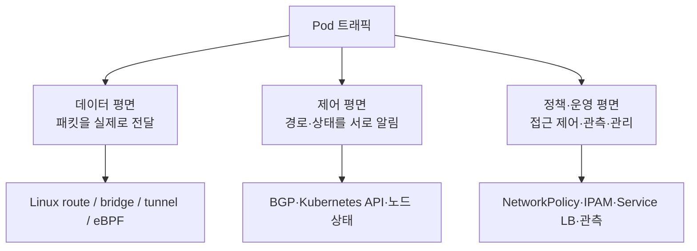
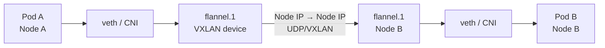
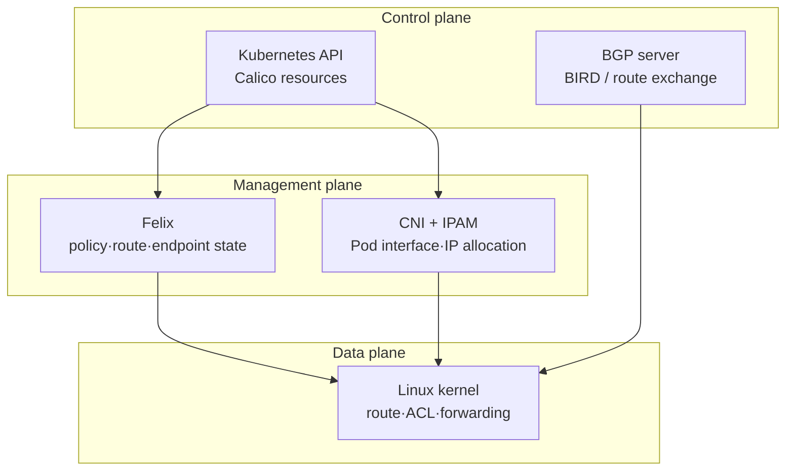
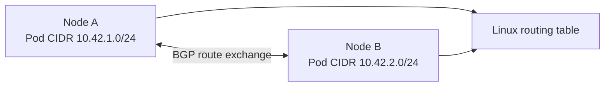
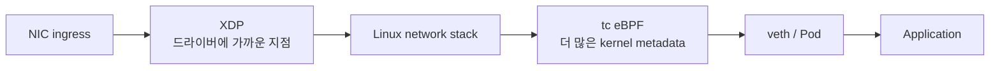
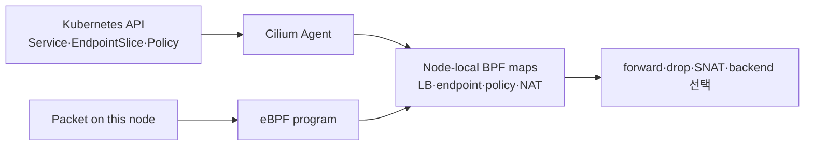
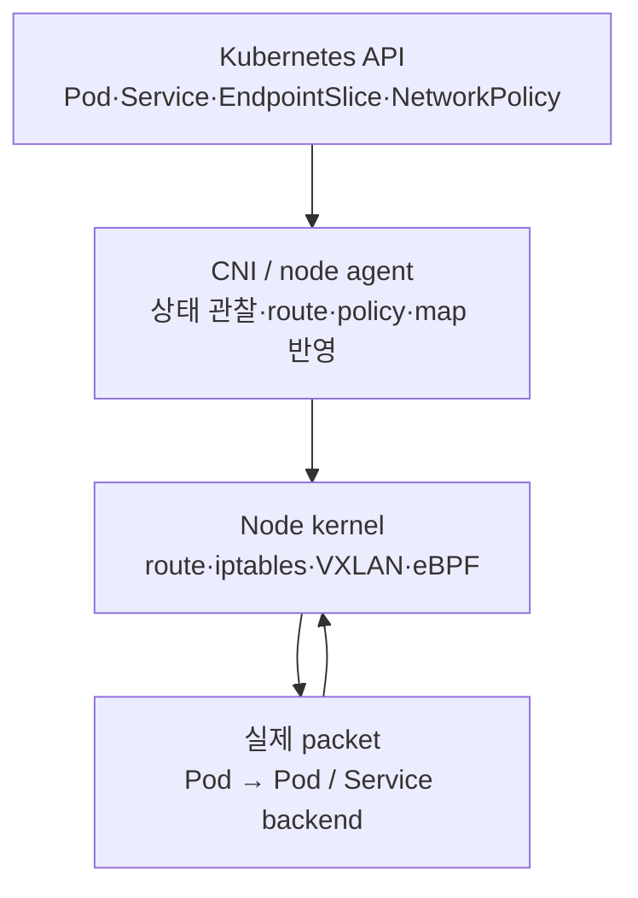

Kubernetes 네트워크를 공부하다 보면 다음처럼 외우기 쉽다.

- Flannel은 VXLAN
- Calico는 BGP
- Cilium은 eBPF

이 문장은 빠른 비교에는 도움이 되지만, 장애를 분석할 때는 부족하다. VXLAN은 패킷을 운반하는 **캡슐화 방식**이고, BGP는 경로를 교환하는 **제어 평면 프로토콜**이며, eBPF는 커널 안에서 패킷 처리 로직을 실행하는 **프로그래머블 데이터패스 기술**이다. 서로 같은 종류의 단어가 아니다.

이 글은 Flannel·Calico·Cilium을 단순한 기능표로 외우기보다 다음 질문에 답하기 위해 정리한 기록이다.

> Pod IP가 다른 노드에 있을 때, 패킷은 어떤 경로로 이동하는가? 그 경로를 누가 만들고, 누가 정책을 적용하며, 어떤 계층을 확인해야 장애 원인을 좁힐 수 있는가?

## 먼저 구분해야 할 세 가지

Kubernetes의 네트워크 플러그인은 CNI(Container Network Interface)라는 인터페이스를 통해 Pod 네트워크를 구성한다. 구체적인 구현은 달라도, 비교할 때는 다음 세 층을 분리해서 보는 편이 좋다.



### VXLAN: 패킷을 다른 노드까지 감싼다

VXLAN(Virtual Extensible LAN)은 원래 Pod IP 패킷을 바깥쪽 UDP/IP 헤더로 감싸서, 노드 사이의 일반 IP 네트워크 위로 전달하는 overlay 방식이다.

```text
안쪽:  Pod A IP → Pod B IP
바깥:  Node A IP → Node B IP, UDP/VXLAN
```

underlay 네트워크가 Pod CIDR를 몰라도 노드 IP끼리만 통신할 수 있으면 된다. 대신 캡슐화 헤더가 추가되므로 MTU를 줄여야 하고, 방화벽이 VXLAN UDP 포트를 허용해야 한다. Flannel 공식 문서는 Linux VXLAN 기본 포트를 8472/UDP로 설명하고, Cilium 문서는 VXLAN 캡슐화가 패킷당 50바이트의 오버헤드를 추가한다고 설명한다.

### BGP: 어디로 보내야 하는지 경로를 교환한다

BGP(Border Gateway Protocol)는 패킷을 직접 운반하는 터널이 아니다. 라우터들이 “이 Pod CIDR 또는 endpoint로 가려면 이 다음 홉을 사용하라”는 경로 정보를 교환하는 프로토콜이다.

```text
Node A: 10.42.1.0/24는 Node A에 있음
Node B: 10.42.2.0/24는 Node B에 있음

BGP 교환 후:
Node A routing table → 10.42.2.0/24 via Node B
```

따라서 BGP 기반의 native routing은 overlay 터널 없이도 동작할 수 있다. 대신 노드와 상위 네트워크가 Pod CIDR 경로를 실제로 이해하고 전달해야 한다.

### eBPF: 커널 경로에 프로그램을 붙인다

eBPF는 특정 CNI 이름이나 터널 방식이 아니다. Linux 커널의 네트워크 처리 지점에 안전하게 검증된 프로그램을 붙여 정책, 로드밸런싱, 관측 같은 동작을 수행할 수 있게 한다.

Cilium은 eBPF를 핵심 데이터패스로 사용한다. 그렇다고 Cilium이 VXLAN을 쓰지 않는다는 뜻은 아니다. Cilium은 VXLAN/Geneve overlay와 native routing을 모두 지원하며, 각각의 패킷 처리 과정에서 eBPF를 사용할 수 있다.

## Flannel: 단순한 L3 Pod 네트워크

Flannel 공식 저장소는 Flannel을 Kubernetes를 위한 간단한 Layer 3 네트워크 fabric으로 설명한다. 각 호스트에 큰 Pod 네트워크에서 잘라낸 subnet lease를 할당하고, 여러 backend 중 하나를 사용해 노드 사이의 트래픽을 전달한다.

Flannel이 담당하는 범위를 먼저 좁혀야 한다.

- 노드별 Pod subnet 할당
- Pod 네트워크를 노드 사이에서 운반
- CNI plugin과 backend 구성
- 필요할 때 외부로 나가는 Pod 트래픽의 masquerading

Flannel은 기본적으로 네트워크 연결에 집중한다. 네트워크 정책이 핵심이면 별도의 정책 엔진을 함께 사용하거나, 정책까지 제공하는 CNI를 선택해야 한다.

### Flannel VXLAN 패킷 흐름

Flannel VXLAN을 단순화하면 다음처럼 볼 수 있다.



Flannel의 `flanneld`는 각 호스트에서 subnet lease와 backend를 관리한다. 실제 데이터패스는 backend에 따라 달라진다. 공식 문서의 VXLAN backend는 커널이 VXLAN 장치를 통해 패킷을 캡슐화하도록 구성한다.

```text
Pod A의 원래 패킷
  src=10.42.1.10, dst=10.42.2.20
                │
                ▼
VXLAN outer packet
  src=Node-A-IP, dst=Node-B-IP, UDP/8472
  payload = 원래 Pod IP 패킷
```

이 구조에서는 Node A와 Node B 사이의 일반 네트워크가 Pod IP를 직접 라우팅하지 않아도 된다. 노드 IP 간 연결과 UDP/8472 허용 여부가 우선 확인 대상이다.

다만 위 Mermaid는 글의 흐름을 위해 재구성한 그림이다. Flannel 공식 문서는 제품 소개보다 backend와 설정 옵션을 중심으로 설명하며, 대표적인 단일 아키텍처 이미지를 제공하지 않는다. 그래서 Flannel 부분은 공식 문서의 동작 설명과 편집 가능한 Mermaid를 함께 사용했다.

### Flannel에서 장애를 좁히는 순서

Pod가 같은 노드에서는 통신하지만 다른 노드에서는 실패한다고 하자.

1. 두 Pod의 IP와 노드를 확인한다.
2. 각 노드의 Pod CIDR와 route를 확인한다.
3. `flannel.1` 또는 배포 환경의 tunnel 장치가 존재하는지 본다.
4. 노드 간 VXLAN UDP 포트가 방화벽에 막히지 않았는지 확인한다.
5. MTU 차이로 큰 패킷만 실패하는지 확인한다.
6. Service IP만 실패하면 Flannel보다 kube-proxy 또는 Service 경로를 따로 확인한다.

```bash
kubectl get pod -A -o wide
kubectl get node -o jsonpath='{range .items[*]}{.metadata.name}{" podCIDR="}{.spec.podCIDR}{" internalIP="}{.status.addresses[?(@.type=="InternalIP")].address}{"\n"}{end}'

ip -br link
ip -d link show flannel.1
ip route
```

Flannel 공식 troubleshooting 문서도 underlay 연결, backend, MTU, 방화벽을 데이터패스의 주요 확인 지점으로 제시한다. VXLAN은 성능과 단순성 사이의 절충이며, host-gw는 캡슐화를 피할 수 있지만 노드가 직접 L2 연결되어야 한다.

## Calico: 라우팅과 정책을 함께 다루는 구조

Calico는 Flannel보다 넓은 문제를 다룬다. 네트워크 연결뿐 아니라 NetworkPolicy, IPAM, Kubernetes controller, route advertisement 같은 구성요소가 함께 들어온다.

### Calico 공식 구성요소 그림

다음은 Calico 공식 문서가 제공하는 구성요소 아키텍처다. Felix, BIRD, confd, CNI plugin, IPAM plugin, kube-controllers, Typha 등이 어떤 범주에서 함께 동작하는지 보는 데 유용하다.

<figure>
  
  <figcaption>Calico 공식 구성요소 아키텍처. Felix, BIRD, CNI plugin, IPAM, kube-controllers, Typha의 역할 경계를 확인할 수 있습니다.</figcaption>
</figure>
<p style="margin: -0.75rem 0 1.75rem; text-align: center; color: #64748b; font-size: 0.78rem; line-height: 1.5;">출처: <a href="https://docs.tigera.io/calico/latest/reference/architecture/overview">Calico 공식 문서 · Component architecture</a>. 공식 문서에서 제공한 도식을 학습용으로 참조했습니다.</p>

Calico를 이해할 때는 모든 프로세스를 한꺼번에 외우기보다 세 역할로 나누면 된다.



Calico 공식 IP fabric 문서는 각 compute server가 자신에게 붙은 endpoint의 router처럼 동작한다고 설명한다. 데이터패스는 Linux kernel, control plane은 BGP protocol server, management plane은 Felix가 맡는 구조다.

### Calico의 BGP는 무엇을 해결하나

Calico 노드가 서로 BGP peer가 되면, 각 노드는 자신이 연결한 Pod 또는 endpoint 경로를 다른 노드와 교환한다.



이 경우 BGP는 원래 Pod 패킷을 감싸지 않는다. 경로를 알려줄 뿐이고, 실제 전달은 Linux routing table과 node underlay가 맡는다. 노드 사이의 네트워크가 Pod CIDR를 라우팅할 수 있어야 한다.

Calico 공식 문서의 BGP 기본 동작은 내부 노드 간 full mesh다. 노드 수가 커지면 route reflector를 사용해 peer 수를 줄이는 구성을 고려한다. on-premises 환경에서는 ToR(Top of Rack) 라우터와 직접 eBGP 또는 iBGP peer를 구성할 수도 있다.

<figure>
  
  <figcaption>Calico 공식 문서의 AS-per-rack 모델. compute server와 ToR, spine의 BGP/스위칭 관계를 설명합니다.</figcaption>
</figure>
<p style="margin: -0.75rem 0 1.75rem; text-align: center; color: #64748b; font-size: 0.78rem; line-height: 1.5;">출처: <a href="https://docs.tigera.io/calico/latest/reference/architecture/design/l3-interconnect-fabric">Calico 공식 문서 · Calico over IP fabrics</a>. 공식 문서의 네트워크 설계 도식을 학습용으로 참조했습니다.</p>

<figure>
  
  <figcaption>같은 AS-per-rack 모델에서 spine을 L3 BGP 라우터로 구성한 변형입니다.</figcaption>
</figure>
<p style="margin: -0.75rem 0 1.75rem; text-align: center; color: #64748b; font-size: 0.78rem; line-height: 1.5;">출처: <a href="https://docs.tigera.io/calico/latest/reference/architecture/design/l3-interconnect-fabric">Calico 공식 문서 · Calico over IP fabrics</a>. 공식 문서의 네트워크 설계 도식을 학습용으로 참조했습니다.</p>

### Calico도 VXLAN을 사용할 수 있다

“Calico = BGP”라고 고정하면 안 된다. Calico는 BGP 기반 non-overlay, IPIP, VXLAN-only 등 여러 네트워크 구성을 지원한다. VXLAN-only pool을 사용하면 BGP를 사용하지 않고도 overlay 방식으로 Pod 트래픽을 전달할 수 있다.

즉, 다음 두 선택은 서로 다른 축이다.

| 질문 | 선택지 |
| --- | --- |
| 노드 사이에 Pod CIDR 경로를 어떻게 알릴까? | BGP, cloud route, static route 등 |
| Pod 패킷을 어떤 방식으로 운반할까? | native routing, VXLAN, IPIP 등 |

Calico 공식 문서도 “BGP가 가능한가”, “overlay가 필요한가”, “정책이 필요한가”를 분리해서 네트워크 방식을 선택하도록 안내한다.

### Calico에서 장애를 좁히는 순서

- Pod IP는 정상인데 다른 노드의 Pod로 갈 수 없다: route/BGP 또는 overlay 경로
- Pod 통신이 정책에 의해 거부된다: Felix와 NetworkPolicy
- Pod 생성 시 IP를 받지 못한다: CNI/IPAM
- 노드 수가 늘며 BGP peer가 과도하게 증가한다: full mesh와 route reflector
- 외부 네트워크가 Pod CIDR를 모른다: ToR peer 또는 overlay 필요

## Cilium: eBPF 데이터패스와 서비스 관측

Cilium은 eBPF를 기반으로 네트워크 연결, 정책, 서비스 로드밸런싱, 관측을 구현한다. Cilium 공식 문서는 eBPF 프로그램이 Linux kernel 안에서 동작해 user space로 패킷을 내보냈다가 다시 커널로 넣는 비용을 줄일 수 있다고 설명한다.

### eBPF가 붙는 위치

eBPF를 “새로운 네트워크”로 생각하면 오해가 생긴다. eBPF는 기존 Linux 네트워크 경로의 특정 hook에 프로그램을 붙이는 방법이다.



Cilium 공식 BPF 문서는 XDP가 네트워크 드라이버에 가까운 이른 지점에서 실행되고, tc BPF는 더 늦은 커널 경로에서 더 많은 메타데이터와 커널 기능에 접근한다고 설명한다.

eBPF 프로그램이 정책, 로드밸런싱, 관측을 처리할 때 상태는 BPF map에 저장할 수 있다. map은 커널 공간의 key/value 저장소이며, BPF 프로그램과 user space 도구가 공유할 수 있다.

여기서 중요한 점은 BPF map이 클러스터 전체에 하나만 존재하는 중앙 데이터베이스가 아니라는 것이다. 기본적으로 각 노드의 커널에 로컬 map이 있고, 해당 노드에서 처리할 Service backend, endpoint, policy, NAT, conntrack 등의 상태가 들어간다. Cilium Agent가 Kubernetes와 Cilium의 상태를 관찰해 각 노드의 map을 갱신하고, 패킷이 들어오면 eBPF 프로그램이 같은 노드의 map을 조회한다.



따라서 `cilium_lb4_services_v2` 같은 map을 확인하는 것은 **현재 노드의 커널 데이터패스 상태**를 보는 일이다. map을 사람이 직접 수정하는 것이 일반적인 운영 방법은 아니며, Kubernetes 리소스와 Cilium Agent 설정이 원천 상태이고 map은 그 결과로 생성되는 실행 상태에 가깝다. 다른 노드의 Service backend까지 하나의 map에서 직접 조회하는 구조로 이해하면 안 된다.

<figure>
  
  <figcaption>eBPF 프로그램과 커널 상태를 연결하는 BPF map의 개념입니다.</figcaption>
</figure>
<p style="margin: -0.75rem 0 1.75rem; text-align: center; color: #64748b; font-size: 0.78rem; line-height: 1.5;">출처: <a href="https://docs.cilium.io/en/stable/reference-guides/bpf/architecture/">Cilium 공식 문서 · BPF Architecture</a>. 공식 문서의 BPF map 도식을 학습용으로 참조했습니다.</p>

### Cilium의 routing mode

Cilium은 크게 overlay와 native routing을 선택할 수 있다.

#### Encapsulation mode

VXLAN 또는 Geneve tunnel을 만들고, 노드 간 트래픽을 캡슐화한다. 노드 IP가 서로 통신할 수 있으면 underlay가 Pod CIDR를 직접 알 필요가 적다. 대신 터널 포트와 MTU를 확인해야 한다.

#### Native routing mode

Pod IP 패킷을 별도 tunnel로 감싸지 않고 Linux host routing 또는 cloud network가 직접 전달하도록 한다. 따라서 모든 노드가 다른 노드의 Pod CIDR로 가는 경로를 알아야 한다.

<figure>
  
  <figcaption>Cilium 공식 문서의 native routing 도식. Pod CIDR를 underlay routing이 직접 전달해야 하는 이유를 보여줍니다.</figcaption>
</figure>
<p style="margin: -0.75rem 0 1.75rem; text-align: center; color: #64748b; font-size: 0.78rem; line-height: 1.5;">출처: <a href="https://docs.cilium.io/en/stable/network/concepts/routing/">Cilium 공식 문서 · Routing</a>. 공식 문서의 native routing 도식을 학습용으로 참조했습니다.</p>

### Cilium은 kube-proxy를 대체할 수 있다

Cilium은 eBPF를 이용해 ClusterIP, NodePort, LoadBalancer, externalIPs 같은 Service 동작을 처리할 수 있다. 이 구성을 `kubeProxyReplacement=true`로 활성화하면 kube-proxy가 iptables 또는 IPVS 규칙을 만드는 대신 Cilium의 eBPF service map이 backend를 관리한다.

```text
Service ClusterIP:80
        │
        ▼
Cilium eBPF service map
        │
        ├── Pod A:8080
        └── Pod B:8080
```

이때 “Cilium이 항상 kube-proxy를 없앤다”라고 말하면 안 된다. Cilium은 kube-proxy를 그대로 두고 CNI와 정책만 사용할 수도 있고, 별도 설정으로 kube-proxy replacement를 켤 수도 있다. 실제 클러스터에서는 다음처럼 확인해야 한다.

```bash
kubectl -n kube-system get ds
kubectl -n kube-system get pods -l k8s-app=cilium
kubectl -n kube-system exec ds/cilium -- cilium-dbg status --verbose
```

Cilium 공식 문서의 검증 예시는 `KubeProxyReplacement`, Service 종류별 지원 여부, 사용 device와 mode를 확인하도록 안내한다.

## 세 가지를 같은 기준으로 비교하기

| 구분 | Flannel | Calico | Cilium |
| --- | --- | --- | --- |
| 핵심 초점 | 단순한 L3 Pod 네트워크 | 네트워크 + 정책 + 라우팅 | eBPF 기반 네트워크·정책·LB·관측 |
| 대표 데이터패스 | VXLAN, host-gw 등 | native routing, VXLAN, IPIP | native routing, VXLAN, Geneve |
| 경로 제어 | subnet lease와 backend | BGP 또는 외부 route | Linux route, L2/BGP, cloud integration |
| 정책 | 기본 핵심 범위 아님 | Felix와 NetworkPolicy | eBPF identity-aware L3-L7 policy |
| Service LB | 별도 kube-proxy와 조합 | kube-proxy 또는 구성에 따른 Calico 기능 | eBPF kube-proxy replacement 가능 |
| 관측 | 별도 도구 필요 | Calico 구성에 따라 다름 | Hubble와 eBPF flow 관측 |
| 운영 난이도 | 비교적 낮음 | 라우팅·정책 선택 폭이 큼 | 커널/eBPF와 기능 범위 이해 필요 |

여기서 중요한 것은 제품별 우열이 아니다. 요구사항을 다음 순서로 질문하는 것이다.

1. underlay가 Pod CIDR를 라우팅할 수 있는가?
2. 안 된다면 overlay가 필요한가?
3. 캡슐화로 인한 MTU와 UDP 포트를 감당할 수 있는가?
4. NetworkPolicy를 어느 수준으로 적용할 것인가?
5. Service load balancing을 kube-proxy로 할 것인가, eBPF로 대체할 것인가?
6. DNS, TCP, HTTP, 정책 거부 이유까지 어떤 관측이 필요한가?
7. kernel version, architecture, NIC, cloud network가 선택한 datapath를 지원하는가?

## CNI 선택은 하나의 선택이 아니다

실무에서 “어떤 CNI를 쓸까?”라고 말할 때는 사실 여러 결정을 한 문장으로 묶는 경우가 많다. 다음 축을 분리하면 Flannel, Calico, Cilium의 차이가 훨씬 명확해진다.

| 선택 축 | 확인할 질문 | 대표 구현 |
| --- | --- | --- |
| Pod network | Pod에 IP를 주고 Pod 간 연결을 만들 누가 담당하는가? | Flannel, Calico, Cilium |
| Routing / transport | 다른 노드의 Pod CIDR까지 패킷을 어떻게 운반하는가? | VXLAN, Geneve, IPIP, native routing |
| Policy | 허용·차단을 어느 계층에서 적용하는가? | Calico Felix, Cilium eBPF, NetworkPolicy controller |
| Service LB | ClusterIP를 backend Pod로 바꾸는가? | kube-proxy, Cilium kube-proxy replacement |
| Observability | flow와 drop 이유를 어느 수준까지 볼 것인가? | 별도 도구, Calico 구성, Cilium Hubble |

예를 들어 Cilium을 선택했다고 해서 routing mode와 kube-proxy replacement가 자동으로 결정되는 것은 아니다. Cilium + VXLAN + 기존 kube-proxy, Cilium + native routing + kube-proxy replacement는 서로 다른 운영 구성이 될 수 있다. 반대로 Calico도 BGP만 사용하는 것이 아니라 VXLAN overlay와 NetworkPolicy를 함께 사용할 수 있다.

### 선택하지 않을 기준도 필요하다

- **BGP를 선택하지 않을 때**: 노드 또는 ToR 라우터의 BGP 운영 권한과 장애 대응 체계가 없다면, 경로 광고를 추가하는 것이 오히려 운영 부담이 될 수 있다.
- **Native routing을 선택하지 않을 때**: underlay가 Pod CIDR를 라우팅하지 못하거나, 클라우드 route table을 자동화할 수 없다면 overlay가 더 단순할 수 있다.
- **VXLAN/Geneve를 선택하지 않을 때**: 방화벽에서 터널 UDP를 열 수 없거나, MTU와 PMTUD 문제가 이미 중요한 환경이면 캡슐화를 피하는 방식을 검토한다.
- **Cilium을 바로 선택하지 않을 때**: eBPF라는 이름만으로 도입하지 말고, 커널 버전·NIC·운영 도구·팀의 디버깅 역량이 실제 요구사항을 충족하는지 먼저 확인한다.
- **Standalone Flannel을 선택하지 않을 때**: 세밀한 NetworkPolicy가 필수라면, Flannel만으로 해결하려 하지 말고 정책 기능을 제공하는 조합을 선택한다.

## Control plane과 data plane을 나눠서 보기

CNI를 공부할 때 가장 헷갈리는 부분은 Kubernetes 리소스 변경과 실제 패킷 전달이 같은 과정처럼 보인다는 점이다. 둘은 다음처럼 나뉜다.



`kubectl apply`가 끝났다는 것은 API 객체가 저장됐다는 뜻이지, 모든 노드의 데이터패스가 즉시 정상이라는 뜻은 아니다. Agent가 해당 객체를 읽고 route, tunnel, iptables/nftables 규칙 또는 eBPF map을 반영해야 실제 패킷 경로가 바뀐다. 이 구분은 “Service는 생성됐는데 연결이 안 된다”, “NetworkPolicy는 존재하는데 어떤 지점에서 drop됐는지 모른다” 같은 장애를 나눠 보는 기준이 된다.

Service 통신에서는 DNS가 Service 이름을 ClusterIP로 해석하고, EndpointSlice가 backend 목록을 제공하며, kube-proxy 또는 CNI의 Service datapath가 backend를 선택한다. CNI는 애플리케이션이 어떤 DNS 이름을 사용할지 결정하는 기능과 같은 개념이 아니다. 서비스 이름 해석, Service LB, Pod 간 routing은 서로 다른 경계로 확인해야 한다.

## 현재 RKE2 환경은 무엇부터 확인해야 하나

현재 환경의 CNI를 이름만 보고 추정하면 안 된다. 특히 RKE2에서 `canal`이라는 이름이 보인다면 Flannel 네트워크와 Calico 정책이 함께 구성된 형태일 가능성이 있지만, 실제 chart values와 DaemonSet args를 확인하기 전에는 단정할 수 없다.

RKE2의 Canal은 별도의 새로운 전송 프로토콜이라기보다 조합이다. RKE2 문서 기준으로 Canal 구성에서는 Flannel이 노드 간 네트워크를 담당하고, Calico가 네트워크 정책을 담당한다. 따라서 현재 클러스터에서 `rke2-canal`을 볼 때는 “Flannel과 Calico 중 하나”라고 보기보다 **Flannel transport + Calico policy 조합**인지 확인하는 편이 정확하다.

다음 명령으로 현재 상태를 확인한다.

```bash
kubectl -n kube-system get pods -o wide | grep -Ei 'canal|flannel|calico|cilium'
kubectl -n kube-system get ds -o wide | grep -Ei 'canal|flannel|calico|cilium'
kubectl -n kube-system get cm -o yaml | grep -Ei -C 3 'vxlan|ipip|backend|calico|flannel'
kubectl get nodes -o wide
```

현재 RKE2 Canal을 실제 증거로 확인할 때는 다음 네 가지를 나눠 본다.

```bash
kubectl -n kube-system get ds rke2-canal -o yaml
kubectl -n kube-system get pods -l k8s-app=rke2-canal -o wide
ip -d link show flannel.1
kubectl get networkpolicy -A
```

- DaemonSet args와 ConfigMap: VXLAN, backend, interface 선택
- Pod 상태와 노드 배치: 어느 노드의 CNI가 준비되지 않았는지
- `flannel.1`과 route: 실제 노드 데이터패스가 만들어졌는지
- NetworkPolicy: 연결 경로는 정상이어도 정책이 차단하는지

노드 내부에서는 tunnel, route, MTU를 확인한다.

```bash
ip -br addr
ip -br link
ip route
ip -d link show flannel.1
ip neigh
```

Calico가 실제로 설치되어 있다면 다음 종류의 리소스도 확인 대상이 된다.

```bash
kubectl get crd | grep -E 'projectcalico|tigera'
kubectl get bgpconfiguration,bgppeer,networkpolicy -A 2>/dev/null
```

Cilium이라면 DaemonSet arguments와 `cilium-dbg status`에서 routing mode, tunnel protocol, kube-proxy replacement, Hubble를 확인한다.

## 장애를 바닥부터 보는 기준

“네트워크가 안 된다”는 말은 범위가 너무 넓다. 다음처럼 증상을 분리하면 CNI 선택과 무관하게 확인 순서를 세울 수 있다.

### 1. Pod가 IP를 받지 못한다

CNI plugin, IPAM, CNI config, node filesystem, kubelet 로그를 먼저 본다.

```bash
kubectl get pod <pod> -o wide
kubectl describe pod <pod>
journalctl -u rke2-server -u rke2-agent --since -15m
```

### 2. 같은 노드 Pod끼리는 되고 다른 노드 Pod는 안 된다

cross-node 데이터패스 문제일 가능성이 높다.

- Flannel: `flannel.1`, VXLAN UDP/8472, node-to-node IP, MTU
- Calico: route table, BGP peer/state, VXLAN/IPIP mode, Felix policy
- Cilium: tunnel/native routing, eBPF state, node route, drop reason

### 3. Pod IP는 되지만 Service IP는 안 된다

Pod network와 Service load balancing을 분리해서 본다. kube-proxy가 있는지, Cilium kube-proxy replacement가 켜져 있는지, EndpointSlice가 정상인지 확인한다.

```bash
kubectl get svc <service>
kubectl get endpointslice -l kubernetes.io/service-name=<service>
kubectl -n kube-system get ds kube-proxy
```

### 4. 통신이 정책에 의해 거부된다

네트워크 경로와 정책 경로를 분리해야 한다. route가 정상이어도 NetworkPolicy가 거부할 수 있다. 이때 “패킷이 도착하지 않았다”와 “도착했지만 정책에 의해 drop됐다”는 전혀 다른 문제다.

### 5. 큰 요청만 실패하거나 간헐적으로 timeout이 난다

overlay header로 줄어든 MTU, PMTUD, 방화벽, checksum offload를 확인한다. VXLAN을 선택했다면 캡슐화 오버헤드는 기능 설명이 아니라 실제 장애 조건이 될 수 있다.

### 확인 범위를 계층별로 고정하기

장애가 발생했을 때는 CNI 이름을 먼저 의심하기보다 다음 순서로 소유권을 나눈다.

| 증상 | 우선 확인할 경계 |
| --- | --- |
| Pod가 IP를 받지 못함 | CNI plugin, IPAM, kubelet, node filesystem |
| 같은 노드에서는 되지만 다른 노드에서는 실패 | route, tunnel device, underlay, MTU, 방화벽 |
| Pod IP는 되지만 Service IP만 실패 | EndpointSlice, kube-proxy 또는 Cilium Service LB |
| 특정 namespace·Pod만 차단 | NetworkPolicy, Calico Felix 또는 Cilium policy |
| 큰 응답만 timeout | MTU, PMTUD, VXLAN/Geneve overhead |
| flow는 보이지만 backend가 선택되지 않음 | Service map/rule, EndpointSlice, readiness 상태 |

이 표의 목적은 모든 CNI 명령어를 외우는 것이 아니다. 먼저 실패 증상을 분류하고, 그 증상을 실제로 소유하는 계층의 상태를 확인하는 것이다.

## 이번에 정리한 결론

Flannel·Calico·Cilium을 비교할 때의 핵심은 제품 이름이 아니다.

```text
Pod IP 할당
  → 같은 노드 / 다른 노드 경로
  → native routing 또는 VXLAN/Geneve 캡슐화
  → Service load balancing
  → NetworkPolicy
  → DNS·TCP·HTTP 관측
```

- **Flannel**은 단순한 Pod 네트워크를 빠르게 구성하고 싶을 때의 선택지다. VXLAN은 노드 IP만으로 overlay를 만들고, host-gw는 underlay가 직접 Pod subnet을 전달할 수 있을 때 캡슐화를 줄인다.
- **Calico**는 라우팅과 정책을 함께 다루고 싶을 때 선택지가 넓다. BGP는 경로를 광고하는 control plane이고, VXLAN/IPIP는 별도의 transport 선택이다.
- **Cilium**은 eBPF 기반으로 policy, Service LB, 관측을 커널 경로에 통합하고 싶을 때 강력하다. 하지만 native routing인지 overlay인지, kube-proxy replacement를 켰는지는 별도로 확인해야 한다.

면접이나 장애 대응에서 방어 가능한 설명은 다음에 가깝다.

> “CNI를 비교할 때 Flannel=VXLAN, Calico=BGP, Cilium=eBPF로 외우기보다, 경로를 누가 만들고, 패킷을 어떻게 운반하며, 정책과 Service LB를 어느 계층에서 처리하는지 분리해 확인합니다. 그 다음 현재 노드의 route, tunnel, BGP 상태, eBPF 또는 kube-proxy 구성을 실제 명령으로 검증합니다.”

## 참고한 공식 문서

- [Kubernetes · Cluster Networking](https://kubernetes.io/docs/concepts/cluster-administration/networking/)
- [Flannel 공식 저장소](https://github.com/flannel-io/flannel)
- [Flannel · Backends](https://github.com/flannel-io/flannel/blob/master/Documentation/backends.md)
- [Flannel · Configuration](https://github.com/flannel-io/flannel/blob/master/Documentation/configuration.md)
- [Flannel · Troubleshooting](https://github.com/flannel-io/flannel/blob/master/Documentation/troubleshooting.md)
- [Calico · Component architecture](https://docs.tigera.io/calico/latest/reference/architecture/overview)
- [Calico · Configure BGP peering](https://docs.tigera.io/calico/latest/networking/configuring/bgp)
- [Calico · Calico over IP fabrics](https://docs.tigera.io/calico/latest/reference/architecture/design/l3-interconnect-fabric)
- [Calico · Determine best networking option](https://docs.tigera.io/calico/latest/networking/determine-best-networking)
- [RKE2 · Network Options](https://docs.rke2.io/networking/basic_network_options)
- [Cilium · Introduction to Cilium & Hubble](https://docs.cilium.io/en/stable/overview/intro/)
- [Cilium · Routing](https://docs.cilium.io/en/stable/network/concepts/routing/)
- [Cilium · BPF Architecture](https://docs.cilium.io/en/stable/reference-guides/bpf/architecture/)
- [Cilium · Kubernetes without kube-proxy](https://docs.cilium.io/en/stable/network/kubernetes/kubeproxy-free/)
