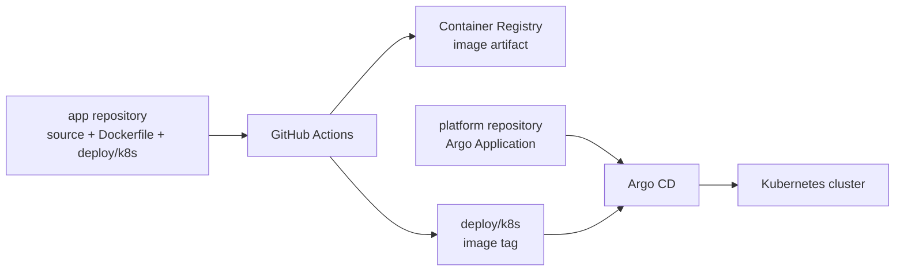
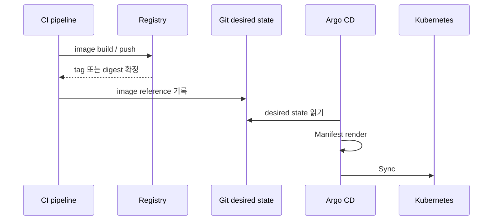
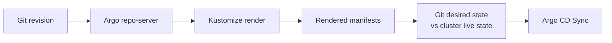

GitOps 배포 구조를 설명하는 글을 읽다 보면 자연스럽게 저장소가 늘어난다.

```text
app repository
deployment repository
environment repository
platform repository
```

처음에는 이것이 당연한 정답처럼 보였다. 애플리케이션 코드와 Kubernetes Manifest를 분리하고, 앱마다 배포 저장소를 하나씩 만들고, Argo CD는 별도의 플랫폼 저장소에서 관리해야 하는 것처럼 느껴졌다.

그런데 실제로 개인 Kubernetes 클러스터에 블로그를 배포해 보니 다른 질문이 생겼다.

> 저장소를 나누는 것이 정말 문제를 해결하는가? 아니면 관리해야 할 연결만 늘리는가?

이 글은 특정 구조를 정답으로 선언하는 글이 아니다. 현재 사용 중인 배포 흐름을 분해하고, 어느 시점에 저장소를 나누는 것이 의미가 생기는지 정리한 기록이다.

## 현재 배포 구조에서 시작한 질문

현재 구조는 두 저장소를 사용한다.



- 앱 저장소에는 소스 코드, Dockerfile, Deployment·Service·Kustomize Manifest가 있다.
- 플랫폼 저장소에는 Argo CD `Application`, 대상 저장소와 경로, namespace, Sync 정책이 있다.
- 컨테이너 이미지는 Registry에 저장된다.
- Argo CD는 앱 저장소의 `deploy/k8s` 경로를 감시한다.

이 구조에서 가장 먼저 헷갈린 부분은 CI가 이미지를 Push한 뒤 같은 저장소의 `kustomization.yaml`을 수정하고 다시 Push한다는 점이었다.

```text
source commit
→ image build/push
→ kustomization.yaml의 newTag 변경
→ bot commit/push
→ Argo CD가 Git 변경 감지
→ Kubernetes Sync
```

CI가 Kubernetes에 직접 배포하지 않는다는 점은 이해했지만, Git에 배포 정보를 다시 쓰는 작업은 소스 저장소의 책임인지 배포 저장소의 책임인지 애매했다.

## 배포에는 두 종류의 상태가 있다

이 질문을 정리하려면 먼저 “무엇이 상태인가”를 나눠야 한다.

### Artifact 상태

Registry에 실제로 존재하는 결과물이다.

```text
<registry>/<image>:git-abcdef123456
```

또는 더 강하게 식별하면 다음과 같다.

```text
<registry>/<image>@sha256:<digest>
```

Artifact 상태는 “무엇을 실행할 수 있는가”에 가깝다.

### Desired state

Kubernetes에 어떤 리소스를 어떤 값으로 실행할지 선언한 상태다.

```yaml
images:
  - name: <registry>/<image>
    newTag: git-abcdef123456
```

Desired state는 “무엇을 실행해야 하는가”에 가깝다.

GitOps에서 중요한 것은 이 두 상태가 순서에 맞게 연결되는 것이다.



이미지가 Registry에 올라가기 전에 Manifest가 먼저 바뀌면 Argo CD의 Sync는 시작되지만 Pod가 이미지를 Pull하지 못할 수 있다. 반대로 이미지 Push가 실패하면 Manifest도 바뀌지 않아 기존 버전을 유지할 수 있다.

이 순서 문제는 이전 글에서 `ImagePullBackOff`와 digest pinning 관점으로 따로 정리했다. [GitOps 배포에서 ImagePullBackOff를 이미지 문제가 아니라 순서 문제로 분리한 이유](/blog/rke2-gitops-imagepullbackoff-digest-pinning/)

## CI의 Git write-back은 실제로 무엇을 하는가

현재 CI의 Manifest 변경은 배포 명령이 아니다. 다음 한 줄의 값을 바꾸는 작업이다.

```yaml
newTag: git-old-version
```

이미지 Push가 성공한 뒤:

```yaml
newTag: git-new-version
```

으로 변경하고, 이 변경을 bot commit으로 남긴다.

```text
CI가 하는 일
= 새 image를 만들고
  “앞으로 이 image를 사용하라”는 desired state를 Git에 기록
```

그 다음 실제 배포는 Argo CD가 담당한다. Argo CD 공식 문서도 CI pipeline이 Manifest 변경을 Git에 commit/push하고, Argo CD가 Git의 desired state를 클러스터에 동기화하는 흐름을 설명한다. [Argo CD: Automation from CI Pipelines](https://argo-cd.readthedocs.io/en/stable/user-guide/ci_automation/)

### 이 방식이 주는 것

- CI에 Kubernetes API 권한을 직접 주지 않아도 된다.
- 배포된 이미지 버전이 Git history에 남는다.
- Argo CD가 항상 Git을 기준으로 동작한다.
- image build가 실패하면 Manifest가 갱신되지 않는다.
- 장애 발생 시 소스 commit, image tag, Manifest commit을 연결할 수 있다.

### 이 방식이 불편한 이유

- 소스 저장소에 bot commit이 생긴다.
- Git push 권한을 CI에 부여해야 한다.
- 여러 환경이 있으면 자동 commit 충돌이 생길 수 있다.
- 소스 변경과 배포 상태 변경이 같은 저장소에 섞인다.
- 이미지 Push와 Manifest Push 사이에 실패하면 재시도 설계가 필요하다.

따라서 CI write-back은 이상한 편법이 아니라 GitOps의 한 패턴이다. 다만 작은 시스템에서는 단순하고, 환경과 팀이 늘어날수록 부담이 커진다.

## Kustomize는 어느 시점에 동작하는가

현재 `deploy/k8s/deployment.yaml`에는 기본 이미지가 적혀 있다.

```yaml
image: <registry>/<image>:v0.1.0
```

`kustomization.yaml`에는 이미지 변환 규칙이 있다.

```yaml
images:
  - name: <registry>/<image>
    newTag: git-abcdef123456
```

Kustomize는 두 파일을 합쳐 다음과 같은 최종 Deployment를 만든다.

```yaml
image: <registry>/<image>:git-abcdef123456
```

이 최종 결과는 일반적으로 다음 시점에 만들어진다.



1. Argo CD가 새로운 Git revision을 감지한다.
2. `argocd-repo-server`가 저장소를 가져온다.
3. 경로에 `kustomization.yaml`이 있으면 Kustomize를 실행한다.
4. Argo CD가 렌더링 결과와 클러스터의 live state를 비교한다.
5. 차이가 있으면 Kubernetes API에 리소스를 적용한다.

즉 현재 CI는 Kustomize로 최종 Manifest를 만드는 것이 아니다. CI는 `newTag`를 바꾸고, Kustomize render는 나중에 Argo CD 안에서 실행된다. [Argo CD: Kustomize](https://argo-cd.readthedocs.io/en/stable/user-guide/kustomize/)

로컬에서는 다음 명령으로 같은 결과를 볼 수 있다.

```bash
kubectl kustomize deploy/k8s
```

Kustomize는 Kubernetes YAML을 조합·변환하는 도구이고, `kubectl kustomize`로 결과를 확인하거나 `kubectl apply -k`로 적용할 수도 있다. [Kubernetes: Declarative Management Using Kustomize](https://kubernetes.io/docs/tasks/manage-kubernetes-objects/kustomization/)

## 저장소를 나누는 네 가지 방식

저장소 구조는 보통 다음 네 가지 선택지 사이에 있다.

### 1. 앱 저장소에 코드와 Manifest를 함께 둔다

```text
blog/
├── src/
├── Dockerfile
└── deploy/k8s/
```

코드 변경과 배포 Manifest 변경을 하나의 흐름으로 추적하기 쉽다. 개인 프로젝트, 작은 팀, 환경 하나에 특히 적합하다.

단점은 CI write-back이 소스 저장소에 들어오고, 앱 코드 권한과 배포 권한이 섞인다는 점이다.

### 2. 앱 저장소와 플랫폼 저장소만 나눈다

```text
blog/
└── source + deploy/k8s

home-ops/
└── Argo Application + platform configuration
```

현재 구조다. 플랫폼 저장소는 “무엇을 배포할지”보다 “어떤 저장소의 어떤 경로를 Argo CD가 감시할지”를 관리한다.

이 분리는 Argo CD bootstrap, Application, AppProject, 공통 알림 정책을 중앙화하면서도 앱별 Manifest 소유권은 앱 저장소에 남길 수 있다는 장점이 있다.

### 3. 여러 앱의 배포 상태를 하나의 Deployment repository에 둔다

```text
deployments/
├── apps/
│   ├── blog/
│   ├── api/
│   └── admin/
└── environments/
    ├── dev/
    ├── stage/
    └── prod/
```

앱 코드는 각자의 저장소에 두고, 배포 버전과 환경별 설정은 하나의 저장소에서 관리한다.

이 방식은 환경 승격, PR 승인, 배포 이력, 운영 권한을 한곳에서 관리하기 쉽다. 반면 여러 팀이 하나의 저장소를 함께 수정하므로 디렉터리 규칙과 ownership 관리가 필요하다.

### 4. 앱마다 Deployment repository를 만든다

```text
blog.git          # source
blog-deploy.git   # manifests
api.git           # source
api-deploy.git    # manifests
```

앱별 팀, 권한, release 주기, 보안 경계가 명확하게 다를 때 선택할 수 있다.

하지만 앱마다 배포 저장소를 만드는 것이 GitOps의 필수 조건은 아니다. 저장소 수가 늘어날수록 Argo CD Application, 권한, PR, webhook, ownership도 함께 관리해야 한다.

## Deployment repository와 `deploy/k8s`는 같은 말이 아니다

이 둘을 혼동하면 구조가 필요 이상으로 복잡해진다.

```text
deploy/k8s
= 하나의 저장소 안에 있는 배포 디렉터리

deployment repository
= 배포 상태를 별도 Git 저장소로 분리한 운영 경계
```

`deploy/k8s`를 별도 저장소로 옮기는 것은 기술적 필수가 아니다. 다음 질문에 “예”가 많을 때 분리의 가치가 커진다.

- 애플리케이션 개발자와 배포 승인자가 다른가?
- 개발·스테이지·운영 승격 절차가 필요한가?
- 운영 Manifest에 더 엄격한 branch protection이 필요한가?
- 여러 앱의 배포 버전을 한곳에서 비교해야 하는가?
- 앱 저장소에 Kubernetes 접근 정보나 운영 설정이 섞이는 것이 문제인가?
- 팀별로 배포 권한과 코드 권한을 분리해야 하는가?

반대로 앱 하나, 환경 하나, 운영자 한 명이라면 별도 Deployment repository가 추가하는 복잡성이 더 클 수 있다.

## 현재 구조에 대한 결론

현재 개인 블로그 배포에는 다음 구조가 적절하다고 판단했다.

```text
blog repository
└── source, Dockerfile, deploy/k8s, image version

home-ops repository
└── Argo Application, platform policy, notification subscription

container registry
└── immutable image artifact
```

앱마다 별도의 Deployment repository를 추가하지 않는다. 이미지 버전도 여러 저장소에 중복해서 저장하지 않는다. 현재는 `blog/deploy/k8s`의 `newTag`가 배포할 버전의 단일 기록이고, `home-ops`는 그 경로를 Argo CD가 감시하도록 등록하는 역할만 한다.

다만 다음 단계에서 환경이 늘어나면 구조를 바꿀 수 있다.

```text
현재
app repo: source + manifests
platform repo: Argo Application

확장 시
app repo: source + Dockerfile
deployment repo: environment별 manifests + image digest
platform repo: Argo bootstrap + ApplicationSet + policy
```

중요한 것은 저장소 개수가 아니라 책임의 경계다.

```text
CI          = artifact 생성
Git         = desired state 기록
Kustomize   = Manifest render
Argo CD     = desired state와 live state 비교·Sync
Kubernetes  = 실제 workload 실행
```

저장소 분리는 이 경계를 더 명확하게 만들 때 도입해야 한다. 경계를 만들지 못한 채 저장소만 나누면, 단순한 배포가 여러 저장소의 동기화 문제로 바뀔 뿐이다.

## 참고 자료

- [Argo CD: Automation from CI Pipelines](https://argo-cd.readthedocs.io/en/stable/user-guide/ci_automation/)
- [Argo CD: Automated Sync Policy](https://argo-cd.readthedocs.io/en/stable/user-guide/auto_sync/)
- [Argo CD: Kustomize](https://argo-cd.readthedocs.io/en/stable/user-guide/kustomize/)
- [Kubernetes: Declarative Management Using Kustomize](https://kubernetes.io/docs/tasks/manage-kubernetes-objects/kustomization/)
- [Cybozu Engineering Blog: Production-grade delivery workflow using Argo CD](https://blog.kintone.io/entry/production-grade-delivery-workflow-using-argocd)
- [GitOps 배포에서 ImagePullBackOff를 이미지 문제가 아니라 순서 문제로 분리한 이유](/blog/rke2-gitops-imagepullbackoff-digest-pinning/)
- [Argo CD 배포 결과를 Discord로 받기](/blog/argocd-discord-deployment-notifications/)
