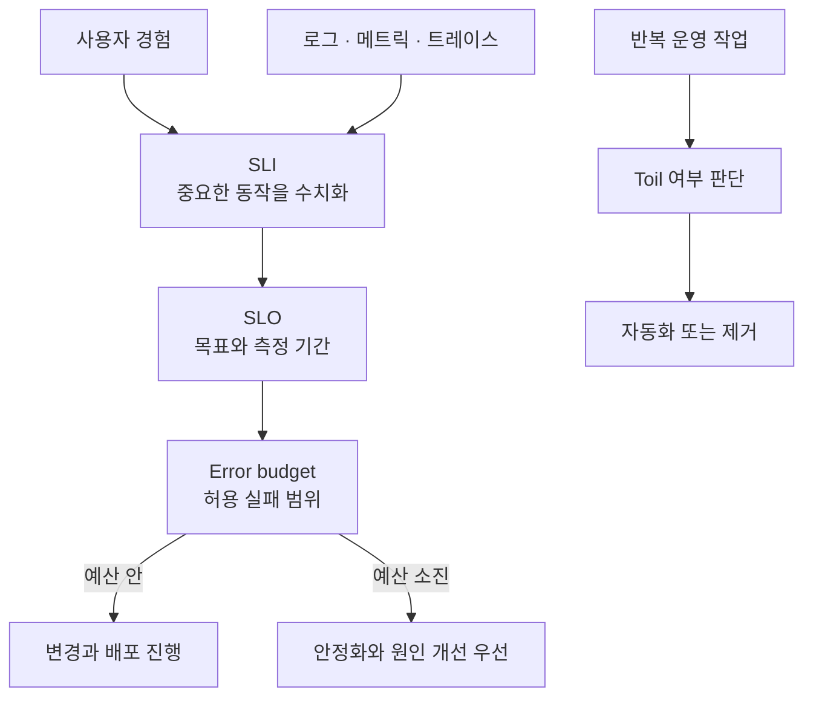

Jenkins stage 시간, Ansible 재실행의 `changed`, OpenTelemetry Collector queue를 확인하면서도 한동안 SRE를 "인프라 운영에 자동화와 관측 도구를 더한 일" 정도로 넓게 이해했다. 도구는 분명 중요하지만, 그 정의만으로는 무엇을 먼저 측정하고, 어느 수준의 실패를 허용하며, 어떤 반복 작업을 자동화해야 하는지 답하기 어렵다.

Google SRE는 여기서 출발점이 다르다. 운영을 별도의 수작업 영역으로 두기보다, **소프트웨어 엔지니어링으로 풀어야 할 문제**로 본다. 서비스의 신뢰성 목표를 사용자 관점에서 정의하고, 그 목표를 지키는 데 필요한 운영 작업을 측정·자동화·개선하는 방식이다. 이 글은 Google SRE Book의 개념을 기준으로, 내가 정리해 온 CI/CD, Provisioning, Observability, GitOps 기록을 어떤 기준으로 다시 볼 수 있는지 정리한 글이다.

<figure style="margin: 2rem 0; text-align: center;">
  
  <figcaption style="margin-top: 0.75rem; text-align: left;">Google SRE Books에서 제공하는 <a href="https://sre.google/books/" target="_blank" rel="noreferrer">Site Reliability Engineering</a> 원본 표지를 외부 참조했다.</figcaption>
</figure>

## SRE가 먼저 묻는 질문

서비스를 운영할 때 흔히 "모니터링을 붙였는가", "배포를 자동화했는가"부터 확인한다. Google SRE의 질문 순서는 조금 다르다.

1. 사용자가 중요하게 느끼는 서비스 동작은 무엇인가?
2. 그 동작이 정상인지 어떤 수치로 판단할 것인가?
3. 목표를 어느 기간 동안 어느 수준으로 약속할 것인가?
4. 목표에서 벗어나면 배포와 개선의 우선순위를 어떻게 바꿀 것인가?
5. 반복되는 운영 작업 중 무엇을 사람의 손에서 분리할 것인가?

이 흐름에서 관측 도구는 출발점이 아니라 판단을 뒷받침하는 수단이다. Grafana dashboard가 있어도 사용자가 겪는 실패와 연결된 지표가 아니면 SLI가 되지 않는다.

## SLI, SLO, Error Budget을 한 묶음으로 보기

Google SRE Book은 신뢰성을 서비스 사용자가 체감하는 수준에서 다루기 위해 SLI, SLO, error budget을 연결한다. [Service Level Objectives 장](https://sre.google/sre-book/service-level-objectives/)의 핵심은 "측정하기 쉬운 값"보다 **사용자가 중요하게 여기는 동작**에서 목표를 시작해야 한다는 점이다.

| 개념 | 질문 | 예시 |
| --- | --- | --- |
| SLI | 무엇을 관측할 것인가? | 성공한 요청 비율, 요청 지연 시간, 정상 처리된 작업 비율 |
| SLO | 어느 수준을 목표로 할 것인가? | 최근 28일 동안 성공 요청 비율 99.9% 이상 |
| Error budget | 얼마나 실패를 감당할 수 있는가? | SLO를 넘지 않는 실패 범위. 소진 시 변경보다 안정화 우선 |

예를 들어 API 성공률을 SLI로 정했다고 해서 "99.99%"가 자동으로 좋은 SLO가 되지는 않는다. 사용자 영향, 서비스 특성, 장애 대응 비용, 개발 속도를 함께 보고 정해야 한다. 100% 신뢰성을 목표로 하면 비용과 출시 속도가 과도해질 수 있고, 반대로 너무 낮은 목표는 실제 사용자 기대를 놓칠 수 있다. Error budget은 이 선택을 배포와 안정성 사이의 합의로 연결한다.

따라서 SLO는 SLA 문구를 예쁘게 쓰는 작업이 아니다. 실패를 어느 정도 허용할지, 예산이 빠르게 소진될 때 어떤 변경을 보류할지를 팀이 같은 기준으로 판단하게 하는 장치다.

## Toil은 단순히 귀찮은 일이 아니다

Google은 toil을 수작업이며 반복적이고, 자동화할 수 있으며, 지속적인 엔지니어링 가치를 만들지 않고, 서비스 규모에 선형적으로 늘어나는 작업으로 설명한다. 모든 수동 작업을 없애자는 뜻은 아니다. 장애 원인을 이해하기 위한 조사나, 위험한 변경을 리뷰하는 일은 필요한 사람의 판단이다.

반대로 다음과 같은 작업은 toil 후보가 되기 쉽다.

- 새 서버마다 같은 패키지, 디렉터리, 권한, 환경 파일을 다시 맞추는 일
- 배포가 느린 이유를 매번 console log에서 수동으로 찾는 일
- 동일한 DB 변경 요청을 문서와 shell script만 보고 반복 확인하는 일
- Collector나 backend가 중단됐을 때 데이터가 어디서 끊겼는지 추측하는 일

[Eliminating Toil 장](https://sre.google/sre-book/eliminating-toil/)은 자동화 자체보다, 반복 작업이 어떤 조건에서 toil인지 식별하는 일을 먼저 다룬다. Google이 소개하는 "SRE 시간의 50% 이하를 toil에 쓰는" 기준은 특정 조직의 운영 원칙이지 모든 팀에 그대로 적용할 숫자는 아니다. 작은 팀에서는 우선 반복 빈도, 실패 영향, 자동화 뒤 검증 가능성을 보고 순서를 정하는 편이 현실적이다.

## Monitoring은 대시보드가 아니라 판단 경로다

SRE에서 monitoring은 모든 값을 수집하는 일이 아니라, 서비스 상태를 빠르게 판단하고 대응할 수 있게 하는 일이다. Google SRE Book은 latency, traffic, errors, saturation을 대표적인 관측 신호로 제시한다. [Monitoring Distributed Systems](https://sre.google/sre-book/monitoring-distributed-systems/)과 [Practical Alerting](https://sre.google/sre-book/practical-alerting/)은 알림도 "무엇이 이상한가"보다 "지금 사람이 행동해야 하는가"에 연결해야 한다고 설명한다.

이 관점에서는 아래 구분이 중요하다.

- **로그**: 어떤 요청과 상태 변화가 있었는지 문맥을 남긴다.
- **메트릭**: 추세, 임계치, 용량 변화를 빠르게 비교한다.
- **트레이스**: 분산 요청이 어느 구간에서 지연되거나 실패했는지 연결한다.
- **알림**: 사람이 확인하고 행동해야 하는 신호만 보낸다.

OpenTelemetry Collector에 persistent queue를 설정했다고 observability가 완성되는 것은 아니다. 데이터가 `filelog receiver`, Agent queue, Gateway queue, Loki 중 어디에서 끊겼는지 구분할 수 있어야 한다. 이를 확인한 기록은 [OpenTelemetry Collector 장애에서 로그는 어디까지 복구되는가](/blog/otel-collector-persistent-queue-loss-review/)에 따로 정리했다.

## DevOps, Platform Engineering, SRE는 무엇이 다른가

세 단어는 겹치는 영역이 많아 역할명만으로 선을 긋기 어렵다. 아래 구분은 조직마다 달라질 수 있는 실무적 해석이다.

| 관점 | 주된 질문 | 결과물 예시 |
| --- | --- | --- |
| DevOps | 개발과 운영의 전달 흐름을 어떻게 빠르고 안전하게 만들까? | CI/CD, 협업 절차, 배포 자동화 |
| Platform Engineering | 여러 팀이 반복 사용할 기반을 어떻게 제품처럼 제공할까? | 공통 runtime, self-service, 표준 배포 경로 |
| SRE | 사용자 신뢰성을 어떤 목표와 오류 예산으로 관리할까? | SLI/SLO, alert, incident 대응, toil 감축 |

실제로는 하나의 개선이 세 관점과 모두 연결될 수 있다. Docker build를 최적화한 일은 DevOps의 delivery 개선이지만, 배포 실패와 대기 시간을 줄여 변경 위험을 낮춘다는 점에서는 SRE의 신뢰성 논의와도 만난다. 차이는 도구보다 **무엇을 성공 기준으로 삼는가**에 있다.

## 지금까지의 기록을 SRE 관점에서 다시 보면

아래 사례들은 SRE를 완성했다고 주장하는 근거가 아니다. 사용자 SLI/SLO와 error budget을 실제 서비스 운영에서 합의한 경험은 아직 별도로 쌓아야 한다. 다만 SRE식 문제 분해에 필요한 관측·재현·변경 통제의 기반으로는 연결된다.

| 기록 | 만든 근거 | SRE 관점의 연결 | 아직 남은 범위 |
| --- | --- | --- | --- |
| [Jenkins/Docker CI/CD 계측](/blog/jenkins-cicd-measurement-docker-optimization-case-study/) | stage별 대기·build/push·deploy 시간을 artifact로 기록 | 변경 경로의 병목과 실패 구간을 수치로 분리 | 배포 시간이 곧 사용자 SLI는 아님 |
| [Ansible Provisioning 재실행](/blog/ansible-provisioning-idempotency/) | 서버 상태와 남은 `changed` 원인을 분류 | 반복 환경 준비라는 toil을 상태 기반 절차로 전환 | 실제 대규모 운영 fleet 검증은 아님 |
| [OTel persistent queue 검증](/blog/otel-collector-persistent-queue-loss-review/) | 생성·수신·누락 건수로 수집 경계를 확인 | 관측 데이터 자체의 신뢰성 확인 | 로그 경로 외 metric/trace 정확도 검증은 남음 |
| [RKE2 GitOps 배포](/blog/rke2-gitops-imagepullbackoff-digest-pinning/) | artifact 생성, promotion, sync 순서를 분리 | 변경이 배포 상태로 이어지는 과정을 추적 | 개인 클러스터 범위의 검증 |

중요한 점은 이 표의 수치를 SLO로 부르지 않는 것이다. `changed=1`, `1,000/1,000` 로그 수신, image build 시간은 각각 Provisioning, 관측 경로, 배포 경로의 **기술적 검증값**이다. 서비스 신뢰성 목표는 사용자 행동과 연결된 SLI, 기간, 목표치, 예산 소진 뒤의 행동까지 정의될 때 비로소 SLO가 된다.

## 작은 팀에서 시작하는 방법

Google의 규모와 도구 구성을 그대로 가져올 필요는 없다. 다음처럼 작은 단위로 시작하면 SRE의 핵심을 잃지 않는다.

1. **사용자 경로 하나를 고른다.** 예를 들어 로그인, 주문 생성, 보고서 생성 중 서비스 가치와 가장 가까운 경로를 먼저 고른다.
2. **SLI 하나와 기간을 정한다.** "성공률"처럼 이름만 두지 말고, 성공·실패의 데이터 원천과 집계 기간을 함께 정한다.
3. **SLO를 넘지 못할 때의 행동을 합의한다.** 알림만 보내지 말고 신규 배포 보류, 원인 분석, 용량 확장 중 무엇을 우선할지 정한다.
4. **관측 경로도 검증한다.** dashboard의 숫자를 믿기 전에 Collector, queue, backend 중 어디까지 데이터가 도달하는지 확인한다.
5. **반복 작업을 하나씩 자동화한다.** 자동화 뒤에는 실행 성공 여부뿐 아니라 재실행, rollback, 변경 이력, 실패 시 확인 경로를 남긴다.

처음부터 완전한 SLO 체계를 만들기보다, "이 수치가 사용자 경험을 설명하는가"와 "이 수치를 보고 팀이 실제로 다른 행동을 하는가"를 계속 확인하는 것이 더 중요하다.

## 정리

Google SRE를 특정 모니터링 제품이나 대규모 조직의 운영법으로만 보면 적용 범위가 지나치게 좁아진다. 핵심은 운영 문제를 사용자 영향과 수치로 설명하고, 실패를 허용하는 범위와 반복 작업을 줄이는 기준을 팀이 공유하는 데 있다.

내가 앞으로 CI/CD, Ansible, OpenTelemetry, GitOps를 계속 다룰 때도 같은 질문을 적용하려 한다. 이 개선이 어떤 사용자 경험을 보호하는지, 무엇을 측정했는지, 실패하면 어디서 원인을 좁힐 수 있는지, 그리고 사람이 계속 반복하지 않아도 되는 작업인지 확인하는 것이다. SRE는 도구 목록보다 **운영을 검증 가능한 엔지니어링 문제로 바꾸는 방식**에 가깝다.

## 참고 자료

- [Google SRE: What is SRE?](https://sre.google/)
- [Google SRE Book: Introduction](https://sre.google/sre-book/introduction/)
- [Google SRE Book: Service Level Objectives](https://sre.google/sre-book/service-level-objectives/)
- [Google SRE Book: Eliminating Toil](https://sre.google/sre-book/eliminating-toil/)
- [Google SRE Book: Monitoring Distributed Systems](https://sre.google/sre-book/monitoring-distributed-systems/)
- [Google SRE Book: Practical Alerting](https://sre.google/sre-book/practical-alerting/)
