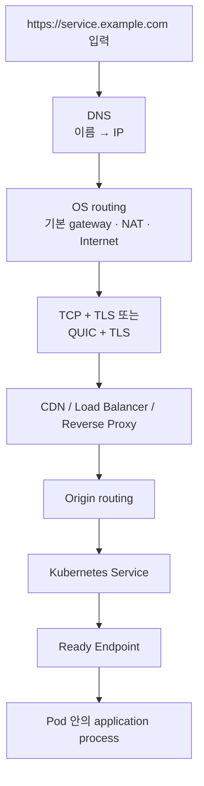
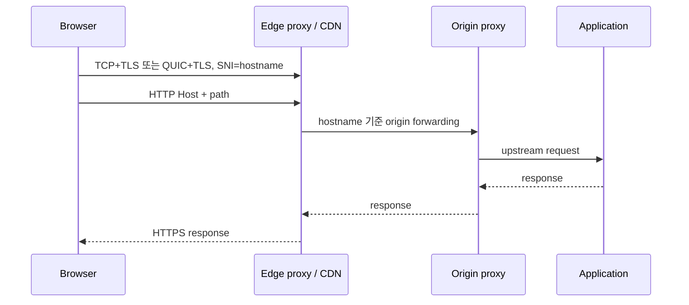
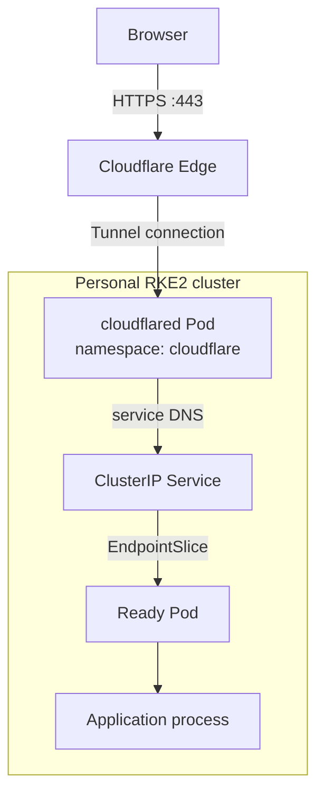
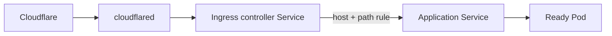

DNS를 확인하면서 `blog.kwl4b.com`이 Cloudflare IP를 돌려준다는 사실까지는 이해했다. 그런데 다음 질문이 남았다. **그 IP는 홈서버 IP가 아닌데, 브라우저 요청은 어떻게 집의 RKE2 클러스터 안의 애플리케이션까지 도달하는가?**

답은 DNS 다음에 여러 경계가 이어진다는 데 있다. DNS는 이름을 IP로 바꾸는 단계일 뿐이다. 이후에는 OS routing, HTTPS 연결, edge proxy, Tunnel, Kubernetes Service와 Endpoint 선택이 차례로 일어난다.

앞 글에서 Linux의 NSS와 DNS resolver가 이름을 해석하는 과정을 다뤘다면, 이 글은 **IP를 얻은 뒤부터 HTTP 요청이 앱 process에 도착하기까지**를 다룬다. [NSS·DNS resolver 글](/blog/linux-dns-nss-stub-recursive-resolver-cloudflare-tunnel/)과 이어서 읽으면 좋다.

## 먼저 결론: DNS 성공은 앱 도달을 뜻하지 않는다

`dig`가 IP를 정상적으로 돌려줘도 다음 단계 중 하나가 실패하면 화면은 열리지 않는다.



각 단계가 답하는 질문도 다르다.

| 경계 | 확인하려는 질문 | 대표 확인 수단 |
| --- | --- | --- |
| DNS | hostname이 어떤 IP로 해석되는가 | `dig`, `getent` |
| OS route | 내 host는 어느 interface와 gateway로 나가는가 | `ip route get <ip>` |
| TLS / HTTP | 어느 server와 인증서를 검증하고 HTTP를 교환했는가 | `curl -v`, `openssl s_client` |
| Edge / Tunnel | public hostname이 어느 origin 경로로 연결되는가 | Cloudflare route, `cloudflared` 상태 |
| Kubernetes | Service가 어느 Ready Pod를 backend로 쓰는가 | `Service`, `EndpointSlice`, Pod readiness |

따라서 `dig` 성공만으로 “서버가 정상”이라고 말할 수 없다. DNS, 연결, proxy, app을 별도로 확인해야 장애 구간을 좁힐 수 있다.

## 일반적인 HTTPS 요청: IP를 얻은 뒤에는 연결을 만든다

### 1. OS는 목적지 IP까지의 다음 hop을 고른다

브라우저가 DNS로 edge IP를 얻으면 OS network stack은 routing table에서 목적지까지의 경로를 찾는다. 같은 LAN 대역이 아니면 보통 default route를 사용한다.

```bash
EDGE_IP=<dns-result-ip>
ip route get "$EDGE_IP"
```

출력은 환경마다 다르지만 보통 아래 세 정보를 읽는다.

```shellsession
$ ip route get <edge-ip>
<edge-ip> via <default-gateway> dev <interface> src <local-ip>
```

- `via <default-gateway>`: 내 PC가 첫 Ethernet frame을 보낼 다음 장비다. 목적지 server 자체가 아니다.
- `dev <interface>`: 실제 패킷을 내보낼 NIC다. 예를 들어 유선 interface나 Wi-Fi interface가 될 수 있다.
- `src <local-ip>`: 이 연결에 사용할 내 host의 source IP다.

가정용 network에서는 이 뒤에 공유기의 NAT가 이어지는 경우가 많다. 즉 브라우저는 Cloudflare edge IP를 향해 연결을 시작하고, home router와 ISP를 지나 인터넷으로 나간다. 이 단계는 home server가 public IP를 갖는지와는 별개다.

### 2. 브라우저는 IP가 아니라 hostname을 포함해 TLS를 협상한다

HTTPS에서는 IP만으로 어떤 사이트를 열지 충분하지 않다. 같은 edge IP에 여러 domain이 연결될 수 있기 때문이다. browser는 TLS `ClientHello`에 **SNI(Server Name Indication)** 로 요청 hostname을 넣고, 지원하는 HTTP protocol도 **ALPN**으로 제안한다.

- HTTP/1.1·HTTP/2 경로: 보통 TCP connection을 만든 뒤 TLS handshake를 한다.
- HTTP/3 경로: QUIC가 UDP 위에서 동작하고 TLS 1.3 handshake가 QUIC 연결 과정에 통합된다.

server는 certificate를 보내고, browser는 인증서 chain, 유효 기간, 그리고 certificate의 SAN에 요청 hostname이 포함되는지를 검증한다. 이 검증에 실패하면 DNS는 정상이더라도 certificate warning이 나타난다. TLS 1.3의 handshake 동작은 [RFC 8446](https://www.rfc-editor.org/rfc/rfc8446), QUIC과 HTTP/3의 관계는 [RFC 9000](https://www.rfc-editor.org/rfc/rfc9000)과 [RFC 9114](https://www.rfc-editor.org/rfc/rfc9114)에 정의돼 있다.

### 3. 실제 public endpoint를 `curl`로 분리해 본다

아래 명령은 HTTP/1.1을 강제해 TCP와 TLS의 연결 순서를 보기 쉽게 만든다. browser의 실제 protocol 선택을 그대로 재현하는 명령은 아니다.

```bash
curl -v --http1.1 -o /dev/null https://blog.kwl4b.com/
```

작성 시점의 실제 출력에서 연결 판단에 필요한 줄만 남기면 다음과 같았다.

```shellsession
* Host blog.kwl4b.com:443 was resolved.
* IPv6: <cloudflare-ipv6> ...
* IPv4: <cloudflare-ipv4> ...
* Connected to blog.kwl4b.com (<cloudflare-ipv4>) port 443
* ALPN: curl offers http/1.1
* SSL connection using TLSv1.3 / <cipher>
* Server certificate:
*  subject: CN=kwl4b.com
*  subjectAltName: host "blog.kwl4b.com" matched cert's "*.kwl4b.com"
*  SSL certificate verify ok.
> GET / HTTP/1.1
> Host: blog.kwl4b.com
< HTTP/1.1 200 OK
< server: cloudflare
< alt-svc: h3=":443"; ma=86400
```

이 출력에서 볼 것은 네 가지다.

1. `Connected to ... :443`: DNS answer 중 하나와 실제 socket connection이 만들어졌다.
2. `subjectAltName ... matched`: certificate가 요청 hostname에 맞는다.
3. `SSL certificate verify ok`: local trust store 기준의 certificate 검증이 통과했다.
4. `server: cloudflare`: browser가 직접 home server가 아니라 Cloudflare public edge와 HTTP를 교환했다.

`alt-svc: h3=":443"`는 server가 HTTP/3 사용 가능성을 알린다는 뜻이다. 다만 browser가 실제로 다음 요청에서 HTTP/3를 선택할지는 client 지원 여부와 network 환경에 따라 달라진다.

### 4. 일반적인 origin까지의 경로

일반적인 public web service에서는 CDN이나 load balancer가 TLS를 종료하고, HTTP `Host`와 path를 기준으로 backend를 고른다. 그 뒤 origin reverse proxy가 다시 application server 또는 Kubernetes ingress로 전달할 수 있다.



여기서 TLS가 어디서 끝나는지는 구성에 따라 다르다. edge에서 끝날 수도 있고, edge와 origin 사이에 별도 TLS를 다시 만들 수도 있다. public hostname만 보고 “end-to-end TLS”라고 단정하면 안 된다.

## 개인 홈서버: Cloudflare IP가 home IP가 아니어도 도달하는 이유

개인 RKE2 cluster에서는 public hostname의 DNS record가 Cloudflare edge IP를 가리킨다. 그래서 browser의 TCP 또는 QUIC connection은 Cloudflare에서 끝난다. home network에 inbound port를 직접 열어 browser가 접속하는 구조가 아니다.

대신 cluster 안의 `cloudflared`가 Cloudflare로 **outbound connection**을 미리 만든다. Cloudflare Tunnel은 public hostname을 내부 service에 매핑하고, `cloudflared`가 만든 outbound-only connection을 통해 traffic을 origin으로 전달한다. 따라서 home router에 inbound port forwarding을 추가하지 않고도 public application을 노출할 수 있다. [Cloudflare Tunnel 개요](https://developers.cloudflare.com/tunnel/)와 [published application routing 문서](https://developers.cloudflare.com/tunnel/routing/)가 이 구조를 설명한다.



이 그림에서 중요한 점은 `cloudflared`가 외부 요청을 기다리는 public server가 아니라는 것이다. `cloudflared`가 먼저 Cloudflare에 connection을 만들고, Cloudflare가 그 connection을 통해 요청을 전달한다. 공식 문서상 Tunnel connector는 Cloudflare에 outbound-only connection을 만들며 public hostname은 local service 주소와 연결된다. [Cloudflare Tunnel routing 문서](https://developers.cloudflare.com/tunnel/routing/)

### 현재 home-ops에서 확인한 범위

GitOps repository에는 `cloudflare` namespace의 `cloudflared` Deployment가 있고, token은 Kubernetes Secret에서 env로 주입해 remote-managed tunnel을 실행한다.

```yaml
containers:
  - name: cloudflared
    args:
      - tunnel
      - --no-autoupdate
      - run
      - --token
      - $(TUNNEL_TOKEN)
    env:
      - name: TUNNEL_TOKEN
        valueFrom:
          secretKeyRef:
            name: <tunnel-token-secret>
            key: <token-key>
```

이 manifest에는 **public hostname → internal service** mapping이 없다. remote-managed tunnel이므로 hostname mapping은 Cloudflare Dashboard에 저장된다. 따라서 Git repository만 보고 모든 hostname이 Ingress를 거치는지, 특정 Service로 직접 가는지를 단정할 수 없다.

다만 home-ops 문서에서 Grafana browser access의 origin은 `ClusterIP` service FQDN으로 지정돼 있다. 이 경우의 흐름은 `Cloudflare → cloudflared → grafana Service → Ready Grafana Pod`다. 이 글에서는 service와 namespace 식별값을 일반화해 표현한다. 다른 public hostname도 같은 방식인지 여부는 Cloudflare Dashboard의 service mapping에서 개별 확인해야 한다.

### Cloudflare Tunnel 뒤에서 TLS는 어디까지 유지되는가

Cloudflare Tunnel의 outbound connection은 Cloudflare와 `cloudflared` 사이를 암호화한다. 하지만 `cloudflared`가 Kubernetes 안에서 연결할 origin URL이 `http://<service>...`라면, **cloudflared와 Service 사이의 마지막 구간은 HTTP**다. origin URL이 `https://...`일 때만 그 구간에도 TLS 검증과 암호화가 추가된다.

즉 다음 셋은 구분해야 한다.

| 구간 | 이 홈서버에서 확인할 기준 |
| --- | --- |
| Browser → Cloudflare | public certificate와 HTTPS connection |
| Cloudflare → cloudflared | Tunnel이 유지하는 outbound encrypted connection |
| cloudflared → Kubernetes Service | Cloudflare public hostname의 origin URL이 `http`인지 `https`인지 |

Tunnel을 사용한다고 application까지 항상 하나의 TLS connection이 유지되는 것은 아니다. proxy 경계를 나눈 구조이므로 각 구간의 protocol을 따로 봐야 한다.

## Service와 Pod 사이에서는 무엇이 일어나는가

`cloudflared`의 origin이 `<service>.<namespace>.svc.cluster.local` 같은 service DNS name이라면, cluster 내부에서는 다음 단계가 이어진다.

1. `cloudflared` Pod가 CoreDNS를 통해 Service 이름을 ClusterIP로 해석한다.
2. Service는 selector에 맞는 backend Pod 목록을 `EndpointSlice`로 관리한다.
3. cluster data plane이 Service traffic을 현재 backend endpoint 중 하나로 전달한다.
4. readiness가 통과한 Pod의 container가 `targetPort`에서 request를 받는다.

Pod IP는 rollout과 restart 때 바뀔 수 있다. Service는 backend Pod group에 안정적인 이름과 virtual IP를 제공하고, EndpointSlice는 현재 backend를 가리킨다. Kubernetes의 Service model은 backend Pod가 바뀌어도 client가 개별 Pod IP를 추적하지 않도록 만든다. [Kubernetes Service 문서](https://kubernetes.io/docs/concepts/services-networking/)를 참고했다.

readiness도 중요하다. Pod process가 떠 있어도 readiness probe가 아직 실패하면 정상 traffic의 backend로 쓰지 않아야 한다. Kubernetes는 readiness가 실패한 container로 traffic을 보내지 않도록 Service endpoint 상태를 갱신한다. [Kubernetes probe 문서](https://kubernetes.io/docs/concepts/workloads/pods/probes/)

### Ingress를 거치는 경우는 한 단계가 더 있다

모든 Tunnel route가 Service를 직접 origin으로 삼는 것은 아니다. Cloudflare public hostname의 origin을 ingress controller Service로 잡으면 host/path routing을 cluster 안의 Ingress가 한 번 더 담당한다.



이 패턴은 여러 application을 ingress controller에서 host와 path 기준으로 분기할 때 유용하다. 반대로 Tunnel Dashboard에서 public hostname을 특정 Service FQDN으로 직접 매핑했다면 Ingress 단계는 없다. Ingress는 HTTP(S) host·path rule을 backend Service로 연결하는 API이고, 실제 routing은 Ingress controller가 수행한다. [Kubernetes Ingress 문서](https://kubernetes.io/docs/concepts/services-networking/ingress/)

## 요청이 실제로 어느 경계까지 도달했는지 확인하는 순서

외부에서 200 응답을 받았다고 곧바로 원하는 Pod까지 request가 갔다고 단정하면 안 된다. CDN cache, 다른 origin route, default backend가 같은 응답을 만들 수도 있다. app까지의 도달을 확인하려면 단계별 증거를 남기는 편이 안전하다.

```bash
# 1. public DNS와 TLS/HTTP edge 확인
dig blog.kwl4b.com A +short
curl -v --http1.1 -o /dev/null https://blog.kwl4b.com/

# 2. Tunnel connector가 cluster 안에서 살아 있는지 확인
kubectl -n cloudflare get pod -l app=cloudflared -o wide
kubectl -n cloudflare logs deployment/cloudflared --tail=80

# 3. target Service와 실제 backend endpoint 확인
kubectl -n <namespace> get service <service-name>
kubectl -n <namespace> get endpointslice \
  -l kubernetes.io/service-name=<service-name>
kubectl -n <namespace> get pod -l <service-selector> -o wide
```

| 결과 | 의미 | 다음 확인 |
| --- | --- | --- |
| `dig` 실패 | 이름 해석 또는 DNS delegation 문제 | authoritative record, local resolver |
| `curl` TLS 실패 | certificate, SNI, protocol 또는 edge connection 문제 | certificate SAN, Cloudflare edge 설정 |
| `curl`은 200인데 app log가 없음 | cache, 잘못된 origin route, 다른 backend 가능성 | non-cacheable health endpoint, response build ID |
| `cloudflared` Pod 비정상 | Tunnel connector 문제 | Pod event, logs, token/egress connection |
| EndpointSlice에 ready endpoint 없음 | Service selector 또는 readiness 문제 | Pod labels, readiness probe, container port |

`cloudflared` log는 connector가 Cloudflare와 연결됐는지 확인하는 근거가 된다. 하지만 모든 HTTP request가 상세 access log로 남는다고 가정하면 안 된다. 실제 application 도달 여부는 request ID, access log, health endpoint, deployment version 같은 app 쪽 증거와 함께 확인해야 한다.

## 이 흐름을 운영 관점에서 어떻게 나눠 볼 것인가

이제 `https://blog.kwl4b.com` 접속 실패를 보면 “DNS 문제인가?” 하나로 시작하지 않는다.

1. 이름이 Cloudflare edge IP로 해석되는가.
2. browser가 certificate를 검증하고 Cloudflare와 TLS를 맺는가.
3. Cloudflare public hostname이 살아 있는 Tunnel로 route되는가.
4. `cloudflared`가 의도한 Kubernetes Service를 origin으로 호출하는가.
5. Service에 Ready Endpoint가 있고, 그 Pod가 application port에서 정상 응답하는가.

DNS는 첫 관문이고, Cloudflare Tunnel은 public edge와 private cluster를 잇는 transport 경계이며, Service와 readiness는 마지막으로 어떤 Pod가 request를 받을지를 정한다. 이 경계를 나눠 보면 public URL 하나가 열리지 않을 때도 확인 범위를 훨씬 빠르게 좁힐 수 있다.

## 참고 자료

- [이전 글: NSS, DNS resolver, TLS, Cloudflare Tunnel](/blog/linux-dns-nss-stub-recursive-resolver-cloudflare-tunnel/)
- [Cloudflare Tunnel overview](https://developers.cloudflare.com/tunnel/)
- [Cloudflare Tunnel routing](https://developers.cloudflare.com/tunnel/routing/)
- [Kubernetes Services, Load Balancing, and Networking](https://kubernetes.io/docs/concepts/services-networking/)
- [Kubernetes Ingress](https://kubernetes.io/docs/concepts/services-networking/ingress/)
- [Kubernetes liveness, readiness, and startup probes](https://kubernetes.io/docs/concepts/workloads/pods/probes/)
- [RFC 8446: TLS 1.3](https://www.rfc-editor.org/rfc/rfc8446)
- [RFC 9000: QUIC](https://www.rfc-editor.org/rfc/rfc9000)
- [RFC 9114: HTTP/3](https://www.rfc-editor.org/rfc/rfc9114)
