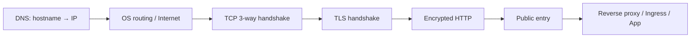
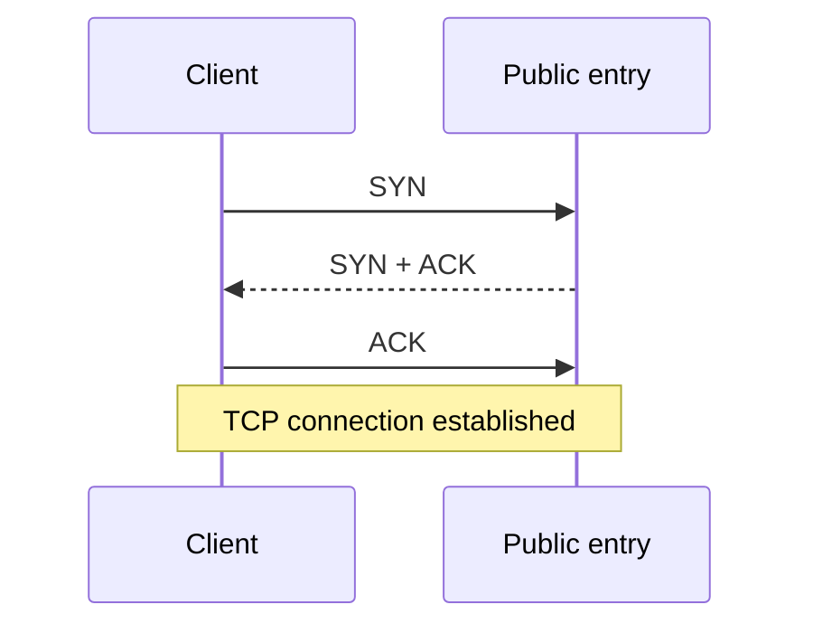
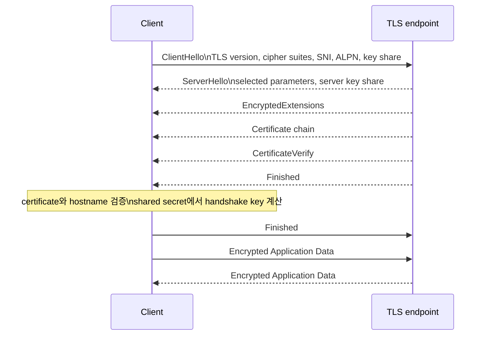
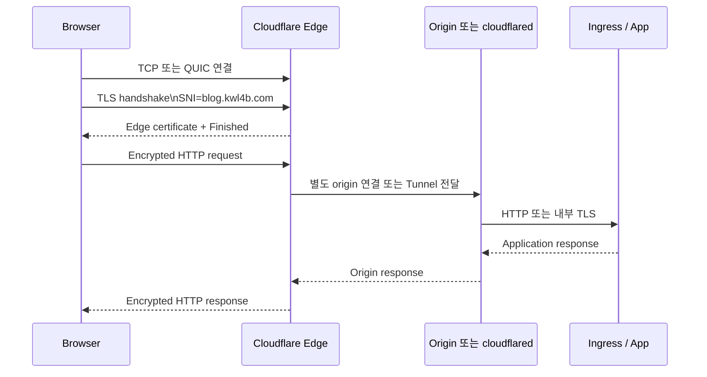

HTTPS를 공부하면서 한 가지 질문이 계속 남았다.

> TCP 연결이 이미 만들어졌는데, 왜 그 다음에 TLS handshake가 또 필요한가?

DNS로 IP를 얻고, routing을 거쳐 public entry까지 도착했다면 통신이 끝난 것처럼 보인다. 하지만 TCP는 **데이터를 안정적으로 주고받을 연결**만 만든다. 상대가 진짜 `blog.kwl4b.com`인지, 중간에서 데이터가 바뀌지 않았는지, HTTP 내용을 다른 사람이 읽을 수 없는지는 아직 보장하지 않는다.

이 글은 Cloudflare Learning Center의 TLS handshake 흐름을 참고해, TCP 연결 이후 HTTPS가 만들어지는 과정을 다시 정리한 기록이다. 참고 글에서 설명하는 구형 TLS 1.2·RSA 방식과 현재 주로 사용하는 TLS 1.3·ECDHE 방식의 차이도 함께 구분한다.

## 먼저 전체 순서부터 보기

일반적인 HTTPS 요청은 다음 순서로 진행된다.



각 단계의 역할은 다르다.

| 단계 | 만드는 것 | 해결하는 문제 |
| --- | --- | --- |
| DNS | hostname과 IP의 매핑 | 어디로 보낼지 |
| Routing | 목적지까지의 packet 경로 | 어떤 network hop을 거칠지 |
| TCP handshake | transport connection | 양방향 전송과 순서·재전송 |
| TLS handshake | 암호화 session | 서버 인증, 키 합의, 무결성 |
| HTTP | application request | 어떤 resource를 요청할지 |

TCP와 TLS는 모두 handshake라는 이름을 쓰지만 목적이 다르다. TCP handshake는 네트워크 연결을 만들고, TLS handshake는 그 연결 위에 신뢰할 수 있는 암호화 세션을 만든다.

## TCP 3-way handshake: 통신할 길 만들기

HTTPS가 TCP 위에서 동작하는 HTTP/1.1 또는 HTTP/2라면 TLS보다 먼저 TCP 연결이 필요하다.



이 단계에서 확인하는 것은 대략 다음과 같다.

- 서버가 해당 IP와 port에서 연결을 받고 있는가
- 양쪽 sequence number를 어떻게 시작할 것인가
- TCP option, window size 같은 transport 조건은 무엇인가

여기서는 인증서도, HTTP 내용도, application 사용자도 확인하지 않는다. TCP 연결이 성공해도 TLS 인증서가 잘못되었거나 서버가 다른 hostname을 서비스하고 있을 수 있다.

<figure style="margin: 2rem 0; text-align: center;">
  <a href="https://www.cloudflare.com/learning/ssl/what-happens-in-a-tls-handshake/" target="_blank" rel="noreferrer">
    
  </a>
  <figcaption style="margin-top: 0.5rem; text-align: center; font-size: 0.78rem; color: #64748b; line-height: 1.5;">출처: <a href="https://www.cloudflare.com/learning/ssl/what-happens-in-a-tls-handshake/" target="_blank" rel="noreferrer">Cloudflare Learning Center - What happens in a TLS handshake?</a></figcaption>
</figure>

이 그림은 **TCP 연결이 먼저 성립한 뒤 TLS handshake가 시작되는 순서**를 한눈에 보여준다. 왼쪽의 `SYN → SYN ACK → ACK`가 TCP 3-way handshake이고, 그 아래 `ClientHello`부터 `Finished`까지가 TLS 협상이다. 다만 그림은 TLS 1.1 시기의 메시지 이름을 사용하므로, 현재 글의 기준인 TLS 1.3에서는 아래의 별도 흐름도와 함께 읽어야 한다.

## TLS handshake: 연결 위에 신뢰를 만드는 과정

TLS handshake의 핵심 목표는 세 가지다.

1. 사용할 TLS 버전과 암호화 방식을 협상한다.
2. 서버가 요청한 도메인의 진짜 endpoint인지 검증한다.
3. 이후 application data를 암호화할 session key를 만든다.

Cloudflare도 TLS handshake를 TLS 버전과 cipher suite 협상, endpoint 인증, session key 생성 과정으로 설명한다. [Cloudflare: What happens in a TLS handshake?](https://www.cloudflare.com/learning/ssl/what-happens-in-a-tls-handshake/)

### TLS 1.3 기준의 메시지 흐름

현재 기준으로는 다음처럼 이해하는 것이 좋다.



실제 구현에서는 메시지가 여러 record와 packet으로 나뉘고, TLS 버전·확장·재개 여부에 따라 세부 순서가 달라질 수 있다. 그림은 개념 흐름을 단순화한 것이다.

### 1. ClientHello

클라이언트는 자신이 지원하는 조건을 제안한다.

```text
TLS version: TLS 1.3 등
Cipher suites: AES-GCM, ChaCha20-Poly1305 등
SNI: blog.kwl4b.com
ALPN: h2, http/1.1
key_share: ECDHE에 사용할 임시 공개값
```

#### SNI

하나의 public IP에서 여러 도메인을 서비스할 수 있다. 서버는 `ClientHello`의 SNI를 보고 어떤 인증서를 제시할지 선택한다.

```text
104.21.60.191:443
  ├─ blog.kwl4b.com
  ├─ api.example.com
  └─ other.example.com
```

#### ALPN

ALPN은 application protocol을 협상한다.

```text
h2       -> HTTP/2
http/1.1 -> HTTP/1.1
h3       -> HTTP/3는 QUIC 경로에서 사용
```

### 2. ServerHello와 서버 인증

서버는 지원 목록 중 하나를 선택하고 자신의 인증서 체인을 보낸다.

인증서에는 보통 다음 정보가 들어 있다.

- 도메인과 SAN(Subject Alternative Name)
- 인증서 유효기간
- 서버 public key
- 발급자와 서명 정보

클라이언트는 다음을 검증한다.

```text
요청 hostname == 인증서 SAN인가?
현재 시간이 유효기간 안에 있는가?
issuer 인증서가 신뢰할 수 있는 CA chain에 연결되는가?
서버가 인증서에 대응하는 private key를 가지고 있는가?
```

여기서 흔히 “CA 공개키로 인증서를 복호화한다”고 표현하지만, 정확히는 CA가 인증서에 남긴 **전자서명을 CA 공개키로 검증**한다. 인증서의 내용을 단순히 복호화하는 과정은 아니다.

또한 브라우저가 접속할 때마다 CA에 실시간으로 인증서를 물어보는 것도 아니다. 브라우저와 운영체제에 내장된 신뢰 Root CA 목록을 바탕으로 인증서 chain과 서명을 검증한다.

### 3. ECDHE로 session key 만들기

TLS 1.3에서 실제 application data는 대칭키로 암호화한다. 대칭키를 네트워크로 그대로 보내지 않고, Client와 Server가 ECDHE 재료를 교환해 같은 shared secret을 계산한다.

```text
Client의 임시 private 값 + Server의 임시 public 값
Server의 임시 private 값 + Client의 임시 public 값
                         ↓
                같은 shared secret
                         ↓
                handshake/application key
```

네트워크에서 보이는 key share만으로는 private 값을 계산할 수 없도록 설계되어 있다. 임시 키를 매 session마다 새로 만들기 때문에, 나중에 서버의 장기 private key가 노출되더라도 과거 session을 쉽게 복호화하지 못하는 **Forward Secrecy**를 얻을 수 있다.

### 4. Finished와 암호화된 HTTP

양쪽은 지금까지의 handshake가 변조되지 않았는지 확인하는 `Finished` 메시지를 교환한다. 이후부터는 HTTP가 TLS Application Data 안에 들어간다.

```text
GET / HTTP/2
Host: blog.kwl4b.com
```

이 내용은 네트워크 중간 router가 그대로 읽는 것이 아니라 암호화된 데이터로 전달된다. 중간 장비는 packet의 IP·port와 TLS metadata 일부는 볼 수 있지만 HTTP path나 request body는 볼 수 없다.

## 참고 글의 RSA 설명과 TLS 1.3을 구분하기

참고 글에는 TLS handshake의 예시로 다음과 같은 설명이 나온다.

```text
Client가 대칭키를 만든다
-> 서버 인증서의 public key로 암호화한다
-> Server가 private key로 복호화한다
```

이 흐름은 TLS 1.2 이전의 **정적 RSA key exchange**를 설명할 때 사용할 수 있는 모델이다. 하지만 현재 TLS 1.3에서는 정적 RSA key exchange가 제거되었고, ECDHE 기반 key agreement가 기본적인 이해 모델이다.

따라서 현재 기준으로는 다음처럼 말하는 편이 정확하다.

> 인증서의 public key와 CA 서명으로 서버 identity를 검증하고, ECDHE key share를 이용해 Client와 Server가 같은 session key를 계산한 뒤, 대칭키로 application data를 암호화한다.

TLS 1.2의 모든 구현이 정적 RSA만 사용한다는 뜻도 아니다. TLS 1.2에서도 ECDHE를 사용할 수 있다. 핵심은 **TLS 버전과 cipher suite에 따라 handshake 세부 메시지가 달라진다**는 점이다.

## SSL과 TLS는 무엇이 다른가

```text
SSL = Secure Sockets Layer
TLS = Transport Layer Security
```

SSL은 과거에 사용하던 보안 프로토콜이고, TLS는 SSL을 계승한 후속 프로토콜이다. SSL 2.0과 SSL 3.0은 현재 안전한 통신에 사용하지 않는다.

| 표현 | 정확한 의미 |
| --- | --- |
| SSL 2.0 / SSL 3.0 | 폐기된 구형 프로토콜 |
| TLS 1.2 | 여전히 널리 사용되는 TLS 버전 |
| TLS 1.3 | 현재 기준의 최신 주요 TLS 버전 |
| SSL certificate | 업계에서 계속 쓰는 관용적 표현 |
| TLS certificate | 현재 프로토콜 기준으로 더 정확한 표현 |
| SSL handshake | 흔히 쓰지만 실제로는 TLS handshake를 뜻하는 표현 |

Cloudflare도 SSL이라는 용어가 널리 남아 있지만 SSL은 TLS의 전신이고, 현대 웹 통신은 TLS를 사용한다고 설명한다. [Cloudflare: What is SSL?](https://www.cloudflare.com/learning/ssl/what-is-ssl/)

즉 블로그나 제품 설정에서 `SSL certificate`라고 적혀 있어도, 현재 실제 연결이 TLS 1.2 또는 TLS 1.3으로 동작하는지 별도로 확인해야 한다.

## Cloudflare Edge에서는 TLS가 어디서 끝나는가

DNS가 `blog.kwl4b.com`에 대해 Cloudflare edge IP를 반환하면 브라우저는 먼저 그 edge와 TLS handshake를 수행한다.



일반적인 Cloudflare proxy에서는 방문자와 Cloudflare Edge 사이의 TLS, Cloudflare와 Origin 사이의 TLS가 별도 connection으로 구성될 수 있다. Cloudflare 공식 문서도 두 구간을 별도의 TLS handshake로 설명한다. [Cloudflare: Authenticated Origin Pulls](https://developers.cloudflare.com/ssl/origin-configuration/authenticated-origin-pull/explanation/)

현재 개인 홈 클러스터처럼 Cloudflare Tunnel을 사용하는 경우에는 origin 구간을 구분해야 한다.

```text
Browser
  -- TLS --> Cloudflare Edge
  -- Tunnel protocol --> cloudflared
  -- HTTP 또는 HTTPS --> Kubernetes Ingress
  -> Service
  -> Pod
```

브라우저와 Pod가 하나의 TLS connection을 직접 공유한다고 보면 안 된다. Cloudflare Edge가 방문자 TLS를 종료하고, tunnel과 `cloudflared`가 홈서버 쪽 origin으로 요청을 전달한다. `cloudflared`와 local origin 사이를 HTTP로 둘지 HTTPS로 둘지는 tunnel origin 설정에 따라 달라진다.

## 직접 확인하기

### `curl -v`

HTTP/1.1을 강제하면 TCP와 TLS가 순서대로 보인다.

```bash
curl -v --http1.1 -o /dev/null https://blog.kwl4b.com/
```

출력에서 다음 항목을 찾는다.

```text
* Host blog.kwl4b.com:443 was resolved
* Connected to blog.kwl4b.com (...) port 443
* ALPN: curl offers http/1.1
* SSL connection using TLSv1.3 / ...
* subjectAltName ... matched
* SSL certificate verify ok
> GET / HTTP/1.1
< HTTP/1.1 200
```

읽는 순서는 다음과 같다.

1. `resolved`: DNS 결과를 얻었다.
2. `Connected`: TCP socket 연결이 만들어졌다.
3. `SSL connection using TLSv1.3`: TLS negotiation이 끝났다.
4. `subjectAltName matched`: 요청 hostname과 certificate가 일치한다.
5. `certificate verify ok`: local trust store 기준 검증이 통과했다.
6. `GET`: TLS가 끝난 뒤 HTTP request가 전송됐다.

### `openssl s_client`

TLS endpoint의 인증서와 협상 결과만 집중해서 확인할 수 있다.

```bash
openssl s_client \
  -connect blog.kwl4b.com:443 \
  -servername blog.kwl4b.com \
  -alpn h2
```

여기서 확인할 항목은 다음과 같다.

```text
Protocol  : TLSv1.3
Cipher    : ...
Server certificate
subject   : ...
issuer    : ...
Verify return code: 0 (ok)
```

`-servername`을 빼면 SNI가 없는 요청이 된다. 하나의 IP에 여러 hostname이 있는 환경에서는 다른 인증서가 선택되거나 검증에 실패할 수 있다.

### 패킷 캡처

Wireshark나 `tcpdump`로 TCP handshake와 TLS record의 순서를 볼 수 있다.

```bash
sudo tcpdump -i any -nn \
  'host <edge-ip> and port 443'
```

보이는 흐름은 대략 다음과 같다.

```text
SYN
SYN, ACK
ACK
ClientHello
ServerHello
Certificate
Finished
Application Data
```

패킷을 캡처해도 private key 없이 일반적인 TLS Application Data를 바로 읽을 수 있는 것은 아니다. TLS handshake metadata와 인증서, 서버 이름 같은 정보는 확인할 수 있지만 HTTP 본문은 암호화되어 있다.

## 장애를 어디서부터 나눠 볼까

HTTPS 접속 실패를 한 번에 “서버 문제”라고 부르지 않고 아래처럼 경계를 나누면 원인을 좁히기 쉽다.

| 증상 | 먼저 확인할 경계 | 확인 도구 |
| --- | --- | --- |
| hostname을 찾지 못함 | NSS·stub·recursive DNS | `getent`, `dig`, `resolvectl` |
| connection refused / timeout | route·firewall·public entry | `ip route`, `ss`, `curl -v` |
| certificate mismatch | SNI·certificate SAN·TLS endpoint | `openssl s_client` |
| TLS handshake 실패 | TLS version·cipher·ALPN | `curl -v`, `openssl s_client` |
| HTTP 502/504 | Edge와 origin·Tunnel·Ingress | `cloudflared` log, Ingress log |
| HTTP 404/응답 오류 | host/path routing·application | reverse proxy, Service, app log |

DNS에서 IP가 나왔다고 application이 정상이라는 뜻은 아니다. 반대로 TLS certificate 오류가 났다고 DNS가 틀렸다고 단정할 수도 없다. 각 단계가 성공했다는 증거를 분리해서 확인해야 한다.

## 정리

이번에 가장 중요하게 정리한 경계는 다음 세 가지다.

1. **TCP는 통신할 연결을 만든다.** 아직 상대의 identity나 HTTP 암호화는 보장하지 않는다.
2. **TLS는 인증서와 key exchange로 신뢰할 endpoint와 session key를 만든다.** 현재 기준으로는 TLS 1.3·ECDHE 흐름을 기본 모델로 보는 것이 안전하다.
3. **HTTPS가 어디까지 암호화되는지는 TLS termination 위치에 따라 달라진다.** Cloudflare Edge, Load Balancer, Ingress, Application이 각각 TLS endpoint가 될 수 있고, 그 뒤에는 별도 connection이 만들어질 수 있다.

그래서 주소창의 요청을 설명할 때는 “DNS에서 IP를 받았다”에서 끝내지 않고 다음처럼 말하는 것이 더 정확하다.

> DNS로 public entry의 주소를 얻은 뒤, routing을 통해 TCP 연결을 만들고, 그 연결 위에서 TLS가 endpoint를 인증하고 session key를 협상한다. 이후 암호화된 HTTP가 public entry에 도착하고, proxy·Tunnel·Ingress가 별도의 내부 연결을 통해 application으로 전달한다.

## 참고 자료

- [Cloudflare: What happens in a TLS handshake?](https://www.cloudflare.com/learning/ssl/what-happens-in-a-tls-handshake/)
- [Cloudflare: What is SSL?](https://www.cloudflare.com/learning/ssl/what-is-ssl/)
- [Cloudflare: CDN SSL/TLS security](https://www.cloudflare.com/learning/cdn/cdn-ssl-tls-security/)
- [Cloudflare: Authenticated Origin Pulls](https://developers.cloudflare.com/ssl/origin-configuration/authenticated-origin-pull/explanation/)
- [RFC 8446: The Transport Layer Security (TLS) Protocol Version 1.3](https://www.rfc-editor.org/rfc/rfc8446)
- [RFC 9000: QUIC: A UDP-Based Multiplexed and Secure Transport](https://www.rfc-editor.org/rfc/rfc9000)
- [RFC 9114: HTTP/3](https://www.rfc-editor.org/rfc/rfc9114)
