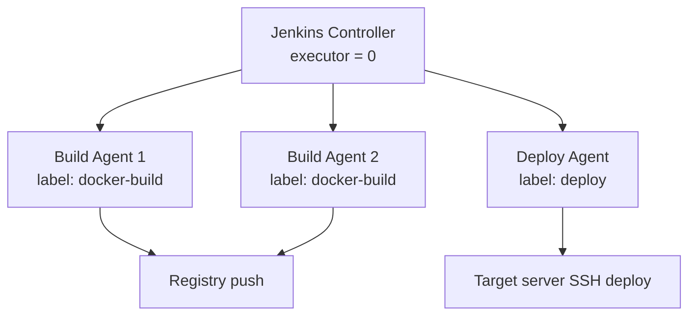

CI/CD가 느려지면 Jenkins executor를 늘리거나 build agent를 추가하는 방법부터 떠올리기 쉽다. 나도 처음에는 Jenkins 대기가 원인일 것이라 생각했다. 하지만 pipeline 전체 시간만 보고는 대기, Docker build/push, target server 배포, health check 중 어디가 느린지 구분할 수 없었다.

그래서 먼저 Jenkinsfile에 stage별 측정 로직을 넣었다. 결론부터 말하면 초기 backend 배포의 주 병목은 agent 대기가 아니라 Docker build/push였다. 이후 개선도 하나의 Dockerfile 수정으로 끝나지 않았다. 서비스마다 dependency, runtime image, 실행 architecture가 달랐기 때문에 같은 지표로 문제를 나눠 보아야 했다.

> 검증 시점: 2026년 7월 2~4일. 사내 SaaS 개발·데모 배포 흐름에서 얻은 수치를 공개 가능한 범위로 재구성했다. 고객명, 서버 주소, registry/repository 식별자, credential은 제외했다.

## 먼저 pipeline을 측정 가능한 단위로 나눴다

Jenkins UI의 전체 duration만으로는 병목을 설명하기 어려웠다. Jenkinsfile에서 각 구간의 시작·종료를 기록하고, build 종료 시 `ci-metrics.json`과 build metadata를 artifact로 남겼다.


*공개 가능한 범위에서 역할과 흐름만 재구성한 CI/CD 아키텍처입니다. 실제 서버 주소, repository, credential, 고객 식별 정보는 제외했습니다.*

기록한 값은 아래와 같다.

| 구간 | 확인하려던 질문 |
| --- | --- |
| `agent_wait_ms` | Jenkins가 실행 자원을 배정받기까지 얼마나 기다렸는가? |
| `docker_build_push_ms` | Dockerfile, dependency install, image export/push 중 어디가 큰가? |
| `deploy_ms`, `health_check_ms` | image를 받은 뒤 target server 갱신과 준비 상태 확인에 얼마나 걸리는가? |
| `build_context_kb`, `image_size_bytes`, `image_digest` | 빌드 입력과 배포 산출물이 무엇이고 얼마나 큰가? |

초기 backend dev build에서는 전체 179.6초 중 Docker build/push가 127.6초, agent 대기는 5.9초였다. 즉 전체 지연의 약 71%가 Docker build/push 구간에 있었고, executor만 늘려서는 핵심 비용을 줄일 수 없었다.

## controller와 실행 agent를 분리한 이유

병목의 주원인은 Docker build였지만, controller가 build와 deploy까지 직접 맡는 구조도 그대로 두기 어렵다고 판단했다. controller의 UI/API/scheduling workload와 Docker socket을 쓰는 build workload, target server SSH 권한이 한 실행 주체에 함께 있었기 때문이다.



- controller는 webhook, scheduling, credential, job 상태 관리만 담당하게 했다.
- build agent pool에는 Docker/buildx와 registry push 권한을 두었다.
- deploy agent에는 target server SSH 배포 권한만 두고 Docker socket은 주지 않았다.
- target server 상태 변경은 충돌 위험이 있어 deploy agent의 executor를 하나로 유지했다.

이 구조는 “무조건 빨라지는” 개선이 아니다. 실제 agent 전환 뒤에도 `agent_wait_ms`는 build queue 상황에 따라 달라졌다. 목적은 controller 부하와 권한 집중을 줄이고, build와 deploy의 책임을 분리하는 데 있었다. Jenkins도 controller executor를 `0`으로 두고 실제 작업은 agent executor에서 수행해 resource contention을 줄이는 방식을 권장한다.

## Docker build는 변경 유형별로 다시 측정했다

`COPY . .` 다음에 dependency install을 두면 source 파일 하나가 바뀌어도 dependency install layer까지 함께 무효화될 수 있다. Docker는 instruction과 그 instruction이 의존하는 파일이 바뀌지 않을 때만 build cache layer를 재사용한다. 따라서 package/dependency 정의와 자주 바뀌는 source를 분리해야 했다.

```dockerfile
# Backend 예시: dependency와 source의 변경 주기를 분리
COPY pom.xml .
RUN mvn dependency:go-offline -DskipTests

COPY src ./src
RUN mvn package -DskipTests
```

Build agent가 여러 대이면 agent의 local cache만으로는 충분하지 않다. 그래서 branch별 BuildKit cache를 Harbor registry에 export/import하도록 구성했다. 실행 image와 cache artifact는 별도 ref로 두고, 다른 agent에서도 dependency layer를 후보 cache로 가져올 수 있게 했다.

### Backend: cache hit 자체보다 invalidation 경계를 확인

Backend는 처음부터 multi-stage Dockerfile이었다. 따라서 “single-stage를 multi-stage로 전환했다”는 개선 이력은 아니다. 실제 작업은 Maven dependency/source layer 분리와 registry cache 재사용이었다.

같은 build agent에서 source만 변경했을 때 Docker build/push는 25.0초였다. 이때 `pom.xml`과 `mvn dependency:go-offline` layer는 cache hit였고, source 이후 `mvn package`만 다시 실행됐다. 반면 dependency를 변경하면 dependency resolution layer가 무효화되어 117.2초가 걸렸다.

```text
same commit full cache :   6.9s  # cache 동작 확인값
source-only change    :  25.0s  # dependency layer 재사용
dependency change     : 117.2s  # dependency resolution 재실행
```

이 결과는 “모든 backend build가 25초”라는 뜻이 아니다. 대신 source-only 변경과 dependency 변경을 같은 수치로 묶지 않고, 어떤 변경에서 cache가 깨지는지 설명할 수 있게 됐다.

기존 multi-stage 구조의 runtime image 효과도 별도 controlled benchmark로만 확인했다. Maven build image를 final runtime으로 쓰는 single-stage 비교군은 685.7MB, 현재처럼 JRE runtime에 jar만 복사하는 구조는 231.2MB였다. 약 66.3% 차이였지만, 이는 기존 구조의 효과를 검증한 수치이지 새로 적용한 변경 성과는 아니다.

### Frontend와 LLM: 같은 layer 원칙, 다른 runtime 문제

Frontend와 LLM은 source-only 변경 기준의 비교 실험을 별도로 수행했다. 두 서비스 모두 비교군에서 `COPY . .`를 dependency install 이전에 두고 source 변경 시 dependency install이 다시 실행되게 만든 뒤, package/requirements 파일을 먼저 복사하는 구조로 되돌려 차이를 확인했다.

| 서비스 | source-only 비교 | Docker build/push | 해석 |
| --- | --- | --- | --- |
| Next.js Frontend | `COPY . . -> npm ci` 대비 package-lock 기반 layer 분리 | 75.7s → 35.5s, 53.0% 단축 | `npm run build`는 다시 필요하지만 `npm ci` 비용을 피함 |
| FastAPI LLM | `COPY . . -> pip install` 대비 requirements 기반 layer 분리 | 155.4s → 4.9s, 96.8% 단축 | requirements가 그대로면 pip install layer 재사용 |

최종 runtime image는 또 다른 문제였다.

- Frontend는 Next.js standalone output을 적용해 전체 `node_modules` 복사를 제거했다. image size는 304.9MB에서 78.1MB로 74.4% 줄었다.
- LLM은 GPU를 쓰지 않는 배포 환경인데 CUDA PyTorch wheel이 포함된 것을 확인했다. CPU-only wheel로 바꾼 뒤 image size는 3.25GB에서 677.7MB로 79.1% 줄었다.

여기서 image size 감소와 cache 효과는 분리해 보아야 한다. Frontend/LLM의 runtime image 축소는 push, pull, deploy 비용을 줄이는 개선이고, dependency/source layer 분리는 변경 유형에 따른 build 재실행 범위를 줄이는 개선이다.

## 수치를 해석할 때 남긴 기준

이 작업에서 가장 경계한 것은 빠른 숫자 하나를 대표 성과로 쓰는 일이었다.

1. 동일 commit warm-cache build의 3~5초 수치는 cache가 작동한다는 검증값으로만 쓴다.
2. source-only, dependency 변경, Dockerfile/base image 변경은 별도 조건으로 기록한다.
3. controller/agent 분리는 권한과 workload 분리의 개선이지, 대기 시간 감소를 자동으로 보장하는 성과로 쓰지 않는다.
4. multi-stage image size 비교가 controlled benchmark라면 실제 운영 변경 성과와 구분한다.
5. `image tag`, `digest`, `size`, `build context`를 artifact에 남겨 어떤 산출물을 배포했는지 다시 확인할 수 있게 한다.

CI/CD 최적화는 Dockerfile 문법을 외우는 문제가 아니었다. 배포가 느리다는 현상을 stage, 변경 유형, image 구성, 실행 agent로 나누고, 같은 기준으로 다시 측정하는 일이 먼저였다. 그 뒤에야 executor 증설, registry cache, runtime image 축소, multi-platform builder 같은 선택지를 근거 있게 비교할 수 있었다.

## 함께 읽을 글

- [Docker BuildKit cache는 왜 Dockerfile 순서에 민감할까](/blog/docker-buildkit-cache-layer-order/)
- [Docker multi-stage와 multi-platform build 정리](/blog/docker-multistage-multiplatform-build/)
- [Jenkins에서 멀티 플랫폼 Docker 이미지를 빌드하며 헷갈렸던 것들](/blog/jenkins-docker-socket-multiplatform-build/)

## 참고 자료

- [Jenkins: Using Jenkins agents](https://www.jenkins.io/doc/book/using/using-agents/)
- [Docker Docs: Optimize cache usage in builds](https://docs.docker.com/build/cache/optimize/)
- [Docker Docs: Registry cache](https://docs.docker.com/build/cache/backends/registry/)
- [Docker Docs: Multi-stage builds](https://docs.docker.com/build/building/multi-stage/)
