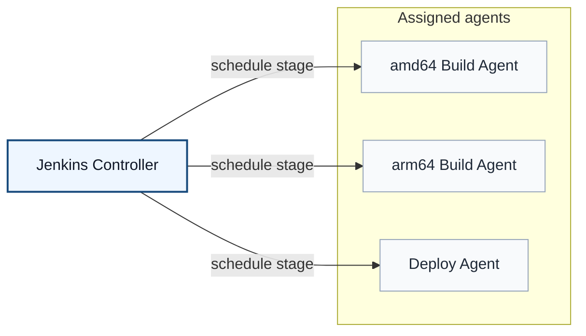
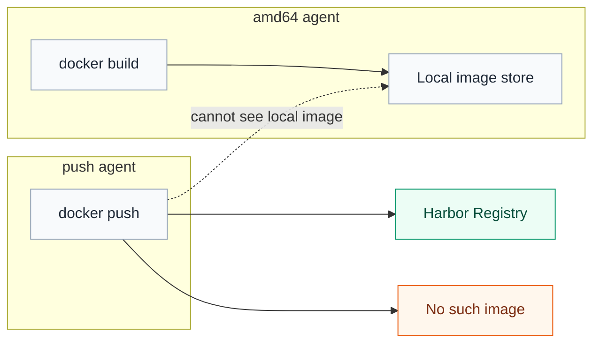
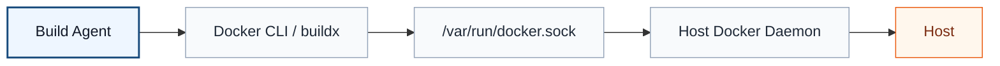
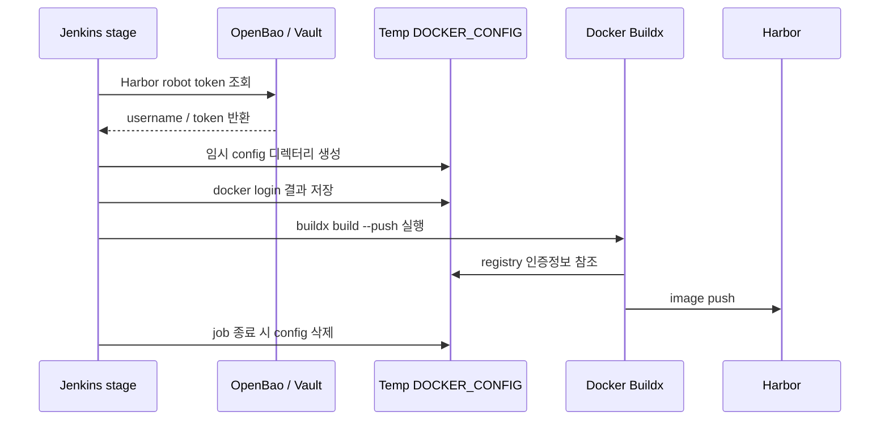
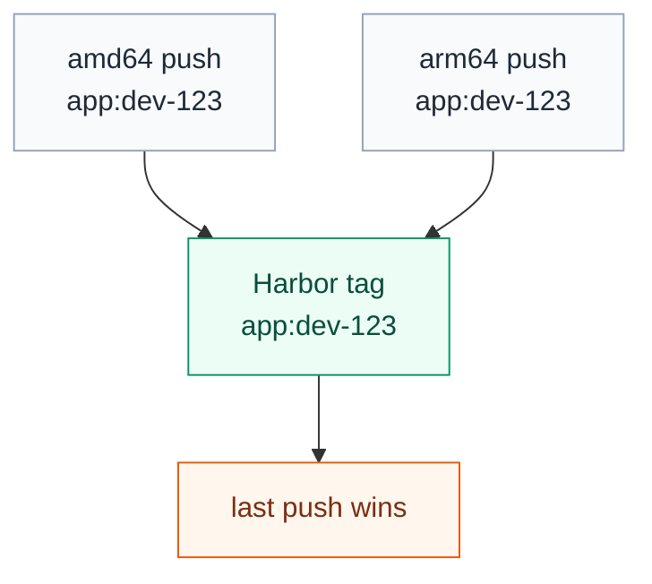
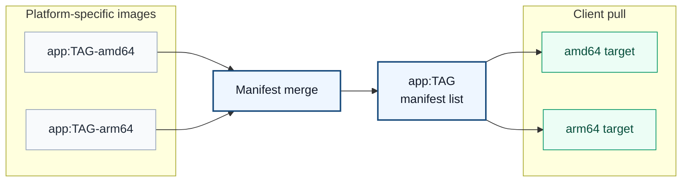
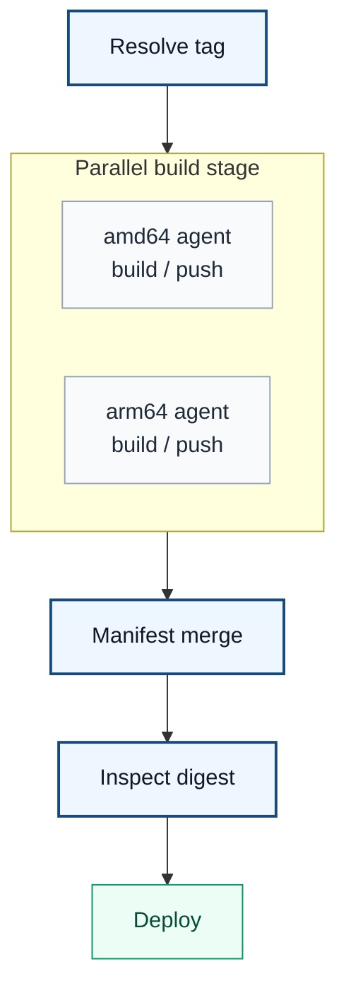

Jenkins에서 Docker 이미지를 빌드하고 Harbor에 push하는 구조는 처음에는 단순해 보였다.

```bash
docker buildx build --push ...
```

하지만 build agent를 나누고, amd64와 arm64 이미지를 병렬로 빌드하고, Harbor에 push한 뒤 하나의 multi-arch image로 배포하려고 보니 질문이 계속 이어졌다.

- build agent가 `docker build`를 실행하면 실제로 어디에 붙는 걸까?
- DooD 방식이면 DinD보다 안전한 걸까?
- `docker login`을 하면 인증정보는 어디에 남는 걸까?
- OpenBao 같은 secret manager에서 Harbor token을 꺼내면 바로 push할 수 있는 걸까?
- amd64 agent와 arm64 agent가 각각 push하면 Harbor가 알아서 manifest list로 묶어주는 걸까?
- Jenkins stage는 실제 실행 공간일까, 아니면 논리적인 구간일까?

이번 글은 이 질문들을 따라가며 Jenkins, Docker Buildx, Harbor, multi-platform image의 책임 경계를 정리한 기록이다.

## 1. Jenkins stage는 실행 공간이 아니다

먼저 헷갈렸던 것은 Jenkins의 `stage`와 `agent`였다.

`stage`는 실제 서버나 컨테이너 공간이 아니다. Pipeline 안에서 작업을 나누는 논리적인 구간이다. 실제 명령은 해당 stage에 배정된 Jenkins agent의 workspace에서 실행된다.



Jenkins controller는 pipeline 상태와 stage 순서를 관리한다. agent는 controller가 요청한 실제 작업을 수행한다. Jenkins 공식 문서에서도 controller는 agent를 관리하고 작업을 스케줄링하며, agent는 executor를 통해 실제 작업을 수행한다고 설명한다. 또한 controller의 executor를 `0`으로 두어 controller가 build 실행보다 관리와 조율에 집중하도록 하는 것을 권장한다.

따라서 멀티 플랫폼 빌드에서 중요한 기준은 이것이다.

```text
stage = 논리적 실행 구간
agent = 실제 실행 장소
workspace = agent 내부 작업 디렉터리
controller = 전체 흐름 관리자
```

## 2. agent가 다르면 workspace도 다르고 Docker image store도 다르다

이걸 이해하고 나면 build stage와 push stage를 함부로 나누면 안 된다는 것도 보인다.

예를 들어 amd64 agent에서 build만 하고, 다른 push agent에서 push하려는 구조를 생각해보자.



`docker build`로 생성한 이미지는 build를 수행한 agent의 local Docker image store에 있다. 다른 agent에서 `docker push`를 실행하면 그 agent의 local image store에서 이미지를 찾는다. 당연히 이미지가 없을 수 있다.

물론 `docker save`로 tar를 만들고 `stash/unstash`로 넘긴 뒤 `docker load`를 할 수도 있다. 하지만 image tar는 크고, Jenkins controller나 artifact storage에 부담을 준다. 멀티 플랫폼 빌드에서는 더 번거롭다.

그래서 container image CI에서는 보통 build와 push를 같은 agent/stage에서 처리한다.

```bash
docker buildx build \
  --platform linux/amd64 \
  -t harbor.example.com/app/backend:${TAG}-amd64 \
  --push .
```

이렇게 하면 stage 간 전달물은 workspace 파일이 아니라 registry에 올라간 image manifest가 된다.

## 3. build agent가 Docker socket을 쓰는 순간 생기는 문제

Jenkins agent에서 아래 명령을 실행한다고 해보자.

```bash
docker buildx build --push ...
```

대부분 Docker CLI는 Docker daemon과 통신한다. Linux 환경에서는 보통 `/var/run/docker.sock`을 통해 Docker daemon에 명령을 보낸다.



DooD(Docker-out-of-Docker) 방식은 agent container 안에 Docker daemon을 띄우는 DinD(Docker-in-Docker)보다 단순하다. 별도 inner daemon을 관리하지 않고, host Docker daemon을 사용한다.

하지만 host의 `docker.sock`을 mount하면 agent container는 host Docker daemon을 조작할 수 있다. 예를 들어 잘못된 job이 host filesystem을 mount하는 container를 실행할 수도 있다.

```bash
docker run -v /:/host alpine
```

그래서 DooD가 DinD보다 운영은 단순할 수 있지만, `docker.sock` 접근 권한 자체는 여전히 강한 권한이다. Jenkins controller와 build agent를 분리하는 것은 controller 보호와 역할 경계 개선에는 도움이 되지만, build agent가 Docker socket을 사용하는 위험을 완전히 없애지는 않는다.

이 위험을 줄이는 방향으로는 rootless BuildKit, remote builder, ephemeral agent가 있다.

다만 작은 팀이나 초기 내부망 환경에서는 모든 것을 한 번에 바꾸기보다 다음 순서가 현실적이라고 봤다.

```text
1. Jenkins controller와 build/deploy agent 분리
2. agent label로 workload와 권한 분리
3. Harbor token은 secret manager에서 runtime 조회
4. Docker auth는 임시 DOCKER_CONFIG로 사용 후 삭제
5. 필요 시 rootless BuildKit 또는 remote builder 검토
```

## 4. `docker login`은 Harbor에 push하기 위한 인증 준비다

Harbor는 private Docker registry다. 아무나 image를 push하면 안 되므로 인증이 필요하다.

```bash
echo "$HARBOR_TOKEN" | docker login harbor.example.com \
  -u "$HARBOR_USER" \
  --password-stdin
```

`docker login`은 image를 push하는 명령이 아니다. 앞으로 해당 registry에 push/pull할 때 사용할 인증정보를 Docker CLI가 읽을 수 있는 형태로 저장하는 과정이다.

Docker 공식 문서에 따르면 credential store를 설정하지 않은 경우 Docker는 인증정보를 `config.json`에 base64 encoded 형태로 저장할 수 있고, credential store나 credential helper를 쓰는 것이 더 안전하다.

고정 Jenkins agent에서 기본 Docker config를 그대로 쓰면 이런 상태가 될 수 있다.

```text
/home/jenkins/.docker/config.json
```

container agent라면 agent container 내부의 home 아래에 남을 수 있다. agent가 고정되어 있으면 다음 job에도 login 상태가 이어질 수 있다.

그래서 더 안전한 방식은 job마다 임시 Docker config를 만드는 것이다.

```bash
export DOCKER_CONFIG="$(mktemp -d)"
trap 'rm -rf "$DOCKER_CONFIG"' EXIT

echo "$HARBOR_TOKEN" | docker login "$REGISTRY" \
  -u "$HARBOR_USER" \
  --password-stdin

docker buildx build \
  -t "$REGISTRY/app:$TAG" \
  --push .
```

이 구조에서는 secret의 원본은 OpenBao/Vault 같은 secret manager에 있고, Jenkins는 필요한 stage에서만 Harbor robot token을 조회한다. Docker가 registry push에 사용할 인증 파일은 임시로 만들고 job 종료 시 삭제한다.



GitHub Actions의 hosted runner가 비교적 안전한 이유도 여기와 연결된다. job마다 깨끗한 runner가 만들어지고 job 종료 후 폐기되기 때문에 credential residue 위험이 줄어든다. 반대로 self-hosted runner나 고정 Jenkins agent는 config cleanup을 별도로 신경 써야 한다.

## 5. QEMU는 쉽지만 느릴 수 있다

Docker 공식 문서는 multi-platform build 전략을 크게 세 가지로 설명한다.

1. QEMU emulation 사용
2. 여러 native node 사용
3. multi-stage build를 활용한 cross-compilation

QEMU는 시작하기 쉽다. amd64 host에서 arm64 image를 빌드할 수 있다. 하지만 Docker 문서도 compilation, compression/decompression처럼 compute-heavy한 작업에서는 QEMU emulation이 훨씬 느릴 수 있다고 설명한다.

내가 고민한 지점도 여기였다.

```text
JVM build, Node build, Python package build처럼 CPU를 많이 쓰는 구간이 있다면
QEMU 하나로 밀어붙이는 것이 정말 맞을까?
```

실제 운영형 구조를 생각하면 amd64와 arm64 native agent를 따로 두고 각자 자기 architecture 이미지를 빌드하는 방식이 더 자연스러웠다.

## 6. Harbor는 manifest list를 저장할 수 있지만 자동으로 merge하지 않는다

처음에는 이렇게 생각했다.

```text
amd64 agent가 app:dev-123을 push하고
arm64 agent도 app:dev-123을 push하면
Harbor가 알아서 multi-arch image로 묶어주지 않을까?
```

아니다.

Harbor는 registry다. multi-platform image의 manifest list를 저장하고 제공할 수는 있지만, 서로 다른 architecture image를 자동으로 묶어주지는 않는다.

같은 tag에 각각 push하면 마지막 push가 tag를 덮어쓸 수 있다.



그래서 architecture별 tag를 따로 둔다.

```text
app:dev-123-amd64
app:dev-123-arm64
```

그리고 마지막 stage에서 manifest list를 만든다.

```bash
docker buildx imagetools create \
  -t harbor.example.com/app:dev-123 \
  harbor.example.com/app:dev-123-amd64 \
  harbor.example.com/app:dev-123-arm64
```

Docker `imagetools create` 문서는 source manifest가 registry에 이미 존재해야 한다고 설명한다. 즉 먼저 각 agent가 platform-specific image를 push하고, 그 다음 merge stage에서 registry에 있는 manifest들을 조합해 최종 manifest list를 push하는 흐름이 된다.



Docker 문서도 multi-platform image는 manifest list가 여러 platform별 manifest를 가리키는 구조라고 설명한다. client가 image를 pull하면 registry가 manifest list를 반환하고, Docker는 host architecture에 맞는 variant를 선택한다.

## 7. Jenkins parallel build에서는 push 완료 후 merge, 그 다음 deploy

이제 Jenkins pipeline 흐름은 명확해진다.



Jenkins Declarative Pipeline의 `parallel` stage는 각 branch가 끝나야 다음 stage로 넘어간다. 따라서 amd64/arm64 build/push가 모두 성공한 뒤 manifest merge stage가 실행되고, deploy는 merge 이후에 실행된다.

예시는 이런 형태다.

```groovy
pipeline {
  agent none

  stages {
    stage('Resolve') {
      agent { label 'docker-build && linux' }
      steps {
        script {
          env.TAG = "${env.BRANCH_NAME}-${env.BUILD_NUMBER}-${env.GIT_COMMIT.take(7)}"
        }
      }
    }

    stage('Build Native Images') {
      parallel {
        stage('Build amd64') {
          agent { label 'docker-build && linux && amd64' }
          steps {
            sh '''
              docker buildx build \
                --platform linux/amd64 \
                -t $REGISTRY/app:$TAG-amd64 \
                --push .
            '''
          }
        }

        stage('Build arm64') {
          agent { label 'docker-build && linux && arm64' }
          steps {
            sh '''
              docker buildx build \
                --platform linux/arm64 \
                -t $REGISTRY/app:$TAG-arm64 \
                --push .
            '''
          }
        }
      }
    }

    stage('Create Manifest List') {
      agent { label 'docker-build && linux' }
      steps {
        sh '''
          docker buildx imagetools create \
            -t $REGISTRY/app:$TAG \
            $REGISTRY/app:$TAG-amd64 \
            $REGISTRY/app:$TAG-arm64

          docker buildx imagetools inspect $REGISTRY/app:$TAG
        '''
      }
    }
  }
}
```

여기서 merge stage는 꼭 별도 전용 서버일 필요는 없다. `docker buildx imagetools`를 실행할 수 있고 Harbor read/write 권한이 있는 build agent면 된다. 다만 controller에 Docker 권한을 주지 않기 위해 controller가 아니라 agent에서 실행하는 것이 좋다.

## 8. Docker Buildx native node builder와 Jenkins parallel 방식

Docker Buildx에는 native node builder 방식도 있다.

```bash
docker buildx create --use --name mybuild node-amd64
docker buildx create --append --name mybuild node-arm64
docker buildx build --platform linux/amd64,linux/arm64 --push .
```

이 방식은 Buildx가 여러 builder node를 하나의 builder처럼 관리한다. 하나의 `docker buildx build --platform ... --push` 명령으로 amd64와 arm64 빌드를 나누고 manifest list까지 생성할 수 있다.

반면 Jenkins parallel 방식은 Jenkins가 병렬 처리를 담당한다.

```text
Jenkins parallel 방식:
  Jenkins가 amd64/arm64 agent를 각각 할당
  각 agent가 platform-specific image push
  마지막 stage에서 manifest list 생성

Buildx native node 방식:
  Buildx builder가 amd64/arm64 node를 관리
  하나의 buildx 명령이 platform별 build와 manifest push 처리
```

Buildx native node 방식이 더 Docker-native한 구조일 수 있다. 하지만 내부망 Jenkins 환경에서는 Docker context, builder node 접근 권한, TLS/SSH, credential, cache, 장애 분석이 복잡해질 수 있다.

반면 Jenkins label 기반 parallel build는 stage별 로그와 책임이 명확하다. 작은 팀이나 초기 내부망 환경에서는 더 설명하기 쉽고 운영하기 쉬운 구조일 수 있다.

## 정리: registry를 기준으로 stage를 연결한다

내가 정리한 결론은 이렇다.

```text
1. stage는 공간이 아니라 논리적 구간이다.
2. 실제 명령은 agent workspace에서 실행된다.
3. agent가 다르면 workspace와 Docker local image store도 다르다.
4. 따라서 build와 push는 같은 agent에서 처리하는 편이 자연스럽다.
5. multi-arch에서는 각 architecture image를 별도 tag로 push한다.
6. Harbor는 자동 merge를 하지 않는다.
7. manifest merge stage가 최종 multi-arch tag를 만든다.
8. deploy는 manifest 생성 이후에 수행한다.
9. docker login credential은 고정 agent에 남을 수 있으므로 임시 DOCKER_CONFIG를 쓴다.
10. QEMU는 PoC에는 쉽지만 운영형 반복 빌드에서는 native agent 분리가 더 적합할 수 있다.
```

처음에는 Jenkinsfile 몇 줄을 어떻게 나눌지의 문제처럼 보였다. 하지만 따라가다 보니 agent, workspace, Docker socket, registry auth, manifest list가 각각 다른 책임을 가진다는 점이 핵심이었다.

결국 멀티 플랫폼 CI/CD에서 중요한 것은 “어디서 build하느냐”보다 “build 결과를 어떤 기준으로 다음 stage에 넘기느냐”였다. 로컬 파일이나 local image store를 넘기려 하면 agent 경계에서 막힌다. 대신 registry에 push한 image tag/digest와 manifest list를 기준으로 stage를 연결하면 구조가 훨씬 명확해진다.

## 참고한 공식 문서

- [Jenkins - Using Jenkins agents](https://www.jenkins.io/doc/book/using/using-agents/)
- [Jenkins - Pipeline Syntax](https://www.jenkins.io/doc/book/pipeline/syntax/)
- [Docker - docker login](https://docs.docker.com/reference/cli/docker/login/)
- [Docker - Multi-platform builds](https://docs.docker.com/build/building/multi-platform/)
- [Docker - buildx imagetools create](https://docs.docker.com/reference/cli/docker/buildx/imagetools/create/)
- [Docker - docker manifest](https://docs.docker.com/reference/cli/docker/manifest/)
