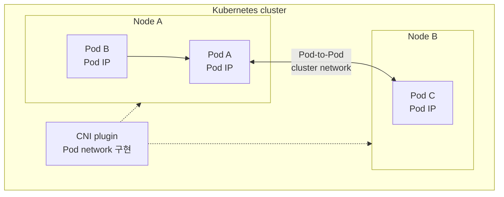
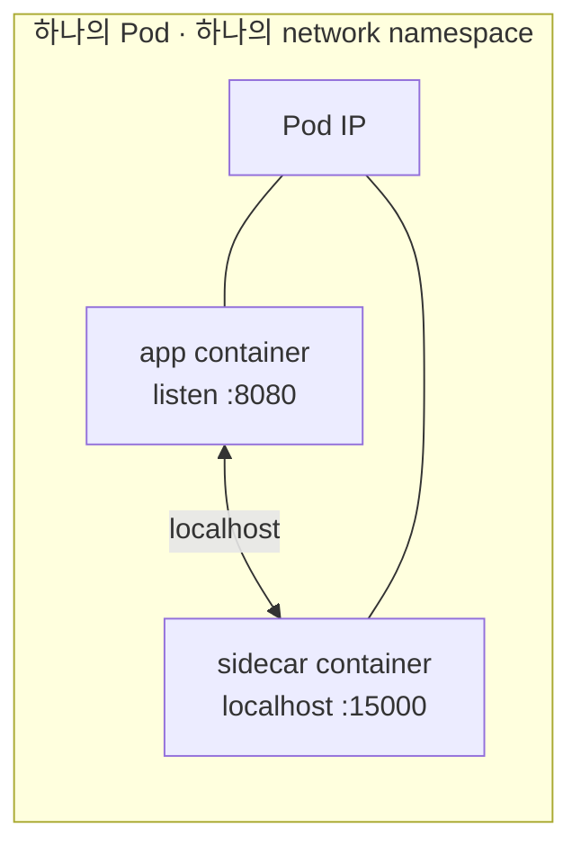
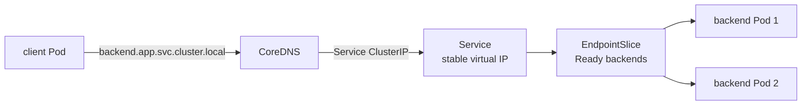
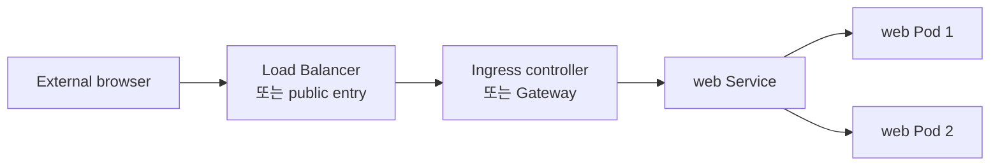

Docker 네트워크를 공부한 뒤 Kubernetes로 넘어가면 Pod IP, Service IP, CoreDNS, CNI, Ingress, Gateway가 한꺼번에 등장한다. 각각을 Docker의 기능과 1:1로 대응하려고 하면 오히려 더 복잡해진다.

Kubernetes 네트워크는 다음 질문으로 나누어 보는 편이 이해하기 쉽다.

1. Pod끼리는 어떤 주소로 통신하는가?
2. Pod가 재생성되어 IP가 바뀌면 어떻게 같은 대상을 찾는가?
3. Service는 무엇을 안정화하는가?
4. 클러스터 외부 요청은 어느 계층에서 받는가?

Docker의 `eth0`, veth, bridge, gateway가 먼저 필요하다면 [Docker bridge 네트워크 글](/blog/docker-kubernetes-networking-bridge-service-cni/)을 먼저 읽는 편이 좋다. 이 글은 Kubernetes의 책임 분리부터 시작한다.

## Kubernetes가 정의하는 네트워크 모델

Kubernetes는 다음과 같은 네트워크 모델을 전제로 한다.

- 모든 Pod는 고유한 클러스터 IP를 가진다.
- 같은 Pod 안의 컨테이너는 network namespace를 공유한다.
- 같은 Pod의 컨테이너는 `localhost`로 서로 통신할 수 있다.
- Pod는 다른 노드의 Pod와도 NAT 없이 통신할 수 있어야 한다.
- 노드의 agent와 Pod도 서로 통신할 수 있어야 한다.

중요한 점은 Kubernetes가 이 모든 네트워크 구현을 직접 제공하지 않는다는 것이다. Kubernetes는 통신 모델을 정의하고, 실제 Pod network를 구성하는 것은 CNI plugin이다.



Docker의 user-defined bridge가 한 호스트 안의 컨테이너 연결을 설명한다면, Kubernetes의 Pod network는 여러 노드에 있는 Pod가 클러스터 단위로 통신할 수 있어야 한다는 약속이다.

RKE2 같은 Kubernetes 배포판에서도 실제 CNI와 service proxy 구성은 설치 방식과 설정에 따라 달라질 수 있다. 따라서 “Kubernetes는 항상 특정 CNI를 사용한다”고 단정하기보다 현재 클러스터를 먼저 확인해야 한다.

```bash
kubectl get pods -A -o wide
kubectl get nodes -o wide
kubectl get pods -A | grep -Ei 'calico|cilium|flannel|canal|weave'
```

`-o wide`는 Pod가 어느 노드에 배치됐고 어떤 Pod IP를 받았는지 확인한다. Pod IP는 재생성 때 바뀔 수 있으므로 애플리케이션이 영구적으로 의존할 주소는 아니다.

## Pod는 네트워크 namespace를 공유한다

Pod는 Kubernetes에서 배포와 네트워크의 기본 단위다. 하나의 Pod 안에 여러 컨테이너를 넣으면 같은 network namespace를 공유한다.



따라서 같은 Pod의 컨테이너끼리는 `localhost`로 통신할 수 있다. 반면 서로 다른 Pod라면 상대 Pod IP 또는 Service 이름을 사용해야 한다.

이 차이를 잘못 이해하면 다음과 같은 문제가 생긴다.

- 별도 Pod의 backend를 같은 `localhost`로 호출함
- 같은 Pod 안에서 두 프로세스가 같은 포트를 사용함
- 재생성될 수 있는 Pod IP를 환경변수에 고정함

Pod 안의 컨테이너가 여러 개인 이유는 항상 애플리케이션을 여러 프로세스로 쪼개기 위해서가 아니다. proxy, log adapter처럼 같은 네트워크와 생명주기를 가져야 하는 보조 프로세스를 함께 배치할 때 사용한다.

## CNI는 Pod network를 구현한다

CNI는 컨테이너 또는 Pod가 네트워크에 연결될 때 필요한 플러그인 인터페이스와 구현을 가리킨다. 구체적인 플러그인은 Pod IP 할당, 인터페이스 연결, 노드 간 경로, 네트워크 정책 등 여러 기능을 제공할 수 있다.

여기서 책임을 분리해야 한다.

| 계층 | 해결하는 문제 | 대표 구성 |
| --- | --- | --- |
| Pod network | Pod IP 사이 연결 | CNI |
| Service | 안정적인 내부 접근 대상 | Service, EndpointSlice |
| Name resolution | Service 이름 해석 | CoreDNS |
| External entry | 외부 host/path 라우팅 | Ingress, Gateway |

CNI가 구성됐다고 Service, DNS, Ingress까지 자동으로 해결되는 것은 아니다. “Pod끼리 연결되지 않는다”와 “Service가 backend를 선택하지 않는다”는 별도 문제일 수 있다.

## Service: 변하는 Pod를 안정적인 이름 뒤에 두기

Pod는 장애나 배포 때 재생성된다. 재생성되면 Pod IP도 바뀔 수 있다. 클라이언트가 Pod IP를 직접 알고 있다면 배포 때마다 설정을 바꿔야 한다.

Service는 이 문제를 해결하는 안정적인 접근 지점이다.



Service는 selector로 Pod를 선택하고, 선택 결과는 EndpointSlice에 반영된다. Service DNS 이름과 ClusterIP는 backend Pod가 교체되는 동안에도 클라이언트가 사용할 안정적인 접근 지점을 제공한다.

```yaml
apiVersion: v1
kind: Service
metadata:
  name: backend
  namespace: app
spec:
  selector:
    app: backend
  ports:
    - name: http
      port: 80
      targetPort: 8080
```

| 필드 | 의미 |
| --- | --- |
| `port` | Service가 제공하는 포트 |
| `targetPort` | 선택된 Pod에서 프로세스가 듣는 포트 |
| `selector` | backend Pod를 선택하는 label 조건 |

Service 이름은 일반적으로 다음처럼 해석된다.

```text
backend.app.svc.cluster.local
```

같은 namespace에서는 `backend`처럼 짧게 쓸 수 있다. CoreDNS가 Service 이름을 ClusterIP로 해석하고, Service proxy 또는 CNI가 구현한 service dataplane이 실제 backend Pod로 트래픽을 전달한다.

### Service와 EndpointSlice 확인

```bash
kubectl -n app get svc backend -o yaml
kubectl -n app get endpointslice -l kubernetes.io/service-name=backend -o yaml
kubectl -n app get pods -l app=backend -o wide
```

확인 순서:

1. Service selector와 Pod label이 일치하는가?
2. EndpointSlice에 Ready endpoint가 있는가?
3. `targetPort`가 실제 프로세스 listen 포트와 일치하는가?
4. readiness probe 실패로 endpoint에서 빠진 Pod는 없는가?

## Pod DNS는 CoreDNS를 통해 Service를 찾는다

Pod 내부의 `/etc/resolv.conf`는 클러스터 DNS Service를 가리키는 경우가 많다.

```bash
kubectl -n app exec deploy/frontend -- cat /etc/resolv.conf
kubectl -n app exec deploy/frontend -- getent hosts backend
```

이미지에 `getent`가 없으면 임시 debug Pod를 사용한다.

```bash
kubectl -n app run net-debug \
  --rm -it --restart=Never \
  --image=busybox:1.36 \
  -- sh
```

debug Pod에서:

```sh
cat /etc/resolv.conf
nslookup backend
wget -qO- http://backend:80
```

이때 단순히 DNS가 되는지만 보지 않는다.

- 어떤 nameserver를 보고 있는가?
- `backend`가 올바른 namespace의 Service로 해석되는가?
- Service에 EndpointSlice가 있는가?
- endpoint Pod가 readiness를 통과했는가?
- NetworkPolicy가 client에서 backend로의 연결을 허용하는가?

## Ingress와 Gateway: 외부 요청의 진입점

Service의 `ClusterIP`는 기본적으로 클러스터 내부 접근을 위한 구성이다. 외부 브라우저가 `https://example.com`으로 들어오려면 외부 진입 계층이 필요하다.



Ingress API는 외부 HTTP/HTTPS 요청을 클러스터 내부 Service로 라우팅하는 규칙을 표현한다. 실제 처리는 ingress controller가 담당한다. 구현에 따라 TLS 종료, host/path routing, load balancing이 수행된다.

Kubernetes 공식 문서의 Ingress 그림도 같은 경계를 보여 준다.

<figure style="margin: 2rem 0; text-align: center;">
  <a href="https://kubernetes.io/docs/concepts/services-networking/ingress/" target="_blank" rel="noreferrer">
    
  </a>
  <figcaption style="margin-top: 0.5rem; text-align: center; font-size: 0.78rem; color: #64748b; line-height: 1.5;">출처: <a href="https://kubernetes.io/docs/concepts/services-networking/ingress/" target="_blank" rel="noreferrer">Kubernetes Documentation - Ingress</a> · CC BY 4.0</figcaption>
</figure>

역할은 다음처럼 나뉜다.

```text
외부 browser
  → public entry 또는 Cloudflare Tunnel
  → Ingress/Gateway
  → Kubernetes Service
  → EndpointSlice
  → Ready Pod
  → application process
```

Cloudflare Tunnel을 사용하는 경우 `cloudflared`가 외부 edge와 outbound 연결을 만들고 private network 안의 entry로 전달할 수 있다. 이것은 CNI가 Pod 사이를 연결하는 책임과 다른 외부 진입 경로다.

## Kubernetes에서 포트 이름이 여러 개인 이유

```yaml
apiVersion: v1
kind: Service
metadata:
  name: web
spec:
  type: ClusterIP
  selector:
    app: web
  ports:
    - name: http
      port: 80
      targetPort: 8080
```

이 설정은 Pod의 8080 포트 프로세스를 Service의 80 포트 뒤에 둔다는 뜻이다.

```text
client Pod
  → web:80
  → Service ClusterIP:80
  → selected Pod IP:8080
```

`containerPort`는 컨테이너가 사용하는 포트를 문서화하는 필드다. 프로세스를 자동으로 bind하거나 방화벽 규칙을 만드는 옵션은 아니다. 실제 통신은 프로세스 listen 상태, Service의 `targetPort`, NetworkPolicy를 함께 확인해야 한다.

## 외부 요청 장애를 나누어 확인하기

```bash
kubectl get ingressclass
kubectl get ingress -A
kubectl get svc -A
kubectl get endpointslice -A
kubectl get networkpolicy -A
```

특정 애플리케이션이라면 범위를 줄인다.

```bash
kubectl -n app describe ingress web
kubectl -n app get svc web -o yaml
kubectl -n app get endpointslice -l kubernetes.io/service-name=web -o yaml
kubectl -n app get pods -l app=web -o wide
```

외부 요청이 실패하면 아래 구간을 분리한다.

```text
DNS
  → public entry / tunnel
  → ingress controller 또는 gateway
  → Service
  → EndpointSlice
  → Pod IP:targetPort
  → application process
```

Ingress access log가 성공했다고 애플리케이션 정상 응답이 보장되는 것은 아니다. 반대로 Pod log가 있어도 Service endpoint에서 빠져 있으면 외부 사용자는 응답을 받지 못할 수 있다.

## 자주 생기는 오해

### Pod IP를 고정해서 사용하면 되나?

대부분의 경우 아니다. Pod는 재생성되고 IP가 바뀔 수 있다. 안정적인 내부 접근 대상은 Service 이름과 ClusterIP다.

### Service가 생기면 외부에서 바로 접근할 수 있나?

아니다. `ClusterIP`는 기본적으로 클러스터 내부 접근용이다. 외부 공개에는 NodePort, LoadBalancer, Ingress, Gateway 또는 별도 tunnel/edge 구성이 필요하다.

### CNI가 모든 네트워크 문제를 해결하나?

아니다. CNI는 Pod network의 연결과 주소 할당을 담당한다. Service routing, DNS, NetworkPolicy, Ingress/TLS, 애플리케이션 listen 상태는 별도 계층이다.

### Ingress가 곧 Load Balancer인가?

Ingress는 HTTP/HTTPS routing 규칙을 표현하는 Kubernetes API 계층이다. 실제 controller 앞에 cloud load balancer가 있을 수도 있고 NodePort나 host network를 사용할 수도 있다.

## 정리

```text
Pod
  → 네트워크 namespace와 실행 단위

CNI
  → Pod network 구현

Service + CoreDNS
  → 변하는 Pod를 안정적인 이름과 가상 IP 뒤에 둠

Ingress/Gateway
  → 외부 host/path 요청을 Service로 분기
```

Kubernetes 네트워크를 이해할 때 중요한 것은 Docker bridge를 더 큰 단어로 바꾸는 것이 아니다. **Pod network, Service, DNS, 외부 진입점이 서로 다른 책임을 가진다는 것**이다.

실제 장애를 확인할 때도 다음 순서를 적용할 수 있다.

1. 애플리케이션이 어느 Pod에서 어느 port에 listen하는가?
2. Pod IP와 CNI network가 정상인가?
3. Service selector와 EndpointSlice가 정상인가?
4. Pod DNS가 올바른 Service IP를 반환하는가?
5. readiness와 NetworkPolicy가 요청을 막고 있지 않은가?
6. Ingress, Gateway, tunnel, TLS 구간에서 요청이 끊기지 않았는가?

## 참고 자료

- [Kubernetes Documentation - Services, Load Balancing, and Networking](https://kubernetes.io/docs/concepts/services-networking/)
- [Kubernetes Documentation - Service](https://kubernetes.io/docs/concepts/services-networking/service/)
- [Kubernetes Documentation - Network Plugins](https://kubernetes.io/docs/concepts/extend-kubernetes/compute-storage-net/network-plugins/)
- [Kubernetes Documentation - Ingress](https://kubernetes.io/docs/concepts/services-networking/ingress/)
- [Kubernetes Documentation - DNS for Services and Pods](https://kubernetes.io/docs/concepts/services-networking/dns-pod-service/)

이 글의 Mermaid 그림은 Kubernetes 공식 문서의 네트워크 모델과 용어를 바탕으로 학습 목적에 맞게 단순화해 재구성했다. Ingress 그림은 공식 문서 원본을 외부 참조했으며 그림 아래 출처를 표시했다.
