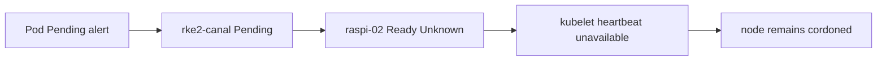
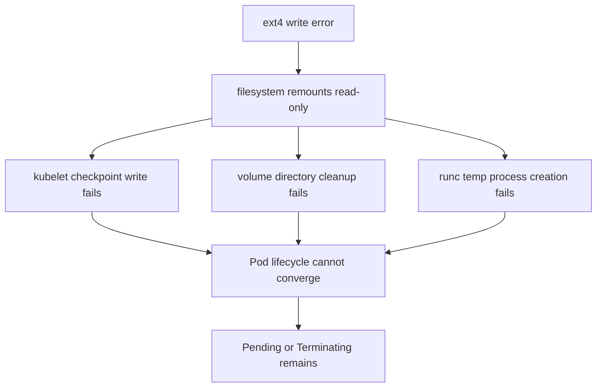
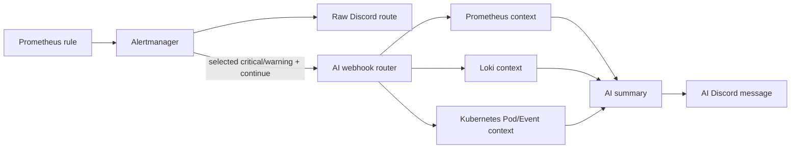

## 결론부터

이번 장애는 `rke2-canal` Pod의 설정 문제가 아니라, 해당 Pod가 배치된 `raspi-02` 노드의 파일시스템 문제였다.

`HomeKubernetesPodPendingTooLong` 알림으로 시작했지만, 확인 결과 노드는 `Ready=Unknown`과 `unreachable` taint 상태였다. kubelet이 control plane에 상태를 보고하지 못했고, root filesystem이 read-only로 동작하면서 Pod 생성·종료에 필요한 파일 쓰기도 실패하고 있었다.

initramfs에서 `fsck.ext4`를 실행해 현재 파일시스템 오류는 복구했다. 그러나 ext4 journal 관련 이상과 SD 카드 기반 root filesystem이라는 재발 위험이 남아 있어, 노드를 다시 workload에 편입하지 않고 SD 카드 교체를 선택했다.

| 구분 | 확인한 결과 |
| --- | --- |
| 시작 증상 | `kube-system/rke2-canal`이 10분 이상 `Pending` |
| 직접 원인 | `raspi-02`의 kubelet이 read-only filesystem에 상태를 기록하지 못함 |
| 복구 조치 | initramfs에서 `/dev/mmcblk0p2`를 offline `fsck.ext4`로 검사·수정 |
| 최종 판단 | 파일시스템은 일시 복구됐지만 SD 카드는 교체하기로 결정 |

## 알림은 Pod에서 왔지만, 원인은 Pod가 아니었다

처음 받은 알림은 다음과 같았다.

```text
[firing] HomeKubernetesPodPendingTooLong
Pod kube-system/rke2-canal-<suffix> has stayed Pending for more than 10 minutes.
severity=warning service=kubernetes namespace=kube-system
```

처음에는 CNI Pod 자체의 이미지, 리소스, 스케줄링 조건을 먼저 확인하려 했다. 하지만 이 알림만 보고 곧바로 `rke2-canal`을 고치는 것은 위험했다. CNI는 노드의 네트워크 경로를 담당하므로, Pod가 올라오지 않은 이유가 해당 Pod의 문제인지 노드 자체의 문제인지 먼저 나눠야 했다.

이번 장애에서 중요한 질문은 다음이었다.

> Pending 상태인 Pod를 고치는 것인가, 아니면 그 Pod를 실행해야 할 노드가 이미 쓰기 불가능한 상태인지 확인하는 것인가?

## 1. 알림을 받은 뒤, Pod 문제와 노드 문제를 분리했다

```bash
kubectl -n kube-system get pod rke2-canal-<suffix> -o wide
kubectl -n kube-system describe pod rke2-canal-<suffix>
```

여기서 볼 항목은 `NODE`, `Status`, `Events`다.

- `NODE`: 문제가 특정 노드에 묶여 있는지
- `Status`: `Pending`, `Terminating`, `ContainerCreating` 중 어느 단계인지
- `Events`: 스케줄러가 거부한 이유, volume mount 실패, CNI 준비 실패, 이미지 pull 실패

RKE2에서 Canal은 기본 CNI이며, 노드 간 트래픽에는 Flannel, 노드 내부 네트워크와 정책에는 Calico가 사용된다. 따라서 `rke2-canal`이 Pending이면 단순 애플리케이션 Pod 하나가 아니라 해당 노드의 네트워크 준비 자체가 영향을 받을 수 있다. 이번 경우에는 `rke2-canal`이 노드에 배치된 뒤에도 초기화와 네트워크 준비가 끝나지 않았는지를 확인하는 것이 먼저였다. [RKE2 Network Options](https://docs.rke2.io/networking/basic_network_options)

## 2. 노드 상태에서 첫 번째 원인을 확인했다

```bash
kubectl get node raspi-02
kubectl get node raspi-02 -o wide
kubectl describe node raspi-02
```

확인 결과는 다음과 비슷했다.

```text
Ready,SchedulingDisabled
```

조건을 더 자세히 보면 다음과 같았다.

```text
NetworkUnavailable  False    FlannelIsUp
MemoryPressure      Unknown  NodeStatusUnknown  Kubelet stopped posting node status.
DiskPressure        Unknown  NodeStatusUnknown  Kubelet stopped posting node status.
PIDPressure         Unknown  NodeStatusUnknown  Kubelet stopped posting node status.
Ready               Unknown  NodeStatusUnknown  Kubelet stopped posting node status.
```

taint도 함께 남아 있었다.

```text
node.kubernetes.io/unschedulable  NoSchedule
node.kubernetes.io/unreachable    NoSchedule
node.kubernetes.io/unreachable    NoExecute
```

여기서 `SchedulingDisabled`는 새 Pod를 배치하지 않겠다는 의미다. 보통 `cordon` 또는 `drain`의 결과로 생긴다. 기존 Pod를 자동으로 제거한다는 뜻은 아니며, DaemonSet은 노드 단위 기능을 제공하므로 drain에서도 별도로 남을 수 있다. Kubernetes 문서도 unschedulable 노드는 새 Pod 배치를 막지만 이미 실행 중인 Pod에는 직접 영향을 주지 않는다고 설명한다. [Kubernetes Nodes](https://kubernetes.io/docs/concepts/architecture/nodes/)

이번 상태는 단순히 “스케줄링이 꺼져 있다”가 아니었다. `Ready=Unknown`과 `unreachable` taint가 함께 있었기 때문에, control plane이 kubelet의 상태 보고를 받지 못하고 있는 상태로 판단했다. 따라서 `rke2-canal`의 YAML부터 수정하기보다 `raspi-02`에서 kubelet과 container runtime이 살아 있는지 확인하는 방향으로 조사 범위를 옮겼다.



## 3. drain은 시작됐지만, Pod 정리 단계에서 멈췄다

문제를 정리하기 위해 다음 명령을 실행했다.

```bash
kubectl drain raspi-02 \
  --ignore-daemonsets \
  --delete-emptydir-data \
  --timeout=10m
```

출력에는 다음과 같은 내용이 반복됐다.

```text
Warning: ignoring DaemonSet-managed Pods: ...
evicting pod ...
Waited for ... due to client-side throttling, not priority and fairness
```

`drain`은 단순히 Pod를 삭제하는 명령이 아니다. 노드를 새 배치에서 제외하고, 일반 Pod를 다른 노드로 이동시킨 뒤, 종료가 완료됐는지까지 기다리는 명령이다.

이 명령은 다음을 한 번에 수행한다.

1. 새 Pod가 해당 노드에 배치되지 않도록 cordon한다.
2. 일반 workload Pod에 eviction을 요청한다.
3. DaemonSet Pod는 `--ignore-daemonsets`로 건너뛴다.
4. `emptyDir` 데이터 삭제를 허용한다.
5. 각 Pod가 실제로 종료되는지 기다린다.

여기서 `evicting pod`는 삭제가 끝났다는 뜻이 아니라, eviction 요청을 보냈다는 뜻이다. `already cordoned`도 drain 전체가 끝났다는 의미가 아니라, 새 Pod 배치를 막는 첫 단계가 이미 수행됐다는 의미다.

노드의 kubelet이 정상적으로 파일과 컨테이너 상태를 정리하지 못하면 Pod가 `Terminating`에 오래 남을 수 있다. 여기에 drain 클라이언트가 짧은 시간에 여러 eviction/status 요청을 보내면서 client-side throttling도 발생했다. throttling 자체가 장애 원인은 아니고, 이미 정리가 지연되는 동안 확인 요청도 제한된 결과다.

이번 drain의 직접적인 정체 지점은 `emptyDir` 데이터 자체가 아니라, kubelet과 runtime이 Pod 상태·volume 디렉터리·임시 파일을 정리하지 못한 것이었다. 그 원인을 확인하기 위해 kubelet 로그와 root filesystem 상태를 확인했다.

## 4. rke2-agent는 시작됐지만, kubelet의 파일 쓰기가 실패했다

처음 `rke2-agent` 로그에는 containerd가 아직 뜨지 않았다는 메시지가 있었다.

```text
Waiting for containerd startup:
... /run/k3s/containerd/containerd.sock: no such file or directory
```

몇 초 뒤에는 다음이 이어졌다.

```text
containerd is now running
Running kubelet ... --containerd=/run/k3s/containerd/containerd.sock
rke2 agent is up and running
```

따라서 이 로그만 보면 단순한 “kubelet이 실행되지 않았다”로 결론 내리면 안 된다. 시작 시점에는 containerd socket이 준비되지 않았지만, 이후 rke2가 containerd와 kubelet을 기동한 기록이 있었다. 문제는 그 뒤 kubelet이 노드의 파일시스템에 상태를 계속 기록할 수 있었는지였다.

### 결정적 증거: read-only filesystem

실제 kubelet 로그에서 더 결정적인 메시지는 다음이었다.

```text
checkpoint ... read-only file system
orphaned pod ... error occurred when trying to remove the volumes dir: read-only file system
OCI runtime exec failed ... open /tmp/runc-process...: read-only file system
```

이 네 메시지는 같은 원인을 가리킨다. kubelet은 checkpoint와 volume 디렉터리를 쓰지 못했고, runc는 exec용 임시 파일을 만들지 못했다. 즉, Pod spec에 PVC를 선언했는지와 별개로 Pod lifecycle 자체가 파일시스템에 막힌 상태였다.

kubelet과 runc는 Pod를 실행·삭제하면서 `/var/lib/kubelet`, `/run`, `/tmp`, Pod volume 디렉터리, checkpoint 파일 등에 기록해야 한다. root filesystem이 read-only가 되면 일반 Pod의 volume mount, 종료 정리, runtime exec가 모두 실패할 수 있다.



## 5. PVC가 없어도 Pod는 노드 디스크를 사용한다

이번 `platform-ops-log` Pod는 별도 PVC를 사용하는 상황이 아니었다. 그래도 Pod 생성에는 노드의 로컬 파일시스템이 필요하다.

Kubernetes에서 volume은 넓은 개념이다.

- `PersistentVolumeClaim`: 애플리케이션 데이터를 보존하기 위한 영속 볼륨 요청
- `emptyDir`: Pod 수명 동안 사용하는 임시 디렉터리
- `configMap`, `secret`: 파일로 주입되는 설정
- `projected`, service account: Pod에 자동 주입되는 정보
- kubelet 관리 디렉터리: mount, checkpoint, plugin, 로그, runtime 상태

따라서 “PVC가 없으니 디스크와 무관하다”는 판단은 맞지 않았다. PVC는 애플리케이션 데이터를 보존하는 저장소이고, 이번 문제는 그보다 아래 계층인 노드의 root filesystem에서 발생했다. 애플리케이션 데이터가 아니라도 kubelet과 container runtime이 Pod lifecycle을 처리할 공간이 필요하다.

## 6. root filesystem이 실제로 read-only였는지 확인했다

노드에 접속해 주요 경로가 어떤 파일시스템에 올라가 있는지 확인했다.

```bash
for path in / /var/lib/kubelet /var/log/pods /tmp
do
  echo "=== $path"
  findmnt -T "$path" -no TARGET,SOURCE,FSTYPE,OPTIONS
done
```

확인 결과는 모두 같은 root filesystem이었다.

```text
/      /dev/mmcblk0p2 ext4 rw,relatime,discard,errors=remount-ro
/      /dev/mmcblk0p2 ext4 rw,relatime,discard,errors=remount-ro
/      /dev/mmcblk0p2 ext4 rw,relatime,discard,errors=remount-ro
/      /dev/mmcblk0p2 ext4 rw,relatime,discard,errors=remount-ro
```

`errors=remount-ro`는 ext4 오류가 감지될 때 파일시스템을 보호하기 위해 read-only로 다시 mount하도록 하는 정책이다. 오류를 고치는 옵션이 아니라, 추가 쓰기로 손상이 커지는 것을 줄이는 보호 동작이다. 이번에는 실제 kubelet 로그에도 `read-only file system`이 찍혔으므로, 단순히 mount 옵션에 `errors=remount-ro`가 적혀 있다는 수준을 넘어 쓰기 실패가 실제 장애로 이어졌다고 판단할 수 있었다.

`tune2fs`로 파일시스템 메타데이터도 확인했다.

```text
Filesystem features: ... metadata_csum
Filesystem state:    not clean
Errors behavior:     Continue
```

특히 `has_journal` feature가 보이지 않았고, 커널 로그에는 다음이 남았다.

```text
EXT4-fs (mmcblk0p2): mounted filesystem without journal
Journal file ... corrupted, ignoring file.
```

여기서 두 종류의 journal을 구분해야 한다.

- **ext4 journal**: 파일시스템 메타데이터와 쓰기 순서를 복구하기 위한 디스크 구조
- **systemd journal**: systemd 서비스·커널 로그를 저장하는 로그 파일 형식

systemd journal 파일 하나가 깨졌다는 메시지와 ext4 journal이 없거나 손상된 상태는 서로 다른 층의 문제다. 하지만 root filesystem 자체에 문제가 있으면 두 종류 모두 영향을 받을 수 있다. ext4 journal은 비정상 종료 뒤 마지막 commit까지 replay해 파일시스템 일관성을 회복하는 역할을 한다. [Linux ext4 journal documentation](https://www.kernel.org/doc/html/latest/filesystems/ext4/journal.html)

## 7. initramfs에서 파일시스템을 offline 복구했다

정상 부팅된 상태에서 root filesystem을 검사하거나 복구하면 실행 중인 시스템과 충돌할 수 있다. 그래서 initramfs/recovery 환경에서 root 파티션을 offline 상태로 두고 검사했다.

```bash
fsck.ext4 -f /dev/mmcblk0p2
```

검사 중 다음과 같은 orphan linked list 오류를 확인했고, 수정 여부에 `y`로 답했다.

```text
Inodes that were part of a corrupted orphan linked list found.
FILE SYSTEM WAS MODIFIED
```

이후 같은 검사를 다시 실행했을 때 다시 `FILE SYSTEM WAS MODIFIED`가 나오지 않고 pass 단계와 파일 수·블록 수 요약만 나왔다. 이는 해당 실행에서 fsck가 추가로 수정할 항목을 찾지 못했다는 의미로 해석할 수 있다.

### 복구 결과와 한계

이 조치로 파일시스템 구조는 다시 검사 가능한 상태가 됐고, 정상 부팅과 SSH 접속도 확인했다. 하지만 이것은 “이번에 발견된 구조 오류를 수정했다”는 의미이지, SD 카드가 앞으로도 안정적이라는 보증은 아니다.

다만 fsck 성공이 저장장치의 건강을 보장하지는 않는다. 파일시스템 구조를 지금 읽을 수 있게 만든 것과, 앞으로 같은 저장장치가 안정적으로 쓰기를 처리할 수 있는지는 다른 문제다.

initramfs에서 `mount | grep mmcblk0p2`와 `command -v tune2fs`가 아무것도 출력하지 않은 것도 이상하지 않았다.

- root 파티션이 아직 mount되지 않았다면 첫 명령은 출력이 없다.
- initramfs는 일반 Ubuntu userspace가 아니므로 `tune2fs`가 없을 수 있다.
- journal 재생성이나 상세 메타데이터 변경은 별도의 복구 환경에서 수행해야 한다.

## 8. kubelet을 수동으로 실행하지 않은 이유

RKE2에서는 kubelet을 사람이 별도 터미널에서 직접 실행하는 방식으로 운영하지 않는다. `rke2-agent`가 containerd와 kubelet의 실행 인자·인증서·kubeconfig를 관리한다.

따라서 복구 순서는 다음이어야 한다.

```bash
sudo systemctl status rke2-agent
sudo systemctl restart rke2-agent
journalctl -u rke2-agent -b --no-pager
kubectl get node raspi-02
```

이번에는 `systemctl restart rke2-agent` 자체가 실패하기도 했고, kubelet 로그에는 read-only filesystem 오류가 남아 있었다. 이 상태에서 kubelet만 수동으로 실행하면 원인인 저장장치 문제를 가린 채 runtime을 더 복잡하게 만들 수 있다.

## 9. 복구 후에도 SD 카드를 교체하기로 한 이유

fsck로 한 번 부팅을 복구하는 것과, 해당 노드를 다시 workload에 편입하는 것은 별도 판단이다.

이번 판단 근거는 다음과 같았다.

1. root filesystem이 `/dev/mmcblk0p2`라는 SD 카드 파티션이었다.
2. kubelet checkpoint, volume cleanup, runc temp process 쓰기가 모두 실패했다.
3. ext4가 journal 없이 mount됐다는 커널 로그가 있었다.
4. systemd journal 파일도 corruption으로 무시됐다.
5. 파일시스템 상태가 `not clean`이었다.
6. fsck는 구조를 수정했지만 저장장치 자체의 재발 가능성은 제거하지 못했다.
7. 해당 노드에 중요한 PersistentVolume이 남아 있지 않은 것을 확인했다.

따라서 정확한 하드웨어 고장 원인을 단정한 것은 아니지만, 이 SD 카드를 다시 클러스터 workload의 기반으로 사용하는 것은 위험하다고 판단했다. `fsck` 결과만 보고 곧바로 `uncordon`하지 않고, 우선 노드는 cordon 상태로 유지한 채 SD 카드를 새 제품으로 교체하기로 했다. 가능하다면 고내구성 SD 카드보다 USB SSD를 RKE2 root disk로 사용하는 방향도 다음 선택지로 검토한다.

## 10. 교체 후 다시 클러스터에 넣는 기준

새 저장장치에 OS와 RKE2 agent를 다시 구성한 뒤에는 다음을 순서대로 확인할 계획이다.

```bash
# 1. ext4 journal 및 mount 상태
sudo tune2fs -l /dev/mmcblk0p2 | grep -E 'Filesystem features|Filesystem state|Errors behavior'
findmnt -T / -no TARGET,SOURCE,FSTYPE,OPTIONS

# 2. 서비스 상태
sudo systemctl is-active rke2-agent
sudo systemctl is-active containerd

# 3. 노드 상태
kubectl get node raspi-02 -o wide
kubectl describe node raspi-02

# 4. 노드 로컬 DaemonSet
kubectl get pods -A -o wide --field-selector spec.nodeName=raspi-02

# 5. workload 재배치와 CNI
kubectl -n kube-system get pod -o wide
kubectl get events -A --sort-by=.lastTimestamp | tail -30
```

`uncordon`은 문제를 고치는 명령이 아니라 새 Pod 배치를 다시 허용하는 명령이다. 따라서 정상 판단은 `Ready=True` 하나로 끝내지 않는다.

- `Ready=True`
- `MemoryPressure=False`, `DiskPressure=False`, `PIDPressure=False`
- `node.kubernetes.io/unreachable` taint 제거
- rke2-agent와 containerd가 active
- `rke2-canal`과 node-local DaemonSet 정상
- kubelet 로그에 read-only filesystem 재발 없음
- 실제 workload가 새로 배치되고 종료·재생성까지 정상

이 조건을 확인한 뒤에만 다음 명령으로 새 Pod 배치를 다시 허용한다.

```bash
kubectl uncordon raspi-02
kubectl get node raspi-02
```

`uncordon` 이후에도 `rke2-canal`과 workload가 실제로 해당 노드에 배치되고, kubelet 로그에 read-only 오류가 다시 나타나지 않는지 확인해야 복구가 끝난다.

## Alertmanager와 AI 흐름에서 남은 과제

이번 알림은 `rke2-canal`이 Pending이라는 증상을 알려줬다. 하지만 원인을 좁히려면 Pod만이 아니라 **Pod → Node → kubelet → containerd → filesystem** 문맥이 필요했다.

Alertmanager의 역할은 Prometheus가 평가한 alert를 진단하는 것이 아니라, label 기준으로 묶고(route/group), 어디로 보낼지 결정하고(receiver), 중복·일시적 알림을 억제하는 것이다. `group_wait`, `group_interval`, `repeat_interval`, inhibition, silence, `send_resolved`가 핵심 기능이다. [Alertmanager configuration](https://prometheus.io/docs/alerting/latest/configuration/)과 [notification templates](https://prometheus.io/docs/alerting/latest/notifications/)에서 이 흐름과 webhook payload를 확인할 수 있다.

현재 보강안은 다음처럼 두 경로를 분리한다.



원문 경로는 AI가 실패해도 살아 있어야 한다. AI 경로는 모든 warning을 보내지 않고, `ImagePullBackOff`, OOM, Pod Pending처럼 Pod·Event 문맥이 필요한 알림만 선택한다. 그리고 AI가 severity를 새로 판정하게 하지 않는다. Prometheus rule이 severity를 결정하고, AI는 관측된 증거와 가능한 원인, 다음 확인 명령을 요약하는 보조 역할로 제한한다.

이번에 로컬에서 보강한 내용은 다음이다.

- Kubernetes AI 대상에 `critical`뿐 아니라 선택된 `warning`을 포함
- `pod`, `node` label을 webhook context에 전달
- Prometheus에서 Pod phase, waiting reason, restart 수집
- Loki에서 대상 namespace·Pod의 `error`, `timeout`, `read-only` 등 로그 수집
- Kubernetes API에서 대상 Pod와 관련 Event 수집
- AI 호출 실패 이유를 `missing key`, HTTP 오류, timeout, empty response로 구분
- raw Discord route는 AI route와 독립적으로 유지

다만 이 변경은 현재 소스와 GitOps manifest에만 반영된 상태다. 새 `alert-ai-router` 이미지를 빌드하고 digest를 갱신해 Argo CD로 배포하기 전까지 실제 클러스터에는 적용되지 않는다.

## 정리

이번 장애에서 배운 기준은 간단했다.

> Pod Pending은 배포 실패의 이름이지, 원인의 이름이 아니다.

먼저 Pod가 어느 노드에 있었는지 확인하고, 노드 상태와 kubelet heartbeat를 본다. 그다음 containerd socket과 kubelet 로그에서 실제 실행·정리 작업이 실패했는지 확인한다. 마지막으로 `/var/lib/kubelet`과 `/tmp`를 포함한 root filesystem의 쓰기 가능 여부와 ext4 journal 상태를 확인한다.

fsck는 파일시스템을 복구하는 수단이었고, 저장장치를 신뢰할 수 있다는 증명은 아니었다. 이번에는 중요한 PV가 해당 노드에 없었고, ext4 journal/read-only 오류가 반복될 위험이 남아 있었기 때문에 SD 카드 교체를 선택했다.

알림 설계도 같은 기준을 가져야 한다. 원문 알림은 항상 남기고, AI는 Pod·Node·Event·로그·메트릭을 모아 사람이 다음 확인을 시작할 수 있는 형태로 정리한다. 자동화의 목표는 사람이 장애를 보지 않게 만드는 것이 아니라, 같은 증상을 다시 만났을 때 더 짧은 경로로 원인을 좁히게 만드는 것이다.

## 참고 자료

- [Prometheus Alertmanager configuration](https://prometheus.io/docs/alerting/latest/configuration/)
- [Prometheus Alertmanager notification templates](https://prometheus.io/docs/alerting/latest/notifications/)
- [Kubernetes Nodes](https://kubernetes.io/docs/concepts/architecture/nodes/)
- [RKE2 Network Options](https://docs.rke2.io/networking/basic_network_options)
- [Linux kernel ext4 journal documentation](https://www.kernel.org/doc/html/latest/filesystems/ext4/journal.html)
- [Linux kernel ext4 general information](https://cdn.kernel.org/doc/html/latest/admin-guide/ext4.html)
