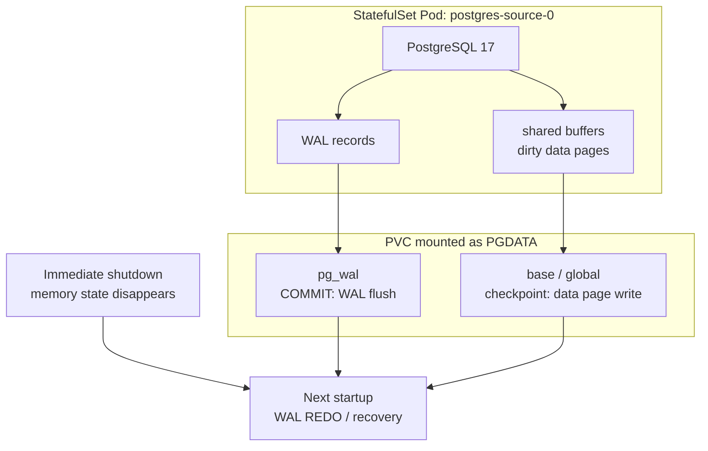

PostgreSQL을 Kubernetes에 올리면 처음에는 “PVC를 붙였으니 Pod가 다시 떠도 데이터가 남는다” 정도로 이해하기 쉽다. 하지만 그 문장만으로는 중요한 질문이 빠진다. **커밋된 데이터는 PVC 안에서 어떤 순서로 남고, PostgreSQL이 비정상 종료되면 무엇을 기준으로 다시 일관된 상태를 만드는가?**

이번에는 PostgreSQL 17 StatefulSet에 붙은 `local-path` PVC를 대상으로, `PGDATA`의 실제 구성과 WAL flush, Pod 재생성, immediate shutdown 뒤 recovery 로그를 순서대로 확인했다. 출발점은 논리 백업 복원이 아니었다. `pg_dump`를 복원하면 데이터 구조가 같아지는 것은 당연하다. 내가 확인하고 싶었던 것은 **PostgreSQL이 실행 중에 만드는 물리적 상태가 Pod 생명주기와 어떻게 분리되는가**였다.

> 검증 범위: 개인 RKE2 클러스터의 disposable PostgreSQL 17 lab이다. 단일 노드 `local-path` PVC에서 Pod/container 재시작과 PostgreSQL crash recovery를 확인했다. 노드 전원 손실, 디스크 장애, 고가용성 failover, 외부 백업, PITR은 검증하지 않았다.



PVC는 Pod 재생성 뒤 `PGDATA`를 다시 붙이는 저장 경계이고, PostgreSQL의 crash consistency는 WAL과 startup recovery가 담당한다.

## 질문은 세 갈래로 나뉘었다

처음에는 “PVC에 DB를 넣으면 어떤 일이 일어나는가?”라는 질문 하나였지만, 실제로는 다음 세 가지를 구분해야 했다.

1. Pod가 교체되면 `PGDATA` 디렉터리는 남는가?
2. `COMMIT` 직후 table data page가 아직 checkpoint되지 않았다면, 커밋 데이터는 어디에 있는가?
3. PostgreSQL을 정상 종료하지 않고 멈춘 뒤에도, 다시 시작할 때 어떤 과정을 거쳐 데이터를 읽을 수 있는가?

이 셋은 같은 문제가 아니다. StatefulSet과 PVC는 첫 번째를, WAL과 `fsync`·`synchronous_commit`은 두 번째를, PostgreSQL startup recovery는 세 번째를 설명한다.

## PVC는 PostgreSQL에 특별한 저장소가 아니다

Pod 내부에서 PostgreSQL은 `/var/lib/postgresql/data`를 일반 파일 시스템처럼 본다. 이 경로가 `PGDATA`이고, 실제 database cluster 파일이 들어 있다.

```bash
kubectl -n postgres-recovery-lab exec postgres-source-0 -- \
  psql -U lab_admin -d recovery_lab -c 'SHOW data_directory;'

kubectl -n postgres-recovery-lab exec postgres-source-0 -- \
  sh -c 'ls -1 "$PGDATA" | sort'
```

여기에는 table과 index 파일이 있는 `base`, cluster 공통 메타데이터가 있는 `global`, WAL segment가 있는 `pg_wal` 등이 함께 있다. 컨테이너 root filesystem에만 파일을 썼다면 재생성 시 사라질 수 있지만, 이 lab에서는 StatefulSet의 `volumeClaimTemplates`가 만든 PVC를 `PGDATA`에 mount했다.

Kubernetes StatefulSet은 ordinal별 PVC를 유지해 Pod가 다시 생성돼도 같은 storage identity를 다시 mount하는 데 적합하다. 따라서 `postgres-source-0`의 Pod가 바뀌어도 `data-postgres-source-0` PVC가 남아 있으면 `PGDATA`가 이어진다. [Kubernetes StatefulSet 문서](https://kubernetes.io/docs/concepts/workloads/controllers/statefulset/)도 volume claim template이 Pod별 stable storage를 제공한다고 설명한다.

다만 PVC라는 이름만으로 내구성이 정해지지는 않는다. 이 lab의 `local-path` storage는 선택된 node의 로컬 파일 시스템을 사용한다. Pod/container 재시작에는 유효하지만, 해당 node나 로컬 디스크를 잃었을 때 다른 node가 같은 데이터를 자동으로 제공하는 구조는 아니다. Kubernetes도 local volume은 underlying node 가용성에 영향을 받으므로 모든 workload에 적합하지 않다고 명시한다. [Kubernetes Volumes 문서](https://kubernetes.io/docs/concepts/storage/volumes/)

`WaitForFirstConsumer`는 PostgreSQL write 동작과는 관계가 없다. Pod가 먼저 어느 node에서 실행될지 결정한 뒤, 그 node에 맞춰 volume binding/provisioning을 늦추는 scheduler·storage 설정이다. [Kubernetes StorageClass 문서](https://kubernetes.io/docs/concepts/storage/storage-classes/)

## COMMIT은 table file을 즉시 쓰라는 뜻이 아니다

PostgreSQL은 변경 내용을 먼저 WAL에 기록하고, WAL record가 durable storage에 flush된 뒤에야 table/index data page를 디스크에 쓸 수 있다. 이 순서가 Write-Ahead Logging이다. 덕분에 매 transaction마다 모든 table page를 flush하지 않아도, crash 뒤 WAL을 replay해 변경을 다시 적용할 수 있다. [PostgreSQL WAL 문서](https://www.postgresql.org/docs/17/wal-intro.html)

이번 lab에서 먼저 설정을 확인했다.

```sql
SHOW fsync;
SHOW synchronous_commit;
SHOW full_page_writes;
SHOW wal_level;
```

`fsync=on`, `synchronous_commit=on`인 기본적인 local durability 설정에서, `COMMIT` 성공은 local WAL flush가 완료된 뒤 반환된다. `synchronous_commit=on`의 local 동작은 WAL을 local disk에 flush할 때까지 기다리는 것이며, `fsync=on`은 system/hardware crash 뒤 consistent recovery를 가능하게 하도록 `fsync()` 계열 호출을 사용한다. [PostgreSQL WAL settings](https://www.postgresql.org/docs/17/runtime-config-wal.html)

아래처럼 marker row를 커밋하고 write/flush LSN을 확인했다.

```sql
BEGIN;

INSERT INTO pvc_commit_probe (probe_id, committed_at, note)
VALUES ('pod-recreate-check', clock_timestamp(), 'committed row')
ON CONFLICT (probe_id)
DO UPDATE SET committed_at = EXCLUDED.committed_at;

COMMIT;

SELECT pg_current_wal_lsn() AS current_write_lsn,
       pg_current_wal_flush_lsn() AS current_flush_lsn;
```

관찰 시점의 결과는 아래와 같았다.

```text
current_write_lsn | current_flush_lsn
------------------+------------------
0/1972470         | 0/1972470
```

두 LSN이 같다는 것은 **그 시점까지 생성된 WAL이 local flush 위치까지 도달했다**는 뜻이다. 이 값 하나가 storage hardware의 모든 durability를 증명하는 것은 아니다. 또 write LSN과 flush LSN이 항상 같아야만 정상이라는 뜻도 아니다. 여기서는 `COMMIT` 직후 관찰한 local WAL 처리 상태를 확인하는 용도로만 사용했다.

이때 table page가 아직 disk에 checkpoint되지 않았더라도, PostgreSQL이 곧바로 조회를 실패하는 것은 아니다. 현재 instance에서는 shared buffer의 dirty page와 MVCC 상태를 통해 커밋한 row를 읽을 수 있다. dirty page는 background writer나 checkpoint가 물리 파일에 반영한다. 서버가 crash하면 그 메모리 상태는 사라지지만, crash recovery가 last checkpoint 이후 WAL을 REDO해 table page를 일관된 상태로 만든다.

## Pod 재생성은 graceful shutdown과 storage 재연결을 확인한다

먼저 커밋한 marker row를 만든 뒤, Pod를 삭제해 StatefulSet이 다시 만들도록 했다.

```bash
kubectl -n postgres-recovery-lab delete pod postgres-source-0

kubectl -n postgres-recovery-lab get pod postgres-source-0 -w
```

새 Pod가 `Running`으로 돌아온 뒤 같은 row를 조회했다.

```bash
kubectl -n postgres-recovery-lab exec postgres-source-0 -- \
  psql -U lab_admin -d recovery_lab -c "
    SELECT *
    FROM pvc_commit_probe
    WHERE probe_id = 'pod-recreate-check';
  "
```

row는 그대로 남아 있었다. 이 결과는 `PGDATA`가 Pod root filesystem에 있지 않고 PVC를 통해 다시 mount됐다는 점을 보여준다. 다만 `kubectl delete pod`는 kubelet이 termination signal과 grace period를 적용하는 **정상 종료에 가까운 경로**다. 이 결과만으로 crash recovery까지 확인했다고 말할 수는 없다.

## immediate shutdown 뒤 실제 recovery 로그를 확인했다

다음에는 checkpoint 직후 새 marker row를 commit하고, PostgreSQL에 immediate shutdown을 발생시켰다.

```sql
CHECKPOINT;

BEGIN;

INSERT INTO pvc_commit_probe (probe_id, committed_at, note)
VALUES (
  'crash-recovery-check',
  clock_timestamp(),
  'committed immediately before immediate shutdown'
)
ON CONFLICT (probe_id)
DO UPDATE SET
  committed_at = EXCLUDED.committed_at,
  note = EXCLUDED.note;

COMMIT;
```

이 실습에서는 컨테이너의 PostgreSQL supervisor process가 PID 1인 것을 확인한 뒤 `SIGQUIT`을 전달했다.

```bash
kubectl -n postgres-recovery-lab exec postgres-source-0 -- \
  sh -c 'kill -QUIT 1'
```

`SIGQUIT`은 PostgreSQL의 immediate shutdown 경로다. child process를 즉시 종료하며 clean shutdown 절차를 거치지 않으므로, 다음 시작에서 WAL recovery가 필요하다. PostgreSQL 문서도 이 방식은 emergency 용도이며 다음 시작 시 WAL replay로 recovery가 발생한다고 설명한다. [PostgreSQL shutdown modes](https://www.postgresql.org/docs/17/server-shutdown.html)

`pg_ctl stop -m immediate`도 같은 종료 mode를 제공한다. 다만 `pg_ctl stop`은 기본적으로 PID file이 사라질 때까지 종료 완료를 기다린다. 이 lab에서는 Kubernetes가 PID 1 종료를 감지하고 컨테이너를 빠르게 재시작하면서 `kubectl exec`가 종료 상태를 명확히 받지 못해 대기처럼 보였다. 그래서 **실습 범위를 확인하기 위해서만** direct signal을 썼다. 운영 runbook에서 무조건 `kill -QUIT 1`을 쓰자는 의미는 아니다. [PostgreSQL pg_ctl](https://www.postgresql.org/docs/17/app-pg-ctl.html)

Pod는 재시작했고 `RESTARTS`가 `0`에서 `1`로 증가했다. 새 컨테이너의 startup log에는 다음 흐름이 남았다.

```text
database system was interrupted
database system was not properly shut down; automatic recovery in progress
redo starts at 0/1972B98
redo done at 0/1972E38
checkpoint starting: end-of-recovery immediate wait
database system is ready to accept connections
```

`invalid record length ... got 0`도 recovery 로그에 함께 나왔다. 이 경우는 PostgreSQL이 valid WAL record가 끝나는 지점을 읽었다는 의미로, 바로 앞의 `redo done`과 함께 나타나는 정상적인 end-of-WAL 처리였다. corruption이라고 단정하면 안 된다.

마지막으로 종료 직전 commit한 row를 조회했다.

```bash
kubectl -n postgres-recovery-lab exec postgres-source-0 -- \
  psql -U lab_admin -d recovery_lab -c "
    SELECT probe_id, committed_at, note
    FROM pvc_commit_probe
    WHERE probe_id = 'crash-recovery-check';
  "
```

```text
probe_id             | crash-recovery-check
note                 | committed immediately before immediate shutdown
```

즉, 이 lab에서는 PostgreSQL이 clean shutdown 없이 종료된 사실을 log로 남겼고, `PGDATA`의 WAL을 replay한 뒤 committed row를 다시 조회할 수 있었다.

## 이번 실습이 말해 주는 것과 말해 주지 않는 것

| 확인한 것 | 아직 확인하지 않은 것 |
| --- | --- |
| StatefulSet + PVC로 Pod 재생성 뒤 동일 `PGDATA` mount | node 전원 손실 뒤 storage 복구 |
| `fsync=on`, `synchronous_commit=on`에서 commit과 local WAL flush 관계 | storage controller와 hardware write cache의 실제 durability |
| immediate shutdown 뒤 WAL redo와 marker row recovery | standby 복제, failover, `remote_apply` |
| `local-path` PVC의 Pod lifecycle 보호 범위 | backup retention, WAL archive, PITR |

특히 **PVC는 backup이 아니다.** 현재 `local-path` PVC는 같은 node에서 Pod가 다시 생성될 때 DB 파일을 유지하는 경계다. Node·disk 장애나 실수로 인한 data corruption까지 되돌리려면 별도 backup, WAL archive, restore 절차가 필요하다.

또한 replica에서 WAL을 receive하고 flush했다고 바로 최신 row가 조회되는 것도 아니다. standby가 WAL을 replay해야 data page와 visibility가 반영된다. replication 수준의 durability와 read visibility는 다음 실습에서 별도로 확인해야 한다.

## 이 실습 뒤에 남긴 기준

Kubernetes에서 PostgreSQL을 볼 때는 “PVC를 붙였다”로 판단을 끝내지 않기로 했다.

1. `PGDATA`가 어떤 PVC와 어떤 failure domain에 놓이는지 먼저 확인한다.
2. transaction durability는 WAL flush 설정과 storage 특성을 함께 본다.
3. Pod 재생성, database crash, node loss, backup/PITR을 서로 다른 failure scenario로 나눈다.
4. recovery 여부는 Pod가 `Running`인지만 보지 않고 `redo` log와 committed marker query를 함께 확인한다.

이번 결과는 단일 local-path 환경에서의 작은 검증이다. 그래도 “Pod가 다시 뜨면 DB가 살아 있다”라는 모호한 표현을, **PVC 재연결과 PostgreSQL WAL recovery라는 서로 다른 두 단계**로 설명할 수 있게 됐다.

## 참고 자료

- [PostgreSQL 17: Write-Ahead Logging](https://www.postgresql.org/docs/17/wal-intro.html)
- [PostgreSQL 17: WAL settings - fsync, synchronous_commit](https://www.postgresql.org/docs/17/runtime-config-wal.html)
- [PostgreSQL 17: CHECKPOINT](https://www.postgresql.org/docs/17/sql-checkpoint.html)
- [PostgreSQL 17: Shutting Down the Server](https://www.postgresql.org/docs/17/server-shutdown.html)
- [PostgreSQL 17: pg_ctl](https://www.postgresql.org/docs/17/app-pg-ctl.html)
- [Kubernetes: StatefulSets](https://kubernetes.io/docs/concepts/workloads/controllers/statefulset/)
- [Kubernetes: Volumes](https://kubernetes.io/docs/concepts/storage/volumes/)
- [Kubernetes: StorageClass](https://kubernetes.io/docs/concepts/storage/storage-classes/)
