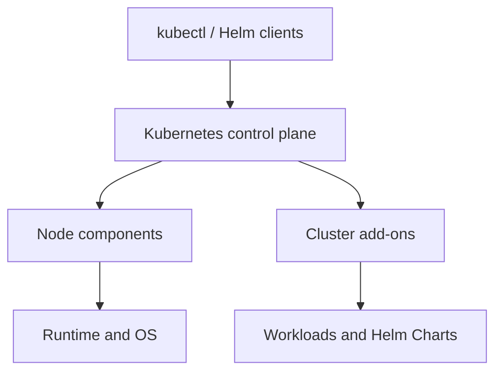
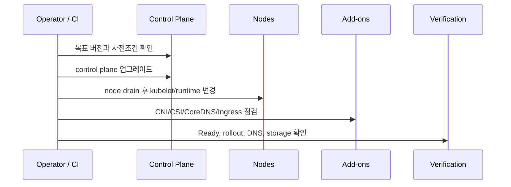
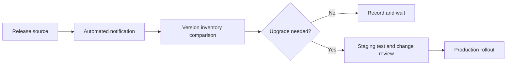

Kubernetes를 공부하다 보면 버전이 한두 개가 아니라는 사실을 금방 만나게 된다.

`kube-apiserver`, `kubelet`, `kube-proxy`, `kubectl`, `Helm`, `containerd`, CNI, CSI, CoreDNS, Ingress까지 각각 버전이 있다. 클러스터를 `kubeadm`으로 만들었는지, RKE2인지, Kubespray인지, EKS인지에 따라 업그레이드 명령도 달라진다.

처음에는 이런 생각이 들었다.

> 새 버전이 나오면 모든 구성요소를 최신으로 맞추면 되는 것 아닌가? 그렇다면 Kubernetes 공식 홈페이지를 매일 확인해야 하나?

지금은 질문을 조금 다르게 정리한다.

> 버전 관리는 최신 버전을 쫓는 일이 아니라, 지원되는 조합을 발견하고, 변경 시점을 판단하고, 안전한 순서로 적용하는 일이다.

이 글에서는 특정 배포판의 명령어를 외우기 전에 알아야 할 **Kubernetes 업그레이드의 공통 원칙**과 **새 버전을 놓치지 않으면서도 매일 수동 확인하지 않는 방법**을 정리한다. 이후 RKE2, Kubespray, EKS를 볼 때 사용할 공통 기준을 먼저 만드는 것이 목표다.

## 버전은 하나가 아니라 여러 계층에 걸쳐 있다

Kubernetes 클러스터를 하나의 버전으로 생각하면 업그레이드가 단순해 보인다. 실제로는 여러 계층의 버전이 서로 연결되어 있다.



- **Control plane**: `kube-apiserver`, `kube-controller-manager`, `kube-scheduler`, etcd
- **Node components**: `kubelet`, `kube-proxy`
- **Runtime and OS**: containerd 또는 CRI-O, Linux kernel, cgroup
- **Cluster add-ons**: CNI, CSI, CoreDNS, Ingress, Metrics Server, device plugin
- **Workloads**: Deployment, StatefulSet, Operator, Helm Chart, 컨테이너 이미지
- **Clients**: `kubectl`, `helm`, CI/CD 도구

따라서 `Kubernetes 1.36으로 올렸다`는 말만으로는 충분하지 않다. 다음 질문이 따라와야 한다.

- kubelet은 어느 minor 버전인가?
- containerd와 cgroup 설정은 호환되는가?
- CNI와 CSI는 목표 Kubernetes 버전을 지원하는가?
- Ingress와 admission webhook은 deprecated API를 사용하지 않는가?
- Helm Chart의 `kubeVersion` 제약은 무엇인가?
- node를 한 번에 몇 대까지 비워도 서비스가 유지되는가?

## 불변 원칙 1: 모든 것을 최신으로 맞추지 않는다

운영 클러스터에서 `latest`는 버전 관리가 아니다. 중요한 것은 최신 여부가 아니라 **지원되는 버전 조합**이다.

Kubernetes 공식 정책은 구성요소 사이에 허용되는 version skew를 정의한다.

예를 들어 공식 정책상 다음과 같은 범위가 허용된다.

| 구성요소 | 기준 |
| --- | --- |
| `kubelet` | `kube-apiserver`보다 최신이면 안 됨. 최대 3 minor 낮을 수 있음 |
| `kube-proxy` | `kube-apiserver`보다 최신이면 안 됨. 최대 3 minor 낮을 수 있음 |
| `kubectl` | API Server 기준 ±1 minor |
| HA `kube-apiserver` | 가장 높은 버전과 낮은 버전 차이 최대 1 minor |
| controller/scheduler | API Server와 같거나 최대 1 minor 낮음 |

예를 들어 API Server가 `1.36`이라면 kubelet은 `1.36`, `1.35`, `1.34`, `1.33` 범위가 공식 지원 대상이다. 하지만 이것은 장기간 그렇게 운영하라는 뜻이 아니다. rolling upgrade 중간에 생기는 임시 상태를 허용하는 기준에 가깝다.

운영 목표는 다음과 같이 잡는 편이 낫다.

```text
업그레이드 중간: 공식 skew 범위 안에서 혼합 버전 허용
업그레이드 완료: control plane과 node를 같은 minor로 수렴
```

공식 문서: [Kubernetes Version Skew Policy](https://kubernetes.io/releases/version-skew-policy/)

## 불변 원칙 2: Minor 버전은 건너뛰지 않는다

Kubernetes 버전이 `1.33.0`에서 `1.35.0`으로 올라왔다고 해도 바로 `1.35`로 이동하지 않는다.

```text
1.33 → 1.34 → 1.35
```

Patch 버전은 보통 같은 minor 안의 보안·버그 수정이다.

```text
1.35.1 → 1.35.2 → 1.35.6
```

반면 minor 버전은 API deprecation, 기본값 변경, 기능 제거가 들어올 수 있다. 그래서 Kubernetes 공식 문서도 지원되는 최신 patch를 사용하고, minor 업그레이드는 한 단계씩 진행하라고 안내한다.

이 원칙은 Kubernetes 자체뿐 아니라 배포 도구에도 적용된다.

- RKE2: Kubernetes minor를 건너뛰지 않음
- Kubespray: Kubespray release tag를 한 단계씩 올림
- EKS: control plane을 한 번에 한 minor만 올림
- kubeadm: `kubeadm upgrade`가 허용하는 경로 확인

업그레이드 도구가 있다고 해서 도구가 지원되지 않는 버전 점프를 자동으로 안전하게 만들어 주는 것은 아니다.

## 불변 원칙 3: 업그레이드 순서는 변하지만 책임 경계는 같다

배포판마다 명령과 내부 실행 순서는 다르다. 하지만 항상 다음 책임 경계를 확인해야 한다.



일반적인 흐름은 다음과 같다.

1. 현재 control plane과 node 상태 확인
2. release notes와 deprecated API 확인
3. control plane 업그레이드
4. node를 drain하고 kubelet·runtime·OS 업데이트
5. CNI, CSI, CoreDNS, Ingress 등 애드온 업데이트
6. `kubectl`, Helm, CI client 업데이트
7. workload rollout과 서비스 경로 검증

단, 이 순서가 모든 제품에서 문자 그대로 동일하지는 않다. EKS는 AWS가 control plane을 관리하고, Kubespray는 Ansible playbook 내부에서 구성요소 순서를 조정하며, RKE2는 server와 agent 서비스 순서를 관리한다.

중요한 것은 명령어가 아니라 다음 질문이다.

> 이번 변경에서 누가 control plane을 바꾸고, 누가 node를 비우며, 누가 애드온 호환성을 확인하는가?

## 불변 원칙 4: node 업그레이드는 작업이 아니라 용량 변경이다

node 하나를 업데이트하는 것은 단순히 패키지 하나를 설치하는 일이 아니다. 해당 node에서 실행 중인 Pod가 다른 node로 이동해야 하는 작업이다.

```text
node cordon
  → Pod eviction
  → kubelet/runtime/OS 변경
  → kubelet 재시작
  → node Ready 확인
  → uncordon
```

이때 확인할 것:

- replica가 충분한가?
- PodDisruptionBudget이 eviction을 막지 않는가?
- Stateful workload의 storage attach/detach가 정상인가?
- DaemonSet과 static Pod를 어떻게 처리할 것인가?
- node를 몇 대까지 동시에 비워도 되는가?

그래서 공식 문서에는 `drain`, `serial`, `concurrency`, `limit` 같은 개념이 반복해서 등장한다. 업그레이드는 버전 변경인 동시에 **서비스 수용 용량을 일시적으로 줄이는 작업**이다.

## 불변 원칙 5: 백업과 교체 경로를 먼저 준비한다

업그레이드 전에 반드시 되돌릴 방법을 생각해야 한다.

- etcd snapshot
- 애플리케이션 DB backup
- PV와 storage 복구 방법
- Git의 이전 manifest와 Helm values
- 이전 node image 또는 재생성 방법
- 업그레이드 실패 시 중단 지점

다만 Kubernetes minor 업그레이드는 데이터베이스 rollback처럼 간단하지 않다. control plane downgrade가 공식적으로 지원되지 않는 경우도 있고, 이미 새로운 API 형식으로 저장된 리소스는 이전 버전에서 읽히지 않을 수 있다.

그래서 실제 운영에서는 “업그레이드 후 다운그레이드”보다 다음 전략을 선호하는 경우가 많다.

```text
새 node 생성
  → workload 이동
  → health 확인
  → 이전 node 제거
```

특히 worker node는 교체 방식이 in-place 업데이트보다 단순한 rollback 경로를 제공한다.

## 불변 원칙 6: 버전의 source of truth를 하나로 만든다

서버에 설치된 실제 버전과 Git에 기록된 목표 버전이 다르면, 다음 업그레이드 때 무엇이 기준인지 알 수 없게 된다.

최소한 다음 정보는 하나의 inventory 또는 Git repository에서 관리할 수 있어야 한다.

```yaml
kubernetes: v1.36.2
rke2: v1.36.2+rke2r1
containerRuntime: containerd-2.x
cni: cilium-1.x
csi: ebs-csi-driver-1.x
ingress: traefik-3.x

helm:
  monitoring: 0.x
  cert-manager: 1.x
```

실제 값은 환경에 맞게 정하면 된다. 중요한 것은 “현재 설치된 값”과 “다음에 적용할 값”을 구분하는 것이다.

```text
current: 실제 클러스터에서 확인한 값
target: 다음 변경으로 적용할 값
```

## 현재 클러스터 버전 확인

버전 관리는 새 버전을 찾는 것보다 먼저 현재 상태를 정확히 기록하는 데서 시작한다.

### Kubernetes와 node

```bash
# client와 server 버전
kubectl version

# node 상태와 kubelet 버전
kubectl get nodes -o wide

# node별 kubelet, OS, container runtime
kubectl get nodes -o custom-columns='NAME:.metadata.name,KUBELET:.status.nodeInfo.kubeletVersion,RUNTIME:.status.nodeInfo.containerRuntimeVersion,OS:.status.nodeInfo.osImage'
```

`kubectl version`의 client 버전과 server 버전이 다를 수 있다. 이것 자체가 항상 오류는 아니지만, 공식 skew 범위를 벗어나는지 확인해야 한다.

### Kubernetes 애드온

```bash
# system namespace Pod 이미지와 상태
kubectl -n kube-system get pods -o wide

# DaemonSet / Deployment
kubectl -n kube-system get daemonset, deployment

# 실제 이미지 확인
kubectl -n kube-system get pods \\
  -o custom-columns='NAME:.metadata.name,IMAGE:.spec.containers[*].image'
```

여기서 CNI, CoreDNS, kube-proxy, CSI, Ingress controller 이미지를 확인한다. Kubernetes 버전만 보고 업그레이드 가능하다고 판단하면 안 되는 이유다.

### Helm

```bash
# Helm CLI 버전
helm version

# 모든 namespace의 Helm release
helm list -A

# 특정 release의 Chart와 values 확인
helm get metadata <release> -n <namespace>
helm get values <release> -n <namespace>
```

Helm CLI, Helm Chart, Chart가 배포하는 애플리케이션 버전은 각각 별도다. Helm Chart의 `Chart.yaml`에는 Kubernetes 버전 제약인 `kubeVersion`이 들어갈 수 있다.

### RKE2 호스트

RKE2는 Kubernetes API에서 보이는 버전 외에 호스트의 RKE2 서비스도 확인해야 한다.

```bash
# RKE2 binary
rke2 --version

# server node
systemctl status rke2-server --no-pager

# agent node
systemctl status rke2-agent --no-pager
```

RKE2 설치 방식이 RPM인지, binary인지에 따라 패키지 확인 방법이 달라질 수 있다. 따라서 `rke2 --version`과 systemd 서비스 상태를 함께 기록하는 편이 안전하다.

## 새 버전은 어떻게 발견할까?

매일 Kubernetes 공식 홈페이지를 직접 확인할 필요는 없다. 운영에서는 발견(discovery)과 결정(decision)을 분리한다.



### 1. 공식 release source를 구독한다

기본 source는 다음처럼 나눌 수 있다.

- Kubernetes: [공식 Releases 페이지](https://kubernetes.io/releases/), [공식 GitHub Releases](https://github.com/kubernetes/kubernetes/releases)
- RKE2: [RKE2 release channel](https://docs.rke2.io/upgrades/manual)
- Kubespray: [Kubespray Releases](https://github.com/kubernetes-sigs/kubespray/releases)
- EKS: [EKS supported versions와 lifecycle](https://docs.aws.amazon.com/eks/latest/userguide/kubernetes-versions.html)
- 보안: [Kubernetes 공식 CVE feed](https://kubernetes.io/docs/reference/issues-security/official-cve-feed/)

GitHub repository는 `Watch` 설정에서 release 알림만 받도록 구성할 수 있다. 모든 issue와 pull request를 구독할 필요는 없다.

### 2. RKE2는 release channel을 사용한다

RKE2는 `stable`, `latest`, 특정 minor channel 등을 제공한다. 운영에서는 일반적으로 `stable`을 기준으로 삼고, 실제 배포는 정확한 RKE2 버전을 고정한다.

채널이 현재 어떤 release를 가리키는지 확인하는 예시는 다음과 같다.

```bash
curl -fsSL https://update.rke2.io/v1-release/channels/stable
```

RKE2의 자동 업그레이드를 사용할 때도 channel을 무조건 따라가게 할지, `Plan`에 정확한 `version`을 지정할지 결정해야 한다. 학습·검증 환경은 channel, 운영 환경은 고정 version이 더 예측 가능하다.

### 3. EKS는 AWS의 readiness 정보를 사용한다

EKS는 control plane 업그레이드 전에 Upgrade Insights로 deprecated API와 업그레이드 방해 요소를 확인할 수 있다. 이후 control plane, node group, EKS add-on, client를 각각 업데이트한다.

EKS Managed Node Group도 control plane 업데이트와 자동으로 같은 버전이 되는 것은 아니다. EKS가 control plane을 관리해도 node와 add-on의 업데이트 책임은 별도로 남는다.

공식 문서: [Updating an existing EKS cluster](https://docs.aws.amazon.com/eks/latest/userguide/update-cluster.html)

### 4. 주기적인 CI 점검을 둔다

사람이 release 페이지를 보는 대신, 정해진 주기의 CI job이 다음을 비교하게 만들 수 있다.

```text
현재 inventory version
  vs
공식 release/channel의 candidate version
```

처음부터 자동 업그레이드까지 할 필요는 없다. 아래 정도면 충분한 시작점이다.

```text
주 1회: 새 release 감지
월 1회: patch 및 보안 업데이트 검토
분기별: minor upgrade 계획
EOL 전: 다음 지원 minor로 이동
```

CI 결과는 “바로 업그레이드”가 아니라 다음과 같은 알림이어야 한다.

```text
RKE2 current: v1.35.x+rke2rN
RKE2 stable:  v1.35.y+rke2rN
Action: patch review required
```

새 버전이 나왔다는 사실과 실제로 지금 운영에 적용할지는 다른 판단이다. release가 나왔다는 이유만으로 production upgrade를 자동 실행하지 않는 이유다.

## 업그레이드 판단을 위한 운영 기록

새 release 알림만으로는 부족하다. 다음 정보를 함께 가지고 있어야 한다.

| 항목 | 질문 |
| --- | --- |
| 현재 버전 | 실제 클러스터는 무엇을 실행 중인가? |
| 목표 버전 | 어느 patch/minor로 이동할 것인가? |
| 지원 종료일 | 지금 버전을 언제까지 유지할 수 있는가? |
| API 변경 | 제거되는 API를 사용하는가? |
| 애드온 호환성 | CNI/CSI/Ingress/Webhook이 목표 버전을 지원하는가? |
| 용량 | drain 중에도 서비스가 유지되는가? |
| 백업 | etcd와 애플리케이션 데이터를 복구할 수 있는가? |
| rollback | 실패하면 이전 node 또는 이전 snapshot으로 돌아갈 수 있는가? |

이 표를 매 upgrade마다 채우면, 버전 관리는 “새 버전이 나왔으니 올리자”가 아니라 change review가 된다.

## 배포판별로 적용하면 이렇게 된다

### kubeadm

운영자가 control plane, node package, kubelet, runtime을 직접 관리한다. 공식 절차는 primary control plane, additional control plane, worker node 순서다.

### RKE2

RKE2 server를 한 대씩 먼저 업데이트한 후 agent를 업데이트한다. 수동 설치, package, `system-upgrade-controller` 방식이 있고, Rancher가 관리하는 클러스터라면 Rancher의 version management 경계를 따라야 한다.

### Kubespray

Ansible inventory와 Kubespray release tag가 source of truth다. `upgrade-cluster.yml`을 사용하고, Kubespray tag와 Kubernetes minor를 건너뛰지 않는다. `serial=1`과 `--limit`으로 rollout 범위를 줄일 수 있다.

### EKS

AWS가 control plane과 etcd를 관리하지만, node group, add-on, workload, IAM, network는 여전히 운영 대상이다. AWS가 관리하는 영역이 많아질수록 업그레이드 명령은 단순해지지만, 책임이 사라지는 것은 아니다.

## 최종 정리

Kubernetes 버전 관리는 다음 다섯 단계로 나누면 이해하기 쉽다.

```text
발견
  → 공식 release와 CVE를 감지

판단
  → 지원 기간, 호환성, API 변경, 서비스 용량 검토

검증
  → staging에서 control plane·node·애드온 순서 테스트

적용
  → drain, serial, backup, 고정 버전으로 순차 rollout

확인
  → node, workload, DNS, network, storage, ingress 검증
```

결국 “매일 최신 버전을 확인하는 사람”이 좋은 운영자는 아니다. 더 중요한 사람은 다음을 알고 있는 운영자다.

- 어떤 release source를 감시해야 하는가
- 현재 버전과 목표 버전은 무엇인가
- 공식적으로 허용되는 version skew는 어디까지인가
- 이번 업그레이드에서 누가 무엇을 바꾸는가
- 실패하면 어디에서 멈추고 어떻게 복구하는가

RKE2를 사용하는 현재 환경에서는 먼저 이 원칙을 작은 staging 클러스터에서 반복해보는 것이 좋다. 그다음 같은 원칙이 Kubespray의 Ansible inventory와 EKS의 control plane/node/add-on 책임 분리에서 어떻게 표현되는지 비교하면, 제품별 명령어를 넘어 Kubernetes 운영 자체가 보이기 시작한다.

## 참고 자료

- [Kubernetes Releases](https://kubernetes.io/releases/)
- [Kubernetes Version Skew Policy](https://kubernetes.io/releases/version-skew-policy/)
- [Kubernetes Upgrade a Cluster](https://kubernetes.io/docs/tasks/administer-cluster/cluster-upgrade/)
- [Kubernetes Upgrading kubeadm clusters](https://kubernetes.io/docs/tasks/administer-cluster/kubeadm/kubeadm-upgrade/)
- [RKE2 Manual Upgrades](https://docs.rke2.io/upgrades/manual)
- [RKE2 Automated Upgrades](https://docs.rke2.io/upgrades/automated)
- [Kubespray Upgrading Kubernetes](https://github.com/kubernetes-sigs/kubespray/blob/master/docs/operations/upgrades.md)
- [Amazon EKS: Update existing cluster](https://docs.aws.amazon.com/eks/latest/userguide/update-cluster.html)
- [Amazon EKS: Kubernetes version lifecycle](https://docs.aws.amazon.com/eks/latest/userguide/kubernetes-versions.html)
- [Helm Version Support Policy](https://helm.sh/docs/v3/topics/version_skew/)
- [Helm Chart.yaml and kubeVersion](https://helm.sh/docs/topics/charts/)
- [Kubernetes Official CVE Feed](https://kubernetes.io/docs/reference/issues-security/official-cve-feed/)
