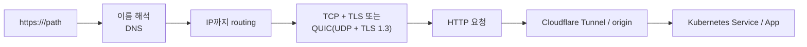
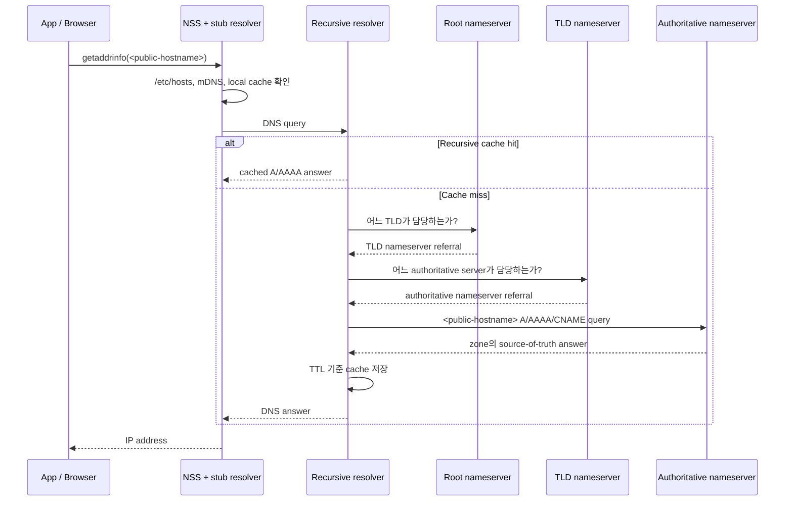
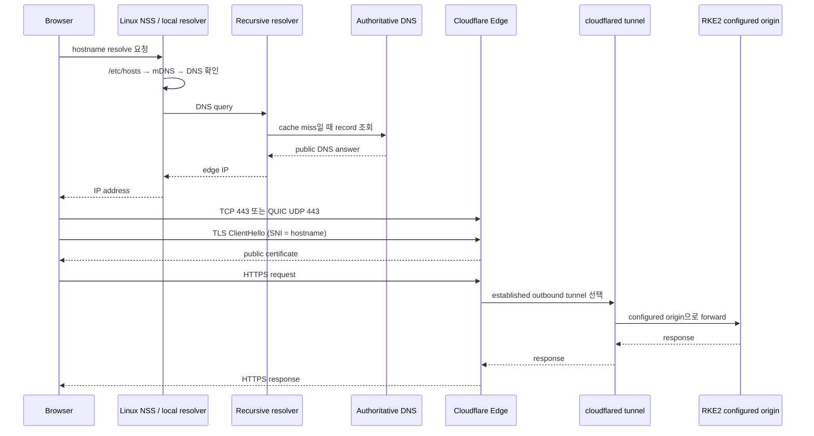

브라우저에 `https://<public-hostname>`을 입력하면 보통은 “DNS가 IP를 알려 주고 서버에 접속한다” 정도로 생각했다. 그런데 Linux에서는 애플리케이션이 이름을 해석하는 **첫 단계**부터 `/etc/nsswitch.conf`, `/etc/hosts`, mDNS, local resolver 설정이 관여한다. 외부 DNS 레코드가 정확해도 이 경로의 어느 한 단계가 어긋나면 애플리케이션은 연결을 시작하지 못한다.

이 글은 Ubuntu 계열 Linux와 개인 RKE2 홈 클러스터를 기준으로 URL 입력부터 Cloudflare Tunnel을 통한 서비스 도달까지의 경계를 정리한 학습 기록이다. 실제 public hostname, IP, Cloudflare Dashboard의 origin 매핑은 공개하지 않고 역할 단위로 표현했다.

## 먼저 구분할 것: DNS는 연결의 시작일 뿐이다

DNS의 역할은 hostname을 IP 주소로 해석하는 데서 끝난다. 그 뒤에는 목적지까지의 routing, HTTPS transport, 인증서 검증, HTTP 요청, Cloudflare Tunnel의 origin forwarding이 이어진다.



그래서 `dig`에서 IP가 보인다고 “서비스가 정상”인 것은 아니다. 반대로 HTTPS 오류가 났다고 DNS 오류라고 단정할 수도 없다. 장애를 좁힐 때는 각 경계를 분리해서 확인해야 한다.

### libc, glibc, TCP, QUIC, TLS를 한 문장씩 구분하기

- **libc**: C 프로그램이 운영체제 기능을 쓰기 위한 표준 라이브러리의 일반 이름이다. 파일, 프로세스, 사용자, 이름 해석 같은 기능을 애플리케이션에 제공한다.
- **glibc**: GNU C Library의 약자다. Ubuntu 같은 Linux 배포판에서 주로 쓰는 libc 구현체다. `getaddrinfo()`는 glibc가 제공하는 이름 해석 함수 중 하나다.
- **TCP + TLS**: HTTP/1.1과 HTTP/2에서 흔한 HTTPS 경로다. 먼저 TCP 연결을 만들고, 그 위에서 TLS로 상대 인증과 암호화 채널을 만든 뒤 HTTP를 보낸다.
- **QUIC**: UDP 위에서 동작하는 transport protocol이다. HTTP/3는 QUIC을 사용하며, TLS 1.3 handshake가 QUIC 연결 과정에 통합되어 있다. 따라서 QUIC은 “TCP의 다른 이름”도, 단순한 “UDP HTTP”도 아니다.

여기서 glibc는 DNS server가 아니다. Linux 프로그램이 hostname을 해석할 때 NSS 규칙과 resolver 설정을 따라 어떤 이름 해석 source를 사용할지 연결해 주는 client 측 라이브러리다. Chrome처럼 자체 DNS cache나 DoH를 쓰는 프로그램은 glibc 경로와 다르게 동작할 수도 있다.

## Linux 애플리케이션은 먼저 NSS에게 이름을 어디서 찾을지 묻는다

대부분의 Linux 프로그램은 hostname을 직접 DNS 서버에 보내기보다 libc의 `getaddrinfo()` 같은 함수를 호출한다. 이 함수가 이름을 어떤 출처에서 어떤 순서로 찾을지는 Name Service Switch, 즉 NSS 정책이 정한다.

현재 Ubuntu에서 확인한 설정은 아래와 같았다.

```text
hosts:          files mdns4_minimal [NOTFOUND=return] dns
```

| 순서 | NSS source | 의미 |
| --- | --- | --- |
| 1 | `files` | `/etc/hosts`의 정적 이름 매핑을 먼저 확인 |
| 2 | `mdns4_minimal` | 주로 LAN의 `.local` 이름을 위한 multicast DNS 확인 |
| 3 | `dns` | 일반 DNS resolver를 통해 공개/사내 DNS 질의 |

`/etc/nsswitch.conf`는 DNS server 주소를 정하는 파일이 아니다. `hosts`, `passwd`, `group`처럼 이름·사용자·그룹 정보를 **어떤 source에서 어떤 순서로 찾을지** 정하는 glibc 정책 파일이다.

```text
passwd:         files systemd
group:          files systemd
hosts:          files mdns4_minimal [NOTFOUND=return] dns
protocols:      db files
services:       db files
```

예를 들어 `passwd: files systemd`는 사용자 정보를 `/etc/passwd`에서 먼저 찾고 systemd user database도 확인한다는 의미다. `protocols: db files`의 `db`는 PostgreSQL 같은 데이터베이스가 아니라 시스템 name-service database source를 뜻한다.

### `/etc/hosts`는 로컬 DNS cache가 아니다

`/etc/hosts`는 hostname과 IP를 직접 적어 두는 정적 override 파일이다. TTL도 없고 외부 DNS 응답을 자동으로 저장하지도 않는다. 따라서 “로컬 DNS cache”라기보다 **가장 앞에서 적용되는 수동 매핑 규칙**에 가깝다.

```text
127.0.0.1 localhost
192.0.2.10 internal-api.example.test
```

운영 중인 공개 hostname을 이 파일에 잘못 등록하면, 외부 DNS가 아무리 정상이어도 해당 Linux host에서는 잘못된 IP로 연결을 시도할 수 있다. 반대로 장애 상황에서 임시 우회 용도로 쓰기 쉬운 만큼, 변경 이력과 제거 시점을 남기지 않으면 나중에 더 큰 혼동을 만든다.

### mDNS는 일반 공개 DNS와 다른 LAN 이름 해석 방식이다

mDNS는 Multicast DNS다. 일반 DNS는 내 PC가 설정된 recursive resolver에 **unicast**로 질의한다. 반면 mDNS는 같은 LAN의 장비들에게 multicast로 “`printer.local`을 아는가?”라고 묻는다. 인터넷 root·TLD·authoritative DNS를 거치지 않으며, 일반적으로 LAN 밖으로 전달되지 않는다. `printer.local`, `raspberrypi.local`처럼 같은 네트워크의 장비를 찾는 데 쓰인다.

`mdns4_minimal`은 이 용도의 IPv4 mDNS NSS plugin이다. 현재 규칙은 아래처럼 읽을 수 있다.

1. `files`: `/etc/hosts`에 이름이 있으면 그 결과를 사용한다.
2. `mdns4_minimal`: `.local` 같은 mDNS 담당 이름이면 LAN multicast 조회를 시도한다.
3. `[NOTFOUND=return]`: mDNS가 담당하는 이름을 찾지 못했을 때 일반 public DNS까지 흘려 보내지 않고 멈춘다. 예를 들어 존재하지 않는 `.local` 이름을 인터넷 DNS에 보내지 않기 위한 경계다.
4. `dns`: `chzzk.naver.com`처럼 mDNS 담당 범위가 아닌 일반 hostname은 이 단계까지 진행해 설정된 DNS resolver에 질의한다.

NSS action은 `SUCCESS`, `NOTFOUND`, `UNAVAIL`, `TRYAGAIN` 같은 결과 상태별로 다음 source를 볼지 정한다. 따라서 `[NOTFOUND=return]`은 “무조건 DNS를 막는다”는 뜻이 아니다. 실제 hostname이 어떤 경로를 탔는지는 `getent`와 resolver 상태를 함께 봐야 한다.

## `getent`와 `dig`는 같은 질문을 하지 않는다

이 둘을 같은 DNS 확인 명령으로 생각하면 진단이 헷갈린다.

```bash
NAME=blog.kwl4b.com

getent ahosts "$NAME"
dig "$NAME" A +short
dig "$NAME" AAAA +short
```

| 명령 | 확인하는 범위 | `/etc/hosts` 영향 |
| --- | --- | --- |
| `getent ahosts` | Linux NSS를 거친 애플리케이션 관점의 이름 해석 | 받음 |
| `dig` | 지정하거나 기본 설정된 DNS server에 직접 질의 | 받지 않음 |

개인 홈 노드에서 `getent`를 실행하면 아래처럼 같은 IP가 `STREAM`, `DGRAM`, `RAW` 유형으로 반복되어 나왔다.

```shellsession
$ getent ahosts blog.kwl4b.com
104.21.60.191   STREAM blog.kwl4b.com
104.21.60.191   DGRAM
104.21.60.191   RAW
172.67.200.61   STREAM
172.67.200.61   DGRAM
172.67.200.61   RAW
2606:4700:3031::6815:3cbf STREAM
2606:4700:3031::6815:3cbf DGRAM
2606:4700:3031::6815:3cbf RAW
```

이 출력은 “DNS가 TCP, UDP, raw socket으로 세 번 질의됐다”는 뜻이 아니다. `getent ahosts`가 `getaddrinfo()` 결과를 socket type별로 표시하는 방식이다. 여기서 볼 것은 **NSS 경로를 거친 뒤에도 IPv4와 IPv6 Cloudflare edge address를 받는가**다. DNS query가 실제로 TCP/UDP 중 무엇을 썼는지는 이 출력만으로 알 수 없다.

예를 들어 `getent`는 실패하는데 `dig`는 성공한다면, 외부 authoritative record보다 `/etc/hosts`, NSS policy, local stub resolver 경로를 먼저 의심할 수 있다. 반대로 `dig`도 실패하면 upstream DNS server, network, zone record 문제까지 범위를 넓힌다.

Chrome은 추가 변수가 있다. 브라우저 자체 DNS cache나 Secure DNS(DoH)를 사용할 수 있어서, 터미널의 `getent` 결과와 완전히 같은 경로를 탔다고 단정하면 안 된다. `getent`는 **Linux NSS 경로**, `dig`는 **DNS 질의 자체**, Chrome 개발자 도구는 **브라우저가 실제 사용한 요청**을 확인하는 도구로 구분하는 편이 안전하다.

## A, AAAA, CNAME, MX는 각각 무엇을 답하는가

DNS record는 hostname에 대해 어떤 종류의 정보를 요청할지 정한다.

| Record | 답하는 정보 | 주 용도 |
| --- | --- | --- |
| `A` | IPv4 address | `203.0.113.10`처럼 IPv4로 연결할 주소 |
| `AAAA` | IPv6 address | `2001:db8::10`처럼 IPv6로 연결할 주소. A가 네 글자인 이유가 아니라 record type의 이름 자체가 `AAAA`다. |
| `CNAME` | 다른 canonical hostname | `service.example.com`을 실제 대상 hostname으로 alias 처리 |
| `MX` | 메일을 받을 server와 우선순위 | `user@example.com`의 `example.com` 메일 수신 경로 |

`CNAME`을 따라간 뒤에 `A` 또는 `AAAA`를 다시 받아 실제 연결 IP를 얻는다. 반면 `MX`는 웹 서비스 hostname이 아니라 **메일 주소의 도메인**에 질의하는 것이 보통이다. 그래서 `chzzk.naver.com MX`보다 `naver.com MX`가 의미 있는 예시다.

### 실제 조회 예시: CHZZK와 이 블로그

아래 결과는 2026-08-04에 확인한 snapshot이다. DNS TTL, CDN traffic engineering, resolver cache에 따라 IP와 순서는 달라질 수 있다.

먼저 `chzzk.naver.com`의 IPv4 질의는 CNAME과 그 대상의 여러 A record를 함께 돌려줬다.

```bash
dig chzzk.naver.com A +noall +answer

chzzk.naver.com.       IN  CNAME  2081bff4.ndash.net.
2081bff4.ndash.net.    IN  A      110.93.149.243
2081bff4.ndash.net.    IN  A      110.93.157.163
2081bff4.ndash.net.    IN  A      202.179.177.67
# ... 같은 alias에 대한 A record가 더 이어짐
```

이는 browser가 처음부터 IP 하나만 고정해 쓰는 구조가 아니라, `chzzk.naver.com`을 `2081bff4.ndash.net`으로 alias 처리하고 여러 IPv4 후보 중 연결 가능한 edge를 선택할 수 있다는 뜻이다.

IPv6 record를 보려면 **A가 네 개인 `AAAA`**를 명시해야 한다.

```bash
dig chzzk.naver.com AAAA +noall +answer

chzzk.naver.com.       IN  CNAME  2081bff4.ndash.net.
```

이 시점의 응답에는 alias는 있었지만 그 alias의 AAAA record는 없었다. 즉 이 결과만 보면 해당 hostname의 IPv6 연결 주소는 제공되지 않은 것이다.

`dig chzzk.naver.com AAA +short`의 `AAA`는 `AAAA` record type이 아니다. `dig`는 이를 record type으로 해석하지 않고 별도 이름 입력처럼 처리할 수 있어, 기본 A 질의 결과가 섞여 보인다. 실제 question section에 `chzzk.naver.com. IN A`가 나타난 이유다. IPv6 확인에는 반드시 아래 명령을 쓴다.

```bash
dig chzzk.naver.com AAAA +short
```

이 블로그 hostname은 public DNS에서 Cloudflare edge address를 반환한다.

```bash
dig blog.kwl4b.com A +noall +answer

blog.kwl4b.com.        IN  A     104.21.60.191
blog.kwl4b.com.        IN  A     172.67.200.61

dig blog.kwl4b.com AAAA +noall +answer

blog.kwl4b.com.        IN  AAAA  2606:4700:3031::6815:3cbf
blog.kwl4b.com.        IN  AAAA  2606:4700:3035::ac43:c83d
```

이 IP들은 RKE2 node나 `cloudflared` pod의 private address가 아니다. browser는 먼저 Cloudflare edge에 연결하고, 그 뒤 Cloudflare가 이미 열려 있는 tunnel을 통해 home cluster의 configured origin으로 요청을 전달한다.

MX는 메일 도메인에 이렇게 질의한다.

```bash
dig naver.com MX +noall +answer

naver.com.             IN  MX  10 mx1.mail.naver.com.
naver.com.             IN  MX  20 mx4.mail.naver.com.
```

숫자 `10`, `20`은 priority다. 보통 더 작은 값의 mail server를 먼저 시도한다.

## Stub resolver와 recursive resolver는 역할이 다르다

DNS 그림에서 Client가 곧바로 recursive resolver에 질의하는 모습이 흔하다. 개념적으로 맞지만, Linux host 내부에는 그 앞단의 stub resolver가 있을 수 있다.

- **stub resolver**: 애플리케이션의 이름 해석 요청을 받아 설정된 DNS server로 전달하는 client 측 resolver다. libc resolver 자체일 수도 있고 `systemd-resolved` 같은 local service일 수도 있다.
- **recursive resolver**: cache를 확인하고, 필요하면 root·TLD·authoritative DNS를 순서대로 찾아 최종 답을 가져오는 DNS resolver다. 공유기, ISP DNS, `1.1.1.1`, `8.8.8.8` 등이 이 역할을 할 수 있다.

<p>아래 그림은 Linux 구성도 자체가 아니라 DNS의 일반 구조를 보조하는 그림이다. 왼쪽 Client는 application/OS cache를 확인하고 recursive resolver에 질의한다. 중앙 resolver는 cache hit이면 바로 응답하고, cache miss이면 오른쪽의 root → TLD → authoritative nameserver를 따라간다. 이 글의 Linux NSS 세부 순서는 이어지는 Mermaid와 함께 봐야 한다.</p>

<figure style="margin: 2rem 0; text-align: center;">
  <a href="https://commons.wikimedia.org/wiki/File:DNS_in_the_real_world.svg" target="_blank" rel="noreferrer">
    
  </a>
  <figcaption style="margin-top: 0.5rem; text-align: center; font-size: 0.78rem; color: #64748b; line-height: 1.5;">출처: <a href="https://commons.wikimedia.org/wiki/File:DNS_in_the_real_world.svg" target="_blank" rel="noreferrer">Lion Kimbro, Wikimedia Commons</a> · Public domain</figcaption>
</figure>



### cache가 없으면 무엇을 찾는가

recursive resolver의 cache에는 이전 질의 결과가 TTL 동안 저장된다. cache miss라면 다음 위임 구조를 따라간다.

1. **Root nameserver**: `.com`, `.kr` 같은 최상위 도메인(TLD)을 누가 담당하는지 알려 준다.
2. **TLD nameserver**: 특정 도메인 zone의 authoritative nameserver가 어디인지 알려 준다.
3. **Authoritative nameserver**: 해당 zone의 A, AAAA, CNAME, MX 같은 실제 DNS record를 source of truth로 제공한다.

여기서 authoritative DNS는 내 PC나 홈서버가 아니라, 도메인 DNS zone을 위임받아 관리하는 provider 측 server다. `kwl4b.com` 같은 도메인의 record를 로컬에 보관한다는 뜻이 아니다.

```bash
DOMAIN=kwl4b.com
NAME=blog.kwl4b.com

dig "$DOMAIN" NS +short
dig "$NAME" CNAME +short
dig "$NAME" A +noall +answer
dig +trace "$NAME" A
```

각 명령에서 확인할 것은 다음과 같다.

```shellsession
$ dig kwl4b.com NS +short
nena.ns.cloudflare.com.
nicolas.ns.cloudflare.com.
```

`NS`는 `kwl4b.com` zone의 authoritative nameserver가 Cloudflare라는 뜻이다. 홈서버나 `cloudflared`가 DNS authority를 직접 맡는다는 뜻은 아니다.

```shellsession
$ dig blog.kwl4b.com CNAME +short
# 출력 없음

$ dig blog.kwl4b.com A +noall +answer
blog.kwl4b.com.        IN  A  104.21.60.191
blog.kwl4b.com.        IN  A  172.67.200.61
```

`CNAME` 질의의 출력이 비어 있어도 오류가 아니다. 이 hostname의 public answer에 CNAME이 없다는 뜻이다. A record가 Cloudflare edge IP를 돌려주는 것과 Cloudflare Tunnel의 origin forwarding은 별도 경계다.

`dig +trace`는 출력이 길다. 아래는 실제 실행 결과에서 위임 경계만 발췌한 것이다.

```text
.		IN  NS  a.root-servers.net.
# ... 다른 root nameserver 생략

com.		IN  NS  a.gtld-servers.net.
# ... 다른 .com TLD nameserver 생략

kwl4b.com.	IN  NS  nena.ns.cloudflare.com.
kwl4b.com.	IN  NS  nicolas.ns.cloudflare.com.

blog.kwl4b.com. IN A  104.21.60.191
blog.kwl4b.com. IN A  172.67.200.61
```

위 네 단계에서 볼 것은 `.` → `com.` → `kwl4b.com.` → `blog.kwl4b.com.` 순서다. root는 `.com` 담당 server를, `.com`은 `kwl4b.com` 담당 Cloudflare nameserver를, Cloudflare authoritative server는 최종 A record를 알려 준다. 실제 trace 중 IPv6 authoritative server에 대한 `network unreachable`이 보이면 local host에 IPv6 route가 없어서 IPv4 server로 fallback한 것이다. DNS zone 자체가 실패했다는 의미는 아니다.

`dig +trace`는 학습용으로 내 local tool이 root부터 위임을 직접 따라가 보게 한다. upstream recursive resolver가 실제 production 질의에서 정확히 똑같은 network path를 탔다는 증명은 아니다.

## 내 Ubuntu에서 stub resolver가 어떻게 동작하는지 확인하기

Ubuntu에서는 `systemd-resolved`가 local cache와 DNS policy를 맡는 경우가 많다. 다만 `systemd-resolved`가 항상 활성화되어 있다고 가정하면 안 된다. `/etc/resolv.conf`가 어디를 가리키는지와 실제 listener를 확인해야 한다.

```bash
systemctl is-active systemd-resolved
readlink -f /etc/resolv.conf
cat /etc/resolv.conf
resolvectl status
resolvectl query <public-hostname>
resolvectl statistics
sudo ss -luntp '( sport = :53 )'
```

개인 홈 노드의 실제 출력은 다음과 같았다. search domain은 개인 network 식별 정보가 될 수 있어 제외했다.

```shellsession
$ systemctl is-active systemd-resolved
active

$ readlink -f /etc/resolv.conf
/run/systemd/resolve/stub-resolv.conf

$ grep -E '^(nameserver|options|search)' /etc/resolv.conf
nameserver 127.0.0.53
options edns0 trust-ad
search <private-search-domain>
```

`active`는 `systemd-resolved` process가 실행 중이라는 뜻이다. `/etc/resolv.conf`가 `stub-resolv.conf`를 가리키고 `nameserver 127.0.0.53`을 보여 주므로, 애플리케이션은 외부 DNS server에 바로 질의하지 않고 먼저 local loopback stub listener에 요청한다.

```shellsession
$ resolvectl status
Global
       Protocols: -LLMNR -mDNS -DNSOverTLS DNSSEC=no/unsupported
resolv.conf mode: stub

Link 2 (eth0)
    Current Scopes: DNS
Current DNS Server: 168.126.63.1
       DNS Servers: 168.126.63.1 168.126.63.2
```

여기서는 `resolv.conf mode: stub`과 default route가 있는 `eth0`의 `Current DNS Server`를 본다. 즉 application → `127.0.0.53` → `eth0`에 설정된 upstream DNS server 순서로 질의가 전달된다. CNI가 만든 `cali*`, `flannel.*` interface가 많아도 `Current Scopes: none`이면 일반 public hostname의 기본 DNS 경로 후보는 아니다.

```shellsession
$ resolvectl query blog.kwl4b.com
blog.kwl4b.com: 104.21.60.191                    -- link: eth0
                172.67.200.61                    -- link: eth0
                2606:4700:3031::6815:3cbf        -- link: eth0
                2606:4700:3035::ac43:c83d        -- link: eth0

-- Information acquired via protocol DNS in 218.1ms.
-- Data from: network
```

이 결과는 `systemd-resolved`를 통해 실제 DNS answer를 받았고, 어떤 interface를 사용했는지까지 알려 준다. `Data from: network`은 이번 응답이 local cache가 아니라 upstream 질의에서 왔다는 의미다.

```shellsession
$ resolvectl statistics
Cache Hits:   2328
Cache Misses: 2541

$ sudo ss -luntp '( sport = :53 )'
udp  UNCONN 127.0.0.53%lo:53
tcp  LISTEN 127.0.0.53%lo:53
```

`Cache Hits`와 `Cache Misses`는 systemd-resolved가 시작된 뒤 누적된 resolver cache 통계다. 단일 질의의 성공 여부를 의미하지는 않는다. 마지막 `ss` 출력은 local stub이 loopback `127.0.0.53`의 DNS port `53`에서 UDP와 TCP를 모두 받고 있음을 보여 준다.

확인할 핵심은 네 가지다.

| 확인 항목 | 확인할 내용 |
| --- | --- |
| `/etc/resolv.conf` | 애플리케이션 resolver가 보낼 `nameserver` 주소 |
| `127.0.0.53` | systemd-resolved local stub listener로 향하는 loopback IP인 경우가 많음 |
| `resolvectl status` | network interface별 DNS server, search domain, routing domain |
| `ss ... :53` | local machine에서 DNS port 53을 누가 받고 있는지 |

`53`은 DNS의 well-known port다. `127.0.0.53`은 IP 주소이고, `:53`은 UDP/TCP DNS port를 뜻한다. 둘은 같은 숫자를 쓰지만 다른 개념이다.

### DHCP와 network interface는 왜 DNS 해석에 영향을 주는가

DHCP는 네트워크에 연결할 때 IP address, subnet mask/prefix, default gateway, DNS server, lease time 등을 자동으로 받는 protocol이다. 회사나 집 공유기를 통해 접속하면 DNS server 설정도 DHCP로 들어오는 경우가 많다.

```bash
ip route
ip route get 1.1.1.1
resolvectl status
```

`enp2s0`처럼 보이는 이름은 predictable network interface naming 규칙에 따른 Ethernet interface 이름이다. `resolvectl status`에서 `Link 2 (enp2s0)`처럼 보이는 숫자는 interface index다. systemd-resolved는 이 interface에 연결된 DHCP 또는 정적 설정을 바탕으로 어떤 DNS server에 질의할지 결정할 수 있다.

즉 DNS 문제를 볼 때 “외부 DNS record가 맞나?”뿐 아니라 “이 host가 **어떤 interface의 어떤 DNS server**를 쓰고 있나?”도 봐야 한다. VPN, Wi-Fi, Ethernet, Kubernetes node network가 동시에 존재하면 특히 중요하다.

## URL 입력부터 Cloudflare Tunnel까지: 현재 홈 환경의 경로

개인 RKE2 cluster에서는 `cloudflared` Deployment가 token 기반 tunnel을 실행하고 있다. `cloudflared`는 Cloudflare 쪽으로 outbound connection을 먼저 맺는다. 그래서 home network에 public inbound port를 열지 않아도 Cloudflare Edge가 tunnel을 통해 origin으로 요청을 전달할 수 있다. [Cloudflare Tunnel 문서](https://developers.cloudflare.com/cloudflare-one/networks/connectors/cloudflare-tunnel/)

Cloudflare Dashboard에서 public hostname이 어떤 tunnel과 origin service에 연결되는지는 Git manifest만으로 알 수 없다. 아래 흐름의 `configured origin`은 그 Dashboard 설정을 일반화한 표현이다.



### TLS 단계에서 browser가 확인하는 것

DNS 응답으로 Cloudflare edge IP를 받은 뒤 browser는 보통 TCP 443 또는 HTTP/3용 QUIC UDP 443으로 연결한다. TLS handshake의 ClientHello에는 SNI(Server Name Indication)가 포함되어 있어 edge가 어떤 hostname의 certificate를 제시할지 판단할 수 있다.

browser는 certificate의 hostname(SAN), expiration, issuer chain을 자신이 신뢰하는 public CA store 기준으로 검증한다. 이 검증이 성공했다고 해서 Kubernetes 내부 Service의 권한, 앱 로그인, data security까지 모두 보장되는 것은 아니다. browser와 Cloudflare Edge 사이의 public HTTPS 경계가 정상이라는 뜻이다.

```bash
NAME=<public-hostname>

curl -sS -o /dev/null \
  -w 'HTTP %{http_code} connect=%{time_connect}s tls=%{time_appconnect}s total=%{time_total}s\n' \
  "https://$NAME/"

printf '' | openssl s_client \
  -connect "$NAME:443" \
  -servername "$NAME" \
  2>/dev/null |
  openssl x509 -noout -subject -issuer -dates -ext subjectAltName
```

첫 명령은 HTTP status와 connect/TLS/total time을, 두 번째 명령은 public endpoint가 제시한 certificate의 subject, issuer, validity, SAN을 확인한다. origin까지의 내부 모든 설정을 증명하는 명령은 아니다.

### Tunnel과 Kubernetes origin은 별도 경계다

`cloudflared`는 cluster에서 Cloudflare로 outbound tunnel을 유지한다. Cloudflare Edge는 public request를 이 tunnel에 전달하고, `cloudflared`는 Dashboard에 설정된 origin으로 전달한다.

```bash
kubectl -n <tunnel-namespace> get deploy,pod
kubectl -n <tunnel-namespace> logs deploy/<cloudflared-deployment> --tail=100
kubectl get ingress -A
```

여기서 확인하는 것은 public browser traffic이 tunnel connector까지 올 수 있는지와, cluster 내부의 origin routing이 준비되어 있는지다. 공개 edge TLS와 tunnel 이후 origin 구간의 protocol/TLS는 별도로 설계·확인해야 한다.

## 문제를 어느 경계에서 좁힐지

| 증상 | 먼저 볼 경계 | 예시 확인 |
| --- | --- | --- |
| hostname을 해석하지 못함 | NSS, `/etc/hosts`, local resolver | `getent ahosts`, `resolvectl query` |
| `getent`는 실패하지만 `dig`는 성공 | Linux name-service 경로 | `nsswitch.conf`, `/etc/hosts`, `/etc/resolv.conf` |
| DNS answer는 있으나 연결이 안 됨 | routing, firewall, port | `ip route get`, `curl -v`, security policy |
| certificate 경고 | TLS/SNI/certificate | `openssl s_client -servername` |
| HTTPS는 연결되나 5xx 또는 timeout | Cloudflare Tunnel, origin, app | `cloudflared` log, Ingress, Service, app log |

이 표는 원인을 바로 확정하는 규칙이 아니라, 다음 확인 위치를 정하는 출발점이다. 예를 들어 browser만 실패한다면 Secure DNS나 browser cache가 변수일 수 있고, CLI만 실패한다면 local NSS와 resolver 설정의 가능성이 커진다.

## 이번에 남긴 확인 순서

주소를 입력했을 때 DNS는 “외부에 있는 레코드를 바로 묻는 단계”만은 아니었다. 요청을 보낸 client가 먼저 local name-service policy를 거치고, configured resolver와 cache를 선택한 뒤 recursive DNS로 질의를 보낸다. 그 다음에야 routing, TLS, HTTP, tunnel forwarding이 이어진다.

그래서 public hostname 장애를 볼 때는 아래 순서로 범위를 줄이려 한다.

1. `getent`로 Linux application 관점의 name resolution을 확인한다.
2. `dig`로 DNS record 자체를 분리해 확인한다.
3. `/etc/nsswitch.conf`, `/etc/hosts`, `/etc/resolv.conf`, `resolvectl status`로 local resolver 경로를 확인한다.
4. DNS 이후에는 route, TLS certificate, HTTP response, Cloudflare Tunnel, Kubernetes origin을 차례로 분리한다.

DNS와 TLS, Cloudflare Tunnel의 역할 경계는 [SSO, Vault, SSH CA, Istio, Cloudflare Tunnel은 무엇을 나눠 맡나](/blog/sso-vault-ssh-ca-istio-cloudflare-boundaries/)에서 이어서 정리했다.

## 참고 자료

- [GNU C Library: Name Service Switch](https://www.gnu.org/software/libc/manual/html_node/Name-Service-Switch.html)
- [systemd-resolved.service(8)](https://www.freedesktop.org/software/systemd/man/latest/systemd-resolved.service.html)
- [RFC 1035: Domain Names - Implementation and Specification](https://www.rfc-editor.org/rfc/rfc1035.html)
- [RFC 6762: Multicast DNS](https://www.rfc-editor.org/rfc/rfc6762.html)
- [RFC 9000: QUIC](https://www.rfc-editor.org/rfc/rfc9000.html)
- [RFC 9114: HTTP/3](https://www.rfc-editor.org/rfc/rfc9114.html)
- [nss-mdns](https://github.com/avahi/nss-mdns) - glibc NSS에서 mDNS를 제공하는 plugin
- [Wikimedia Commons: DNS in the real world](https://commons.wikimedia.org/wiki/File:DNS_in_the_real_world.svg) - Lion Kimbro, public domain
- [IANA Root Servers](https://www.iana.org/domains/root/servers)
- [Cloudflare Tunnel documentation](https://developers.cloudflare.com/cloudflare-one/networks/connectors/cloudflare-tunnel/)
- [Cloudflare Universal SSL](https://developers.cloudflare.com/ssl/edge-certificates/universal-ssl/)
