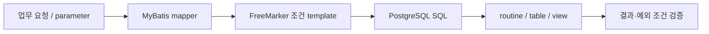

Oracle에서 PostgreSQL로 DB를 옮길 때 처음에는 procedure와 function을 얼마나 빨리 바꿀 수 있는지가 가장 큰 일이라고 생각했다. 실제로는 SQL 파일을 변환하는 것만으로는 끝나지 않았다. 애플리케이션의 MyBatis SQL, 입력 조건에 따라 SQL을 만드는 FreeMarker template, 배포 순서, 되돌릴 수 있는지까지 함께 봐야 했다.

이 글은 Oracle 11g 기반 업무 시스템을 PostgreSQL 17로 전환하며, 프로시저 95개와 함수 63개, 다수의 view/table을 이관한 과정에서 DB 변경을 어떻게 release 단위로 다뤘는지 정리한 기록이다. 내부 schema와 업무 규칙은 공개하지 않고, 판단 기준만 남긴다.

## SQL 문법이 아니라 실행 맥락이 달랐다

Oracle 종속 SQL은 DB object 안에만 있지 않았다. MyBatis XML, native query, batch, 보고서용 조회, 동적 조건 생성에도 섞여 있었다. 그래서 object 단위로 옮기는 것과 application request가 같은 결과를 내는 것은 별개의 문제였다.

우선 호환성 이슈를 다음처럼 나눴다.

| 구분 | 확인한 차이 | 확인 방법 |
| --- | --- | --- |
| 타입/NULL | 빈 값·문자열·숫자 변환과 NULL 처리 | 결과 행과 예외 조건 비교 |
| 날짜 함수 | DB별 날짜 연산과 formatting | 경계 날짜·timezone 조건 확인 |
| row limiting | Oracle식 제한 구문과 PostgreSQL `LIMIT/OFFSET` | 정렬 기준 포함 여부 확인 |
| routine | procedure/function 호출, OUT 값, transaction 경계 | 호출부와 반환값 비교 |
| 동적 SQL | MyBatis 조건과 FreeMarker template 결과 | 대표 parameter 조합별 생성 SQL 확인 |

특히 동적 SQL은 “어느 DB 문법인가”보다 **입력 조합에 따라 어떤 SQL이 만들어지는가**가 중요했다. MyBatis 기본 동적 SQL만으로 관리하기 어려운 조합은 FreeMarker template으로 SQL 생성 조건을 분리했다. 이는 MyBatis를 우회한 것이 아니라, 조건 조합을 읽을 수 있는 단위로 나누고 PostgreSQL 기준 SQL을 생성하도록 정리한 선택이었다.

## DB 변경을 파일 전달이 아니라 release 계약으로 봤다

DB migration 이후에도 schema, data, function, view는 계속 바뀐다. SQL 파일을 전달하고 사람이 실행하면 다음 질문에 답하기 어려워진다.

- 이 환경에 어느 변경이 적용됐는가?
- 애플리케이션 version과 DB 변경은 어떤 순서로 맞춰야 하는가?
- 같은 변경을 다시 실행해도 되는가?
- 배포 실패 시 무엇을 확인하고, rollback은 가능한가?

그래서 Liquibase changelog를 변경의 source of truth로 두고, Jenkins 배포 흐름에서 DB 변경을 application release와 함께 추적했다.

*이관 이후 반복 DB 변경에 적용한 흐름입니다. AI-assisted step은 changelog와 검증 체크리스트의 초안을 돕는 역할이고, 실제 적용은 PR review와 Jenkins/Liquibase 검증 뒤에만 진행합니다.*

Liquibase changeset은 변경 단위의 식별자와 author, 실행 조건을 갖고 changelog history에 적용 여부를 남긴다. 이 구조 덕분에 “누가 이 SQL을 실행했는가”보다 **어떤 release가 어떤 DB 변경을 포함했는가**를 먼저 확인할 수 있었다. [Liquibase Changeset 문서](https://docs.liquibase.com/secure/user-guide-5-1/what-is-a-changeset)

## 적용 전에 확인한 네 가지

Liquibase를 붙였다고 모든 DB 변경이 안전해지는 것은 아니다. 변경마다 다음을 같이 보려고 했다.

1. **적용 순서**: table/type/extension, routine, data 변경, application code 사이의 선후 관계를 확인한다.
2. **재실행성**: 이미 적용된 changeset을 다시 실행하지 않는지와 precondition을 확인한다.
3. **rollback 가능성**: drop, data correction, external side effect처럼 자동 rollback이 부적절한 변경은 복구 절차와 영향 범위를 별도로 남긴다.
4. **검증 SQL**: row count, function call, 핵심 조회처럼 적용 후 확인할 쿼리를 PR에 함께 둔다.

특히 rollback은 “모든 changeset에 rollback SQL을 써야 한다”는 뜻이 아니다. 데이터 삭제나 외부 연동처럼 자동으로 되돌리는 것이 더 위험한 변경도 있다. 이 경우에는 rollback 가능 여부, backup/restore 경로, 수동 확인 단계를 release 판단에 포함하는 편이 안전했다.

## DBA 경험이 Platform 관점에 남긴 것

이번 이관을 하며 DB는 application의 뒷단이 아니라 배포·secret·권한·관측과 연결된 runtime 구성 요소라는 점을 더 분명히 봤다.

- DB user/role과 권한은 테넌트 runtime provisioning의 일부였다.
- Liquibase 실행용 credential과 application credential은 목적과 권한을 분리해야 했다.
- DB 변경은 Jenkins의 image 배포와 별개가 아니라 release의 순서를 결정하는 입력이었다.
- 장애 분석에서는 application error, DB lock/query, migration history를 함께 봐야 했다.

따라서 이관의 성과를 “Oracle SQL을 PostgreSQL 문법으로 바꿨다”로만 정리하지 않는다. DB 변경을 Git review, changelog, Jenkins 배포 기록으로 연결해, 이후에도 추적하고 검증할 수 있는 흐름으로 남긴 것이 더 중요한 결과였다.

## 참고 자료

- [Liquibase: What is a Changeset?](https://docs.liquibase.com/secure/user-guide-5-1/what-is-a-changeset)
- [Jenkins CI/CD stage를 계측해 Docker 병목을 나눈 기록](/blog/jenkins-cicd-measurement-docker-optimization-case-study/)
- [AI가 만든 DB 변경 초안을 PR 검토 흐름 안에 둔 이유](/blog/ai-assisted-db-change-pr-review-workflow/)
