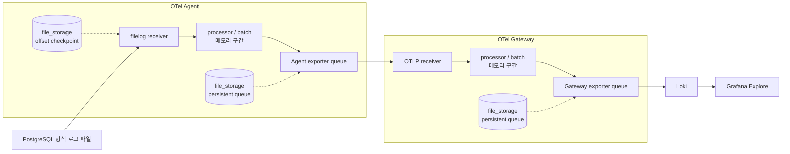

데모 환경에서 모니터링이 한동안 보이지 않았을 때, 처음에는 Collector를 재기동하면 된다고 생각했다. 하지만 재기동 뒤에 화면이 다시 열린다고 해서, 중단 구간에 생성된 로그까지 복구됐다는 뜻은 아니었다.

이 질문을 확인하기 위해 OpenTelemetry Collector의 Agent/Gateway 구조를 격리된 Docker Compose 환경에 다시 만들었다. 핵심은 persistent queue를 켜는 일이 아니라, **어디까지 저장되고 어떤 시점부터는 다시 유실되는지**를 분리하는 것이었다.

> 이 글의 검증은 회사 모니터링 환경이 아닌 로컬 Mac/Colima의 일회성 Docker Compose 프로젝트에서 수행했다. 고객 정보, 운영 네트워크, 실제 서비스 로그는 사용하지 않았다.

## 먼저 정한 질문

검증 전에는 persistent queue가 Collector 재시작과 backend 장애를 모두 막아줄 것처럼 보였다. 실제로는 아래 다섯 질문을 따로 봐야 했다.

1. Gateway가 내려간 상태에서 Agent가 재시작해도, Agent가 이미 받은 로그는 남는가?
2. Loki가 내려간 상태에서 Gateway가 재시작해도, Gateway가 이미 받은 로그는 남는가?
3. Agent가 멈춘 동안 로그 파일이 계속 커지면, 재시작 뒤 읽지 못한 부분을 이어 읽는가?
4. 디스크 기반 queue라도 용량이 너무 작으면 어떻게 되는가?
5. backend 장애가 retry 예산보다 길면, 디스크에 남긴 batch도 결국 포기되는가?

## 검증 구조: 수집과 저장의 경계를 나눠 보기

검증 대상은 PostgreSQL 형식의 합성 로그였다. 각 로그에는 `test_run_id`, scenario, iteration, sequence를 넣어 1,000건을 만들고, Loki에서 다시 조회한 sequence와 비교했다. 따라서 “Grafana에서 로그가 보인다”가 아니라 생성·수신·누락·중복 건수로 결과를 판단했다.


*포트폴리오에서 사용한 Collector 구조를 공개 가능한 범위에서 재구성했습니다. application OTLP·PostgreSQL filelog, Agent/Gateway queue, filelog offset의 저장 경계를 함께 표시했습니다.*



`file_storage`는 Collector 전체에 자동 적용되는 보호막이 아니다. `filelog receiver`가 참조하면 파일 fingerprint와 offset checkpoint를, exporter의 `sending_queue.storage`가 참조하면 아직 전송하지 못한 batch를 저장한다. 같은 Agent 안에서 하나의 storage extension ID를 두 설정이 함께 참조할 수는 있지만, 저장 목적과 보호 범위는 다르다. 특히 processor/batch 구간은 일반적으로 메모리에서 동작하므로, 저장소에 들어가기 전 Collector가 종료되면 처리 중 데이터는 남지 않을 수 있다.

여기서 서로 다른 상태를 한 덩어리로 보지 않는 것이 중요했다.

- **filelog offset**: 로그 파일을 어디까지 읽었는지 저장하는 상태다.
- **Agent/Gateway persistent queue**: Collector가 이미 받은 batch를 exporter로 보내기 전 디스크에 보관하는 상태다.
- **Loki 수신 결과**: 실제 로그 backend까지 도달했는지 확인하는 최종 기준이다.

`file_storage`는 로컬 파일 시스템에 상태를 영속화하는 extension이다. exporter helper의 persistent queue는 storage extension을 지정해 이미 queue에 들어온 batch를 재시작 뒤에도 이어서 내보낼 수 있다. 다만 queue에 들어가기 전 거부된 데이터나 retry 한도를 넘긴 batch까지 보장하지는 않는다. [OpenTelemetry Exporter Helper](https://github.com/open-telemetry/opentelemetry-collector/blob/main/exporter/exporterhelper/README.md)와 [File Storage Extension](https://github.com/open-telemetry/opentelemetry-collector-contrib/tree/main/extension/storage/filestorage)의 책임도 이 경계로 이해했다.

## 비교 방법

같은 장애 조건에서 baseline과 persistent 구성을 비교했다.

| 구분 | baseline | persistent |
| --- | --- | --- |
| Agent/Gateway queue | 메모리 기반 | `file_storage` 기반 디스크 queue |
| filelog offset | 영속화하지 않음 | `file_storage`에 저장 |
| queue 용량 | 일반 조건 | 일반 조건, B6에서만 `queue_size=2` |
| retry | 동일 | 동일, `max_elapsed_time=300s` |

`B3`, `B5`, `B6`, `B7`은 각 3회 반복했고, 실제 300초 retry 만료를 확인하는 `B8`은 1회 실행했다. 로그의 정확한 수신량은 Loki 경로에서만 검증했다. Mimir metric과 Tempo trace는 구성에는 포함됐지만, 이 글의 1,000건 수신 검증 범위에는 포함하지 않았다.

## 결과 1: Collector가 이미 받은 로그는 재시작 뒤 복구됐다

| 시나리오 | 장애 조건 | baseline 평균 수신 / 누락 | persistent 평균 수신 / 누락 | 반복 |
| --- | --- | ---: | ---: | ---: |
| B3 | Gateway 중단 후 Agent 재시작 | 0 / 1,000 | 1,000 / 0 | 3회 |
| B5 | Loki 중단 후 Gateway 재시작 | 0 / 1,000 | 1,000 / 0 | 3회 |
| B7 | Agent 중단 중 로그 파일 append | 0 / 1,000 | 1,000 / 0 | 3회 |


B3는 Gateway가 사용할 수 없는 동안 Agent가 받은 batch의 복구 범위, B5는 Loki가 사용할 수 없는 동안 Gateway가 받은 batch의 복구 범위를 확인하는 시나리오다. B7은 Agent가 멈춘 동안 파일에 추가된 로그를 재시작 뒤 이어 읽을 수 있는지 보는 시나리오다.

세 시나리오에서 persistent 구성은 1,000건을 모두 수신했다. 이 결과는 persistent queue와 filelog offset이 각각의 저장 지점에서 역할을 했다는 근거다. 다만 “어떤 Collector 장애에서도 로그가 안전하다”는 결론은 아니다. 다음 두 시나리오가 그 한계를 보여준다.

## 결과 2: persistent queue는 무한 버퍼가 아니다

`B6`에서는 queue 크기를 2로 낮춰 overflow를 의도적으로 만들었다. persistent 구성도 평균 274건을 수신했지만, 평균 726건이 누락됐다.


이는 디스크를 쓴다는 사실과 queue 용량이 충분하다는 사실이 별개임을 보여준다. exporter helper 문서도 queue가 가득 차거나 storage가 추가 데이터를 받지 못하면 enqueue 단계에서 데이터가 거부될 수 있고, 이 데이터는 exporter retry까지 도달하지 못한다고 설명한다. 따라서 queue 크기는 단순한 성능 옵션이 아니라, backend 장애 동안 감당할 batch 수와 연결된 운영 기준이다.

`B8`에서는 Gateway 장애를 `max_elapsed_time=300s`보다 길게 유지했다. persistent 구성에서도 1,000건 모두 수신하지 못했다. retry 예산이 끝나면 “나중에 backend가 살아나면 보내겠다”는 상태가 계속 유지되지 않는다는 점을 확인한 것이다. retry 시간은 무조건 크게 두기보다, 디스크 사용량·장애 대응 시간·중복 전송 가능성과 함께 정해야 한다.

## 설정에서 중요했던 부분

아래는 검증에 사용한 설정의 역할만 남긴 예시다. 실제 경로나 환경 변수 이름은 일반화했다.

```yaml
extensions:
  file_storage/agent:
    directory: /var/lib/otelcol/storage/agent
    create_directory: true
    fsync: true

receivers:
  filelog/postgresql:
    include: [/var/log/postgresql/postgresql-*.log]
    storage: file_storage/agent

exporters:
  otlp/gateway:
    retry_on_failure:
      max_elapsed_time: 300s
    sending_queue:
      queue_size: 5000
      storage: file_storage/agent
```

이 구성에서 확인할 것은 설정값 자체보다 세 가지다.

- Collector 실행 계정이 storage directory를 읽고 쓸 수 있는가
- `queue_size`와 batch 크기가 장애 시간 동안 쌓일 수 있는 데이터량에 맞는가
- retry timeout이 지나면 무엇을 버리고, 그 사실을 어떤 metric과 로그로 알 수 있는가

Loki 역시 수신 지점에서 rate limit, label cardinality, storage 장애로 로그를 거부할 수 있다. 따라서 Collector queue만 보지 않고 Loki의 discard metric과 ingest error도 함께 확인해야 한다. [Grafana Loki의 ingestion troubleshooting 문서](https://grafana.com/docs/loki/latest/operations/troubleshooting/troubleshoot-ingest/)가 제시하는 것처럼, 로그 유실은 수집기와 backend를 나눠서 봐야 한다.

## 이 검증으로 남긴 운영 기준

이번 검증 뒤에는 “persistent queue를 켰는가”보다 아래 질문을 먼저 확인하게 됐다.

1. 로그가 **filelog receiver**, **Agent queue**, **Gateway queue**, **Loki** 중 어디까지 도달했는가?
2. queue의 남은 용량과 storage 사용량은 장애 시간을 버틸 수 있는가?
3. enqueue 실패, retry 만료, backend 거부를 구분할 수 있는 metric과 로그가 있는가?
4. 로그 정확도는 실제 backend에서 generated/received/missing으로 검증했는가?

observability 구성의 목적은 대시보드를 띄우는 데 있지 않다. 장애가 난 뒤 “로그가 안 보인다”는 현상을 수집 중단, queue overflow, retry 만료, backend 수신 실패 중 어느 문제인지 좁힐 수 있어야 한다.

## 검증 범위와 다음 단계

이 결과는 로컬 격리 환경에서 합성 PostgreSQL 형식 로그 1,000건을 기준으로 얻었다. 실제 운영의 burst traffic, 장시간 network partition, Loki rate limit, 디스크 포화, Mimir/Tempo 경로의 정확한 수신량까지 보장하지는 않는다.

다음에는 Collector self-metrics와 storage 사용량을 Grafana dashboard에 함께 올려, queue가 쌓이기 시작한 시점과 drop이 발생한 시점을 같은 시간축에서 확인하려 한다. 그때도 성공 여부는 “Collector가 살아 있다”가 아니라, 장애 조건별로 허용한 데이터 손실 범위 안에 들어왔는지로 판단할 계획이다.

## 참고 자료

- [OpenTelemetry Collector Exporter Helper: retry, sending queue, persistent queue](https://github.com/open-telemetry/opentelemetry-collector/blob/main/exporter/exporterhelper/README.md)
- [OpenTelemetry File Storage Extension](https://github.com/open-telemetry/opentelemetry-collector-contrib/tree/main/extension/storage/filestorage)
- [OpenTelemetry Filelog Receiver](https://github.com/open-telemetry/opentelemetry-collector-contrib/tree/main/receiver/filelogreceiver)
- [Grafana Loki: Troubleshoot log ingestion](https://grafana.com/docs/loki/latest/operations/troubleshooting/troubleshoot-ingest/)
