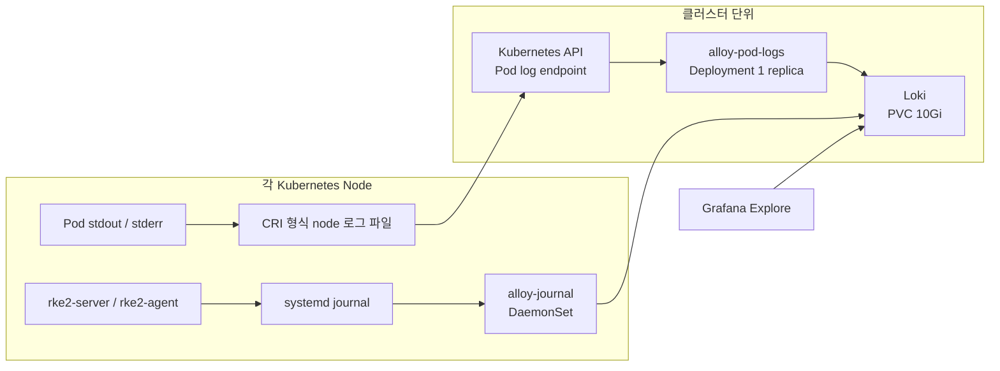
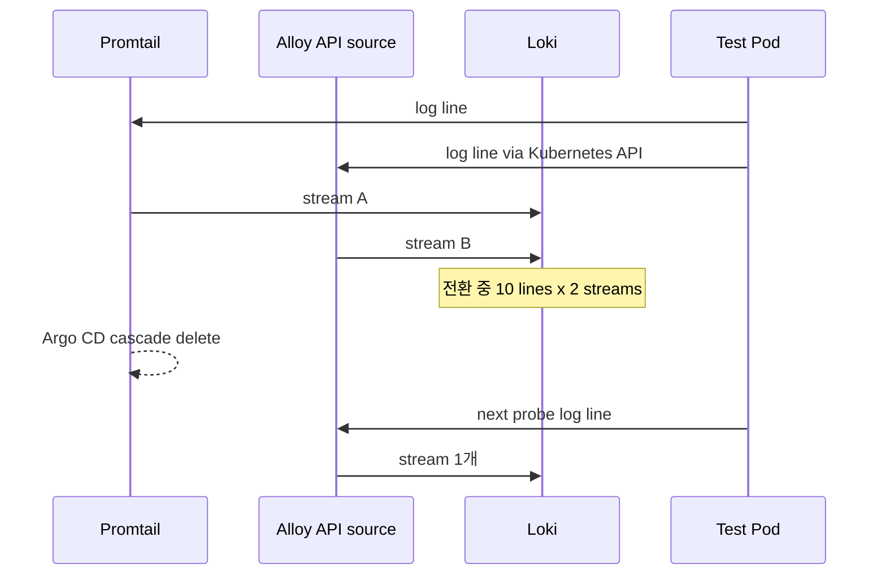

처음에는 Promtail이 Kubernetes Pod 로그만 수집하고 있었다. 이후 RKE2 `systemd` 로그를 Loki에서 함께 확인해야 했고, host journal을 읽는 Alloy DaemonSet을 별도로 도입했다. 그 다음 질문은 자연스럽게 이어졌다. Alloy가 Pod 로그도 수집할 수 있다면, Promtail을 유지할 이유는 무엇일까?

결론부터 말하면 그렇지 않았다. **로그를 읽는 위치가 `/var/log/pods` 파일 시스템에서 Kubernetes API로 바뀌면, 권한·배포 형태·초기 수집 동작·비용이 함께 바뀐다.** 이 글은 홈 RKE2 클러스터에서 Promtail을 실제로 제거하고 Alloy로 전환한 과정을 기록한다.

> 검증 범위는 개인 RKE2 홈 클러스터의 Kubernetes Pod 로그다. RKE2, SSH, kernel 같은 노드 journal 로그는 기존 `alloy-journal` DaemonSet이 계속 맡는다. 대규모 클러스터의 API 부하나 장기간 로그 유실까지 검증한 결과는 아니다.

## 먼저 용어를 나눴다: CRI 로그, OTel, Alloy

### CRI 로그 파일은 Pod 안의 파일이 아니라 node에 남는 container stdout/stderr 기록이다

CRI(Container Runtime Interface)는 Kubernetes의 kubelet이 container runtime과 통신할 때 따르는 인터페이스다. 여기서 말하는 **CRI 로그 형식**은 runtime이 container의 표준 출력과 표준 오류를 node 디스크에 남길 때 앞에 붙이는 공통 형식이다.

예를 들어 애플리케이션이 아래 JSON을 출력했다고 하자.

```json
{"level":"INFO","event":"order_created","orderId":42}
```

node의 `/var/log/pods/.../0.log`에는 보통 다음처럼 timestamp, `stdout`/`stderr`, 완료 여부(`F`)가 앞에 붙어 기록된다.

```text
2026-08-02T10:00:00.123456789Z stdout F {"level":"INFO","event":"order_created","orderId":42}
```

Promtail은 이 **node의 파일**을 직접 읽었다. 그래서 먼저 `cri` stage로 앞부분을 해석해 timestamp와 stdout/stderr 정보를 분리하고, 그 뒤 남은 JSON 본문에 `json` stage를 적용했다. `cri` stage가 JSON을 만드는 작업은 아니다. 파일 한 줄의 CRI 헤더를 벗겨내는 작업이고, `json` stage가 그 뒤의 애플리케이션 본문에서 `level`, `event` 같은 필드를 꺼낸다.

새 Alloy Pod collector는 node 파일을 직접 mount하지 않고 Kubernetes API의 Pod log endpoint를 읽는다. 따라서 기존 Promtail의 `cri` stage를 복사하지 않았고, API에서 받은 애플리케이션 JSON 본문만 `stage.json`으로 해석했다.

### OpenTelemetry는 표준과 Collector 생태계, Alloy는 실행 가능한 수집기다

OpenTelemetry는 로그·메트릭·트레이스를 어떤 형식과 의미로 만들고 전송할지 정하는 오픈소스 표준 및 생태계다. 애플리케이션 SDK, OTLP 전송 규약, OpenTelemetry Collector가 여기에 속한다. Collector 자체는 데이터를 오래 보관하는 DB가 아니라, 받아서 가공하고 backend로 보내는 중계 프로세스다.

Grafana Alloy는 OpenTelemetry Collector distribution에 Prometheus와 Loki용 pipeline을 함께 넣은 수집기다. 즉, Alloy도 OTLP를 받아 OTel Collector처럼 쓸 수 있지만, 이번 구성에서는 `otelcol.*` component를 사용하지 않았다. `loki.source.*`와 `loki.write`로 **로그만 Loki에 보내는 역할**로 썼다. [Grafana Alloy 소개](https://grafana.com/docs/alloy/latest/introduction/)와 [OpenTelemetry Collector 문서](https://opentelemetry.io/docs/collector/)를 함께 보면 이 경계가 분명하다.

## 시작점: 왜 Pod 로그와 node journal 로그를 같은 방식으로 보지 않았나

Alloy는 처음부터 Promtail을 대체하기 위해 넣은 도구가 아니었다. 우선 Kubernetes Pod 파일 경로 밖에 있는 RKE2 systemd 로그를 수집하는 역할로 도입했다.

현재 클러스터에는 수집 범위가 다른 Alloy workload 두 개가 있다. Promtail은 전환 검증 후 제거했다.

- **`alloy-journal` DaemonSet**: 모든 node에 하나씩 실행한다. hostPath로 mount한 `/var/log/journal`, `/run/log/journal`에서 `rke2-server`, `rke2-agent` systemd 로그를 읽어 Loki로 보낸다.
- **`alloy-pod-logs` Deployment**: 현재 1 replica만 실행한다. Kubernetes API로 cluster의 Pod/container log stream을 읽어 Loki로 보낸다. hostPath와 root 권한은 쓰지 않는다.

Promtail을 Alloy로 옮길 때 journal DaemonSet에 `loki.source.kubernetes`만 추가하는 방법도 생각할 수 있다. 하지만 이 방식은 서로 다른 권한을 한 Pod에 섞는다. journal 수집은 host journal mount와 root 권한이 필요하지만, Kubernetes API 기반 Pod 로그 수집은 그렇지 않다.

그래서 아래처럼 나눴다.



Alloy는 수집기이지 로그 저장소가 아니다. 현재 `alloy-journal`과 `alloy-pod-logs` 모두 별도 PVC나 `file_storage` queue를 쓰지 않는다. 전송 중인 데이터는 Alloy process의 메모리에 잠시 머문 뒤 Loki로 전송된다. Alloy Pod가 종료되거나 Loki 연결이 오래 끊기면 아직 Loki에 전달되지 않은 in-flight 로그의 보존은 보장하지 않는다.

영속 저장소는 Loki 쪽이다. 현재 Loki single-binary에 `local-path` PVC 10Gi가 연결되어 있고, Grafana는 그 Loki를 조회한다. journal 입력 자체는 node 디스크의 journal 파일이고, Pod 로그 입력은 Kubernetes API가 node의 container 로그를 제공하는 stream이다. 입력 파일과 최종 저장소를 Alloy의 PVC로 혼동하면 안 된다.

`loki.source.kubernetes`는 Kubernetes API로 Pod 컨테이너 로그를 tail한다. 이 방식은 privileged container, root 사용자, 노드 파일 시스템 접근, DaemonSet 없이 클러스터 전체 Pod 로그를 수집할 수 있다. 반대로 node 로그는 수집할 수 없고, API/Kubelet의 네트워크·CPU 사용량이 늘어난다. [Grafana Alloy 문서](https://grafana.com/docs/alloy/latest/reference/components/loki/loki.source.kubernetes/)의 장단점도 이 선택과 일치했다.

홈 클러스터에서는 한 replica Deployment로 시작했다. Pod 수가 적고, 목적이 모든 노드에 file tailer를 하나씩 띄우는 것이 아니라 **권한을 분리한 API 기반 수집 경로를 검증하는 것**이었기 때문이다. Pod 수와 로그량이 커지면 API/Kubelet 부하, API rate limit, Alloy clustering 또는 file 기반 DaemonSet을 다시 비교해야 한다.

## 이전 설정에서 반드시 보존할 것부터 정리했다

도구를 바꾸더라도 Grafana Explore에서 쓰던 조회 기준까지 바꾸고 싶지는 않았다. Promtail이 만들던 Kubernetes label은 최대한 유지했다.

| 목적 | 유지한 label |
| --- | --- |
| Kubernetes 위치 | `namespace`, `pod`, `container`, `node_name` |
| 애플리케이션 식별 | `app`, `instance`, `component`, `job` |
| JSON 애플리케이션 로그 | `level`, `event`, `service`, `method`, `status_code` |

기존 Promtail은 node의 CRI 형식 파일을 직접 읽었으므로 `cri` stage로 헤더를 해석한 뒤 JSON parsing을 적용했다. 새 Alloy는 Kubernetes API에서 Pod log stream을 받는다. 따라서 Promtail 설정을 줄 단위로 복사하지 않고, API 수집 이후 필요한 JSON 필드만 parsing하도록 다시 구성했다.

여기서 `path`를 Loki label로 계속 유지한 것은 기존 대시보드/조회 호환성 때문이었다. 다만 path에 ID나 query string이 섞이면 label cardinality가 급격히 커질 수 있다. 다음 정리에서는 정규화한 route만 label로 둘지 검토할 항목으로 남겼다.

## 최소 권한으로 Pod 로그만 읽는 Alloy Deployment

API 방식이므로 hostPath volume과 root 권한은 제거했다. 대신 service account에는 Pod discovery와 `pods/log` 조회에 필요한 권한만 부여했다.

```yaml
controller:
  type: deployment
  replicas: 1

global:
  podSecurityContext:
    runAsNonRoot: true
    runAsUser: 473
    runAsGroup: 473

rbac:
  create: true
  rules:
    - apiGroups: [""]
      resources: ["pods"]
      verbs: ["get", "list", "watch"]
  clusterRules:
    - apiGroups: [""]
      resources: ["pods/log"]
      verbs: ["get"]
```

`discovery.kubernetes`가 Pod 목록과 metadata를 얻으려면 `get`, `list`, `watch`가 필요하고, `loki.source.kubernetes`가 실제 컨테이너 로그를 읽으려면 `pods/log`의 `get` 권한이 필요하다. source component는 target마다 namespace, Pod 이름, Pod UID, container 이름을 요구하며, `role = "pod"` discovery 결과에는 이 값들이 기본으로 들어온다. [공식 component 문서](https://grafana.com/docs/alloy/latest/reference/components/loki/loki.source.kubernetes/)를 기준으로 최소 권한을 잡았다.

Alloy 설정의 핵심은 아래와 같다. 내부 endpoint와 실제 서비스 이름은 일반화했다.

```alloy
discovery.kubernetes "pods" {
  role = "pod"
}

discovery.relabel "pod_logs" {
  targets = discovery.kubernetes.pods.targets

  rule {
    source_labels = ["__meta_kubernetes_namespace"]
    target_label  = "namespace"
  }

  rule {
    source_labels = ["__meta_kubernetes_pod_name"]
    target_label  = "pod"
  }

  rule {
    source_labels = ["__meta_kubernetes_pod_container_name"]
    target_label  = "container"
  }

  rule {
    source_labels = ["__meta_kubernetes_pod_node_name"]
    target_label  = "node_name"
  }

  // app, instance, component, job도 Pod label/controller metadata에서 구성
}

loki.process "pod_logs" {
  forward_to = [loki.write.home.receiver]

  stage.json {
    expressions = {
      level       = "level",
      event       = "event",
      service     = "service",
      request_id  = "request_id",
      path        = "path",
      method      = "method",
      status_code = "statusCode",
      duration_ms = "durationMs",
    }
  }

  stage.labels {
    values = {
      level       = "",
      event       = "",
      service     = "",
      path        = "",
      method      = "",
      status_code = "",
    }
  }
}

loki.source.kubernetes "pod_logs" {
  targets    = discovery.relabel.pod_logs.output
  forward_to = [loki.process.pod_logs.receiver]
}

loki.write "home" {
  endpoint {
    url = "http://<loki-service>/loki/api/v1/push"
  }
}
```

`stage.json`과 `stage.labels`의 object field에는 쉼표가 필요하다. HCL처럼 보여도 Alloy configuration의 object 문법을 따라야 한다. 이 작은 차이는 실제 배포에서 바로 드러났다.

## 전환 중 실제로 만난 문제 세 가지

### 1. `runAsNonRoot`만 지정했더니 Pod가 기동하지 않았다

처음에는 `runAsNonRoot: true`만 넣었다. Kubernetes는 이미지 metadata가 기본 root 사용자라고 판단해 다음과 같이 컨테이너 기동을 막았다.

```text
container has runAsNonRoot and image will run as root
```

Alloy 이미지에는 `alloy` 사용자 UID 473이 있었지만, image의 기본 `USER`가 명시돼 있지 않았다. 따라서 Pod security context에 `runAsUser: 473`, `runAsGroup: 473`을 명시해 실행 사용자를 모호하지 않게 만들었다.

이 문제는 non-root를 선언하는 것과 **이미지가 실제로 어떤 UID로 실행되는지**를 확인하는 일이 다르다는 점을 보여줬다. Helm values만 보고 판단하지 않고, Pod event와 image user를 함께 확인해야 했다.

### 2. Alloy 설정은 로컬 검증을 통과했지만, 실제 컨테이너는 parse error로 종료됐다

처음 작성한 `stage.json.expressions`, `stage.labels.values` object에 쉼표가 빠져 있었다. Pod의 Alloy 로그는 다음처럼 field list parse error를 냈다.

```text
/etc/alloy/config.alloy:80:28: missing ',' in field list
```

문제는 이전 로컬 검증 스크립트에도 있었다. Helm render 결과에서 `config.alloy`만 뽑기 위해 사용한 `yq`가 로컬에 없었는데, 빈 파일을 Alloy validate에 넘겼다. 빈 설정은 오류가 없으므로 잘못된 검증 성공으로 보였다.

검증은 아래처럼 Helm render 결과를 실제 파일로 만들고, **파일이 비어 있지 않은지 먼저 확인**하도록 바꿨다.

```bash
tmpdir=$(mktemp -d)

helm template alloy-pod-logs grafana/alloy \
  --version 1.11.0 \
  --namespace monitoring \
  -f apps/observability/alloy-pod-logs/values.yaml \
  | sed -n '/^  config.alloy: |-/,/^---/p' \
  | sed '1d;$d;s/^    //' > "$tmpdir/config.alloy"

test -s "$tmpdir/config.alloy"

docker run --rm \
  -v "$tmpdir/config.alloy:/config.alloy:ro" \
  docker.io/grafana/alloy:v1.18.0 \
  validate /config.alloy
```

설정 문법 검증에는 성공했지만, **render extraction 자체가 실패하면 검증 대상도 사라진다.** 이후에는 `test -s`를 검증 명령의 일부로 둔다.

### 3. 처음 열린 log stream에서 오래된 로그와 API throttling을 봤다

새 Alloy는 시작 직후 클러스터 Pod마다 Kubernetes API log stream을 열었다. 오래 살아 있던 Job/Pod의 과거 로그 일부는 Loki가 허용하는 가장 오래된 timestamp보다 이전이어서 `400 timestamp too old`로 거절됐다. 또한 API client가 짧은 시간에 많은 stream을 열면서 client-side throttling도 기록됐다.

```text
server returned HTTP status 400: entry has timestamp too old

client-side throttling, not priority and fairness
```

이는 새 로그가 유실됐다는 뜻은 아니지만, API source가 시작 시점에 과거 컨테이너 로그를 읽고 Kubelet/API 부하를 만들 수 있다는 실제 신호다. Grafana도 API tailing이 `loki.source.file`보다 network traffic과 Kubelet CPU를 더 사용한다고 명시한다. 작은 클러스터에서는 이 비용을 측정한 뒤 허용할 수 있었지만, Pod 수가 많거나 로그량이 큰 환경에서 같은 구성을 기본값으로 쓰지는 않을 것이다.

## 중복 수집을 확인한 뒤 Promtail을 제거했다

새 collector를 기동한 순간 Promtail은 아직 살아 있었다. 이 상태에서 probe Pod가 10줄을 출력하게 한 뒤 Loki를 조회했다.

```bash
kubectl -n monitoring run alloy-migration-probe \
  --image=busybox:1.36 \
  --restart=Never \
  --labels='app=alloy-migration-probe,observability-test=alloy' \
  -- sh -c 'for i in $(seq 1 10); do echo "alloy-migration-probe sequence=$i"; sleep 1; done'
```

처음 조회에서는 **10줄이 두 stream으로 총 20건** 보였다.

- stream A: `filename`, `stream` label이 있는 Promtail file tailing 경로
- stream B: `filename`이 없는 Alloy Kubernetes API 경로

새 경로가 실제로 수집하고 있음을 확인하는 동시에, Promtail을 제거하기 전에는 중복 수집이 생긴다는 증거가 됐다.

Promtail은 Argo CD Application으로 배포되어 있었지만 cascade deletion finalizer가 없었다. Application만 삭제하면 Helm workload가 남을 수 있으므로 finalizer를 추가한 뒤 Application을 삭제해 DaemonSet, ServiceAccount, RBAC까지 함께 제거했다. GitOps repository에서도 Promtail Application과 values 파일을 같은 변경으로 제거했다.



Promtail 삭제 후에는 새 `alloy-cutover-probe`가 10줄을 출력했고, Loki query 결과는 **stream 1개, entry 10건**이었다. 이 stream에는 `namespace`, `pod`, `container`, `node_name`, `app`, `job` label이 남아 있었다.

```bash
curl --fail --silent --get \
  'http://127.0.0.1:3100/loki/api/v1/query_range' \
  --data-urlencode 'query={namespace="monitoring",pod="alloy-cutover-probe"}' \
  --data-urlencode 'limit=30'
```

같이 확인한 RBAC 결과도 모두 `yes`였다.

```bash
kubectl auth can-i list pods --all-namespaces \
  --as=system:serviceaccount:monitoring:alloy-pod-logs

kubectl auth can-i get pods/log --all-namespaces \
  --as=system:serviceaccount:monitoring:alloy-pod-logs
```

## 전환 뒤 남긴 기준

이번 작업의 목표는 “Promtail을 없애고 Alloy를 쓴다”가 아니었다. 다음 경계를 명확히 하는 것이었다.

1. **Pod 로그와 node journal 로그는 수집 권한이 다르다.** API 기반 Pod 수집은 non-root Deployment로, journal은 필요한 host access를 가진 DaemonSet으로 분리했다.
2. **입력 방식이 바뀌면 pipeline을 그대로 옮기지 않는다.** CRI 파일 parsing과 Kubernetes API log stream의 경계를 먼저 확인했다.
3. **기동 성공만으로 cutover하지 않는다.** 신규 collector와 기존 collector가 동시에 있을 때 중복 stream을 먼저 확인하고, 제거 후에는 probe의 생성 건수와 Loki 수신 건수를 비교했다.
4. **API 방식의 비용도 결과다.** 첫 수집의 오래된 timestamp 거부와 client throttling을 확인했다. 이 방식은 권한을 줄이는 대신 API/Kubelet 자원을 쓴다.
5. **configuration validation은 입력까지 검증한다.** render 결과가 비어 있으면 validate 성공도 의미가 없다.

API 기반 Alloy 수집은 이 홈 클러스터에서 Pod 로그를 단일 경로로 정리하는 데 적합했다. 하지만 규모가 커지면 꼭 같은 결론을 낼 필요는 없다. Pod 수, Kubelet/API 부하, 로그량, 노드 접근 권한 정책을 기준으로 `loki.source.kubernetes`와 `loki.source.file` DaemonSet을 다시 비교하는 것이 더 안전하다.

## 참고 자료

- [Grafana Alloy: Collect logs in Kubernetes](https://grafana.com/docs/alloy/latest/collect/logs-in-kubernetes/)
- [Grafana Alloy: loki.source.kubernetes](https://grafana.com/docs/alloy/latest/reference/components/loki/loki.source.kubernetes/)
- [Grafana Alloy: discovery.kubernetes](https://grafana.com/docs/alloy/latest/reference/components/discovery/discovery.kubernetes/)
- [Grafana Alloy: loki.process](https://grafana.com/docs/alloy/latest/reference/components/loki/loki.process/)
