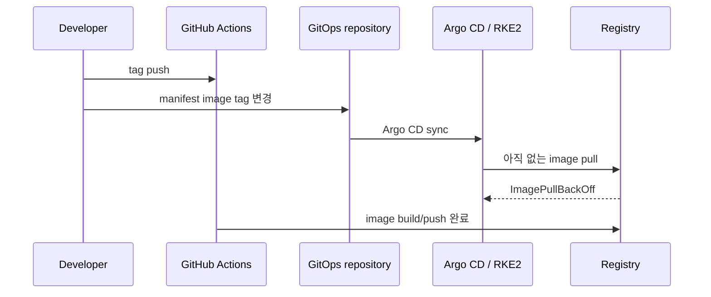
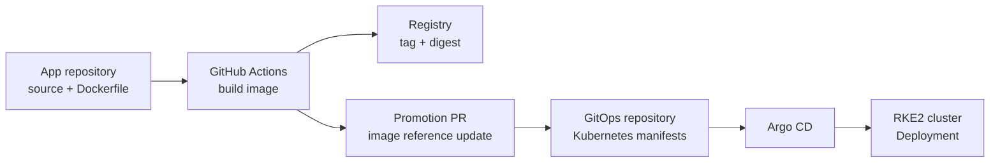

개인 RKE2 클러스터에 웹 서비스를 올릴 때 `ImagePullBackOff`를 처음 만났다. 처음에는 registry 인증이나 tag 오타부터 의심했다. 이벤트를 따라가 보니 그보다 앞선 문제가 있었다. **manifest는 바뀌었는데, 그 manifest가 가리키는 image가 아직 registry에 없었다.**

이 글은 개인 홈 클러스터에서 이미지 build와 Kubernetes desired state가 서로 다른 속도로 바뀌면서 생긴 race condition을 어떻게 나눠 봤는지 정리한 기록이다. 회사 Kubernetes 운영 경험을 대신한다고 주장하지 않는다. 개인 환경에서 GitOps의 배포 순서, image 추적, rollout 조건을 실제 서비스에 적용하며 확인한 범위다.


*개인 RKE2 클러스터에서 사용한 GitHub Actions → registry → promotion PR → Argo CD → Kubernetes 흐름입니다. 공개 가능한 개인 서비스 구조만 남기고 인증 설정과 내부 운영 정보는 제외했습니다.*

## 코드와 배포 상태가 같은 repository에 있을 때 생긴 문제

초기에는 애플리케이션 source와 Kubernetes manifest가 같은 repository에 있었다. 새 version을 배포할 때 code 변경, tag 생성, manifest의 image tag 변경이 가까운 시점에 일어났다.



문제의 원인은 두 가지였다.

1. **순서 문제**: image push 완료 전에 Argo CD가 manifest 변경을 sync할 수 있었다.
2. **식별 문제**: tag만으로는 배포 대상 image가 불변인지, 나중에 어떤 image가 배포됐는지 충분히 설명하기 어려웠다.

`ImagePullBackOff`는 증상이다. 존재하지 않는 tag, registry 인증, network 접근, image reference 문제는 모두 유사하게 보일 수 있으므로 Deployment event와 실제 image reference를 먼저 분리해 확인해야 했다.

## app repository와 GitOps repository의 책임을 나눴다

해결은 “Argo CD를 더 자주 sync시키는 것”이 아니었다. Argo CD가 보는 Git 상태가 **이미 존재하는 image artifact만 가리키도록** 순서를 바꿨다.



- **app repository**는 source, Dockerfile, image build를 맡는다.
- **GitOps repository**는 Kubernetes manifest와 실제 배포 상태를 맡는다.
- GitHub Actions는 image push가 끝난 뒤 digest를 얻고, GitOps repository에 promotion PR을 만든다.
- PR merge 뒤에만 Argo CD가 변경된 desired state를 sync한다.

Argo CD의 자동 sync는 Git의 desired state와 cluster의 live state를 비교해 적용한다. 따라서 GitOps repository의 manifest가 아직 존재하지 않는 image를 가리키면 sync 자체는 정상이어도 cluster는 pull에서 실패할 수 있다. 이 구분이 문제를 “Argo CD 오류”가 아니라 artifact와 manifest의 순서 문제로 보게 했다. [Argo CD automated sync 문서](https://argo-cd.readthedocs.io/en/stable/user-guide/auto_sync/)

## tag에는 이름을, digest에는 배포 대상을 남겼다

사람이 version을 읽기 쉽게 tag를 유지하되, manifest는 `tag@sha256:digest` 형태를 사용했다.

```text
# tag-only
<registry>/<image>:vX.Y.Z

# tag + digest
<registry>/<image>:vX.Y.Z@sha256:<digest>
```

tag는 release 이름을 읽기 좋게 하지만 변경될 수 있다. digest는 content-addressable identifier이므로 GitOps repository에 기록된 image artifact를 정확히 다시 가리킨다. 덕분에 장애가 나면 “어떤 tag였나”뿐 아니라 “어떤 digest가 Deployment에 선언됐나”까지 확인할 수 있게 됐다.

이것이 image 서명, SBOM, 취약점 스캔까지 포함하는 공급망 보안 전체를 해결한다는 뜻은 아니다. 이 환경에서 우선 해결하려던 범위는 **manifest와 실제 배포 image 사이의 추적성**이었다.

## rollout은 image pull 실패와 별개로 봤다

당시 단일 replica와 `Recreate` 전략에서는 새 pod가 준비되기 전에 기존 pod가 내려갈 수 있었다. image pull이 실패하면 기존 pod도 없고 새 pod도 준비되지 않는 중단 조건이 생긴다.

```yaml
spec:
  strategy:
    type: RollingUpdate
    rollingUpdate:
      maxUnavailable: 0
      maxSurge: 1
  template:
    spec:
      containers:
        - name: app
          readinessProbe:
            httpGet:
              path: /health
              port: 3000
```

`RollingUpdate`와 readiness probe를 적용한 뒤에는 새 pod가 readiness 조건을 만족한 뒤 Service endpoint에 들어가는 흐름을 확인했다. 단일 replica에서 이를 “무중단 보장”이라고 부르지는 않는다. 다만 Recreate보다 중단 가능성을 낮추고, traffic 진입 시점을 readiness로 통제하는 기반이 됐다. Kubernetes는 readiness probe가 성공한 Pod만 Service endpoint에 포함한다고 설명한다. [Kubernetes probe 문서](https://kubernetes.io/docs/concepts/workloads/pods/probes/)와 [Deployment 문서](https://kubernetes.io/docs/concepts/workloads/controllers/deployment/)

## 장애를 볼 때 남긴 확인 순서

ImagePullBackOff를 다시 만나면 다음 순서로 본다.

1. Argo CD가 sync한 Git revision과 manifest image reference를 확인한다.
2. Deployment/Pod event에서 pull failure message를 확인한다.
3. registry에 tag와 digest가 실제 존재하는지 확인한다.
4. `imagePullSecrets`, node의 registry network 경로, image policy를 분리해 확인한다.
5. image pull 문제가 해소된 뒤 rollout status, readiness, Service endpoint, ingress/tunnel 접근을 확인한다.

## 이 경험에서 남긴 기준

GitOps의 핵심은 YAML을 Git에 두는 데 있지 않았다. **image artifact 생성, manifest promotion, controller sync라는 서로 다른 상태 전환을 분리하고 추적 가능하게 남기는 것**에 있었다.

개인 RKE2 환경에서는 이 흐름을 계속 쓰면서, 실제 사용자의 피드백을 받는 웹 서비스를 같은 방식으로 배포하고 있다. 이후 개선은 Argo CD sync 주기 자체를 줄이는 것보다 promotion PR의 검증, manifest diff, rollout health를 함께 보는 방향으로 이어갈 생각이다.

## 참고 자료

- [Argo CD: Automated Sync Policy](https://argo-cd.readthedocs.io/en/stable/user-guide/auto_sync/)
- [Kubernetes: Deployments](https://kubernetes.io/docs/concepts/workloads/controllers/deployment/)
- [Kubernetes: Liveness, Readiness, and Startup Probes](https://kubernetes.io/docs/concepts/workloads/pods/probes/)
- [Ansible provisioning 재실행에서 changed를 해석한 기준](/blog/ansible-provisioning-idempotency/)
