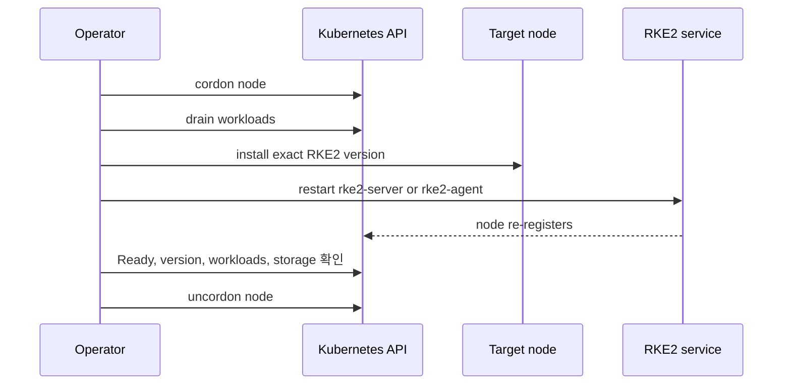

처음에는 `v1.35.4+rke2r1`에서 `v1.35.7+rke2r1`로 올리는 일이 단순해 보였다.

RKE2 설치 스크립트를 다시 실행하고 서비스를 재시작하면 끝날 것 같았다. 실제로는 그 전에 확인해야 할 것이 더 많았다. 어떤 Pod가 다른 노드로 이동할 수 있는지, local-path PVC가 어느 노드에 묶여 있는지, `emptyDir` 데이터를 버려도 되는지, 업그레이드 중 `NodeNotReady`를 장애로 볼지 정상적인 과도 상태로 볼지부터 판단해야 했다.

이 글은 Kubernetes 버전 관리의 일반론보다, 이번 홈 클러스터에서 실제로 `1.35.4 → 1.35.7` 패치 업그레이드를 진행하며 확인하고 타협한 내용을 기록한 글이다.

## 환경과 목표

공개 글에서는 실제 호스트명과 네트워크 정보는 일반화했다.

| 항목 | 구성 |
| --- | --- |
| 배포판 | RKE2 |
| 노드 | control-plane 1대, worker 2대 |
| 아키텍처 | amd64와 arm64 혼합 |
| 설치 방식 | tar 기반 RKE2 설치, systemd 서비스 |
| 클러스터 구성 | GitOps, Argo CD, 모니터링, Loki |
| 스토리지 | local-path PVC 일부 사용 |
| 변경 목표 | `v1.35.4+rke2r1` → `v1.35.7+rke2r1` |

control-plane에도 Pod가 배치되도록 설정해둔 상태였다. 따라서 control-plane을 단순히 “Kubernetes 제어 컴포넌트만 있는 노드”로 취급할 수 없었다. 이 점은 업그레이드 절차를 정할 때 생각보다 중요했다.

이번 목표는 minor 버전을 바꾸는 것이 아니라, 같은 `1.35` minor 안에서 patch 버전만 올리는 것이었다.

```text
현재: v1.35.4+rke2r1
목표: v1.35.7+rke2r1
```

## 시작 전에 다시 확인한 것

### `kubectl` 버전과 Kubernetes 서버 버전은 별개였다

처음 확인한 결과는 다음과 같았다.

```text
Client Version: v1.32.3
Kustomize Version: v5.5.0
Server Version: v1.35.4+rke2r1
WARNING: version difference between client (1.32) and server (1.35)
exceeds the supported minor version skew of +/-1
```

이후 Homebrew로 `kubectl`을 업데이트하면서 클라이언트가 `v1.36.3`이 됐다. 이것은 Kubernetes 클러스터를 `1.36`으로 업그레이드했다는 뜻이 아니다. `kubectl`은 API Server에 요청을 보내는 클라이언트이고, RKE2 버전은 각 노드의 `rke2` 서비스가 결정한다.

Kubernetes 공식 정책에서 `kubectl`은 API Server 기준 ±1 minor 범위가 지원된다. 따라서 `kubectl v1.36`과 `Kubernetes v1.35` 조합은 지원 범위 안에 들어오지만, `kubectl`의 Homebrew 업그레이드가 서버 업그레이드를 대신해주지는 않는다.

확인 명령은 다음처럼 나눠서 봤다.

```bash
# kubectl client와 API Server
kubectl version

# kubelet 버전과 container runtime까지 포함한 노드 상태
kubectl get nodes -o wide

# 호스트의 RKE2 버전은 각 노드에서 확인
ssh <node> rke2 --version
```

이 구분을 하지 않으면 `kubectl`이 최신이니 클러스터도 최신일 것이라는 잘못된 판단을 하게 된다. 공식 기준은 [Kubernetes Version Skew Policy](https://kubernetes.io/releases/version-skew-policy/)에 정리되어 있다.

### 최신 minor로 바로 가지 않은 이유

이번에는 `1.36` 같은 최신 minor로 이동하지 않고 `1.35.7`을 선택했다.

이유는 간단하다.

- 현재 minor를 유지하므로 API deprecation과 기본값 변경 범위가 작다.
- 패치 버전 변경의 영향 범위를 먼저 경험할 수 있다.
- RKE2, CNI, CoreDNS, Ingress, 모니터링, GitOps workload를 한 번에 minor까지 바꾸지 않아도 된다.
- 문제가 생겼을 때 원인을 RKE2 patch 변경 범위 안에서 좁혀 볼 수 있다.

“최신 버전이 나왔으니 바로 적용”이 아니라, 이번 변경의 목적을 **지원되는 동일 minor의 patch 보정**으로 제한했다. minor 업그레이드는 release notes, deprecated API, 애드온 호환성을 별도의 변경으로 검토할 예정이다.

## RKE2 설치 방식 확인

노드에서 systemd 서비스 구성을 확인했다.

```bash
systemctl cat rke2-server
systemctl cat rke2-agent
```

출력에는 다음과 같은 경로가 보였다.

```text
/usr/local/lib/systemd/system/rke2-agent.service
ExecStart=/usr/local/bin/rke2 agent
```

이 경로와 실행 파일 위치를 바탕으로 tar 기반 RKE2 설치로 판단했다. 설치 방식이 RPM인지 tar인지에 따라 업그레이드 명령이 달라질 수 있으므로, 설치 스크립트를 실행하기 전에 이 확인을 먼저 하는 편이 안전하다.

RKE2는 수동 설치 스크립트, 패키지 업그레이드, system-upgrade-controller를 통한 자동화 경로를 제공한다. 이번 클러스터에는 `system-upgrade-controller` Deployment가 있었지만, 업그레이드를 지시하는 `Plan`은 없었다. 그래서 이번 작업에는 자동화 컨트롤러를 새로 끌어들이지 않고 수동 절차를 선택했다.

Rancher가 버전 관리를 담당하는 클러스터라면 Rancher의 관리 경계를 따라야 한다. 반대로 system-upgrade-controller를 사용할 때는 server Plan과 agent Plan, `concurrency`, `cordon`, 버전 또는 channel을 명시해야 한다. 이번 작업에서는 두 자동화 경로와 수동 작업을 동시에 사용하지 않았다. RKE2의 자동 업그레이드 문서도 Rancher가 관리하는 클러스터와 system-upgrade-controller를 직접 사용하는 클러스터를 구분한다. [RKE2 Automated Upgrades](https://docs.rke2.io/upgrades/automated)

## drain 전에 확인한 것

Node 하나를 재시작하는 일은 패키지 설치 문제가 아니라 Pod를 다른 노드에 수용할 수 있는지 확인하는 문제였다.

```bash
# 모든 노드의 상태와 버전
kubectl get nodes -o wide

# 애플리케이션 상태
kubectl get deploy,sts -A

# 이미 문제가 있는 Pod가 있는지
kubectl get pods -A --field-selector=status.phase=Pending
kubectl get pods -A --field-selector=status.phase=Failed

# drain 중 수용 가능한 리소스가 남아 있는지
kubectl top nodes

# PVC와 PV의 바인딩 상태
kubectl get pvc -A
kubectl get pv
```

여기서 특히 중요했던 것은 PV의 node affinity였다. 이 클러스터의 Loki는 `local-path` StorageClass를 사용하고 있었고, PVC가 특정 worker의 로컬 경로에 묶여 있었다.

```text
storage-loki-0   Bound   10Gi   RWO   local-path
```

Loki의 PVC를 삭제하거나 다른 노드로 옮기면 안 됐다. 따라서 Loki가 있던 노드를 drain할 때는 해당 StatefulSet을 drain 대상에서 제외하고, 그 노드에 저장 데이터가 남아 있는 상태를 받아들였다. 반면 이번에 업그레이드한 두 번째 worker에는 해당 노드에 고정된 PV가 없다는 것을 확인했다.

이 차이를 확인하지 않고 모든 drain에 `--delete-emptydir-data`를 붙이는 것은 위험하다. `emptyDir`은 Pod와 생명주기를 같이하는 임시 데이터지만, local-path PV는 노드의 실제 경로에 남는 데이터다. 둘 다 drain 오류 메시지에서 “local storage”처럼 보일 수 있지만, 손실의 의미는 다르다.

## 첫 번째 drain에서 배운 것

처음 worker를 drain할 때는 다음 오류를 만났다.

```text
cannot delete Pods with local storage (use --delete-emptydir-data to override):
argocd/...
monitoring/loki-0
```

처음에는 “그냥 옵션을 추가하면 되는가?”라고 생각하기 쉽다. 하지만 이 옵션은 데이터를 보존해주는 옵션이 아니다. 해당 Pod가 사용하는 `emptyDir` 데이터를 버려도 된다고 운영자가 확인했다는 뜻에 가깝다.

그래서 다음처럼 판단을 나눴다.

| 구분 | 이번 판단 |
| --- | --- |
| `emptyDir` 기반 캐시·임시 파일 | 재생성 가능한 범위만 삭제 허용 |
| local-path PVC | 삭제하지 않음 |
| Loki가 고정된 worker | drain에서 제외하고 별도 판단 |
| PV가 없는 worker | `--delete-emptydir-data`를 사용해 drain |
| 강제 삭제 | `--force`는 사용하지 않음 |

이 판단을 거친 뒤 Loki가 없는 worker에만 다음 명령을 사용했다.

```bash
kubectl drain <worker-node> \
  --ignore-daemonsets \
  --delete-emptydir-data \
  --timeout=10m
```

`--ignore-daemonsets`는 DaemonSet Pod를 일반 애플리케이션 Pod처럼 다른 노드로 옮기려 하지 않게 한다. CNI, ingress, node exporter 같은 DaemonSet은 노드가 다시 올라온 뒤 해당 노드에서 재생성되는 것이 정상이다.

Kubernetes 공식 문서가 설명하듯 `drain`은 새 Pod가 들어오지 않도록 노드를 unschedulable 상태로 만들고, 가능한 Pod를 eviction하는 유지보수 절차다. 성공적으로 끝났다는 것은 제외된 Pod를 빼고 eviction이 완료됐다는 뜻이지, 모든 종류의 저장 데이터가 자동으로 안전하다는 뜻은 아니다. [Safely Drain a Node](https://kubernetes.io/docs/tasks/administer-cluster/safely-drain-node/)

## 실제 업그레이드 순서

RKE2 공식 문서는 server 노드를 먼저 한 대씩 업그레이드한 다음 agent 노드를 업그레이드하도록 안내한다. 이번에도 control-plane/server를 먼저 맞춘 뒤 worker를 순서대로 처리했다.



### 1. 노드를 스케줄링에서 제외

```bash
kubectl cordon <node>
```

### 2. 일반 Pod를 다른 노드로 이동

```bash
kubectl drain <node> \
  --ignore-daemonsets \
  --delete-emptydir-data \
  --timeout=10m
```

단, 이 명령은 해당 노드의 PV와 `emptyDir` 사용 여부를 확인한 뒤에 실행해야 한다. Loki처럼 로컬 스토리지에 의존하는 Stateful workload가 있으면 이 명령을 그대로 복사해서는 안 된다.

### 3. 정확한 RKE2 버전 설치

agent 노드에서는 다음처럼 목표 버전을 명시했다.

```bash
curl -sfL https://get.rke2.io | \
  sudo env \
  INSTALL_RKE2_METHOD=tar \
  INSTALL_RKE2_TYPE=agent \
  INSTALL_RKE2_VERSION='v1.35.7+rke2r1' \
  sh -
```

control-plane/server 노드에서는 `INSTALL_RKE2_TYPE=server`를 사용한다. 중요한 부분은 channel의 “현재 최신”을 묵묵히 따라가지 않고 `INSTALL_RKE2_VERSION`으로 정확한 목표를 고정한 것이다.

### 4. RKE2 서비스를 재시작

```bash
sudo systemctl restart rke2-agent
sudo systemctl is-active rke2-agent
sudo rke2 --version
```

server 노드라면 서비스 이름과 타입만 바꾼다.

```bash
sudo systemctl restart rke2-server
```

RKE2 공식 문서도 설치 스크립트로 버전을 교체한 뒤 server 또는 agent 서비스를 재시작하도록 안내한다. [RKE2 Manual Upgrades](https://docs.rke2.io/upgrades/manual)

### 5. Kubernetes API에서 재등록과 workload를 확인

```bash
kubectl wait \
  --for=condition=Ready \
  node/<node> \
  --timeout=180s

kubectl get node <node> -o wide
kubectl get pods -A --field-selector=status.phase=Pending
kubectl get pods -A --field-selector=status.phase=Failed
kubectl get deploy,sts -A
kubectl top nodes
```

이번에 확인한 최종 형태는 다음과 같았다.

```text
control-01   Ready   v1.35.7+rke2r1   containerd://2.2.6-k3s1
worker-01    Ready   v1.35.7+rke2r1   containerd://2.2.6-k3s1
worker-02    Ready   v1.35.7+rke2r1   containerd://2.2.6-k3s1
```

그리고 Pending/Failed Pod 조회는 모두 다음 결과였다.

```text
No resources found
```

### 6. 검증 후에만 uncordon

```bash
kubectl uncordon <node>
```

이번 작업에서도 마지막에만 `worker-02`를 uncordon했다.

```text
node/worker-02 uncordoned
```

그 뒤 다시 모든 노드, Deployment, StatefulSet, Loki Pod, PVC를 확인했다.

```bash
kubectl get nodes -o wide
kubectl get deploy,sts -A
kubectl -n monitoring get pod loki-0
kubectl -n monitoring get pvc storage-loki-0
```

결과는 다음과 같았다.

```text
loki-0          2/2   Running
storage-loki-0  Bound  10Gi  RWO  local-path
```

## 중간에 헷갈렸던 상태와 확인 방법

`raspi-02`를 재시작한 직후 한 번의 조회에서는 이전 버전인 `v1.35.4`와 `NotReady`가 보였다. 그런데 노드에 직접 접속해 확인한 결과는 달랐다.

```text
rke2 version v1.35.7+rke2r1
rke2-agent.service active (running)
```

노드 condition과 Lease도 확인했다.

```bash
kubectl get node <node> -o jsonpath='{range .status.conditions[*]}{.type}={.status} reason={.reason}{"\n"}{end}'
kubectl get lease -n kube-node-lease <node> -o yaml
```

RKE2 서비스는 이미 새 버전으로 실행 중이었고, API Server 쪽 Node 상태가 갱신되는 시간 차이가 있었다. 잠깐의 `NodeNotReady` 이벤트도 발생했지만 곧 `NodeReady`, `NodeSchedulable`로 바뀌었다.

이 경험 이후 검증 기준을 바꿨다.

```text
kubectl wait 하나만 통과하면 완료
```

가 아니라,

```text
호스트의 rke2 버전
  + systemd 서비스 상태
  + API Server의 node version/condition
  + Pending/Failed Pod
  + Deployment/StatefulSet readiness
  + storage 상태
```

를 함께 확인해야 업그레이드가 끝났다고 판단한다.

또 하나의 현실적인 문제도 있었다. 원격 SSH에서 RKE2 설치 명령을 자동 실행하려 했지만 `sudo` 비밀번호 입력 프롬프트에서 멈췄다. 비밀번호를 채팅이나 로그에 전달하는 방식은 선택하지 않았고, 사용자가 대상 노드에서 권한이 필요한 설치 블록을 직접 실행했다. 이후 클러스터 검증과 `uncordon`은 다시 Kubernetes API를 통해 진행했다.

자동화는 명령어를 대신 입력하는 것만으로 끝나지 않는다. sudo credential 전달 방식, 실패 시 재시도 경계, 작업자를 다시 수동으로 전환하는 경로까지 설계해야 한다는 점을 확인했다.

## 이번에 의도적으로 타협한 것

모든 위험을 제거한 뒤 업그레이드한 것은 아니다. 작은 홈 클러스터의 현실에 맞춰 몇 가지를 의도적으로 받아들였다.

### `emptyDir` 데이터 일부는 재생성된다고 가정했다

이번 worker에는 노드에 고정된 PV가 없었고, drain 대상 Pod의 `emptyDir`은 캐시와 임시 파일 성격이었다. 그래서 `--delete-emptydir-data`를 허용했다.

다만 “emptyDir이면 항상 지워도 된다”는 규칙으로 일반화하지 않았다. 로그 버퍼, 큐, 임시 파일처럼 보여도 애플리케이션이 재시작 시 복구하지 못하는 데이터를 넣었을 수 있다. 실제 운영에서는 Pod spec과 애플리케이션 동작을 같이 확인해야 한다.

### control-plane의 여유 용량을 넉넉하게 잡지 못했다

control-plane에도 workload를 배치한 상태라, worker 한 대를 비우면 일부 Pod가 control-plane으로 이동할 수 있었다. 이 구조는 소규모 홈 랩에서는 자원을 활용할 수 있지만, control-plane 유지보수와 애플리케이션 가용성이 서로 얽힌다.

앞으로는 control-plane에 workload를 계속 배치할지, 아니면 taint와 toleration을 다시 분리할지 검토할 생각이다. control-plane에 workload가 있다면 control-plane 업그레이드도 worker와 같은 관점에서 cordon, drain, capacity를 검토해야 한다.

### 자동 버전 관리를 이번에는 도입하지 않았다

system-upgrade-controller가 설치되어 있다는 사실만으로 자동 업그레이드가 실행되지는 않는다. Plan이 없었기 때문에 이번 수동 작업에는 영향을 주지 않았다.

이번에는 버전 자동화를 추가하는 대신, 직접 다음을 경험하는 쪽을 선택했다.

- 어느 시점에 drain이 막히는가
- 어떤 Pod가 재생성되는가
- node가 Ready가 되는 데 얼마나 걸리는가
- local storage와 emptyDir이 어떻게 다른가
- 최종 검증에서 무엇을 봐야 하는가

다음 단계에서 자동화를 도입한다면 Rancher의 version management와 system-upgrade-controller 중 하나를 source of truth로 정하고, server와 agent를 `concurrency: 1`로 순차 처리하는 방식부터 검토할 것이다.

## 이번 작업에서 느낀 것

### 버전 업그레이드는 설치 스크립트보다 상태 전환에 가깝다

실제 명령은 짧았다.

```text
install → restart
```

하지만 운영 절차는 다음과 같았다.

```text
현재 상태 기록
  → 저장 경로 확인
  → cordon
  → drain
  → 정확한 버전 설치
  → 서비스 재시작
  → node와 workload 검증
  → uncordon
```

버전 문자열을 바꾸는 시간보다, Pod를 비워도 되는지 판단하고 복구를 확인하는 시간이 더 길었다.

### `drain`은 안전장치이자 사전 검토 보고서였다

drain이 실패한 것은 귀찮은 장애가 아니었다. 오히려 “이 노드에 로컬 데이터가 있는 Pod가 있다”는 정보를 알려주는 안전장치였다.

처음부터 `--force`나 여러 override 옵션으로 통과시키는 것보다, 오류 메시지에 나온 Pod를 확인하고 저장 경로를 분리한 뒤 필요한 옵션만 선택하는 편이 훨씬 이해하기 쉬웠다.

### 완료의 기준은 노드 버전이 아니었다

노드가 `v1.35.7`을 보고한다고 끝나지 않았다. 다음도 함께 정상이어야 했다.

- 모든 노드 `Ready`
- target 노드 `SchedulingDisabled` 해제
- Pending/Failed Pod 없음
- Deployment와 StatefulSet Ready
- Loki Pod Running
- Loki PVC Bound
- 재시작 중 발생한 `NodeNotReady`가 지속되지 않음

이 기준을 갖고 나니 “버전은 올라갔는데 서비스가 괜찮은가?”라는 질문에 명확하게 답할 수 있었다.

## 앞으로의 버전 관리 기준

이번 작업을 반복 가능한 운영 방식으로 만들려면 다음 정보는 Git이나 별도 inventory에 남겨야 한다.

```yaml
current:
  rke2: v1.35.7+rke2r1
  kubectl: v1.36.x

target:
  rke2: v1.35.7+rke2r1

policy:
  minor: do-not-skip
  rollout: one-node-at-a-time
  server-before-agent: true
  automatic-upgrade: false
```

그리고 release를 매일 수동으로 확인하는 대신 다음 정도의 감시를 두고 싶다.

- RKE2 stable channel 또는 공식 release 알림 구독
- Kubernetes release와 CVE 알림 구독
- 주 1회 current/target version 비교
- patch는 검토 후 순차 적용
- minor는 release notes, deprecated API, 애드온 호환성을 별도 검토

알림이 곧 자동 적용은 아니다. 알림은 “검토할 변경이 생겼다”는 신호이고, 실제 적용은 백업·용량·호환성·rollback 경로를 확인한 뒤 결정한다.

## 마무리

이번 RKE2 업그레이드에서 가장 크게 배운 것은 버전 관리의 핵심이 명령어가 아니라는 점이다.

배포판이 kubeadm이든 Kubespray든 RKE2든 EKS든, 결국 같은 질문으로 돌아온다.

1. 현재 실제 버전과 설치 방식을 알고 있는가?
2. 이번 변경은 patch인가, minor인가?
3. 업그레이드할 노드의 Pod를 다른 노드가 수용할 수 있는가?
4. local storage와 `emptyDir` 데이터를 구분했는가?
5. control plane, node, add-on, workload를 어떤 순서로 검증할 것인가?
6. 실패하면 어디에서 멈추고 어떻게 복구할 것인가?

이번에는 답을 확인하기 위해 최신 minor로 크게 점프하지 않고, `1.35.4 → 1.35.7`이라는 작은 변경을 세 노드에 순차 적용했다. 작은 변경이었지만, 그 안에서 cordon, drain, storage, systemd, version skew, workload readiness가 모두 연결되어 있다는 것을 직접 확인할 수 있었다.

이전 글에서 정리한 공통 원칙은 [Kubernetes 업그레이드의 불변 원칙과 버전 확인 방법](/blog/kubernetes-upgrade-invariants-version-tracking/)에 따로 정리했다. 이번 글은 그 원칙을 실제 RKE2 홈 클러스터에 적용해본 실행 기록이다.

## 참고 자료

- [RKE2 Manual Upgrades](https://docs.rke2.io/upgrades/manual)
- [RKE2 Automated Upgrades](https://docs.rke2.io/upgrades/automated)
- [Kubernetes Version Skew Policy](https://kubernetes.io/releases/version-skew-policy/)
- [Kubernetes: Safely Drain a Node](https://kubernetes.io/docs/tasks/administer-cluster/safely-drain-node/)
- [Kubernetes: Upgrading Linux Nodes](https://kubernetes.io/docs/tasks/administer-cluster/kubeadm/upgrading-linux-nodes)
