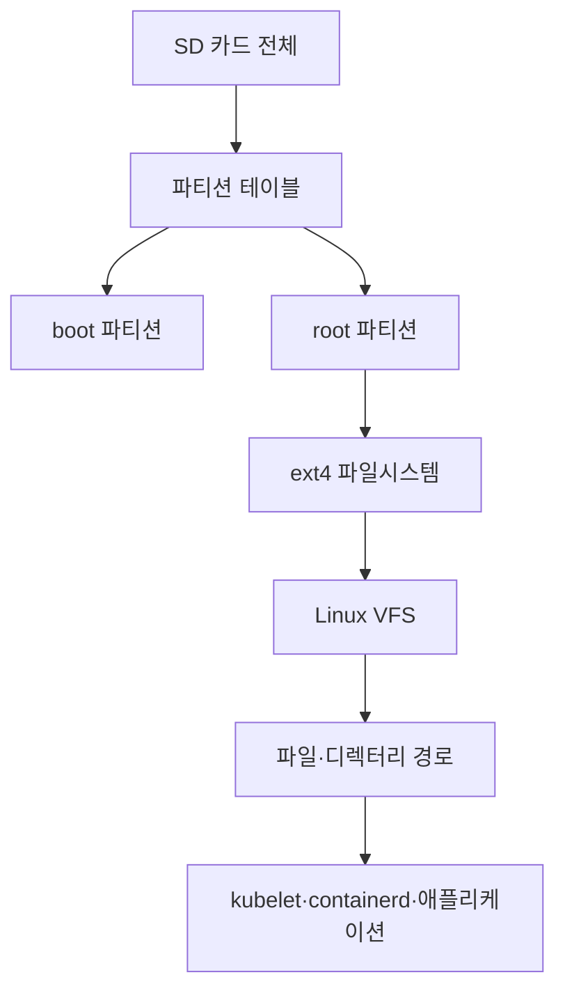
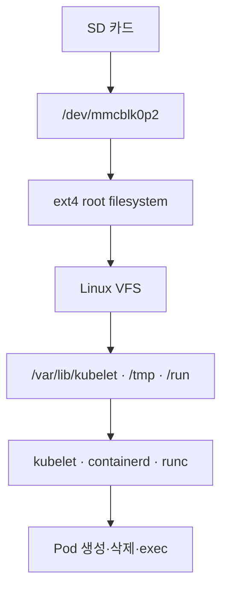

## SD 카드가 왜 Kubernetes 장애가 되는가

홈 Kubernetes 클러스터의 한 노드에서 Pod가 계속 `Pending` 상태에 머물렀다. 처음에는 CNI Pod 설정이나 스케줄링 문제라고 생각했다. 하지만 조사 결과는 조금 달랐다.

노드의 root filesystem이 ext4 오류 이후 read-only 상태로 동작하고 있었고, kubelet과 container runtime이 필요한 파일을 기록하지 못하고 있었다. 그 결과 Pod 생성, 종료, volume 정리, runtime 작업이 차례로 실패했다.

장애를 복구한 뒤에는 이런 질문이 남았다.

> SD 카드의 `/dev/mmcblk0p2`는 무엇이고, ext4는 정확히 무엇이며, 파일 하나를 저장하는 일이 어떻게 kubelet 장애로 이어지는가?


이 글에서는 특정 SD 카드 제품을 추천하려는 것이 아니다. SD 카드 위에서 동작하던 Ubuntu의 저장 구조를 분해해 보고, 왜 이번에는 파일시스템 복구만으로 끝내지 않고 카드를 교체하기로 했는지 정리한다.

## 먼저 결론: SD 카드 위에는 여러 계층이 있다

SD 카드는 단순히 파일을 담는 하나의 큰 상자가 아니다. Linux에서는 다음과 같은 계층으로 사용된다.



각 계층의 역할은 다르다.

| 계층 | 역할 |
| --- | --- |
| SD 카드 | 실제 데이터를 저장하는 물리 매체 |
| 파티션 | 저장장치를 여러 영역으로 나눈 경계 |
| ext4 | 한 파티션을 파일·디렉터리 구조로 사용하는 파일시스템 |
| VFS | 애플리케이션과 여러 파일시스템을 연결하는 Linux 공통 인터페이스 |
| kubelet/containerd | Pod와 컨테이너 상태를 파일시스템에 기록하고 정리하는 구성요소 |

이번 장애는 애플리케이션 데이터 파일 하나가 깨진 문제가 아니라, 이 계층 중 아래쪽에 있는 root filesystem의 쓰기가 막힌 문제였다.

## 1. `/dev/mmcblk0p2`는 무엇인가

Linux는 디스크와 파티션을 장치 파일로 표현한다.

```text
/dev/mmcblk0      SD 카드 전체
/dev/mmcblk0p1    첫 번째 파티션
/dev/mmcblk0p2    두 번째 파티션
```

이 이름을 나누어 보면 다음과 같다.

```text
/dev        장치 파일이 있는 경로
mmcblk0     첫 번째 MMC/SD 블록 장치
p2          두 번째 파티션
```

따라서 `/dev/mmcblk0p2`는 디렉터리 이름이 아니다. SD 카드 안에서 두 번째로 나뉜 저장 영역을 가리키는 장치 이름이다.

파티션은 파일시스템과도 다르다.

```text
SD 카드 전체
├─ 파티션 1: boot
└─ 파티션 2: root
   └─ ext4 파일시스템
      └─ Ubuntu의 /
```

실제 Ubuntu 환경에서는 다음 명령으로 확인할 수 있다.

```bash
lsblk -f
```

예상되는 구조는 다음과 비슷하다.

```text
NAME        FSTYPE FSVER LABEL UUID                                 MOUNTPOINTS
mmcblk0
├─mmcblk0p1 vfat         boot  ...                                  /boot/firmware
└─mmcblk0p2 ext4         root  ...                                  /
```

여기서 `FSTYPE`은 해당 파티션을 어떤 파일시스템으로 해석하는지 보여준다. 현재 노드에서는 `/dev/mmcblk0p2`를 `ext4`로 사용하고 있었다.

## 2. 파티션과 파일시스템은 어떻게 다른가

파티션은 저장장치를 나눈 **범위**다. 파일시스템은 그 범위 안에 파일과 디렉터리를 배치하는 **저장 형식**이다.

예를 들어 64GB SD 카드를 다음처럼 나눌 수 있다.

```text
0GB ~ 0.5GB       boot 파티션
0.5GB ~ 64GB      root 파티션
```

이 상태만으로는 root 파티션 안에 `/etc`, `/var`, `/home`이 존재하지 않는다. root 파티션에 ext4를 만들고 Ubuntu 파일을 복사한 뒤, `/`에 mount해야 운영체제가 사용할 수 있다.


다음 명령은 파티션에 새 ext4 구조를 만드는 예시다.

```bash
sudo mkfs.ext4 /dev/mmcblk0p2
```

이 명령은 기존 데이터를 삭제할 수 있다. 따라서 운영 중인 root 파티션에 실행하면 안 된다. Raspberry Pi Imager로 Ubuntu 이미지를 다시 쓰는 과정도 결과적으로 파티션과 파일시스템을 새로 만들고 운영체제 파일을 다시 배치하는 과정에 가깝다.

## 3. ext4는 Ubuntu 전용 규칙이 아니다

ext4는 Linux에서 사용하는 파일시스템의 이름이다. Ubuntu에서 많이 사용하지만 Ubuntu에만 종속된 것은 아니다.

ext4는 파티션의 raw block을 다음과 같은 구조로 해석한다.

- 파일명과 디렉터리 엔트리
- inode와 파일 권한
- 파일 크기와 시간 정보
- 파일이 차지하는 데이터 블록
- 빈 공간과 블록 할당 정보
- 파일시스템 상태와 journal

즉, ext4는 단순한 확장자나 설정값이 아니다.

> 디스크의 바이트를 Linux 파일·디렉터리로 해석하고 관리하는 실제 저장 형식

이라는 의미다.

Linux는 ext4 외에도 XFS, Btrfs, NFS, tmpfs 등 여러 파일시스템을 사용할 수 있다. 애플리케이션이 항상 ext4를 직접 호출하는 것도 아니다. 애플리케이션은 보통 `open`, `read`, `write`, `mkdir` 같은 Linux 파일 API를 호출한다.

## 4. inode는 파일을 찾기 위한 메타데이터다

ext4 안에는 파일 내용만 저장되는 것이 아니다. 파일과 디렉터리를 관리하기 위한 inode도 함께 저장된다.

inode는 파일의 실제 내용이 아니라 다음 메타데이터를 가진다.

- 파일 종류
- 권한과 소유자
- 파일 크기
- 생성·수정·접근 시간
- 하드 링크 수
- 실제 데이터 블록의 위치

파일명과 파일 내용 사이의 관계는 다음과 같다.


예를 들어 `/home/app/log.txt`를 읽을 때 Linux는 먼저 디렉터리에서 `log.txt`에 해당하는 inode 번호를 찾는다. 그다음 inode에서 실제 데이터 블록의 위치를 확인하고 파일 내용을 읽는다.

따라서 inode는 파일을 읽기 위한 별도의 네트워크 인터페이스가 아니라, **파일의 상태와 데이터 위치를 설명하는 파일시스템 메타데이터 레코드**다.

inode 자체도 디스크에 저장된다. ext4 파티션에는 보통 inode table이 있고, Linux 커널은 자주 사용하는 inode를 메모리에 캐시한다.

```text
ext4 파티션
├─ superblock
├─ inode table
├─ data block
└─ journal
```

### inode 소진이란 무엇인가

ext4를 만들 때는 데이터 블록뿐 아니라 사용할 inode의 개수도 정해진다. 파일을 하나 만들 때마다 보통 inode 하나가 필요하다.

```text
새 파일 생성
→ inode 할당
→ 디렉터리 엔트리 추가
→ 데이터 블록 할당
```

그래서 큰 파일 하나보다 작은 파일 수십만 개가 inode를 더 빠르게 소진시킬 수 있다.

```text
데이터 블록은 남아 있음
inode는 모두 사용됨
→ 새 파일 생성 실패
```

이 상태에서는 `df -h`만 보면 디스크 용량이 남아 있는 것처럼 보일 수 있다. inode 사용량은 별도로 확인해야 한다.

```bash
df -h /
df -i /
```

`df -i`에서 `IUse%`가 100%에 가까우면 파일·디렉터리·심볼릭 링크·소켓 같은 파일시스템 객체가 너무 많이 생성됐을 가능성이 있다.

```bash
sudo du --inodes -x -d 2 /var 2>/dev/null | sort -n | tail
```

삭제하면 inode가 바로 해제되는 것도 아니다. 일반적으로 파일명을 삭제하면 디렉터리 엔트리가 사라지고 inode의 링크 수가 줄어든다. 마지막 하드 링크까지 없어지고, 파일을 열고 있던 프로세스도 파일을 닫아야 inode와 데이터 블록이 해제된다.

```text
name-a ─┐
        ├─ inode 1234
name-b ─┘
```

`name-a`만 삭제하면 `name-b`가 남아 있으므로 inode는 유지된다. 반대로 프로세스가 파일을 열고 있는 상태에서 파일명을 삭제하면 이름은 사라져도 프로세스가 파일을 닫을 때까지 실제 inode가 남을 수 있다.

이번 장애에서 `fsck`가 보고한 `corrupted orphan linked list`도 이 계층과 관련 있다. 파일을 생성·삭제하거나 inode의 연결 상태를 변경하는 도중 비정상 종료되면 디렉터리에서 분리됐지만 아직 정리되지 않은 inode가 남을 수 있다. `fsck.ext4`는 이런 파일시스템 구조를 검사하고 연결 상태를 복구한다.

## 5. Linux VFS는 파일시스템 사이의 공통 입구다

VFS는 Virtual File System의 약자다. Linux 커널 안에서 애플리케이션과 실제 파일시스템 구현 사이를 연결하는 계층이다.

```text
애플리케이션
    │ open(), read(), write(), mkdir()
    ▼
Linux VFS
    ├─ ext4
    ├─ XFS
    ├─ NFS
    └─ tmpfs
    ▼
블록 디바이스 또는 네트워크 저장소
```

애플리케이션은 아래 경로가 ext4인지 XFS인지 알 필요가 없다.

```c
open("/var/lib/kubelet/checkpoint", ...);
```

Linux VFS가 경로를 해석하고, 실제 mount 지점에 연결된 파일시스템 구현으로 요청을 넘긴다. `/var/lib/kubelet`이 ext4 위에 있으면 ext4가 처리하고, NFS 위에 있으면 NFS 구현이 처리한다.

이번 장애에서 kubelet 로그에 다음이 찍혔다는 것은 단순히 kubelet 코드가 잘못됐다는 뜻이 아니다.

```text
read-only file system
```

파일 쓰기 요청이 VFS를 거쳐 ext4에 도착했지만, ext4가 read-only 상태여서 최종적으로 거부됐다는 의미다.

## 6. ext4 journal은 무엇을 보호하는가

파일시스템이 파일을 수정하는 과정은 한 번의 단순한 쓰기로 끝나지 않는다. 예를 들어 새 파일을 만들면 다음 정보가 함께 바뀐다.

1. 디렉터리에 새 파일명이 추가된다.
2. inode가 할당된다.
3. 파일 크기와 권한이 기록된다.
4. 데이터 블록이 할당된다.
5. 실제 내용이 저장된다.

이 작업 중 전원이 꺼지면 일부 정보만 저장될 수 있다. ext4 journal은 파일시스템 변경 작업을 기록해 비정상 종료 뒤 구조를 복구할 수 있도록 돕는다.

개념적으로는 다음과 같다.

```text
파일시스템 변경
    ↓
journal에 transaction 기록
    ↓
inode·directory·block 정보 반영
    ↓
commit 기록
```

다음 부팅에서 commit이 완료되지 않은 transaction을 발견하면 ext4는 journal을 replay하거나 버린다. 이를 통해 파일시스템 메타데이터가 중간 상태로 남는 것을 줄인다.

다만 ext4의 기본 `data=ordered` 모드에서는 파일시스템 메타데이터가 주로 journal의 보호 대상이다. 애플리케이션 파일 내용 전체가 항상 journal에 그대로 저장된다는 의미는 아니다. [Linux ext4 journal documentation](https://www.kernel.org/doc/html/latest/filesystems/ext4/journal.html)

## 7. PostgreSQL WAL과 비슷하지만 같은 것은 아니다

ext4 journal을 PostgreSQL WAL과 비교하면 개념을 이해하기 쉽다.

| 구분 | ext4 journal | PostgreSQL WAL |
| --- | --- | --- |
| 계층 | Linux 파일시스템 | 데이터베이스 |
| 보호 대상 | inode·디렉터리·블록 등 파일시스템 구조 | 트랜잭션·데이터베이스 페이지 |
| 목적 | 파일시스템 메타데이터 일관성 회복 | 데이터베이스 변경 재생과 복구 |
| 복구 주체 | ext4/jbd2 | PostgreSQL |

공통점은 있다.

```text
변경 기록을 먼저 남김
→ 실제 구조에 반영
→ 장애 후 기록을 사용해 복구
```

하지만 두 기록은 서로 대체할 수 없다.

- ext4 journal이 정상이어도 PostgreSQL의 논리적인 트랜잭션 복구를 대신하지 못한다.
- PostgreSQL WAL이 정상이어도 WAL 파일이 저장된 ext4가 깨지면 PostgreSQL이 파일을 읽지 못할 수 있다.
- ext4 journal은 파일시스템 구조를 보호하고, WAL은 데이터베이스 의미를 보호한다.

이번 장애는 PostgreSQL 데이터베이스 복구 문제가 아니라, 더 아래 계층인 root filesystem이 read-only가 되어 kubelet과 containerd가 파일을 쓰지 못한 문제였다.

## 8. 이번 장애는 이 계층에서 발생했다

이번 `raspi-02`의 저장 구조를 단순화하면 다음과 같다.



ext4 오류가 발생하면 다음과 같은 흐름이 가능하다.

```text
SD 카드 쓰기 오류
  ↓
ext4 오류 감지
  ↓
errors=remount-ro 정책에 따라 read-only 재마운트
  ↓
VFS를 통한 write() 실패
  ↓
kubelet checkpoint·volume cleanup 실패
  ↓
Pod Pending·Terminating 또는 drain 지연
```

실제로 확인한 증거는 다음과 같았다.

```text
/dev/mmcblk0p2 ext4 ... errors=remount-ro
Filesystem state: not clean
EXT4-fs (mmcblk0p2): mounted filesystem without journal
read-only file system
```

kubelet 로그에서도 다음 실패가 나타났다.

```text
could not save checkpoint ... read-only file system
error occurred when trying to remove the volumes dir: read-only file system
OCI runtime exec failed ... open /tmp/runc-process...: read-only file system
```

이 때문에 `rke2-canal` Pod의 Pending 알림이 실제로는 노드의 저장장치 문제를 드러내는 신호가 됐다.

## 9. PVC가 없어도 노드 디스크는 필요하다

여기서 한 가지 혼동이 있었다. 문제가 된 `platform-ops-log` Pod에는 별도 PVC가 없었다. 그렇다면 디스크 문제와 무관하지 않을까 생각할 수 있다.

하지만 PVC는 애플리케이션이 데이터를 보존하기 위한 저장소일 뿐이다. 모든 Pod는 실행되는 동안 다음과 같은 노드 로컬 경로를 사용한다.

- `/var/lib/kubelet`: Pod 상태, checkpoint, volume 정보
- `/var/log/pods`: Pod 로그
- `/run`: container runtime과 kubelet의 상태·소켓
- `/tmp`: runtime 실행에 필요한 임시 파일
- `emptyDir`: Pod 수명 동안 사용하는 임시 저장공간
- `configMap`, `secret`, service account 주입 경로

따라서 다음 두 문장은 서로 다르다.

```text
이 Pod는 PVC를 사용하지 않는다.
이 Pod는 노드 디스크를 사용하지 않는다.  ← 틀린 판단
```

이번 문제는 애플리케이션 데이터가 저장된 PVC 손상이 아니라, Pod lifecycle을 처리하는 노드의 root filesystem 쓰기 실패였다.

## 10. fsck는 무엇을 해결했고, 무엇을 해결하지 못했나

정상 실행 중인 root filesystem을 바로 복구하면 파일시스템과 실행 중인 프로세스가 충돌할 수 있다. 그래서 initramfs 환경에서 root 파티션을 offline 상태로 두고 다음 명령을 실행했다.

```bash
fsck.ext4 -f /dev/mmcblk0p2
```

검사 중에는 다음 오류가 확인됐다.

```text
Inodes that were part of a corrupted orphan linked list found.
FILE SYSTEM WAS MODIFIED
```

수정에 동의한 뒤 다시 `fsck.ext4`를 실행했을 때 추가 수정 메시지가 나오지 않았다. 이는 해당 시점에 검사 도구가 더 수정할 파일시스템 구조를 찾지 못했다는 뜻이다.

하지만 다음 두 문장은 다르다.

```text
fsck로 파일시스템 구조를 복구했다.
SD 카드가 앞으로도 안정적이라는 사실을 증명했다.  ← 아님
```

`fsck`는 파일시스템 메타데이터의 일관성을 복구하는 도구다. SD 카드의 플래시 셀 노후, 컨트롤러 문제, 전원 불안정, 반복적인 쓰기 실패까지 제거해 주지는 않는다.

## 11. 그래서 운영 노드로 바로 되돌리지 않았다

복구 후 정상 부팅과 SSH 접속은 확인했지만, 다음 근거가 남아 있었다.

1. root filesystem이 `/dev/mmcblk0p2`라는 SD 카드 파티션이었다.
2. kubelet checkpoint와 volume 정리가 read-only로 실패했다.
3. runc의 `/tmp` 임시 파일 생성도 실패했다.
4. 파일시스템 상태가 `not clean`이었다.
5. journal 관련 이상과 systemd journal corruption 기록이 있었다.
6. fsck는 구조를 복구했지만 저장장치 자체의 재발 가능성은 제거하지 못했다.

따라서 정확한 하드웨어 고장 지점을 단정한 것은 아니다. 다만 장애를 한 번 일으킨 저장장치를 다시 Kubernetes root disk로 신뢰하는 것은 위험하다고 판단했다.

결론은 다음과 같았다.

```text
노드 cordon 유지
→ 중요한 PV가 해당 노드에 없는지 확인
→ 새 SD 카드에 Ubuntu 재설치
→ RKE2와 노드 구성 복구
→ Ready·filesystem·workload 상태 검증
→ 마지막에만 uncordon
```

가능하다면 다음 구성에서는 SD 카드보다 USB SSD를 RKE2 root disk로 사용하는 방향도 검토할 수 있다. 하지만 저장장치를 바꾼다고 모든 운영 문제가 해결되는 것은 아니므로, 백업과 복구 절차도 함께 준비해야 한다.

## 정리: 장애를 이해하려면 계층을 나눠 봐야 한다

처음에는 “Pod가 Pending이다”라는 Kubernetes 증상만 보였다. 하지만 실제 흐름은 다음과 같았다.

```text
Pod Pending
  ↓
노드 kubelet 상태 보고 이상
  ↓
kubelet·runc 파일 쓰기 실패
  ↓
root filesystem read-only
  ↓
ext4 오류와 journal 이상
  ↓
SD 카드 기반 저장장치 신뢰성 문제
```

이번 장애에서 남긴 운영 기준은 단순하다.

> `fsck`가 통과했다는 이유만으로 저장장치를 다시 신뢰하지 않는다. 파일시스템 복구와 저장매체 교체 판단을 분리한다.

그리고 Kubernetes 장애를 볼 때도 Pod YAML만 보지 않는다.

```text
Pod
→ Node
→ kubelet
→ containerd/runc
→ VFS
→ ext4
→ block device
→ 실제 저장매체
```

문제가 어느 계층에서 발생했는지 좁혀야, Pod 설정을 불필요하게 수정하지 않고 실제 원인에 맞는 조치를 선택할 수 있다.

## 참고 자료

- [Linux Kernel: Overview of the Virtual File System](https://docs.kernel.org/filesystems/vfs.html)
- [Linux Kernel: ext4 journal](https://www.kernel.org/doc/html/latest/filesystems/ext4/journal.html)
- [Linux Kernel: ext4 general information](https://cdn.kernel.org/doc/html/latest/admin-guide/ext4.html)
- [Linux Kernel: ext4 high-level design](https://www.kernel.org/doc/html/latest/filesystems/ext4/overview.html)
- [Kubernetes: Volumes](https://kubernetes.io/docs/concepts/storage/volumes/)
- [Kubernetes: Safely Drain a Node](https://kubernetes.io/docs/tasks/administer-cluster/safely-drain-node/)
