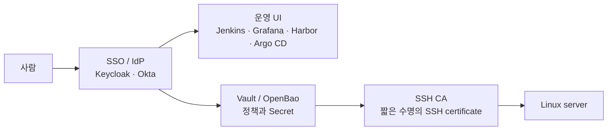
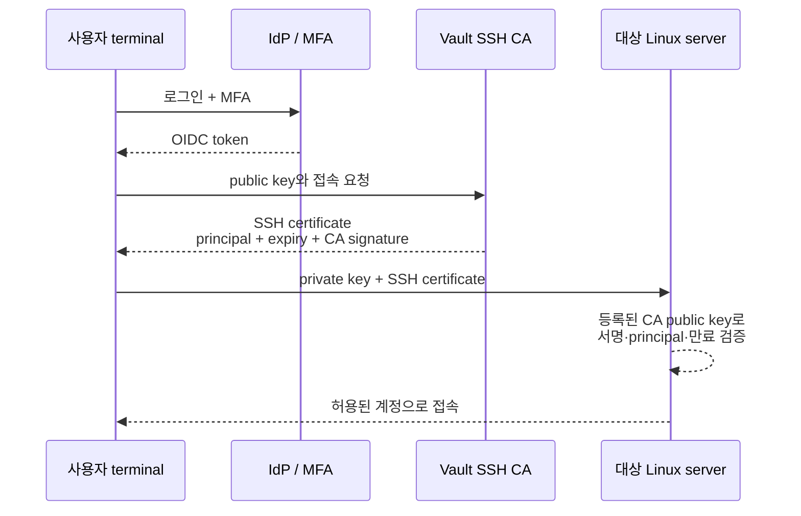
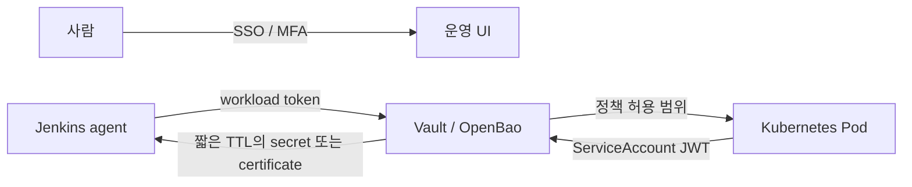
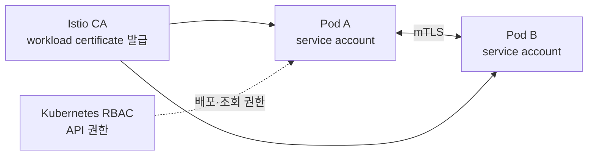

홈 클러스터를 Cloudflare Tunnel로 외부에 공개한 뒤 브라우저 주소창의 자물쇠를 보면서 질문이 이어졌다. Cloudflare가 CA인가? Vault나 OpenBao는 SSH 키를 보관하는 도구인가? Keycloak은 Jenkins에 로그인만 시키는가? Istio의 mTLS에는 또 다른 CA가 필요한가?

이 질문들은 모두 비슷해 보이지만 실제로는 다른 경계를 다룬다. 이 글은 개별 제품의 설치 가이드가 아니라, **사람·자동화·워크로드가 여러 서버와 도구에 접근할 때 무엇을 누가 확인하는지**를 이해하기 위해 정리한 기록이다.

먼저 범위를 분명히 한다. 현재 개인 RKE2 클러스터에서는 Cloudflare Tunnel을 통해 서비스를 외부에 노출하고 있다. 반면 Keycloak SSO, Vault/OpenBao SSH CA, Istio mTLS는 이 환경에 아직 도입하지 않았다. 아래 내용 중 이 세 도구의 연결 구조는 공식 문서와 공개 사례를 바탕으로 정리한 학습·설계 범위다.

## 먼저 한 장으로 역할을 나눠 보기

여기서 가장 많이 섞이는 단어는 인증, 권한, 인증서, 암호화다. 역할을 먼저 나누면 제품 이름이 바뀌어도 구조를 이해할 수 있다.

| 질문 | 담당 개념 | 예시 |
| --- | --- | --- |
| **누구인가?** | 인증(Authentication) | Keycloak, Okta, MFA, SSH certificate principal |
| **무엇을 할 수 있는가?** | 인가(Authorization) | Kubernetes RBAC, Vault policy, Jenkins role |
| **통신을 믿고 암호화할 수 있는가?** | TLS, CA, certificate | 브라우저 HTTPS, service mesh mTLS |
| **비밀값을 어디서 받아 쓸 것인가?** | Secret 관리와 workload identity | Vault/OpenBao, Kubernetes ServiceAccount |

SSO, Vault, CA, Istio는 서로 대체재가 아니다. 같은 요청에서 여러 도구가 순서대로 참여할 수 있다.



이 그림에서 SSO는 사람의 로그인, Vault policy는 권한, SSH CA는 서버 접속용 증명서를 맡는다. 하나를 도입했다고 나머지가 자동으로 해결되지는 않는다.

## Cloudflare Tunnel에서 브라우저 자물쇠가 뜻하는 것

개인 환경에서 실제로 확인한 지점부터 시작해 보자. 사용자가 `https://<public-hostname>`에 접속하면 브라우저는 먼저 Cloudflare edge와 TLS 연결을 맺는다. Chrome은 도메인 이름, 인증서 발급 체인, 유효 기간 등을 확인한다. Cloudflare의 Universal SSL은 이 방문자 구간의 공개 신뢰 인증서를 자동으로 발급하고 갱신한다. [Cloudflare Universal SSL 문서](https://developers.cloudflare.com/ssl/edge-certificates/universal-ssl/)


여기서 Cloudflare는 방문자에게는 CA가 서명한 인증서를 제공하는 edge 역할을 한다. 다만 Cloudflare 자체가 내가 운영하는 Linux server의 SSH CA가 되는 것은 아니다. 또한 자물쇠는 적어도 **브라우저와 Cloudflare 사이의 HTTPS가 정상 검증되었다**는 뜻이지, 내부 서비스 전체의 권한 설계나 애플리케이션 보안까지 보증한다는 뜻은 아니다.

Tunnel 이후 Cloudflare와 origin 사이를 HTTP로 연결할지 HTTPS로 연결할지는 tunnel과 origin 설정에 따라 달라진다. Cloudflare도 방문자 구간의 edge certificate와 origin 구간의 certificate를 별도 계층으로 설명한다. [Cloudflare SSL/TLS 개요](https://developers.cloudflare.com/ssl/)

공개 hostname의 edge 인증서는 다음처럼 확인할 수 있다.

```bash
openssl s_client \
  -connect <public-hostname>:443 \
  -servername <public-hostname> \
  </dev/null 2>/dev/null |
  openssl x509 -noout -subject -issuer -dates
```

이 명령은 브라우저가 신뢰한 origin 구성을 모두 보여 주지는 않는다. 공개 endpoint가 제시한 서버 인증서의 subject, issuer, 만료일을 확인하는 첫 단계다.

## CA와 TLS: "암호화 기능"보다 신뢰를 연결하는 구조

TLS는 통신 내용을 암호화하고, 전송 중 변조를 막고, 상대가 기대한 서버인지 확인하는 프로토콜이다. 이때 certificate는 공개 키와 identity를 묶은 문서에 가깝고, CA(Certificate Authority)는 그 묶음에 서명해 “이 공개 키가 이 이름의 주체에 연결된다”는 신뢰 사슬을 만든다.

PKI(Public Key Infrastructure)는 이 certificate와 공개 키, 개인 키, CA, 발급·갱신·폐기 절차를 함께 부르는 말이다. 제품 하나의 이름이 아니라 공개 키 기반 신뢰를 운영하는 체계다.

일반 인터넷에서는 브라우저와 OS가 신뢰하는 public CA가 중요하다. 반면 사내 서비스, Kubernetes workload, SSH 접속처럼 외부 브라우저가 직접 보지 않는 영역은 조직이 private CA를 둘 수 있다. HashiCorp Vault의 PKI secrets engine은 동적으로 X.509 certificate를 발급하고 root 또는 intermediate CA 구성을 지원한다. [Vault PKI 문서](https://developer.hashicorp.com/vault/docs/secrets/pki)

Vault가 private CA가 **될 수 있다**는 말은 Vault가 모든 인증을 대신한다는 뜻은 아니다. Vault의 PKI engine 또는 SSH secrets engine을 활성화하고, 조직이 신뢰할 CA public key/certificate를 대상에 배포했을 때 발급 역할을 할 수 있다는 뜻이다.

## SSH CA는 private key를 중앙에 모으는 방식이 아니다

처음에는 “Vault가 SSH key를 보관하고 대신 접속하는가?”라고 생각했다. SSH CA 방식의 핵심은 개인 private key를 중앙에 보관하는 것이 아니라, **사용자가 가진 public key에 짧은 수명의 서명 certificate를 붙이는 것**이다.



대상 server에는 SSH CA의 **public key**를 `TrustedUserCAKeys`로 등록한다. 사용자는 자신의 private key와 Vault가 서명한 SSH certificate를 함께 제시한다. 서버는 CA에 실시간으로 질의하지 않아도 CA public key로 서명, principal, 만료 시간을 로컬에서 검증할 수 있다. HashiCorp의 SSH signed certificate 문서도 이 모델과 `TrustedUserCAKeys` 설정을 설명한다. [Vault SSH signed certificates 문서](https://developer.hashicorp.com/vault/docs/secrets/ssh/signed-ssh-certificates)

그래서 private key를 Vault에 저장하는 것이 기본 모델은 아니다. 로컬 key를 유지한 채 certificate의 TTL을 짧게 두고, 사람의 SSO group 또는 Vault policy에 따라 허용 principal을 제한하는 것이 일반적인 방향이다.

이 구조는 수백 대 서버에 개인 public key를 추가·삭제하는 부담을 줄인다. 다만 짧은 TTL이 모든 문제를 즉시 해결하지는 않는다. 이미 발급한 certificate를 즉시 차단해야 하는 요구가 있다면 TTL, CA key rotation, 접근 경로, 별도 revocation 전략을 함께 검토해야 한다.

## SSO와 Vault policy: 로그인과 서버 권한을 같은 것으로 보지 않기

Keycloak이나 Okta 같은 IdP는 OIDC, OAuth 2.0, SAML을 통해 사람의 로그인과 MFA, group/role 관리를 중앙화한다. Keycloak은 사용자·role·client를 중앙에서 관리하고 OIDC/OAuth 2.0/SAML을 지원한다. [Keycloak Server Administration Guide](https://www.keycloak.org/docs/latest/server_admin/)

예를 들어 사람이 Grafana, Harbor, Argo CD, Jenkins UI에 들어갈 때는 SSO로 “누구인가”를 확인할 수 있다. 그 뒤 각 도구 또는 proxy가 group claim을 role로 매핑해 읽기, 배포 승인, 관리자 권한을 나눈다.

Vault/OpenBao도 OIDC 같은 auth method로 로그인 주체를 확인하고 policy를 연결할 수 있다. 그러나 Vault policy가 곧 Jenkins administrator 권한을 뜻하지는 않는다. Vault policy는 Vault 안의 secret path, certificate 발급 role, token TTL 같은 **Vault 내부 권한**이다. [Vault auth methods 문서](https://developer.hashicorp.com/vault/docs/auth)

정리하면 다음과 같다.

- SSO/IdP: `kim`이라는 사람이 로그인했는지와 group 정보를 확인한다.
- Jenkins/Grafana/Argo CD: 그 사람이 UI에서 어떤 동작을 할 수 있는지 결정한다.
- Vault/OpenBao: 그 사람이 또는 workload가 어떤 secret과 certificate를 받을 수 있는지 결정한다.
- SSH CA: 허용된 조건의 certificate를 발급한다.
- Linux server: certificate의 principal과 만료를 확인해 local account 접속을 허용한다.

## 사람 계정과 자동화 계정은 같은 방식으로 다루지 않는다

Jenkins pipeline이나 Ansible automation은 사람이 매번 MFA를 통과해 SSH password를 입력하는 방식으로 돌리면 안 된다. 이런 workload에는 사람이 가진 계정과 별도의 identity가 필요하다.

CI runner가 Vault/OpenBao에서 registry credential이나 deploy secret을 가져올 때는 환경에 따라 OIDC/JWT, AppRole, Kubernetes auth처럼 짧은 수명의 workload credential을 쓴다. 현재 Jenkins 경로에서 OpenBao를 통해 배포 secret을 조회한 경험은 있지만, 아래의 OIDC workload identity 전체를 이미 구성했다는 뜻은 아니다.

Kubernetes에서는 Pod가 ServiceAccount token을 제시해 Vault에 자신을 증명하는 흐름을 사용할 수 있다. Vault는 Kubernetes auth 또는 JWT/OIDC auth와 policy를 조합할 수 있다. [Vault Kubernetes OIDC 문서](https://developer.hashicorp.com/vault/docs/auth/jwt/oidc-providers/kubernetes)



핵심은 “누가 호출했는지”가 사람인지 automation인지 분리하는 것이다. 사람의 SSO session을 pipeline에 재사용하는 것이 아니라, pipeline에 필요한 최소 권한을 가진 별도 workload identity를 설계한다.

## Kubernetes RBAC와 Istio mTLS는 다른 층을 본다

Kubernetes에서 IdP와 OIDC를 연결하면 API server는 사용자 또는 service account의 identity를 받고, RBAC가 namespace와 resource별 권한을 결정한다. Kubernetes는 OIDC provider를 통한 사용자 인증을 지원하지만 IdP 자체를 제공하지는 않는다. [Kubernetes Authentication 문서](https://kubernetes.io/docs/reference/access-authn-authz/authentication/)

반면 Istio mTLS는 Pod 사이의 통신을 보호하는 workload identity와 transport security에 가깝다. 서비스 A가 서비스 B를 호출할 때 서로의 workload certificate를 검증하고, 통신을 암호화한다. “이 사람이 Deployment를 수정할 수 있는가?”를 결정하는 Kubernetes RBAC와는 다른 문제다.



Istio는 기본적으로 Istiod가 mesh의 mTLS CA 역할을 할 수 있다. 따라서 Istio를 쓰려면 처음부터 Vault PKI가 반드시 필요한 것은 아니다. 여러 cluster/VM에 신뢰 체계를 통합하거나, 조직의 중앙 CA·감사·규정 요구가 있을 때 외부 CA 연동을 검토하는 식이 자연스럽다. Istio 공식 문서도 기본 self-signed CA와 external CA plug-in 구성을 구분한다. [Istio security model](https://istio.io/latest/docs/ops/deployment/security-model/) · [Istio CA certificates](https://istio.io/latest/docs/tasks/security/cert-management/plugin-ca-cert/)

## 내 환경에서는 무엇부터 확인하는 편이 현실적인가

이 도구들을 한 번에 추가하면 오히려 장애 원인과 책임 경계가 흐려질 수 있다. 현재 RKE2와 Cloudflare Tunnel 환경에서라면 다음 순서가 현실적이다.

1. **현재 HTTPS 경계 확인**: public hostname의 certificate와 Cloudflare Tunnel의 origin 연결 방식을 확인한다.
2. **운영 UI 하나에 SSO 적용**: Grafana 또는 Argo CD처럼 영향 범위가 명확한 도구 하나를 대상으로 IdP, group, viewer/admin role 매핑을 검증한다.
3. **Kubernetes API 접근 분리**: 사람의 OIDC identity와 cluster RBAC를 namespace 단위로 최소 권한부터 설계한다.
4. **Pod workload identity 검증**: ServiceAccount와 secret policy를 연결해 Pod가 필요한 secret만 받는지 확인한다.
5. **service-to-service mTLS 검토**: 실제로 분리된 service 간 통신과 정책 요구가 생겼을 때 Istio default CA부터 검증한다.
6. **SSH CA는 마지막에 도입**: server 수와 접속 인원이 늘어나며 authorized key 배포·회수 비용이 커질 때 짧은 TTL certificate 흐름을 실험한다.

이 순서에서 중요한 것은 제품 수가 아니다. 어느 요청이 어느 identity로 들어왔는지, 권한은 어디서 결정되는지, certificate는 누구에게 어떤 TTL로 발급되는지를 로그와 정책으로 설명할 수 있어야 한다.

## 실무 사례를 읽을 때 볼 지점

비슷한 구조를 공개한 글은 많지만, 모든 도구를 한 회사가 같은 방식으로 쓰지는 않는다. 그래서 제품 이름보다 identity 전달 경로를 따라 읽는 편이 좋다.

- [HyperAccel: ARC와 Vault 연동](https://hyper-accel.github.io/posts/arc-setup-guide/): GitHub Actions OIDC token과 Kubernetes workload 인증을 Vault policy에 연결한 사례다.
- [AWS Open Source: EKS에서 Istio로 zero trust 구성](https://aws.amazon.com/blogs/opensource/achieving-zero-trust-security-on-amazon-eks-with-istio/): Keycloak OIDC/JWT, ingress, Istio mTLS를 서로 다른 층으로 다룬다.
- [Indeed Engineering: SPIRE OIDC와 Istio workload identity](https://engineering.indeedblog.com/blog/2024/07/workload-identity-with-spire-oidc-for-k8s-istio/): multi-cluster workload identity를 어떻게 분리하는지 볼 수 있다.

세 사례 모두 “Vault/Keycloak/Istio를 같이 쓴다”가 결론은 아니다. 사람, CI, Pod, 서비스 간 통신이 각각 어떤 credential을 사용하고 어떤 policy를 통과하는지 읽어 보는 것이 핵심이다.

## 정리

Cloudflare Tunnel은 외부 사용자가 서비스에 안전하게 들어오는 HTTPS 경계를 만든다. SSO는 사람이 누구인지 확인하고, RBAC와 Vault policy는 각 시스템에서 무엇을 할 수 있는지 제한한다. SSH CA는 서버 접속용 identity를 짧은 수명의 certificate로 바꾸고, Istio mTLS는 Pod 간 통신 identity와 암호화를 다룬다.

모두 보안 도구지만 해결하는 문제는 다르다. 다음 실습에서는 SSO나 Istio를 무작정 추가하기보다, 현재 Cloudflare Tunnel과 RKE2 접근 경계부터 확인하고 운영 UI 하나에만 최소 권한 SSO를 연결해 보는 방식으로 검증할 계획이다.

## 참고 자료

- [Cloudflare Universal SSL](https://developers.cloudflare.com/ssl/edge-certificates/universal-ssl/)
- [Cloudflare SSL/TLS 개요](https://developers.cloudflare.com/ssl/)
- [Vault PKI secrets engine](https://developer.hashicorp.com/vault/docs/secrets/pki)
- [Vault SSH signed certificates](https://developer.hashicorp.com/vault/docs/secrets/ssh/signed-ssh-certificates)
- [Vault auth methods](https://developer.hashicorp.com/vault/docs/auth)
- [Keycloak Server Administration Guide](https://www.keycloak.org/docs/latest/server_admin/)
- [Kubernetes Authentication](https://kubernetes.io/docs/reference/access-authn-authz/authentication/)
- [Istio security model](https://istio.io/latest/docs/ops/deployment/security-model/)
- [Plug in CA certificates](https://istio.io/latest/docs/tasks/security/cert-management/plugin-ca-cert/)
