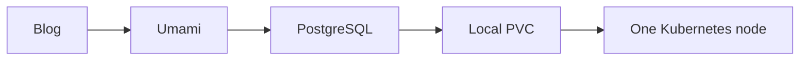
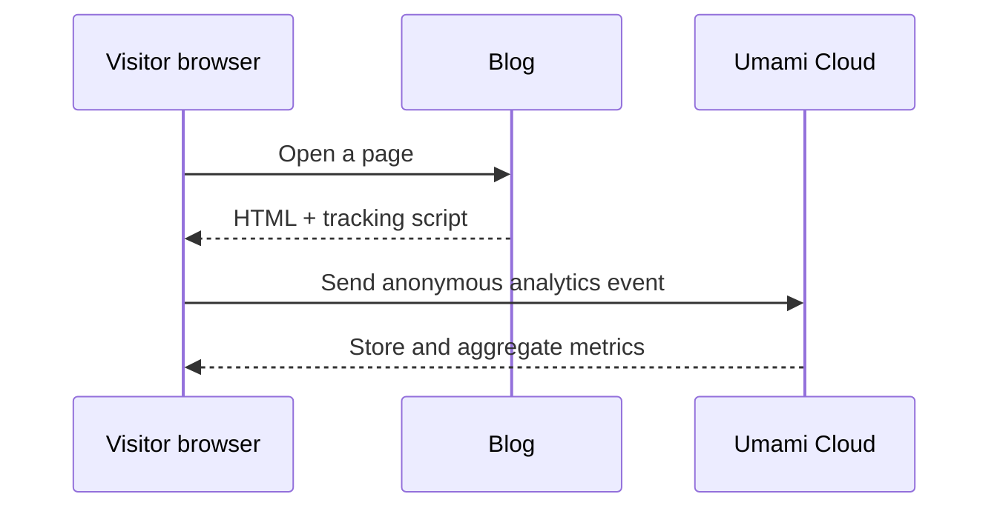

처음에는 블로그 방문자 수를 따로 수집해야 한다는 생각보다, 이미 구축해 둔 관측 환경으로 해결할 수 있는지부터 고민했다. 클러스터에는 Prometheus, Grafana, Loki가 연결되어 있었다.

Prometheus와 Grafana로 Pod의 CPU·메모리와 애플리케이션 metric을 보고, Loki로 로그를 검색하면 블로그가 정상적으로 동작하는지는 확인할 수 있다. 그렇다면 방문자 수나 글별 조회 수도 이 조합으로 만들 수 있지 않을까?

곧 질문의 성격이 다르다는 것을 알게 됐다.

```text
Prometheus + Grafana + Loki
  → 서버, Pod, 애플리케이션의 상태

웹 분석 도구
  → 방문자, 페이지 조회, 유입 경로, 디바이스, 세션
```

Prometheus에 페이지 조회 수를 counter로 보낼 수는 있다. Loki에 방문 이벤트를 로그로 남길 수도 있다. 하지만 그러려면 브라우저 추적 코드, 방문자·세션 구분, 개인정보 처리, 이벤트 저장 형식, 조회용 dashboard를 직접 설계해야 한다. 인프라 관측 도구를 웹 분석 제품처럼 사용하는 순간, 부족한 부분을 직접 채워야 했다.

그래서 “그렇다면 분석 시스템을 직접 구축해야 하나?”라는 다음 질문으로 넘어갔다. 이것저것 찾아보다 Umami를 알게 됐고, 처음에는 내 Kubernetes에 Umami와 PostgreSQL을 올리는 방식을 검토했다.

이 글은 Umami 사용법 자체보다 **기존 관측 스택으로 충분하지 않았던 이유와, 분석 데이터를 어디에서 운영할 것인가를 결정한 과정**에 대한 기록이다.

## 기존 관측 스택과 웹 분석은 경계가 달랐다

내가 이미 가진 관측 환경은 인프라와 애플리케이션의 상태를 확인하는 데 적합했다.

- Prometheus: 시간에 따른 metric 수집
- Grafana: metric과 로그를 dashboard로 시각화
- Loki: 애플리케이션과 인프라 로그 검색

이 도구들은 “서비스가 살아 있는가”, “메모리가 증가하는가”, “오류 로그가 발생했는가” 같은 질문에 답한다. 반면 블로그 운영에서 궁금한 것은 “어떤 글을 읽었는가”, “어디에서 들어왔는가”, “모바일로 보는가”였다.

두 종류의 질문을 억지로 하나의 스택에 넣기보다, 웹 분석에 맞는 도구를 따로 선택하는 편이 단순했다.

## 그래서 처음에는 Kubernetes에 올리려고 했다

Umami를 알게 된 뒤에는 이미 운영 중인 홈 Kubernetes 클러스터에 직접 올리는 구성을 자연스럽게 떠올렸다.



Umami Pod 자체는 비교적 단순하다. 문제는 PostgreSQL이다. 통계 데이터는 상태를 가지므로 저장 공간이 필요하고, `local-path` PVC를 사용하면 데이터가 특정 노드의 디스크에 묶인다.

Kubernetes의 local volume은 노드에 연결된 저장소라는 특성이 있다. 따라서 Pod를 다른 노드로 옮기는 것만으로는 데이터 문제가 해결되지 않는다. 저장된 디스크와 노드가 함께 살아 있어야 한다. [Kubernetes Volumes 공식 문서](https://kubernetes.io/docs/concepts/storage/volumes/)

즉, 다음 항목이 새 운영 대상이 된다.

- PostgreSQL 비밀번호와 `DATABASE_URL` 관리
- PVC 용량과 노드 고정
- PostgreSQL 업그레이드
- 디스크 장애 대응
- 정기 백업과 복구 테스트
- 홈 클러스터 장애 시 통계 데이터 복구

방문자 수를 확인하려고 시작한 일이 작은 데이터베이스 운영 프로젝트로 변하는 순간이었다.

## Umami Cloud를 보고 질문이 바뀌었다

Umami Cloud에서는 계정을 만든 뒤 Website를 추가하고, Website ID를 추적 스크립트에 넣으면 된다.

Astro 블로그의 공통 head에 다음과 같은 코드를 넣었다.

```astro
<script
	is:inline
	defer
	src="https://cloud.umami.is/script.js"
	data-website-id="YOUR_WEBSITE_ID"
></script>
```

배포 뒤 실제 블로그 HTML에 스크립트가 포함됐는지 확인하고, Umami Cloud 대시보드에서 방문 데이터를 확인하면 된다.



이 구조에서는 블로그를 Kubernetes에 배포하는 일과 분석 시스템을 운영하는 일이 분리된다. 블로그는 계속 내 서버에서 실행하지만, 분석 데이터 저장과 분석 UI는 Umami Cloud가 맡는다.

## 두 방식의 차이

| 항목 | Umami Cloud 무료 플랜 | Kubernetes self-host |
| --- | --- | --- |
| 설치 | 필요 없음 | Umami, PostgreSQL, PVC 필요 |
| 업데이트 | Umami가 관리 | 직접 관리 |
| 데이터 위치 | Umami Cloud의 리전 | 내 클러스터와 디스크 |
| 백업 | Cloud export 사용 | 직접 백업·복구 구성 |
| 장애 범위 | Cloud 서비스 의존 | 노드·디스크·DB 장애까지 책임 |
| 확장 | Cloud가 처리 | CPU, 메모리, DB를 직접 확장 |
| 커스터마이징 | Cloud API 범위 내 | DB와 API를 직접 통제 |
| 비용 | 개인·저트래픽용 Hobby 무료 플랜 | 소프트웨어 외 운영 비용 발생 |

Umami는 Cloud를 관리형 서비스로 제공하고, Hobby 플랜은 개인 프로젝트와 낮은 트래픽 사이트를 대상으로 한다. Cloud 데이터는 export할 수 있으므로, 나중에 직접 운영으로 옮길 가능성도 남아 있다. [Umami Cloud 개요](https://docs.umami.is/docs/cloud), [Cloud FAQ](https://docs.umami.is/docs/cloud/faq)

다만 무료 플랜을 무제한이라고 가정하면 안 된다. 구체적인 사용량 한도와 플랜 조건은 가입한 계정의 Billing 또는 Plan 화면에서 확인해야 한다.

## Cloud UI에서 무엇을 보는가

Umami를 붙이는 목적은 대시보드를 많이 만드는 것이 아니다. 블로그를 운영하면서 다음 질문에 답하는 것이다.

### 방문자가 있는가

- `Views`: 전체 페이지 조회 수
- `Visitors`: 고유 방문자 수
- `Visits`: 방문 횟수

한 사람이 글 세 개를 읽으면 방문자는 한 명이지만 페이지 조회는 세 번이 된다. 이 세 지표를 구분해야 숫자를 잘못 해석하지 않는다.

### 실제 대시보드에서 확인한 숫자

24시간 범위의 한 스냅샷에서는 방문자 3명, 방문 3회, 페이지 조회 30회, 이탈률 33%, 평균 방문 시간이 13분 32초로 표시됐다.

이 숫자를 블로그 성과로 해석하기에는 표본이 너무 작다. 대신 이 화면은 Umami가 왜 단순한 접속 로그보다 유용한지를 보여준다. 방문자 수만 보면 세 명이 다녀간 기록이지만, 페이지 조회 수와 방문 시간이 함께 보이면서 실제로는 여러 페이지를 읽은 방문이 있었는지 추가로 생각할 수 있다.


*Umami Cloud의 24시간 방문·조회 지표 화면*

### 어떤 글이 읽히는가

`Pages` 화면에서는 어떤 경로에 방문자가 들어왔는지 확인할 수 있다. 실제 화면에서는 홈 경로에 방문자 3명, 특정 Kubernetes 글에 2명, 새로 작성한 Umami 글에 1명이 기록되어 있었다.

여기서 주의할 점은 해당 캡처의 오른쪽 숫자가 `Views`가 아니라 `Visitors`라는 점이다. 즉 “그 글을 몇 번 조회했는가”가 아니라 “몇 명의 방문자가 그 경로를 열었는가”에 가깝다. 글별 총 조회 수를 비교하려면 Pages 화면의 metric을 `Views` 기준으로 확인해야 한다.

최근 글을 여덟 개로 노출하고 전체 글 목록으로 이동하는 버튼을 추가한 뒤, 실제로 어떤 페이지가 선택되는지 확인하는 데도 사용할 수 있다.


*경로별 방문자 수를 보여주는 Pages 화면*

### 어디에서 들어오는가

`Referrers`를 보면 검색엔진, 직접 접속, 다른 사이트 링크 등 유입 경로를 구분할 수 있다. 글을 꾸준히 작성하는 블로그라면 검색 유입이 늘고 있는지 확인하는 지표가 된다.

### 어떤 환경에서 읽는가

브라우저, 운영체제, 디바이스, 국가 정보는 모바일 화면이나 글 레이아웃을 조정할 때 참고할 수 있다. Umami는 쿠키를 사용하지 않고 개인 식별을 목적으로 하지 않는 분석 도구를 지향한다. [Umami 소개](https://docs.umami.is/docs), [Metric definitions](https://docs.umami.is/docs/metric-definitions)

세션 화면에서는 방문 단위로 위치, 브라우저, 운영체제, 디바이스, 마지막 접속 시각도 볼 수 있다. 이 정보는 모바일 레이아웃이나 특정 브라우저에서만 발생하는 문제를 확인할 때 유용하다.

다만 이 정보는 공개할 때 조심해야 한다. 지역과 접속 시각이 함께 보이면 방문자를 추정할 단서가 될 수 있기 때문이다. 이번 글의 캡처는 작성자가 제공한 예시지만, 다른 방문자의 데이터를 포함한 화면을 공개한다면 위치와 시간 정보를 가리거나 충분히 집계된 형태로 바꿔야 한다.


*세션별 방문·조회·위치·환경 정보 화면*

요일·시간대별 Traffic과 지도 화면도 제공되지만, 방문자가 적은 초기에는 결론을 내리기 어렵다. 표본이 쌓인 뒤 게시 시간이나 콘텐츠 공개 주기를 조정하는 참고 자료로 사용하는 편이 안전하다.


*국가별 위치와 요일·시간대별 Traffic 화면*

처음부터 클릭 이벤트, 퍼널, 리텐션까지 모두 만들 필요는 없다. 우선 `Visitors`, `Top Pages`, `Referrers` 세 가지로도 블로그 운영 질문 대부분에 답할 수 있다.

## 그러면 self-host는 언제 의미가 있을까

Kubernetes에 직접 설치하는 방식이 나쁜 것은 아니다. 다음 조건이라면 오히려 self-host가 맞다.

1. 분석 데이터를 외부 서비스에 보내고 싶지 않다.
2. 데이터 저장 위치와 보존 기간을 직접 통제해야 한다.
3. Cloud 플랜의 사용량이나 기능 제한을 넘어섰다.
4. Umami API와 내부 시스템을 깊게 연동해야 한다.
5. Kubernetes와 PostgreSQL 운영 자체가 학습 목표다.

반대로 개인 블로그의 낮은 트래픽을 측정하는 것이 목적이고, 아직 백업 체계가 없다면 Cloud가 더 단순하다. 특히 홈 클러스터에서 단일 노드의 local PVC를 사용하는 경우, 통계 데이터의 가용성이 블로그 본체보다 취약해질 수 있다.

## 현재의 선택

현재는 블로그를 Kubernetes에서 운영하되 Umami는 Cloud 무료 플랜을 사용하기로 했다.

이 선택은 “Cloud가 항상 더 좋다”는 뜻이 아니다. **분석 기능을 얻기 위해 데이터베이스 운영 책임까지 가져올 필요가 있는가**를 따져 본 결과다.

현재 구조는 다음과 같다.

```text
Blog on Kubernetes
  └─ Umami Cloud tracking script
       └─ Umami Cloud dashboard
```

나중에 Cloud 한도, 데이터 위치, API 요구사항이 커지면 self-host를 검토할 수 있다. 그때는 PostgreSQL PVC와 백업을 먼저 설계하고, Umami 애플리케이션을 올리는 순서가 되어야 한다. 애플리케이션보다 데이터 복구 경계를 먼저 정하는 편이 안전하다.

## 정리

이번 판단에서 배운 것은 도구 선택보다 운영 경계가 먼저라는 점이다.

- Umami Cloud는 방문 통계를 빠르게 시작하기에 적합하다.
- Kubernetes self-host는 데이터 통제와 학습에는 좋지만 PostgreSQL 운영이 따라온다.
- local PVC를 쓴다면 노드 장애와 백업을 함께 설계해야 한다.
- 개인 블로그에서는 Cloud UI만으로도 운영 질문에 충분히 답할 수 있다.
- 커스텀 `/admin` 페이지는 Cloud UI가 부족해지는 시점에 추가하면 된다.

분석 도구를 도입하는 목적은 서비스를 하나 더 늘리는 것이 아니다. **블로그를 계속 운영할 수 있는 질문을 숫자로 확인하는 것**이다.

## 참고 자료

- [Umami Cloud 개요](https://docs.umami.is/docs/cloud)
- [Umami Cloud FAQ](https://docs.umami.is/docs/cloud/faq)
- [Umami 설치 방식](https://docs.umami.is/docs/install)
- [Kubernetes Volumes](https://kubernetes.io/docs/concepts/storage/volumes/)
- [Umami Metric definitions](https://docs.umami.is/docs/metric-definitions)
- [Umami Cloud API Key](https://docs.umami.is/docs/cloud/api-key)
