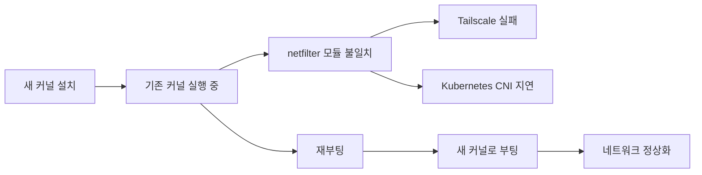

## 문제는 Tailscale처럼 보였지만, 시작점은 커널이었다

Raspberry Pi worker 노드를 SD 카드에 새로 설치한 뒤 Tailscale을 다시 연결하려고 했다. `tailscaled` 서비스는 실행됐지만, `tailscale up`은 다음과 같은 오류를 남겼다.

```text
could not setup netfilter
cleanup: list tables: socket: protocol not supported
```

처음에는 Tailscale 로그인이나 TPM 장치 문제를 의심했다. 하지만 핵심은 `iptables`와 Linux netfilter를 사용할 수 없다는 점이었다.



## `uname -r`은 설치된 커널이 아니라 실행 중인 커널을 보여준다

먼저 실행 중인 커널을 확인했다.

```bash
uname -r
```

처음에는 다음과 같이 나왔다.

```text
5.15.0-1105-raspi
```

이후 패키지를 설치하는 과정에서 다음 메시지를 확인했다.

```text
The currently running kernel version is not the expected kernel version 6.8.0-1047-raspi
Restarting the system to load the new kernel will not be handled automatically
```

이 메시지는 설치 실패가 아니다.

- 현재 실행 중인 커널: `5.15.0-1105-raspi`
- 새로 설치된 커널: `6.8.0-1047-raspi`
- 새 커널 적용 방법: 재부팅

APT는 실행 중인 커널을 즉시 교체하지 않는다. 새 커널 파일과 모듈을 설치한 뒤, 다음 부팅에서 새 커널을 선택한다. Ubuntu의 `needrestart`도 새 커널 적용에는 재부팅이 필요하다고 안내한다.

## 복구 절차

먼저 netfilter userspace 패키지를 복구했다.

```bash
sudo apt update
sudo apt install --reinstall iptables nftables
```

하지만 이 단계만으로는 현재 실행 중인 `5.15` 커널이 바뀌지 않는다. 따라서 재부팅했다.

```bash
sudo reboot
```

부팅 후 반드시 다시 확인한다.

```bash
uname -r
```

이제 기대하는 새 커널이 출력되어야 한다.

```text
6.8.0-1047-raspi
```

그다음 Tailscale netfilter와 서비스 상태를 확인한다.

```bash
sudo iptables -S
sudo systemctl status tailscaled --no-pager
sudo tailscale up
```

`/dev/tpmrm0`가 없다는 메시지는 Raspberry Pi에 TPM 장치가 없어서 나오는 경고일 수 있다. 이번 문제의 핵심 원인은 TPM이 아니라 netfilter 경로였다.

## Kubernetes 노드는 네트워크가 준비된 뒤 확인한다

RKE2 agent를 다시 연결한 뒤에도 곧바로 애플리케이션을 배치하지 않고 다음 순서로 확인한다.

```bash
sudo systemctl enable --now rke2-agent
sudo journalctl -u rke2-agent -f
```

컨트롤 플레인에서 worker 상태를 확인한다.

```bash
sudo /var/lib/rancher/rke2/bin/kubectl \
  --kubeconfig=/etc/rancher/rke2/rke2.yaml \
  get nodes -o wide
```

`Ready`가 되기 전에는 `rke2-canal`이 아직 초기화되지 않았을 수 있다. 실제 복구 과정에서도 처음에는 다음 상태가 보였다.

```text
NetworkPluginNotReady
cni plugin not initialized
```

잠시 후 `rke2-canal`이 `Running`이 되고, ingress와 로그 수집 Pod도 정상화됐다. 따라서 CNI 초기화 중인 짧은 구간과 실제 실패를 구분해야 한다.

## 결론

이번 문제에서 기억할 규칙은 간단하다.

1. `uname -r`은 **현재 실행 중인 커널**을 보여준다.
2. `apt`가 새 커널을 설치해도 실행 중인 커널은 즉시 바뀌지 않는다.
3. `currently running kernel ... expected kernel ...` 메시지는 보통 재부팅 필요 알림이다.
4. Tailscale의 netfilter 오류가 발생하면 `iptables`, `nftables`, 커널 모듈, 실행 중인 커널을 함께 확인한다.
5. RKE2 worker는 node가 `Ready`이고 CNI가 `Running`인 뒤 운영에 복귀시킨다.

커널 문제를 확인할 때는 버전 문자열 하나만 보는 것보다, **설치된 커널과 실행 중인 커널이 같은지**를 먼저 비교하는 편이 빠르다.

## 참고 자료

- [Ubuntu: 커널 업데이트 후 재부팅이 필요한 이유](https://ubuntu.com/security/livepatch/docs/livepatch/explanation/reboot_requirement)
- [Ubuntu `needrestart` 매뉴얼](https://manpages.ubuntu.com/manpages/noble/man1/needrestart.1.html)
- [Tailscale netfilter 모드](https://tailscale.com/docs/reference/netfilter-modes)
- [RKE2 Quickstart](https://docs.rke2.io/install/quickstart)
